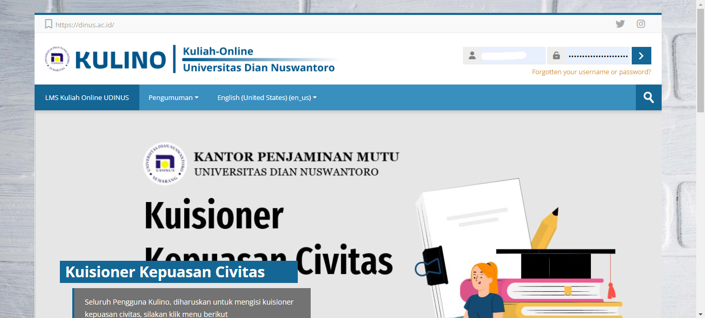
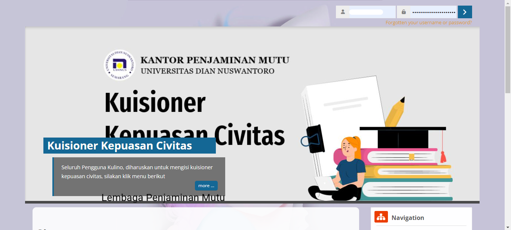
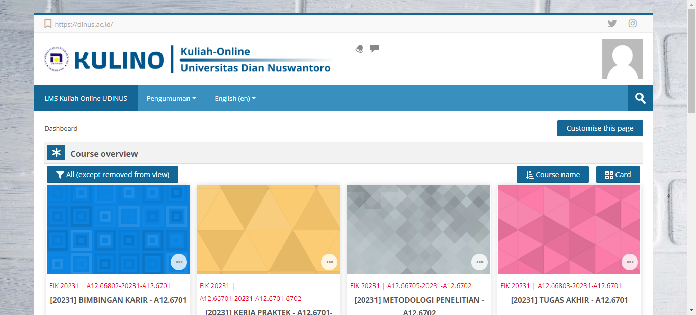
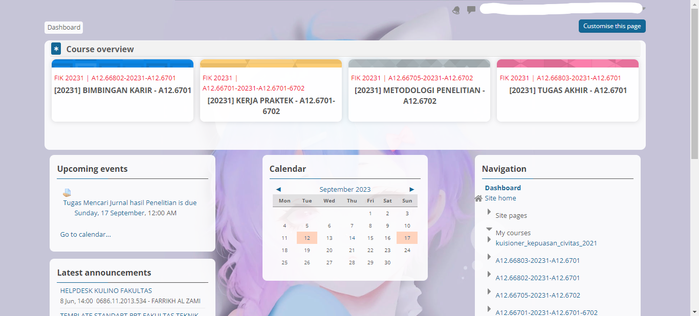

Kulino (Kuliah Online) adalah sistem manajemen pembelajaran (learning manajemen system) [lms] yang dibuat dengan menggunakan [moodle](https://moodle.org/) dan dikembangkan oleh UDINUS.

Disini saya membahas cara memodifikasi kulino seminimalis berdasarkan selera saya.

## Tampilan Kulino

| Default                                       | Modify                                    |
| --------------------------------------------- | ----------------------------------------- |
|  |  |
|      |      |

<!--truncate-->

Dapat dilihat tampilan yang saya berikan lumayan minimalis:

- Mengurangi mouse scroll. _jika benar dalam `custom this page`_
- Rounded card.
- Image background.

## Tutorial

- 🧩 Install extension [Stylish - Custom themes for any website](https://chrome.google.com/webstore/detail/stylish-custom-themes-for/fjnbnpbmkenffdnngjfgmeleoegfcffe) pada Google Chrome atau browser lainnya.
- 🎨 Install style [Kulino Udinus](https://userstyles.org/styles/246522/kulino-dinus)
- Lalu `Custom this Page` pada kulino sesuaikan dengan selera kalian.
- Jangan lupa aktifkan extension dan style-nya.
