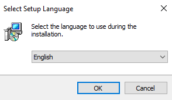
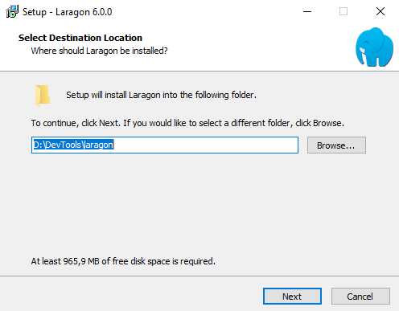
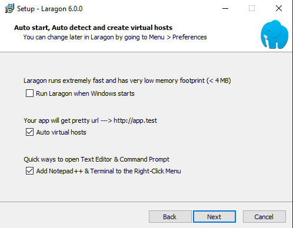
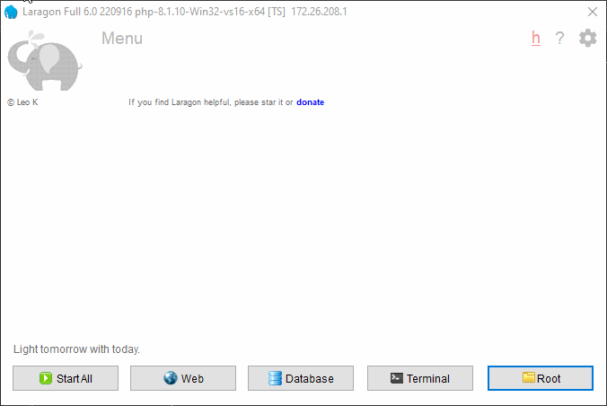
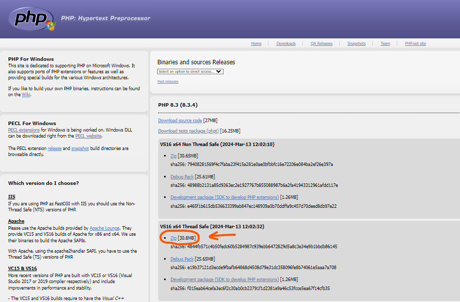
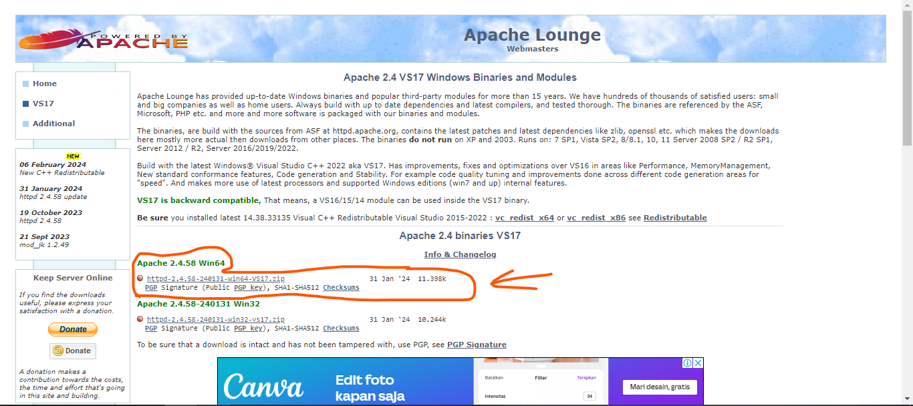

# Laragon

Pengganti XAMPP yang tidak bisa ganti versi `PHP` tanpa install ulang.

- https://laragon.org/download/
## Pemasangan

- Klik `laragon-wamp.exe` > `Run as Administator` > `Yes`
- Memilih bahasanya.  
  
- Memilih lokasi tempat untuk menyimpan laragon.  
  - `path-default` : `C:\laragon`
  - `path-kaesa-pilih` : `D:\DevTools\laragon`
  
- Pengaturan opsional tambahan.  
  - ❌ Run Laragon when Windows starts? Karena laptop saya kentang saya tidak checklist, supaya laragon tidak auto dijalankan saat menyalakan laptop.
  - ✅ Auto virtual hosts? Bagus sih bisa langsung dikasih domain `.test`
  - ✅ Add Notepad++ & Terminal to the Right-Click Menu? Kurang tahu ini buat apa, checklist saja dulu.
  
- Terakhir klik `install`.  
  

## Mengubah `document root`

Saya ubah dari `D:\DevTools\laragon\www` ke `D:\Projects\www` karena supaya rapi saja, saat backup semua project cukup folder `Project` yang Saya backup.



## Menambahkan PHP versi lainnya

🌐 Download link: https://windows.php.net/download#php-8.3-ts-vs16-x64
🔽 Example link: https://windows.php.net/downloads/releases/php-8.3.4-Win32-vs16-x64.zip
📚 Extract to `php-8.3.4-Win32-vs16-x64`
✂ Cut to `D:\DevTools\laragon\bin\php`




## Menambahkan versi NGINX

🌐 Download link: https://nginx.org/en/download.html
🔽 Example link: https://nginx.org/download/nginx-1.24.0.zip
📚 Extract here `nginx-1.24.0`
✂ Cut to `D:\DevTools\laragon\bin\nginx`


## Menambahkan versi PostgreSQL

Tambahkan langsung pada berkas `package.conf` dengan `Klik kanan laragon > Tools > Quick add > Configuration...`.

```conf
# Example
*postgresql-16=https://get.enterprisedb.com/postgresql/postgresql-16.2-1-windows-x64-binaries.zip
```

```conf title="D:\DevTools\laragon\usr\packages.conf"
# phpMyAdmin
*phpmyadmin=https://files.phpmyadmin.net/phpMyAdmin/5.2.0/phpMyAdmin-5.2.0-english.zip

# MySQL
# mysql-8.0=https://dev.mysql.com/get/Downloads/MySQL-8.0/mysql-8.0.30-winx64.zip
mysql-5.7=https://dev.mysql.com/get/Downloads/MySQL-5.7/mysql-5.7.39-winx64.zip
dbeaver=https://dbeaver.io/files/dbeaver-ce-latest-win32.win32.x86_64.zip
---


# Node.js
*yarn=https://github.com/yarnpkg/yarn/releases/download/v1.22.19/yarn-v1.22.19.tar.gz


# MongoDB https://www.mongodb.com/download-center/community
mongodb-4=https://fastdl.mongodb.org/win32/mongodb-win32-x86_64-2008plus-ssl-4.0.3.zip
 
 

# VS Code
*code=https://go.microsoft.com/fwlink/?Linkid=850641
 http://127.0.0.1:8090/_/ http://127.0.0.1:8090/_/


# PostgreSQL
*postgresql-16=https://get.enterprisedb.com/postgresql/postgresql-16.2-1-windows-x64-binaries.zip
postgresql-14=https://get.enterprisedb.com/postgresql/postgresql-14.5-1-windows-x64-binaries.zip


---
# Golang
golang=https://go.dev/dl/go1.19.1.windows-amd64.zip

# Pocketbase
pocketbase=https://github.com/pocketbase/pocketbase/releases/download/v0.7.3/pocketbase_0.7.3_windows_amd64.zip
```


## Fix Apache in PHP 8.3.x

```
httpd.exe - Entry Point not found  
The procedure entry point nghttp2_option_set_no_rcf9113_leading_and_trailing_ws_validation could not be located in the dynamic link library C:\laragon\bin\php\php-8.2.12-Win32-vc16-x64\ext\php_curl.dll
```

Solusi download apache versi terbaru:
🌐 Download link: https://www.apachelounge.com/download/
📚 Extract to `httpd-2.4.58-240131-win64-VS17` jangan lupa pindahkan folder `bin` dari `./httpd-2.4.58-240131-win64-VS17/Apache24` ke folder `./httpd-2.4.58-240131-win64-VS17` langsung.
🔽 Example link: https://www.apachelounge.com/download/VS17/binaries/httpd-2.4.58-240131-win64-VS17.zip
 


## Mencoba Menggunakan `Ngork`

```bash
ngork update
```

`app\Http\Middleware\TrustProxies.php`

```php
<?php

namespace App\Http\Middleware;

use Illuminate\Http\Middleware\TrustProxies as Middleware;
use Illuminate\Http\Request;

class TrustProxies extends Middleware
{
    /**
     * The trusted proxies for this application.
     *
     * @var array<int, string>|string|null
     */
    protected $proxies = "*"; // ngrok
    // protected $proxies;

    /**
     * The headers that should be used to detect proxies.
     *
     * @var int
     */
    protected $headers =
    Request::HEADER_X_FORWARDED_FOR |
        Request::HEADER_X_FORWARDED_HOST |
        Request::HEADER_X_FORWARDED_PORT |
        Request::HEADER_X_FORWARDED_PROTO |
        Request::HEADER_X_FORWARDED_AWS_ELB;
}

```

```yaml title="D:\DevTools\laragon\bin\ngrok\conf\pondokmbodo.yml"
web_addr: localhost:4790
version: "2"
region: ap
// https://dashboard.ngrok.com/get-started/your-authtoken
authtoken: random-string-auth-token 
tunnels:
    laragon:
        addr: pondokmbodo.test:80
        proto: http
        host_header: rewrite
```

```bash title="D:/DevTools/laragon/bin/ngrok"
./ngrok.exe start --config=conf/pondokmbodo.yml --region=ap laragon
```

```bash
ngrok start --config=conf/pondokmbodo.yml --region=ap laragon
```