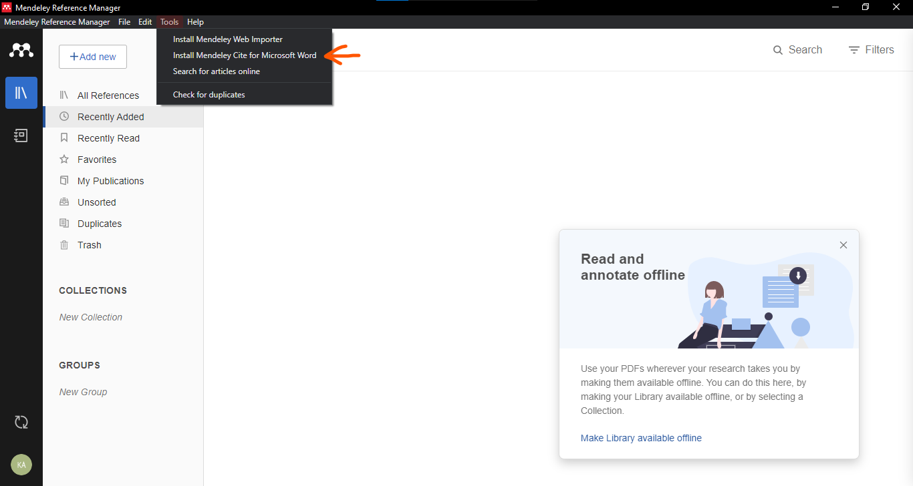
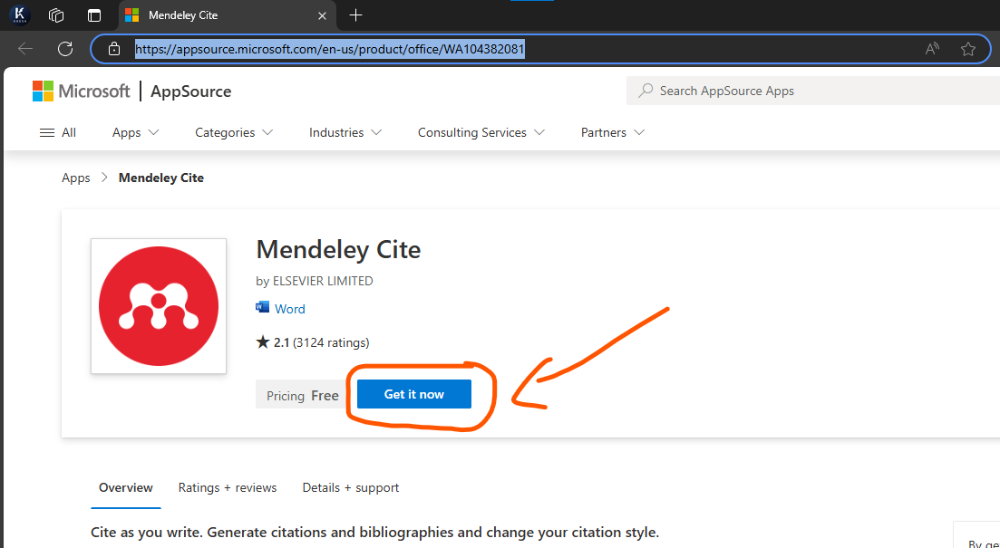
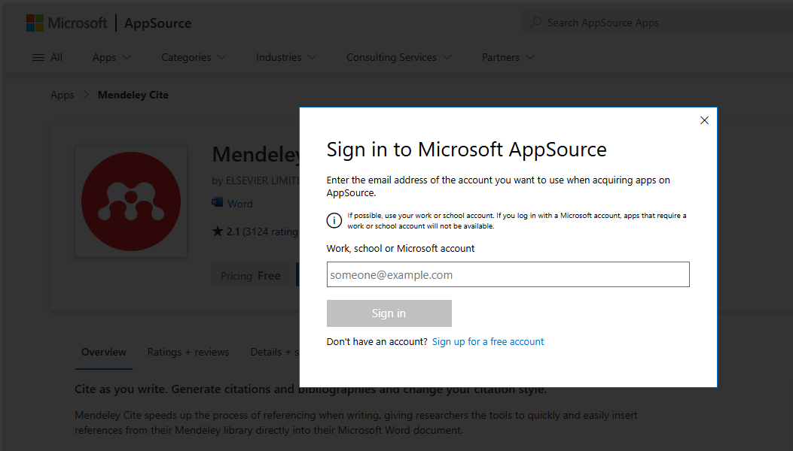
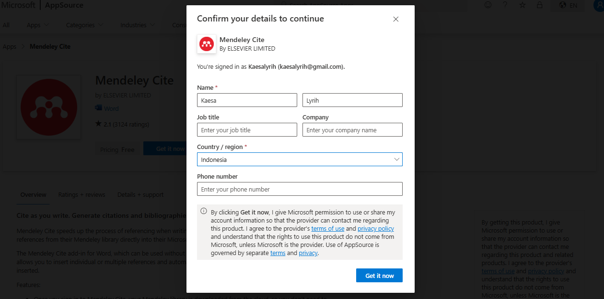
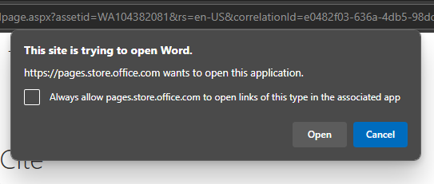
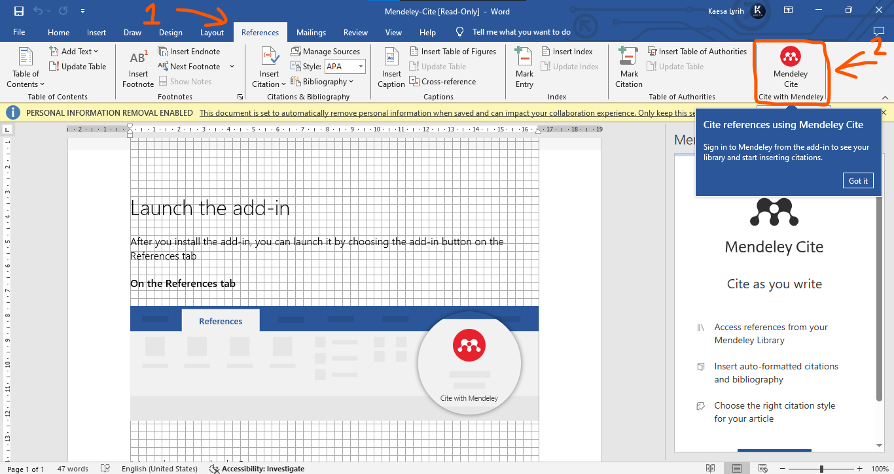

# Install Mendeley Windows

- Unduh dan pasang dahulu [Mendeley Reference Manager for Desktop](https://www.mendeley.com/download-reference-manager/windows) pada Windows Anda.
- Setelah itu buka aplikasi `Mendeley Reference Manager`.
- Nanti akan muncul halaman masuk (Login), silahkan login dengan akun Mendeley kalian, atau daftar (register) terlebih dahulu. Saya sarankan jangan gunakan akun Universitas, gunakanlah akun pribadi saja, kali saja akun universitas anda nantinya tidak terpakai di S2, atau penelitian (alias dinonaktifkan).
- Setelah itu `Tools` > `Install Mendeley Cite for Microsoft Word`. Ini adalah ekstensi tambahan untuk menjadikan Mendeley sumber data referensi. Sebenarnya Microsoft punya fitur menyimpan referensi yaitu `References` > `Manage Sources`.

- Nanti anda akan diarahkan ke [Mendeley Cite](https://appsource.microsoft.com/en-us/product/office/WA104382081) 

- Masukan Name (Nama) dan Country/Region (Negara) saja karena itu yang wajib (require). Lalu klik `Get it now`

- Jika muncul gambar di bawah silahkan klik open karena akan otomatis membuka aplikasi Microsoft Word

- Jika sudah tunggu beberapa saat sampai Mendeley Cite terpasang. Dan ada `Mendeley Cite` pada Tab `References`.

- Klik tombol biru `Get Started` untuk login ke akun Mendeley yang sudah anda miliki tadi.

> Catatan
> Anda bisa beda akun antara Mendeley dan akun Microsoft.
> Misalnya akun Microsoft Word Anda menggunakan akun `lenovokaesa@gmail.com` ini akun saat activation Microsoft Word Laptop baru keluaran 2020 keatas. Dan anda memiliki akun pribadi misal `pribadikaesa@gmail.com` anda tetap bisa menjalankan Microsoft Word dengan akun `lenovokaesa@gmail.com` didalamnya ada Mendeley Cite dengan akun `pribadikaesa@gmail.com` atau mungkin bisa di logout ganti akun Mendeley lainnya milik teman Anda.

