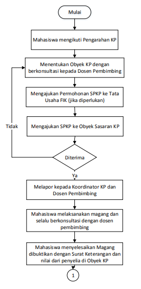
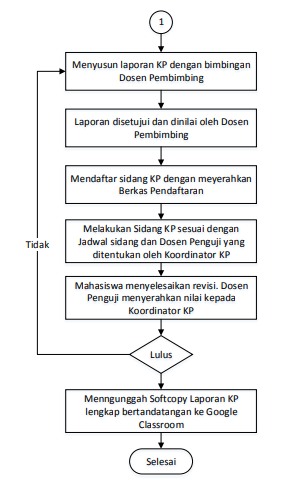
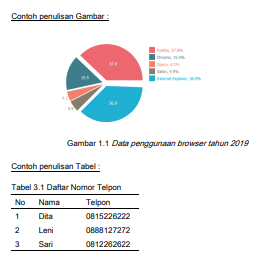
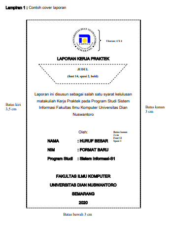
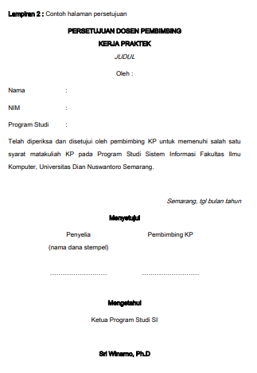
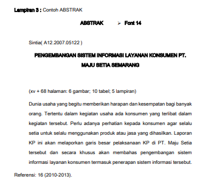
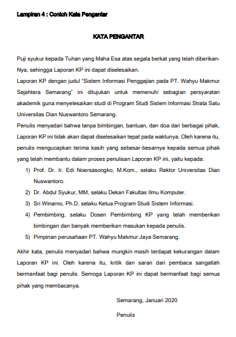
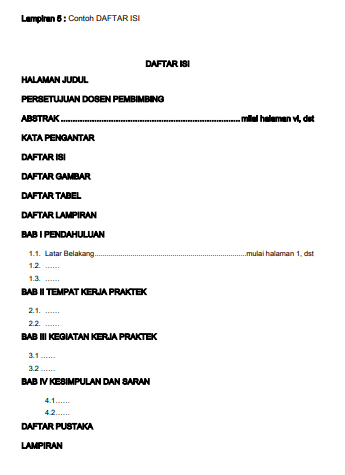
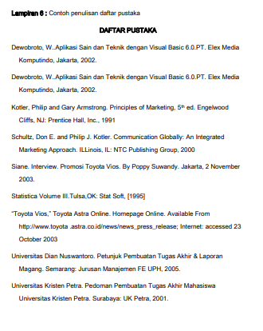

# Buku Pedoman Kerja Praktik - Sistem Informasi

## BAB I Pendahuluan

## Latar Belakang

Kerja Praktik (KP) adalah mata kuliah **wajib** sebagai salah satu syarat kelulusan bagi mahasiswa pada Program Studi Sistem Informasi Fakultas Ilmu Komputer. Kegiatan KP dilaksanakan dengan magang di sebuah lembaga/instansi, dengan jangka waktu selama **1 hingga 3 bulan** (tergantung kebijakan dan permintaan dari Obyek KP).

Panduan kegiatan dan penulisan laporan KP ini mengacu pada capaian pembelajaran (cp) yang telah disusun oleh Program Studi. Beberapa capaian pembelajaran dalam mata kuliah kerja praktik antara lain:

1. mahasiswa memiliki kemampuan untuk menyelesaikan permasalahan yang secara nyata terjadi di instansi/lembaga;
2. kemampuan memfasilitasi pengambilan keputusan berbasis SI/TI;
3. kemampuan menyelesaikan pekerjaan SI/TI secara mandiri ataupun bekerja sama dengan tim.

## Batasan Kerja Praktik

Diharapkan mahasiswa dapat menyelesaikan kerja praktik dalam waktu 1 (satu) semester, dengan rincian aktivitas sebagai berikut:

1. Mahasiswa melakukan magang pada lembaga/instansi yang sesuai dengan visi program studi dan memperhatikan kompetensi mahasiswa, selama berturut-turut atau intermitten (terputus-putus) 1 (satu) hingga 3 (tiga) bulan (tergantung kebijakan dan permintaan dari obyek kerja praktik)
2. Mahasiswa kemudian menyelesaikan kerja praktik dengan menyusun laporan kerja praktik dengan dibimbing oleh seorang dosen pembimbing.

## Capaian Pembelajaran Kerja Praktik (CP KP)

Unsur capaian pembelajaran yang ingin dicapai dari mahasiswa yang mengambil mata kuliah kerja praktik adalah sebagai berikut:

1. Sikap
   1. Menunjukkan sikap bertanggung jawab atas pekerjaan di bidang keahliannya secara mandiri;
   2. Mengidentifikasi nilai, norma, dan etika akademik;
   3. Menginternalisasi semangat kemandirian, kejuangan, dan kewirausahaan;
   4. Memiliki kemampuan menegakkan integritas akademik.
2. Keterampilan Umum
   1. Mampu menunjukkan kinerja mandiri, bermutu, dan terukur;
   2. Mampu memelihara dan mengembangkan jaringan kerja dengan pembimbing, kolega, sejawat, baik di dalam maupun di luar lembaganya;
   3. Mampu bertanggung jawab atas pencapaian hasil kerja kelompok dan melakukan supervisi dan evaluasi terhadap penyelesaian pekerjaan yang ditugaskan kepada pekerja yang berada di bawah tanggung jawabnya;
   4. Mampu melakukan proses evaluasi diri terhadap kelompok kerja yang berada di bawah tanggung jawabnya, dan mampu mengelola pembelajaran secara mandiri;
   5. Memiliki kemampuan menggunakan teknologi informasi dan komunikasi dalam pengembangan keilmuan dan implementasi bidang keahlian;
   6. Memiliki kemampuan mempublikasi karya akademik berupa desain/model/aplikasi/seni yang dapat diakses oleh masyarakat.
3. Pengetahuan
   1. Menguasai konsep teoritis bidang pengetahuan Sistem Informasi secara umum dan konsep teoritis bagian khusus dalam bidang pengetahuan tersebut secara mendalam, serta mampu memformulasikan penyelesaian masalah prosedural;
   2. Menguasai konsep teoritis yang mengkaji, menerapkan, dan mengembangkan serta mampu memformulasi dan mampu mengambil keputusan yang tepat dalam penyelesaian masalah;
   3. Mempunyai pengetahuan dalam penyusunan algoritma pemrograman yang efektif dan efisien serta dapat merancang, membangun, dan mengelola aplikasi sistem informasi secara tepat dan akurat untuk mendukung pengambilan keputusan;
   4. Menguasai konsep dan pengetahuan dalam menganalisis performa sistem informasi yang menjadi solusi atau membantu pelaksanaan manajemen dan proses bisnis.
4. Keterampilan Khusus
   1. Mampu membuat dan memodifikasi rancangan sistem informasi dengan menggunakan pendekatan terstruktur dan pendekatan objek dalam organisasi bisnis.
   2. Memiliki kemampuan untuk mengaplikasikan software proses model dalam rekayasa perangkat lunak;
   3. Mampu memanfaatkan ilmu, pengetahuan, dan teknologi untuk menyelesaikan proyek teknologi atau sistem informasi;
   4. Mampu memanfaatkan teknologi IT/IS untuk menghasilkan inovasi-inovasi yang berdampak secara sosial dan ekonomi;
   5. Mampu memanfaatkan IPTEKS untuk menggali, menganalisa, dan mempresentasikan data sehingga dapat menghasilkan informasi atau knowlage ang berguna untuk penyelesaian masalah dalam organisasi bisnis.

## Sasaran Kerja Praktik

Kerja Praktik (KP) diarahkan pada instansi/lembaga/pelaku bisnis dan usaha yang mendayagunakan komputer sebagai instrumen Sistem Informasi, sehingga mahasiswa dapat mengamati dan menganalisa proses bisnis yang berjalan, mengidentifikasi permasalahan yang ada pada proses bisnis tersebut, kemudian merancang solusi dengan pemanfaatan Teknologi Informasi atau Sistem Informasi.

## Lingkup Kegiatan Kerja Praktik

Rangkaian kegiatan Kerja Praktik adalah sebagai berikut:

1. Pra KP **(Tidak Wajib)**  
   Pra Kerja Praktik (Pra KP) merupakan kegiatan _opsional_ bagi Mahasiswa yang ingin melaksanakan magang sebelum mengambil Mata Kuliah KP. Biasanya kegiatan ini dilakukan Mahasiswa dengan tujuan ingin menyelesaikan kegiatan Magang sebelum perkuliahan atau semester aktif dimulai, sehingga tidak mengganggu jalannya perkuliahan.

   Kegiatan Pra KP juga bertujuan untuk memudahkan Mahasiswa dalam proses penyelesaian Laporan KP, sehingga diharapkan dapat meningkatkan tingkat kelulusan Mata Kuliah KP tepat waktu (1 semester).

   Syarat serta aturan pelaksanaan Pra KP secara lengkap ada pada dokumen [📄 Tata Cara Pelaksanaan Pra-Kerja Praktik.pdf](attachments/tata_cara_pelaksanaan_pra_kp.pdf).

2. Pelaksanaan magang

   Mahasiswa melaksanakan magang di instansi/lembaga berturut-turut/intermittent selama 1 (satu) hingga 3 (bulan) (sesuai kebijakan dan permintaan Obyek KP). Dimana, Mahasiswa bekerja purna waktu (masuk setiap hari kerja), dan terlibat secara langsung dalam kegiatan keseharian lembaga/instansi Obyek KP.

   Syarat dan Prosedur pelaksanaan ada pada bagian [selanjutnya](#prosedur-pelaksanaan-kerja-praktik);

3. Penyusunan Laporan Kerja Praktik

   Setelah menyelesaikan magang, Mahasiswa dituntut untuk membuat Laporan Kerja Praktik yang terdiri dari 3 (tiga) bagian, yaitu:

   1. Bagian Awal/Pendahuluan,
   2. Bagian Isi/Analisan dan Pembahasan,
   3. Bagian Lampiran.

   Selengkapnya ada pada [BAB II Standard Penulisan pada Buku ini](#bab-ii-standart-penulisan).  
   Yang perlu diperhatikan pada bagian **isi** adalah analisa dan pembahasan, yang menjadi tolak ukur Capaian Pembelajaran Mahasiswa dalam melaksanakan Kerja Praktek.

   Isi pembahasan yaitu:

   1. Analisa dan pemodelan proses bisnis yang berjalan di instansi/lembaga/pelaku usaha. _Tools_ yang dapat digunakan adalah:
      1. _Business Process Modelling Notation_ (BPMN), atau
      2. _Cross Functional Flowchart_, atau
      3. _Flow of Document_, atau
      4. _Rich Picture_
   2. Identifikasikan permasalahan yang terjadi pada proses bisnis yang berjalan di instansi/lembaga/pelaku usaha. Metode yang dapat digunakan adalah:
      1. Analisa _fishbone_, atau
      2. _Why-why diagram_
   3. Rancangan solusi Teknologi Informasi untuk menyelesaikan permasalahan yang terjadi pada proses bisnis di instansi/lembaga/pelaku usaha. Rancangan solusi yang diusulkan dapat berupa:
      1. Desain alur sistem informasi, atau
      2. Rancangan sistem informasi, atau
      3. Pengembangan prototipe sistem informasi.
   4. Dapat juga menambahkan desain alur proses bisnis yang baru setelah implementasi sistem informasi.

Dalam pelaksanaannya, mahasiswa akan dibimbing penuh oleh dosen pembimbing dan penyelia. **Pembimbingan dilakukan mulai dari penentuan obyek/tempat Kerja Praktik, selama pelaksanaan magang, hingga penyelesaian Laporan Kerja Praktik, untuk menjamin Capaian yang diharapkan.**

## Syarat Mengambil Kerja Praktik

Syarat mahasiswa mengambil Kerja Praktik sebagai berikut:

1. IPK >= 2.00 dan telah menyelesaikan minimal 95 SKS.
2. Mengambil mata kuliah Kerja Praktik, sebagai tercantum dalam KRS.

## Dosen Pembimbing Kerja Praktik

Dosen pembimbing kerja praktik adalah dosen Program Studi Sistem Informasi yang ditunjuk oleh Dekan Fakultas Ilmu Komputer melalui Koordinator Kerja Praktik untuk melakukan pembimbingan Kerja Praktik terhadap mahasiswa. Penunjukan dosen pembimbing kerja praktik ini bertujuan untuk membantu mahasiswa dalam mempersiapkan, melaksanakan dan membantu mahasiswa dalam menyusun laporan kerja praktik. Dosen pembimbing kerja praktik berkewajiban:

1. Membantu mahasiswa dalam menentukan obyek/tempat pelaksanaan Kerja Praktik.
2. Membimbing mahasiswa selama pelaksanaan magang.
3. Membimbing penyusunan Laporan Kerja Praktik, mulai dari penentuan topik, susunan dan isi laporan, hingga penyelesaian laporan sampai Mahasiswa siap mengajukan laporannya untuk diuji pada sidang Kerja Praktik.

## Prosedur Pelaksanaan Kerja Praktik

Prosedur pelaksanaan kerja praktik sebagai berikut:

1. Mahasiswa perlu untuk membekali diri dengan informasi mengenai kerja praktik, sehingga mahasiswa diwajibkan untuk mengikuti Sosialisasi Kerja Praktik yang diadakan di setiap awal semester.
2. Mahasiswa yang sudah siap melaksanakan kerja praktik, diminta berkonsultasi dengan dosen pembimbing untuk menentukan obyek/tempat kerja praktik. Setelah itu, mahasiswa dapat mengajukan Surat Permohonan Kerja Praktik (SPKP). Surat Permohonan disampaikan melalui Koordinator Kerja Praktik. Koordinator Kerja Praktik kemudian mengajukan Surat Permohonan kepada Tata Usaha (TU) dan disahkan oleh Ketua Program Studi.

   Mahasiswa hanya diperkenankan mengajukan 1 (satu) SPKP. Boleh mengajukan lagi, jika dalam jangka waktu kurang lebih 2 minggu, tidak mendapatkan balasan atau respond dari Obyek sasaran KP yang dituju.

3. Setelah mendapatkan SPKP, mahasiswa lalu menyampaikan surat tersebut kepada obyek tempat kerja praktik yang dituju.
   1. Jika obyek sasaran menyetujui permohonan mahasiswa, maka mahasiswa diminta melaporkannya kepada dosen pembimbing dan koordinator kerja praktik, bahwa telah mendapatkan obyek atau tempat kerja praktik.
   2. Jika permohonan ditolak oleh obyek kerja praktik sasaran, maka mahasiswa dipersilahkan berkonsultasi kembali dengan dosen pembimbing untuk menentukan obyek sasaran kerja praktik berikutnya, dan kembali mengajukan SPKP.
4. Magang dilaksanakan berturut-turut/intermittent minimal 1 bulan dan maksimal 3 bulan. Selama melaksanakan magang, mahasiswa diminta untuk selalu berkonsultasi kepada koordinator kerja praktik (saat pra-KP) dan dosen pembimbing (saat KP). Tujuannya adalah, agar mahasiswa mengetahui apa saja hal-hal yang perlu diperhatikan saat pelaksanaan magang dan bagaimana cara mengumpulkan bahan yang akan digunakan sebagai dasar pembuatan Laporan Kerja Praktik.
5. Setelah mahasiswa selesai menjalankan magang, selanjutnya adalah penyusunan laporan kerja praktik. Penyusunan laporan dilakukan dengan berkonsultasi atau bimbingan kepada dosen pembimbing. Konsultasi dilakukan minimal 8 kali, dibuktikan dengan Log Bimbingan.
6. Setelah laporan selesai disusun dan disetujui oleh Dosen Pembimbing, mahasiswa dipersilahkan mendaftar sidang kerja praktik. Sidang kerja praktik dilaksanakan sebanyak 2 (dua) periode dalam 1 (satu) semester, yaitu Tengah Semester dan Akhir Semester.

   Mahasiswa mendaftarkan diri untuk sidang kerja praktik kepada koordinator kerja praktik, dengan menyerahkan:

   1. Log Kegiatan Kerja Praktik dan nilai dari penyelia,
   2. Log Bimbingan dan nilai dari dosen pembimbing,
   3. Surat Keterangan telah menyelesaikan kerja praktik, yang diterbitkan oleh lembaga atau instansi obyek kerja praktik.

7. Setelah mendaftarkan diri, mahasiswa menunggu jadwal sidang kerja praktik dan dosen penguji yang ditentukan oleh koordinator kerja praktik.
8. Setelah mengetahui jadwal sidang kerja praktik, mahasiswa diminta menyerahkan Naskah Laporan Kerja Praktik dan Berita Acara Sidang Kerja Praktik kepada dosen penguji selambat-lambatnya H-1 sebelum jadwal Sidang yang ditentukan.
9. Pelaksanaan sidang kerja praktik dilakukan oleh mahasiswa dan seorang Dosen Penguji. Selesai sidang, dosen penguji menyerahkan Berita Acara Sidang Kerja Praktik yang telah dinilai kepada Koordinator Kerja Praktik.
10. Mahasiswa bisa dinyatakan lulus dan bisa menerima nilai Kerja Praktik apabila:
    1. Telah menyelesaikan revisi, dan menyerahkan Lembar Persetujuan Revisi yang disetujui oleh Dosen Penguji kepada Koordinator Kerja Praktik.
    2. Mengunggah softcopy Laporan Kerja Praktik lengkap bertanda tangan ke Kulino yang telah disediakan oleh Koordinator Kerja Praktik.
11. Pelaksanaan keseluruhan kerja praktik maksimal satu semester. Jika lewat dari waktu tersebut maka mahasiswa diwajibkan memasukkan kembali mata kuliah kerja praktik pada KRS selanjutnya.

## Flowchart Prosedur Kerja Praktik

| Flow 01                             | Flow 02                             |
| ----------------------------------- | ----------------------------------- |
|  |  |

## Penilaian

Penilaian kerja praktik sebagai berikut:

1. Penilaian laporan kerja praktik oleh dosen pembimbing kerja praktik dengan bobot 40%, terdiri dari unsur: kelengkapan, bahasa, dan tata penulisan.
2. Penilaian kerja praktik dilakukan oleh pembimbing lapangan atau penyelia dengan bobot 30%, terdiri dari unsur: kreativitas dalam memberikan solusi, attitude, kerja sama.
3. Penilaian ujian kerja praktik oleh dosen penguji laporan kerja praktik dengan bobot 30%, terdiri dari unsur: teknik presentasi, bahasa dan tata penulisan, ketepatan pemilihan ide atau gagasan dalam memberikan solusi.

Semua hal yang berkaitan dengan penilaian kerja praktik atau laporan kerja praktik harus dicantumkan dalam lembar penilaian.

---

## BAB II STANDART PENULISAN

Susunan penulisan laporan kerja praktik (KP) secara umum terdiri dari tiga bagian yaitu:

- Awal laporan
- Isi laporan
- Akhir laporan

Untuk keseragaman format penulisan, standar penulisan di setiap bagian dijelaskan dalam bab ini.

## Bagian Awal

### Halaman Sampul

Halaman sampul diharapkan dapat menjadi informasi singkat kepada pembaca tentang isi dari laporan kerja praktik, yang memuat:

- judul,
- nama proyek,
- tujuan pelaksanaan kerja praktik,
- identitas penulis,
- institusi, dan
- tahun penulisan.

### Halaman Judul

Sama dengan halaman sampul perbedaannya yaitu halaman judul dicetak pada kertas HVS.

### Halaman Persetujuan Dosen Pembimbing Kerja Praktik

Halaman yang berisikan persetujuan dari pembimbing lapangan atau penyelia dan pembimbing kerja praktik.

### Abstrak

Abstrak merupakan inti sari penulisan yang memuat latar belakang, hasil pengamatan kerja praktik, dan kesimpulan yang diperoleh. Abstrak bertujuan agar pembaca dengan cepat dan mudah memahami isi tulisan.

### Kata Pengantar

Halaman yang memuat pengantar singkat atas tulisan yang dianggap banyak membantu dalam pembuatan laporan kerja praktik.

### Daftar Isi

Halaman yang memuat daftar tiap bagian penulisan beserta nomor halaman masing-masing, yang ditulis sama sepeti isi yang bersangkutan.

### Daftar Gambar dan Daftar Lainnya

Tujuan halaman ini memuat gambar, tabel, dan lainnya yang digunakan dalam penulisan karya tulis berupa laporan kerja praktik.

## Bagian Isi

### BAB I PENDAHULUAN

1. Latar belakang masalah
2. Tujuan
3. Manfaat

### BAB II TEMPAT KERJA PRAKTIK

1. Tempat kerja praktik,
2. Sejarah dan perkembangan
3. Visi & Misi
4. Jenis produk (barang atau jasa)
5. Struktur organisasi

### BAB III KEGIATAN KERJA PRAKTIK

1. Log Kegiatan  
   Berisikan log kegiatan yang di lengkapi dengan bukti-bukti kegiatan (foto-foto, dokumen terkait) dan dilengkapi penjelasan yang diperlukan.
2. Uraian dan Pembahasan  
   Pembahasan isi sesuai dengan ruang lingkup kerja praktik yang telah ditentukan.

### BAB IV KESIMPULAN

Kesimpulan berupa rangkuman keseluruhan isi yang sudah dibahas, mengacu pada hasil yang dicapai selama kegiatan kerja praktik.

Saran berupa perluasan dan pengembangan terhadap kekurangan-kekurangan yang bersumber dari kesimpulan yang dibuat.

## Lampiran

Lampiran merupakan data atau pelengkap yang menunjang penulisan laporan kerja praktik, yang tidak dapat diletakan pada isi laporan karena mengganggu kesinambungan pembacaan. Contoh lampiran dari kegiatan ini antara lain:

1. Surat keterangan dari instansi atau perusahaan tempat kerja praktik.
2. Dokumen pendukung penyusunan laporan kerja praktik.

---

## BAB III TEKNIK PENULISAN

Bab ini memberikan uraian praktik teknik penulisan Laporan Kerja Praktik (KP) dengan tujuan agar mahasiswa dan dosen pembimbing kerja praktik memiliki pandangan yang sama dalam penyusunan laporan kerja praktik.

### III. Kertas

Spesifikasi kertas yang digunakan adalah sebagai berikut:

| Key    | Value              |
| ------ | ------------------ |
| Jenis  | HVS                |
| Warna  | Putih Polos        |
| Berat  | Minimal 70 gram    |
| Ukuran | A4 (21cm x 29,7cm) |

### III. Pengetikan

Ketentuan pengetikan adalah sebagai berikut:

- Pencetakan dilakukan pada satu sisi kertas.
- Posisi penempatan teks pada tepi kertas

| key           | value                     |
| ------------- | ------------------------- |
| Batas kiri    | 3.0 cm                    |
| Batas kanan   | 3.0 cm                    |
| Batas atas    | 4.0 cm                    |
| Batas bawah   | 3.0 cm                    |
| Margin gutter | 0.5 cm                    |
| Font Family   | Time New Roman            |
| Font Size     | 11 poin                   |
| Alignment     | Justify (rata kiri kanan) |
| Spasi         | 1,5 (satu setengah)       |

### III. Penomoran Halaman

Penomoran halaman mengikuti ketentuan sebagai berikut:

1. Peletakan nomor halaman bab baru di bagian bawah tengah dan peletakan nomor halaman isi di kanan atas.
2. Menggunakan dua jenis nomor halaman yaitu angka romawi kecil dan angka arab
3. Menggunakan kombinasi huruf angka arab untuk penomoran lampiran
4. Angka romawi kecil digunakan pada bagian awal laporan.
5. Angka arab digunakan pada bagian isi laporan dan bagian akhir laporan yaitu daftar pustaka.

### III. Halaman Sampul dan Judul

Halaman sampul dan judul mengikuti ketentuan sebagai berikut:

1. Warna halaman sampul laporan kerja praktik adalah biru;
2. Semua huruf pada halaman sampul dicetak dengan mengikuti ukuran sesuai contoh di lampiran 2;
3. Halaman judul diketik pada kertas HVS dengan mengikuti ukuran sesuai contoh di lampiran 2;
4. Pada punggung halaman sampul dicantumkan klasifikasi (laporan kerja praktik), judul, nama penulis dan NIM yang seluruhnya ditulis dengan Time New Roman. batas atas 2 cm dan batas bawah 2 cm.
5. Urutan penulisan halaman sampul dan halaman judul adalah sebagai berikut:
   1. Logo Universitas Dian Nuswantoro berwarna hitam dengan diameter 4 cm;
   2. Klasifikasi karya tulis: Laporan Kerja Praktik
      1. Font Family: Time New Roman
      2. Font Size: 12 poin
   3. Judul laporan kerja praktik umumnya berisi nama proyek
      1. Font Family: Time New Roman
      2. Font Size: 14 poin
      3. UPPERCASE
      4. **BOLD**
      5. Spasi: 2.0
   4. Dibawah judul ditambahkan tulisan:
      :::tip
      Laporan ini disusun sebagai salah satu syarat pada matakuliah KP pada program Studi Sistem Informasi . . . ..
      :::
      1. Font Family: Time New Roman
      2. Font Size: 10 poin
      3. Spasi: tunggal / single / 1.0
   5. Nama penulis, NIM (Nomor Induk Mahasiswa)
      1. Font Family: Time New Roman
      2. Font Size: 12 poin
      3. **BOLD**
      4. Spasi: tunggal / single / 1.0
   6. Nama Program Studi "Sistem Informasi"
   7. Nama Fakultas "Fakultas Ilmu Komputer"
   8. Universitas Dian Nuswantoro
   9. Semarang
   10. Tahun pelaksanaan kerja praktik; mulai nama jurusan sampai tahun sidang kerja praktik ditulis dengan:
       1. Font Family: Time New Roman
       2. Font Size: 12 poin
       3. Spasi: tunggal / single / 1.0

### III. Halaman Persetujuan Dosen Pembimbing Kerja Praktik

Halaman yang memuat:

1. Judul
2. Nama penulis
3. NIM
4. Program Studi
5. Kota, tanggal bulan tahun pada saat Kerja Praktik
6. Tanda tangan penyelia dan pembimbing kerja praktik
7. Tanda tangan ketua program studi sistem informasi

### III. Abstrak

Ketentuan title **Abstrak**:

1. Font Family: Times New Roman
2. Font Size: 14 poin
3. HURUF KAPITAL (UPPERCASE)
4. **Cetak Tebal (Bold)**
5. Spasi: tunggal / single / 1.0

Ketentuan Body Abstrak:

1. Maksimum 200 kata/character
2. Font Family: Times New Roman
3. Font Size: 11 poin
4. Spasi: tunggal / single / 1.0

Nama mahasiswa diikuti dengan NIM;

Ketentuan kalimat Judul Laporan:

1. Font Family: Times New Roman
2. Font Size: 11 poin
3. UPPERCASE
4. dan dicetak serta diikuti dengan jumlah halaman angka Romawi, angka Arab, gambar, tabel, dan lampiran
5. Referensi menunjukkan jumlah referensi dari tahun publikasi yang dirujuk mulai dari yang terlama hingga terbaru;
6. Kata kunci dapat diberikan dalam Bahasa Indonesia dan/atau Bahasa Inggris.
7. Semua istilah asing dicetak miring

### III. Kata Pengantar

Halaman Kata Pengantar ditulis dengan Times New Roman 11 poin dan spasi satu setengah serta ukuran sesuai dengan contoh pada Lampiran F. Untuk judul Kata Pengantar ditulis dengan Times New Roman 11 poin, huruf besar dan dicetak tebal.

### III. Daftar Isi

Pada halaman Daftar Isi Tugas Akhir semua huruf ditulis dengan Times New Roman 11 poin dengan spasi satu.

### III. Daftar Gambar dan Lainnya

Ketentuan Penulisan Daftar Gambar dan daftar lainnya adalah sebagai berikut:

1. Semua huruf ditulis dengan Times New Roman 11 poin dalam spasi tunggal dan ukuran sesuai dengan contoh pada lampiran H;
2. Untuk judul Daftar Gambar ditulis dengan Times New Roman 11 poin, huruf besar dan dicetak tebal.

### III. Isi Laporan

Isi Laporan merupakan bagian pokok yang memuat uraian pengamatan dan pengumpulan data-data maupun analis yang dilakukan penulis selama melangsungkan KP. Secara umum pembagian bab dalam penulisan Laporan KP adalah pendahuluan, uraian proyek, berdasarkan data-data tertulis yang diperoleh selama pelaksanaan KP, uraian pelaksanaan yang berhasil diamati di proyek, analisis dan pembahasan tentang hal-hal yang diamati, kesimpulan dan saran.

Ketentuan penulisan setiap bab pada Laporan KP adalah sebagai berikut:

1. Tiap BAB dimulai pada halaman baru
2. Judul bab diawali dengan kata BAB dan diikuti angka Romawi yang menunjukkan angka dari bab yang bersangkutan;
   
3. Judul bab diketik dengan Times New Roman 14 poin, huruf besar. Dicetak tebal, di tengah halaman, tidak diakhiri titik dan bila melebihi satu baris menggunakan spasi setengah;
4. Semua istilah asing harus diketik miring (italic);
5. Untuk istilah asing yang menjadi penekanan KP boleh dicetak tebal (bold) atau diketik dalam tanda kutip(“);
6. Ketentuan-ketentuan penomoran:
   1. Huruf setelah nomor harus huruf kecil, bukan huruf capital;
   2. Urutan harus disajikan dalam bentuk nomor, tidak boleh dengan bullet;

### III. Gambar dan Tabel

Ketentuan mengenai Gambar dan Tabel adalah sebagai berikut;

1. Gambar dan Tabel harus diberikan nama dan judul;
2. Gambar dan Tabel ditempatkan di antara bagian teks yang paling banyak membahasnya;
3. Gambar dan Tabel terletak di tengah halaman;
4. Gambar dan Tabel sedapat mungkin berada dalam satu halaman (tidak terpotong);
5. Penulisan judul Gambar dan Tabel yaitu;
   1. Judul Gambar diletakkan di bawah Gambar dan ditulis dengan Times New Roman 10 poin dengan spasi tunggal;
   2. Judul Tabel diletakkan di atas Tabel dan ditulis dengan Times New Roman 10 poin dan spasi tunggal;
6. Gambar dan Tabel harus diberikan nomor dengan ketentuan bahwa angka pertama merujuk pada bab tempat Gambar/Tabel tersebut berada dan angka kedua menunjukkan urutan Gambar/Tabel dalam bab tersebut.

   

### III. Daftar Pustaka

Penulis dapat memilih dan menggunakan salah satu standar format penulisan internasional seperti APA (American Psychological Association), MLA (Modern Language Association), Turabian dan lainnya. Penggunaan standar format penulisan harus dilakukan dengan konsisten. Adapun contoh standar format penulisan internasional yang digunakan dalam buku Pedoman adalah Turabian.

Ketentuan yang berlaku untuk pembuatan daftar pustaka adalah:

1. Daftar pustaka mencakup semua sumber referensi yang digunakan dalam penyusunan tugas akhir;
2. Semua sumber kutipan yang ada dalam tugas akhir harus dimasukkan ke dalam daftar pustaka;
3. Daftar pustaka disusun berdasarkan abjad mulai dari yang berawalan A hingga yang terakhir Z.
4. Daftar pustaka diketik dalam spasi tunggal;
5. Jarak antara entri judul adalah spasi;
6. Baris pertama setiap entri rata kiri dan baris berikutnya lebih masuk lima karakter.
7. Standar format Nama pengarang paling belakang. Nama pengarang paling depan. Judul. Tempat terbit: nama penerbit, tahun terbit.

---

## BAB IV TEKNIK PENGUMPULAN LAPORAN

Laporan KP merupakan bukti tertulis bagi program studi bahwa yang bersangkutan pernah melaksanakan KP di Instansi/perusahaan. Oleh karena itu bukti-bukti tersebut perlu disiapkan dan diserahkan ke Program Studi (PS) dalam bentuk softcopy.

Laporan KP mahasiswa diupload ke Kulino yang disediakan oleh Koordinator KP dengan format PDF. File yang diunggah merupakan laporan KP yang telah diujikan dan mendapatkan pengesahan dari Penyelia, Dosen Penguji, Dosen Pembimbing dan Ketua Program Studi. Penamaan file: Nama_5 digit NIM terakhir_Judul Laporan

---

## Bagian Lampiran

### L. Cover Laporan

### L. Halaman Persetujuan

### L. Abstrak

### L. Kata Pengantar

### L. Daftar Isi

### L. Daftar Pustaka

