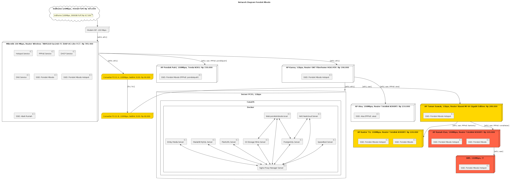
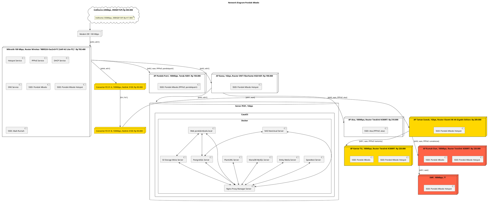

# Jaringan Pondok Mbodo

Public dokumentasi jaringan Pondok Mbodo.

| SSID (Nama WiFi)     | Keamanan                    |
| -------------------- | --------------------------- |
| Pondok Mbodo         | WPA/WPA2 PSK                |
| Pondok Mbodo Hotspot | Captive Portal Pondok Mbodo |
| Abah Rumah           | WPA/WPA2 PSK                |

## Rencana 2024

---

## Rencana 2027 (3 Tahun Kedepan)

- Semua jaringan full (Gigabit Ethernet) `1000 Mbps` untuk jaringan LOCAL AREA NETWORK (LAN).