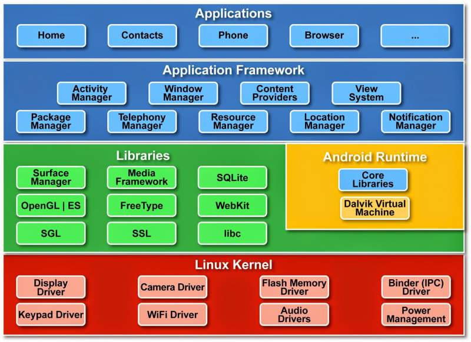

# Responsi

## 1. Sebutkan dan Jelaskan Jenis-jenis Sistem Operasi dan penggunaanya!

Ada beberapa jenis sistem operasi (OS) yang digunakan pada komputer dan perangkat elektronik lainnya. Berikut adalah penjelasan mengenai beberapa jenis sistem operasi dan penggunaannya:

Sistem Operasi Berbasis Teks (Command-line Operating System): Jenis sistem operasi ini hanya dapat dioperasikan melalui perintah yang dimasukkan melalui teks. Sistem operasi berbasis teks biasanya digunakan pada server atau komputer dengan spesifikasi rendah, karena sistem operasi jenis ini cukup ringan dan tidak memerlukan banyak sumber daya. Contoh dari sistem operasi berbasis teks adalah MS-DOS dan UNIX.

Sistem Operasi Berbasis Grafik (Graphical User Interface Operating System): Jenis sistem operasi ini menggunakan antarmuka grafis dan dapat dioperasikan melalui mouse atau keyboard. Sistem operasi berbasis grafis sangat populer digunakan pada komputer desktop, laptop, dan tablet. Contoh dari sistem operasi berbasis grafis adalah Windows, macOS, dan Linux.

Sistem Operasi Real-Time: Jenis sistem operasi ini dirancang untuk mengendalikan perangkat atau sistem yang membutuhkan pemrosesan data secara cepat dan akurat dalam waktu yang singkat. Sistem operasi real-time biasanya digunakan pada sistem yang memerlukan kontrol yang ketat, seperti sistem kendali industri dan sistem kendali lalu lintas. Contoh dari sistem operasi real-time adalah VxWorks dan QNX.

Sistem Operasi Jaringan (Network Operating System): Jenis sistem operasi ini dirancang untuk mengatur dan mengelola jaringan komputer. Sistem operasi jaringan memungkinkan beberapa komputer terhubung ke jaringan yang sama dan berbagi sumber daya dan data. Sistem operasi jaringan digunakan pada server dan jaringan bisnis yang besar. Contoh dari sistem operasi jaringan adalah Windows Server dan Linux.

Sistem Operasi Mobile: Jenis sistem operasi ini dirancang khusus untuk perangkat mobile seperti smartphone dan tablet. Sistem operasi mobile umumnya lebih ringan dan hemat daya dibandingkan sistem operasi desktop. Contoh dari sistem operasi mobile adalah Android dan iOS.

Sistem Operasi Embedded: Jenis sistem operasi ini dirancang untuk perangkat elektronik tertanam seperti sistem kontrol mesin, sistem pemantauan, dan perangkat pengukur. Sistem operasi embedded umumnya lebih ringan dan hanya menampilkan antarmuka sederhana yang sesuai dengan fungsinya. Contoh dari sistem operasi embedded adalah VxWorks dan ThreadX.

Pemilihan jenis sistem operasi yang tepat sangat penting, karena dapat mempengaruhi performa dan keandalan perangkat atau sistem yang digunakan.

## 2. Sebutkan dan jelaskan Arsitektur Android!

Arsitektur Android merupakan struktur yang terdiri dari komponen-komponen dan lapisan-lapisan yang saling berinteraksi dan mendukung fungsi sistem operasi Android. Berikut adalah penjelasan mengenai arsitektur Android:

- Kernel Linux: Arsitektur Android didasarkan pada kernel Linux, yang berfungsi sebagai dasar dari sistem operasi Android. Kernel Linux memungkinkan Android untuk berjalan pada berbagai perangkat dengan arsitektur CPU yang berbeda.

- Lapisan Hardware Abstraction: Lapisan ini berfungsi untuk memetakan antara perangkat keras dan sistem operasi. Lapisan ini memungkinkan Android untuk berjalan pada berbagai perangkat dengan perangkat keras yang berbeda tanpa perlu memodifikasi kode sumber Android.

- Lapisan Native Libraries: Lapisan ini berisi sekumpulan pustaka dan komponen-komponen native yang digunakan oleh sistem operasi Android. Komponen-komponen ini termasuk audio, grafik, dan pemrosesan gambar.

- Android Runtime: Android Runtime (ART) adalah mesin virtual yang menjalankan kode aplikasi pada sistem operasi Android. ART memungkinkan aplikasi untuk dijalankan secara efisien dan mengoptimalkan penggunaan baterai pada perangkat.

- Framework: Lapisan framework adalah kumpulan API dan komponen yang memungkinkan pengembangan aplikasi pada sistem operasi Android. Framework menyediakan antarmuka untuk interaksi antara aplikasi dan sistem operasi, serta menyediakan komponen seperti layanan, aktivitas, penyimpanan, dan jaringan.

- Aplikasi: Aplikasi adalah komponen teratas pada arsitektur Android. Aplikasi dapat dikembangkan oleh pengembang menggunakan bahasa pemrograman Java atau Kotlin. Aplikasi berinteraksi dengan sistem operasi melalui framework dan API yang disediakan oleh sistem operasi.

Dalam arsitektur Android, setiap lapisan memiliki tugas dan tanggung jawab yang berbeda-beda, namun saling berinteraksi satu sama lain untuk membentuk sistem operasi Android secara keseluruhan. Hal ini memungkinkan Android untuk berjalan pada berbagai perangkat dengan perangkat keras yang berbeda-beda.

## 3. Apa keuntungan dan Kerugian penggunaan OS Android!

Penggunaan sistem operasi Android memiliki keuntungan dan kerugian sebagai berikut:

Keuntungan penggunaan OS Android:

1. Terbuka dan Gratis: Android merupakan sistem operasi yang bersifat terbuka dan gratis, sehingga memungkinkan pengembang untuk mengakses kode sumber Android dan memodifikasi sesuai dengan kebutuhan mereka.

2. Beragam Pilihan Perangkat: Android dapat dijalankan pada berbagai jenis perangkat, mulai dari smartphone, tablet, hingga televisi pintar. Hal ini memberikan pengguna banyak pilihan dalam memilih perangkat Android yang sesuai dengan kebutuhan mereka.

3. Aplikasi yang Beragam: Google Play Store menyediakan beragam aplikasi dan game yang dapat diunduh dan digunakan pada perangkat Android.

4. Integrasi dengan Layanan Google: Android terintegrasi dengan berbagai layanan Google seperti Gmail, Google Drive, Google Maps, dan lain-lain, sehingga memudahkan pengguna dalam mengakses dan mengelola informasi mereka.

5. Pengembangan Aplikasi yang Mudah: Android menyediakan berbagai SDK dan API yang memudahkan pengembangan aplikasi.

Kerugian penggunaan OS Android:

1. Keamanan: Android sering menjadi target serangan malware dan virus karena jumlah perangkat Android yang banyak dan beragam, serta pembaruan keamanan yang mungkin terlambat pada beberapa perangkat.

2. Performa: Meskipun Android telah dikembangkan untuk bekerja pada berbagai jenis perangkat, performa perangkat mungkin tidak sama antara satu dengan yang lainnya, tergantung pada spesifikasi dan kapasitas perangkat.

3. Fragmentasi: Fragmentasi mengacu pada variasi sistem operasi dan perangkat yang digunakan oleh pengguna Android, yang dapat menghasilkan ketidakcocokan aplikasi dan mempersulit pengembangan aplikasi.

4. Pembaruan Perangkat Lunak yang Lambat: Meskipun Google secara teratur merilis pembaruan sistem operasi Android, pembaruan sering kali tidak segera tersedia pada semua perangkat, dan beberapa perangkat mungkin tidak mendapatkan pembaruan sama sekali.

5. Ketergantungan pada Google Play Store: Meskipun Google Play Store menyediakan berbagai aplikasi, pengguna Android harus mengandalkan layanan ini untuk mendapatkan aplikasi dan game. Ini membatasi pengguna untuk mengunduh aplikasi dari sumber lain yang mungkin lebih aman atau lebih relevan dengan kebutuhan mereka.

6. Keterbatasan Kapasitas Baterai: Meskipun beberapa perangkat Android memiliki baterai yang besar, beberapa perangkat mungkin memiliki baterai yang lebih kecil dan mudah habis. Hal ini dapat membatasi pengguna dalam menggunakan perangkat mereka untuk waktu yang lama, terutama jika mereka menggunakan aplikasi yang membutuhkan daya tinggi.

7. Tidak Konsisten dalam Pengalaman Pengguna: Karena Android dapat disesuaikan oleh produsen perangkat, pengalaman pengguna mungkin berbeda antara satu perangkat dengan perangkat lainnya, bahkan jika mereka menggunakan versi sistem operasi yang sama. Hal ini dapat mempersulit bagi pengguna dalam mengoperasikan dan memahami perangkat mereka.

8. Kurangnya Kontrol atas Pembaruan Aplikasi: Google Play Store sering melakukan pembaruan otomatis pada aplikasi tanpa pemberitahuan atau persetujuan pengguna. Hal ini dapat menyebabkan ketidaknyamanan bagi pengguna jika ada perubahan yang tidak disukai dalam aplikasi mereka.

9. Privasi: Beberapa pengguna khawatir tentang privasi mereka pada sistem operasi Android, terutama karena Android terintegrasi dengan layanan Google yang mengumpulkan data pengguna. Meskipun ada opsi privasi yang tersedia untuk pengguna, beberapa orang mungkin merasa tidak nyaman dengan tingkat pengumpulan data yang dilakukan oleh sistem operasi.

Meskipun ada beberapa kerugian dalam menggunakan sistem operasi Android, namun Android masih menjadi sistem operasi yang populer dan banyak digunakan oleh pengguna di seluruh dunia. Keuntungan-keuntungan dari penggunaan Android, seperti kemudahan pengembangan aplikasi dan pilihan perangkat yang beragam, terus menarik perhatian pengguna dan pengembang.

## 4. Jelaskan Konsep penggunaan Sqlite dalam Android Studio!

SQLite adalah salah satu database relasional yang digunakan dalam pengembangan aplikasi Android. Konsep penggunaan SQLite dalam Android Studio adalah sebagai berikut:

- Membuat Database: Pertama, pengembang harus membuat database di Android Studio. Hal ini dilakukan dengan menggunakan kelas SQLiteOpenHelper. Pengembang dapat menentukan nama database, versi, dan tabel yang ada di dalam database.

- Membuat Tabel: Setelah database dibuat, pengembang harus membuat tabel di dalamnya. Pengembang dapat menentukan nama tabel, kolom dan tipe data yang ada di dalam tabel.

- Memasukkan Data ke Tabel: Setelah tabel dibuat, pengembang dapat memasukkan data ke dalam tabel menggunakan perintah INSERT INTO. Data ini dapat dimasukkan langsung atau dari sumber data eksternal.

- Membaca Data dari Tabel: Pengembang dapat membaca data dari tabel menggunakan perintah SELECT. Data yang dibaca dapat disimpan dalam berbagai struktur data seperti ArrayList atau Cursor.

- Mengubah Data di Tabel: Pengembang dapat mengubah data yang ada di dalam tabel menggunakan perintah UPDATE.

- Menghapus Data dari Tabel: Pengembang dapat menghapus data yang ada di dalam tabel menggunakan perintah DELETE.

Dalam pengembangan aplikasi Android, SQLite digunakan untuk menyimpan data yang dibutuhkan oleh aplikasi, seperti konfigurasi, informasi pengguna, dan data aplikasi lainnya. SQLite juga dapat digunakan untuk menyimpan cache data sementara yang dapat membantu mempercepat waktu respons aplikasi. Oleh karena itu, penggunaan SQLite dalam Android Studio sangat penting untuk mengoptimalkan kinerja aplikasi dan memastikan aplikasi dapat bekerja dengan baik di berbagai perangkat.
