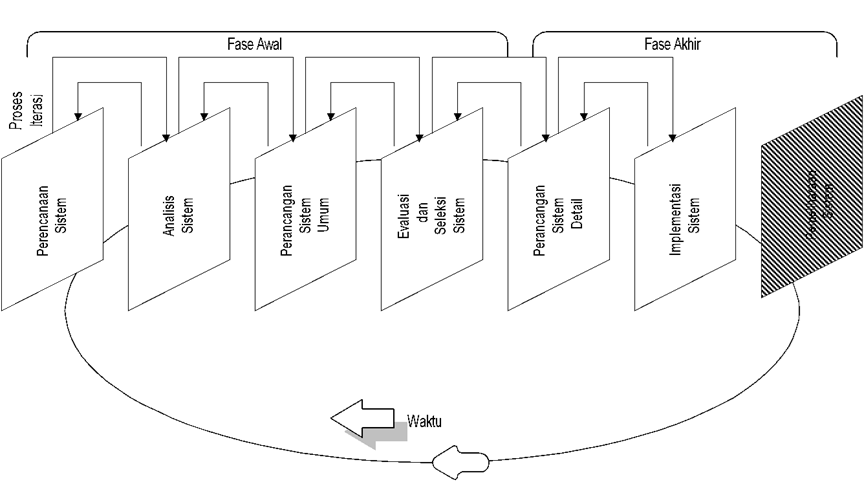
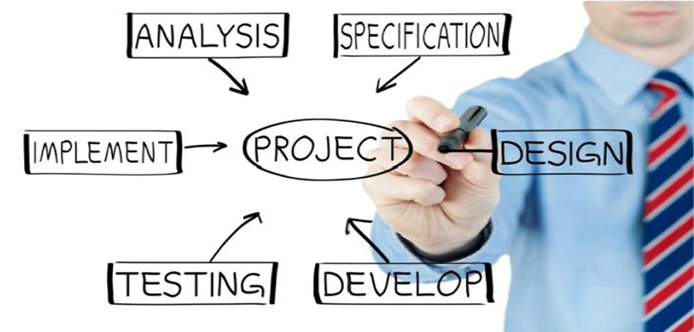
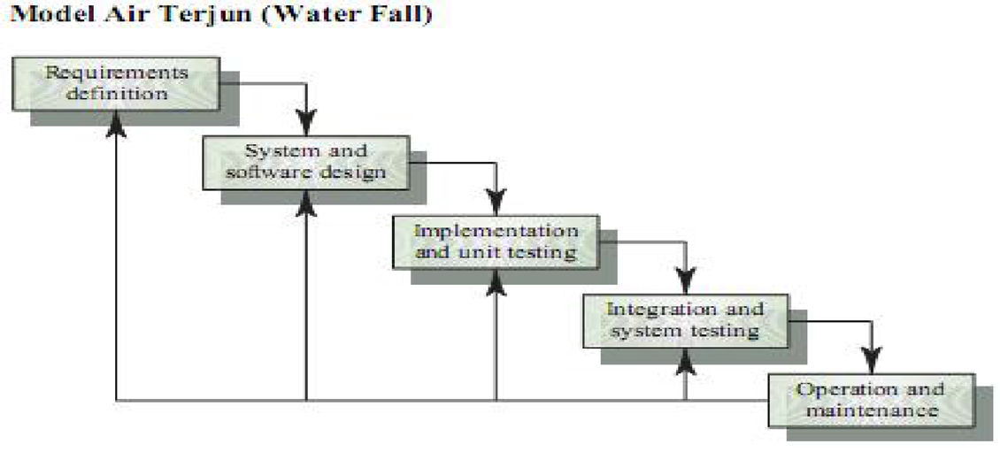
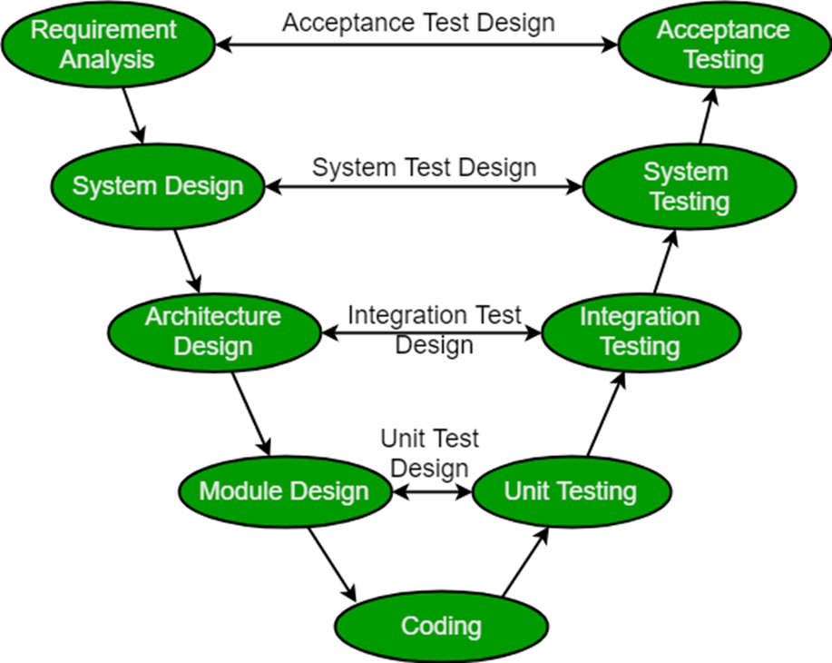
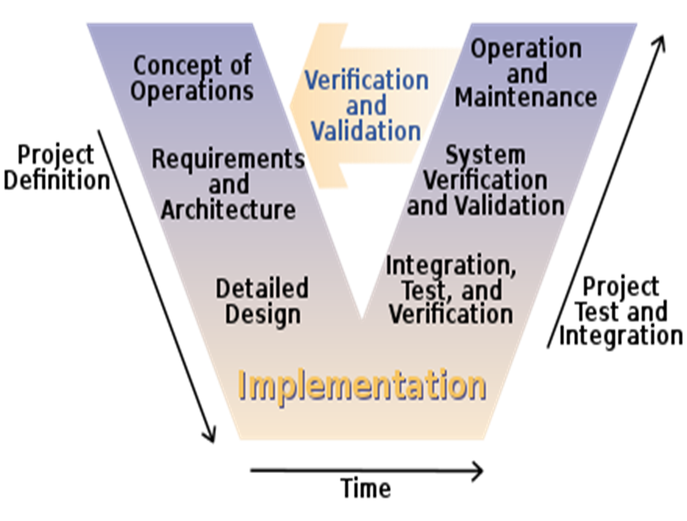
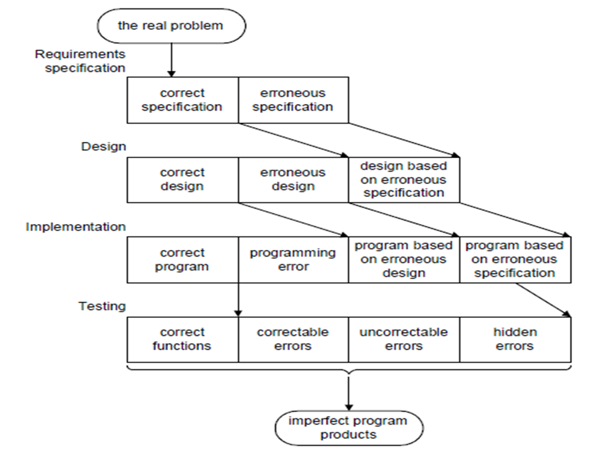
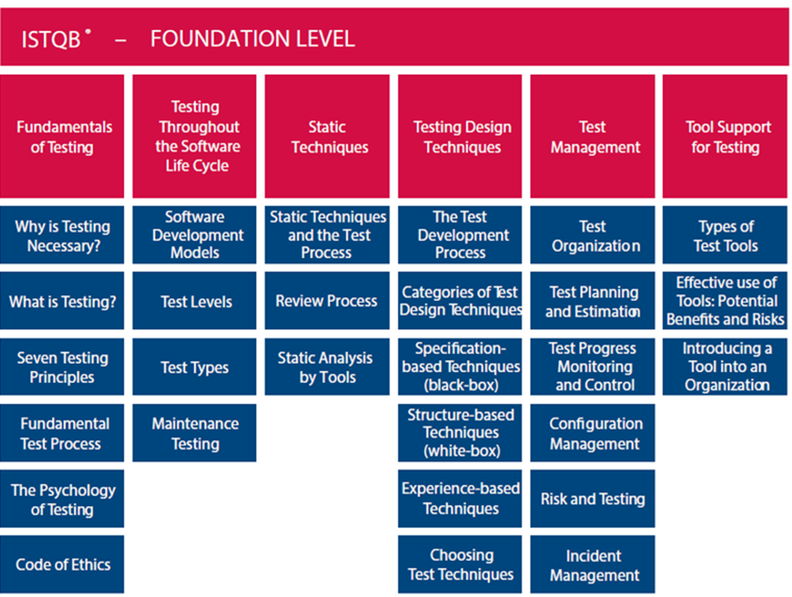

# Pendekatan Pengembangan Sistem atau Perangkat Lunak

## Capaian Pembelajaran

Mahasiswa memperoleh pandangan umum tentang Rekayasa Perangkat Lunak [RPL] dan pengujian perangkat lunak.

## Kemampuan Akhir yang Diharapkan

Mahasiswa dapat memahami Pengembangan Perangkat Lunak, Proses Pengembangan Perangkat Lunak, Tahapan-tahapan Pengembangan Perangkat Lunak, Implementasi dan Pengujian Perangkat Lunak.

## Alasan Pengembangan Sistem

1. Sistem Berjalan
   - Karena adanya kebutuhan atau masalah.
   - Karena adanya peluang atau kesempatan.
   - Karena adanya regulasi atau petunjuk dll.
2. Pengembangan Sistem
   - Menyelesaikan masalah atau kebutuhan yang ada.
   - Pengambilan keputusan.
   - Mengikuti regulasi atau petunjuk yang ada.
3. Sistem yang Baru

## Kenapa Perangkat Lunak Perlu di Uji?

- Error (Kekeliruan, ketidak tepatan, kerusakan pada software/hardware)
 Karena error ini, maka pelaksanaan perintah tidak sesuai dengan yang diharapkan.
- Defect adalah catat atau kekurangan didalam sistem software, namun tidak memiliki dampak apabila tidak mempengaruhi customer/user dan sistem operasional organisasi.
- Failure adalah cacat yang memberikan dampak negatif pada customer/user

## Pengembangan Perangkat Lunak atau Sistem

Perangkat lunak menjadi kebutuhan manusia dengan berbagai bagidan disiplin ilmu. Menjadi bagian penting yang melatarbelakangi tumbuhnya perkembangan perangkat lunak (sisi krisis: konsumen, manajer, dan pengembang/praktisi)

Serangkaian masalah yang terjadi dalam pengembangan perangkat lunak komputer.

- Perangkat lunak yang tidak berfungsi dengan baik (mutu perangkat lunak)
- Perangkat lunak tidak hanya dokumentasi terhadap source code tapi juga dokumentasi terhadap sistem keseluruhan yang dibutuhkan selama pengembangan, instalasi, penggunaan, dan pemeliharaan sebuah sistem.
- Perangkat lunak haru:
  - Maintainability (dapat dirawat)
  - Dependability (dapat dipercaya)
  - Efisiensi (penggunaan resource efisien)
  - Usability (dapat digunakan sesuai dengan yang direncanakan)

Proses pengembangan perangkat lunak dengan menggunakan model **Daur Hidup Rekayasa Perangkat Lunak (Software Development Live Cycle) [SLC/SDLC]**

Macam perangkat lunak:

- Sistem
- Bisnis
- Teknik
- Embedded Software
- Personal
- Kecerdasan Buatan
- dll.

Merupakan sekumpulan aktivitas yang memiliki tujuan untuk pengembangan ataupun evolusi perangkat lunak.

Aktivitas umum dalam semua proses perangkat lunak terdiri dari:

- Software specification - apa yang harus dilakukan oleh perangkat lunak dan batasan atau kendala pengembangan.
- Software development - proses memproduksi sistem perangkat lunak.
- Software validation - pengujian perangkat lunak terhadap keinginan pengguna
- Software evolution - perubahan perangkat lunak berdasarkan perubahan keinginan.

## System Development Life Cycle [SDLC]

## Metodologi Pembangunan Sistem

Model proses aktivitas pengembangan yang fundamental adalah Waterfall:

1. Reuirement Analysis and Definition
2. System and Software Design
3. Implementation and Unit Testing
4. Integration and System Testing
5. Operation and Maintenance

### V-Model

| V-Model A                                 | V-Model B                                 |
| ----------------------------------------- | ----------------------------------------- |
|  |  |

## Software Development Activities

### Application Domain

1) Requirements analysis - What is the problem?
2) System design - What is the solution?

### Solution Domain

3) Detailed design - What are the best mechanisms to implement the solution?
4) Program implementation - How is the solution constructed?
5) Testing - Is the problem solved?
6) Delivery - Can the customer use the solution?
7) Maintenance - Are enhancements needed?

## General Phase to Software Engineering

### Definition phase -> berfokus pada "apa (what)"

- Informasi yang akan diproses
- Fungsi dan performance yang dibutuhkan
- Tingkah laku sistem yang diharapkan
- Interface yang akan dibangun
- Batasan sistem yang sukses

### Development phase -> berfokus pada "bagaimana (how)"

- Data dikonstruksikan
- Fungsi-fungsi diimplementasikan
- Detail prosedur akan diimplementasikan
- Interface di karakterisasi
- Rancangan akan diterjemahkan ke dalam pemrograman
- Pengujian dilakukan

### Maintenance phase -> berfokus pada "perubahan (change)"

- Dihubungkan dengan koreksi kesalahan
- Ketika lingkungan perangkat lunak berkembang
- Sehubungan dengan perubahan kebutuhan pelanggan

## Changes in Phase Development

### Correction (Koreksi)

Membetulkan cacat atau kerusakan

### Adaptation (Adaptasi)

Modifikasi perangkat lunak karena perubahan kebutuhan fungsional original (CPU, OS, aturan bisnis, karakteristik produk eksternal, dll.)

### Enhancement (Perkembangan)

Memperluas perangkat lunak sehingga melampaui kebutuhan fungsi originalnya

### Prevention (Pencegahan)

Pencegahan sebagai antisipasi perubahan karena usia perangkat lunak.

## Penyebab 56% Proyek GAGAL

Perangkat lunak yang dihasilkan tidak akan memenuhi kebutuhan pemakai yang sebenarnya.

Jika kesalahan tersebut diketahui di akhir siklus hidup pengembangan, usaha untuk memperbaikinya akan sangat mahal.

## Biaya Pengembangan Perangkat Lunak/Sistem

Sekitar 60% untuk biaya pengembangan, 40% biaya pengujian. Untuk perangkat lunak berbasis pengguna (custom), biaya evolusi biasanya melebihi biaya pengembangan.

Produk perangkat lunak yang bermutu dipengaruhi oleh 3 pihak yaitu:

1. Pihak sponsor,
2. Developer,
3. User/Pengguna.

## Implementasi Perangkat Lunak

Implementasi perangkat lunak yang merupakan bagian dari tahapan siklus hidup pengembangan perangkat lunak [SDLC]

Fondasi dari aktivitas ini adalah pemrograman.

- Aktivitas dari pemrograman akan menghasilkan PROGRAM.
- Program adalah serangkaian ekspresi yang disusun menjadi kesatuan prosedur berupa urutan langkah untuk menyelesaikan suatu permasalahan dan diimplementasikan dalam bentuk bahasa pemrograman sehingga dapat dijalankan pada komputer.
- Tools untuk membuat program disebut bahasa pemrograman. 2 faktor penting bahasa pemrograman:
  - Syntax, yaitu aturan-aturan gramatikal yang mengatur tata cara penulisan ekspresi/statement
  - Semantic, yaitu aturan-aturan untuk menyatakan suatu arti.

## Pengujian Perangkat Lunak

Pengujian perangkat lunak menunjukkan bahwa fungsi perangkat lunak bekerja sesuai spekfikasi dan bahwa persyaratan kinerja telah dipenuhi.

Motivasi: membangun perangkat lunak mulai dari konsep abstrak sampai kepada tahap implementasi.

Proses ini lebih terkesan berusaha untuk `membongkar` perangkat lunak yang dibangun.

Proses pengujian merupakan tahapan dimana secara fisik terlihat lebih banyak sisi destruktifnya dibandingkan konstruktifnya karena tujuannya adalah untuk menemukan kesalahan pada perangkat lunak.

Sasaran pengujian perangkat lunak:

- Pengujian untuk menemukan kerusakan-kerusakan yang sebelumnya belum ditemukan.
- Pengujian dikatakan berhasil jika berhasil menentukan kerusakan yang belum ditemukan.

## Prinsip Pengujian Perangkat Lunak

Sasaran pengujian perangkat lunak adalah untuk menemukan kesalahan. Semua pengujian harus dapat ditelusuri sampai ke kebutuhan pelanggan sebenarnya.

Pengujian dapat direncanakan dan dirancang sebelum semua kode dibuat/dibangkitkan. Pengujian harus direncanakan lama sebelum dimulai.

Prinsip pareto berlaku untuk pengujian perangkat lunak. Prinsip pareto mengimplikasikan bahwa 80% dari semua kesalahan yang ditemukan selama pengujian akan dapat ditelusuri sampai 20% modul program

Pengujian harus dimulai "dari yang kecil" dan perkembangan ke pengujian "yang besar".

Tidak mungkin melakukan pengujian yang mendalam.

Agar memperoleh pengujian yang paling efektif, pengujian harus dilakukan oleh pihak ketiga yang independen.

## Strategi Pengujian perangkat Lunak

Strategi pengujian yang dilakukan pada proses Rekayasa Perangkat Lunak:

- Unit Testing: pengujian pada bagian terkecil dari suatu program.
- Integration Testing: pengujian pada saat unit-unit di integrasikan membentuk suatu perangkat lunak yang lengkap.
- Validation Testing: pengujian yang dilakukan untuk memvalidasi
- System Testing: pengujian yang dilakukan setelah perangkat lunak terintegrasi pada Sistem Berbasis Komputer.

## International Software Testing Qualification Board

