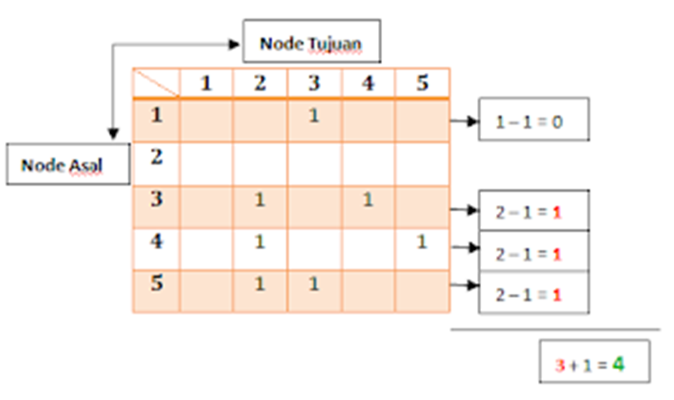
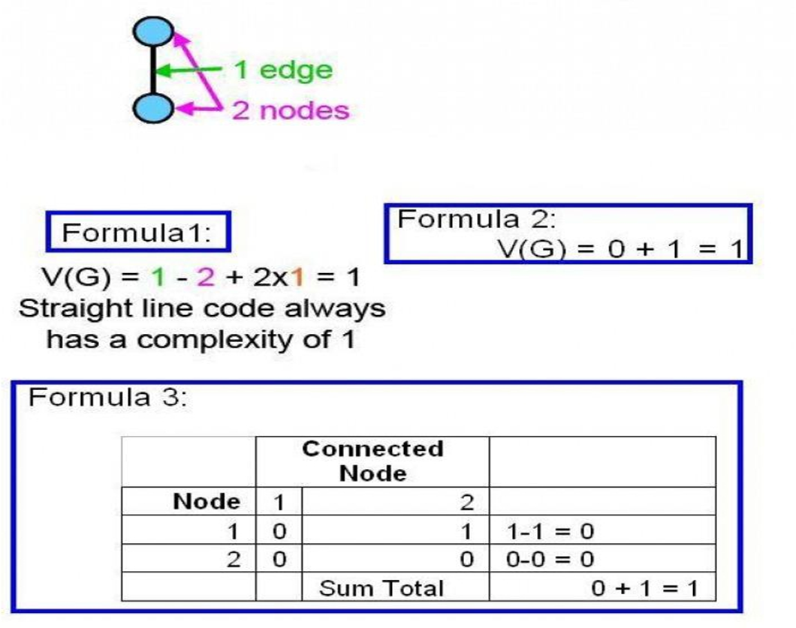
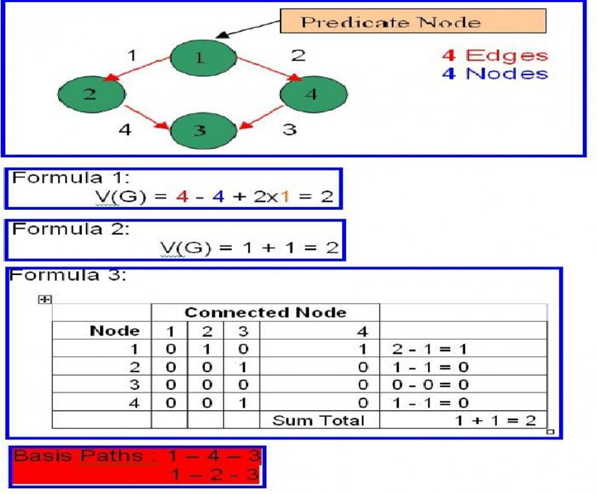
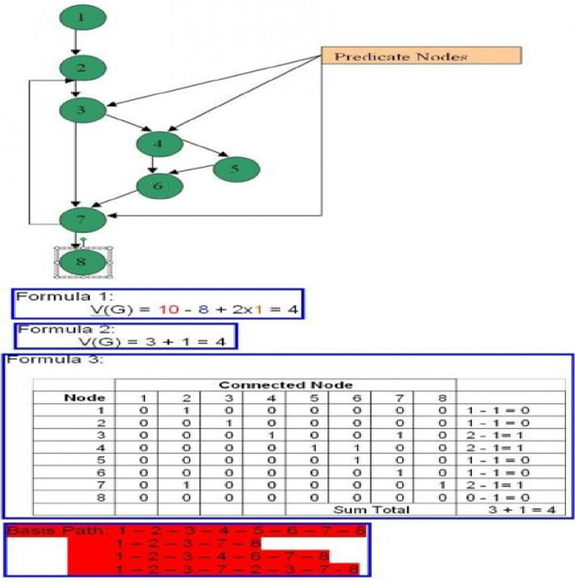
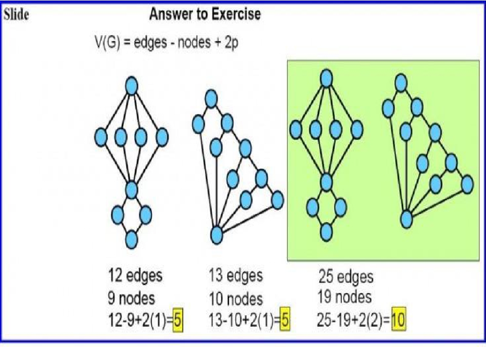
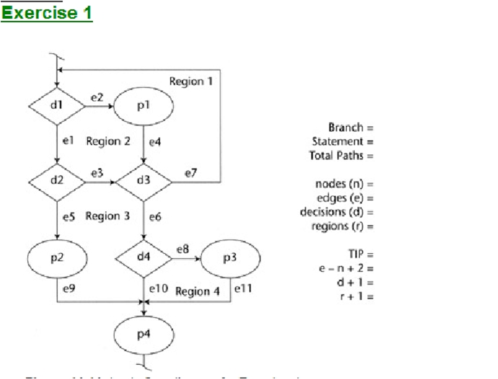
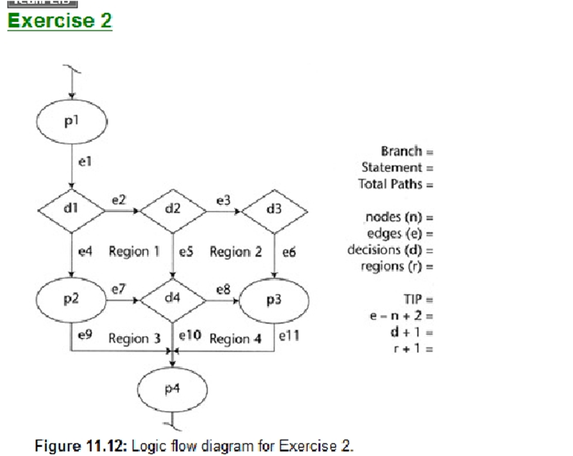
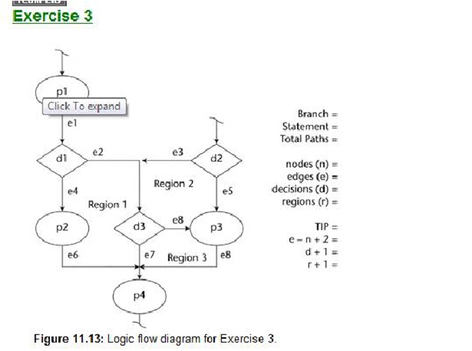
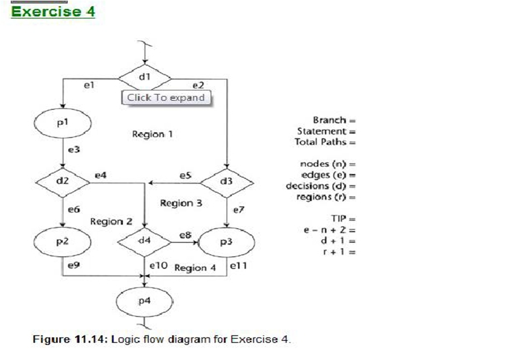

# Graph Matrix

>**Campaian Pembelajaran**
>Mahasiswa memperoleh pandangan umum tentang pengujian perangkat lunak White-Box

>Kemampuan Akhir yang Diharapkan
>Mahasiswa dapat melakukan pengujian Perangkat Lunak menggunakan menggunakan metode White-Box dan menghitung Graph-Matrix

Graph Matrix adalah matrix berbentuk persegi panjang sama sisi dimana jumlah baris & kolom sama dengan jumlah node dan identifikasi baris & kolom sama dengan identifikasi node, serta isi data adalah keberadaan penghubung antar node (edges).

## Kompleksitas Siklomatis

Kompleksitas Siklomatis merupakan matrik tradisional yang menghitung tingkat kompleksitas suatu method/procedure. Kompleksitas siklometis digunakan mencari jumlah path dalam satu flow graph.

Rumus-rumus untuk menentukan nilai kompleksitas siklomatis:

1. Jalur independen
2. V(G) = E-N+2
3. V(G) = P + 1
4. Region

Keterangan:
Jalur independen = beberapa cara penyelesaian grafik alir bisa sampai ketujuan.
E = jumlah edge/garis panah
N = jumlah node/simpul
P = Jumlah predikat (node yang memiliki cabang)
R = region adalah jumlah wilayah kompleksitas siklomatis yaitu suatu area yang dibatasi oleh edges dan nodes (dan pada saat menghitung regions, area diluar grap ikut ditambahkan)

## KSA: Kompleksitas Siklomatis

Kompleksitas Siklomatis (Cyclomatic Complexity) [C/V(G)] adalah sebuah metrik perangkat lunak yang digunakan untuk `mengukur kompleksitas struktural` dari sebuah program komputer. Metrik ini didasarkan pada teori graf dan menghitung jumlah sirkuit linearly independen (atau "siklus") dalam graf alur kendali program.

Dalam pemrograman, struktur alur kendali program dapat digambarkan sebagai sebuah graf, dimana setiap simpul mewakili blok kode dan setiap edge menunjukkan aliran eksekusi antara blok kode tersebut. Siklus linearly independen dalam graf alur kendali program dapat dianggap sebagai urutan instruksi yang mungkin akan dieksekusi berulang kali selama eksekusi program, terlepas dari input yang diberikan.

Semakin banyak siklus linearly independen dalam program, semakin kompleks program tersebut dan semakin sulit untuk memahami dan memodifikasi kode tersebut. Oleh karena itu pengukuran kompleksitas siklomatis dapat membantu dalam memperkirakan biaya pengembangan, memperbaiki, dan memelihara program.

Kompleksitas siklomatis dapat dihitung menggunakan beberapa teknik, termasuk metode grafik dan analisis teori graf. Salah satu metode paling umum digunakan adalah metode McCabe, yang menghitung kompleksitas siklomatis dengan menghitung jumlah area berwarna putih pada graf alur kendali program. Semakin banyak area putih, semakin kompleks program tersebut.

### Metode McCabe

> C atau V(G) = E - N + 2  
> atau  
> C = P + 1
>
> Kompleksitas Siklomatis = jumlah cabang - jumlah simpul + 2  
> atau  
> Kompleksitas Siklomatis = jumlah daerah putih + 1

Di sini, jumlah cabang mengacu pada jumlah edge dalam graf alur kendali program yang mengarah keluar dari sebuah simpul. Jumlah simpul mengacu pada jumlah blok kode dalam program. Jumlah daerah putih mengacu pada jumlah daerah yang dibatasi oleh edge dalam graf alur kendali program.

| Simbol | Keterangan                                                   |
| ------ | ------------------------------------------------------------ |
| C      | (Cyclomatic complexity) kompleksitas siklomatis              |
| E      | (Edges) jumlah edge (cabang) dalam graf alur kendali program |
| N      | (Nodes) jumlah simpul (blok kode) dalam program              |
| P      | jumlah daerah putih dalam graf alur kendali program          |

### Metode Graphical

C atau V(G) = S - N + 1

> Kompleksitas Siklomatis = jumlah siklus - jumlah simpul + 1

Di sini, jumlah siklus mengacu pada jumlah sirkuit linearly independen dalam graf alur kendali program.

| Simbol | Keterangan                                                         |
| ------ | ------------------------------------------------------------------ |
| C      | (Cyclomatic complexity) kompleksitas siklomatis                    |
| S      | jumlah sirkuit linearly independen dalam graf alur kendali program |
| N      | (Nodes) jumlah simpul (blok kode) dalam program                    |

> Dalam praktiknya, metode McCabe lebih umum digunakan karena lebih mudah dipahami dan dihitung. Namun, beberapa orang lebih suka menggunakan mitode Graphical karena dianggap lebih akurat.
