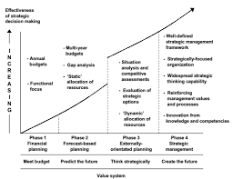
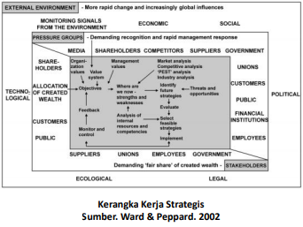
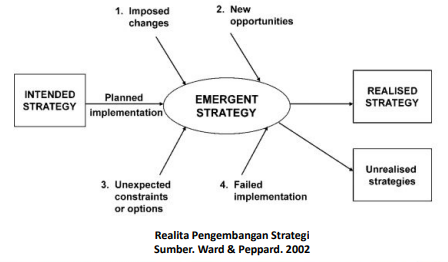
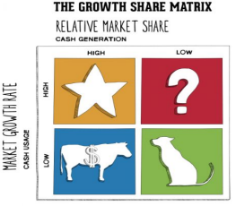

# Konsep Strategi Bisnis dan Implikasi Strategi SI/TI

## Manajemen Strategi Bisnis

Saat ini sebagian besar organisasi menyadari bahwa strategi sistem informasi harus dikembangkan dalam konteks yang lebih luas dari strategi perusahaan, bisnis dan implementasinya. Investasi sistem informasi dan teknologi dalam organisasi diarahkan menuju pencapaian tujuan dan rencana bisnis.

Sistem Infroamsi atau Teknologi Informasi bukan merupakan implementasi dari pilihan strategi tertentu, tetapi merupakaan faktor pendukung penyusunan strategi baru yang tidak mungkin dapat berjalan jika tidak memanfaatkan Sistem Informasi atau Teknologi Informasi.

Dulu, proporsi dana yang dikeluarkan untuk sistem informasi dan teknologi tidak dikaitkan dengna tujuan tersebut, maka dari itu manfaat yang dihasilkan tidak disadari.

Apabila organisasi sukses dalam mengelola Sistem Informasi atau Teknologi Informasi-nya, maka dapat memaksimalkan pengembalian (return) dana yang telah dikeluarkan untuk memperoleh Teknologi Informasi, memproses dan memanfaatkan informasi dalam organisasi, memungkinkan penggunaan yang strategis dari informasi, untuk mencapai keunggulan kompetitif dan menjauhkan/menghindari ancaman kompetitif.

Maka dari itu, penting bagi manajer bisnis untuk terlibat dalam proses pengembangan strategi sistem informasi. Artinya setiap proses pengembangan tersebut bisa dimengerti dan dipahami oleh manajer bisnis.

Strategi yang dibuat harus berkaitan dengan masalah bisnis, kemudian dibimbing dan diarahkan menggunakan alat dan teknik yang mereka familiar, dalam bahasa yang mereka mengerti, menghindari jargon atau istilah seputar Teknologi Informasi.

## Evolusi Strategi dan Perencanaan Strategis dalam Organisasi

Selama tahun 1950-an Harvard Business Schoool menjadi yang pertama kali menyorot pentingnya memiliki strategi perusahaan yang terintegrasi dengan bermacam-macam area fungsional.

Awal 1976 ada penelitian yang berhasil mengenali kegagalan/kelemahan dari perencanaan strategis yang ada saat itu, dimana strategi tersebut digunakan untuk memecahkan permasalahan yang timbul pada masa pasca industri. Mereka kemudian menyarankan penerapan manajemen strategis.

Dalam perjalanan evolusinya, tahun 1980 peneliti lain berhasil mengembangkan model untuk mendeskripsikan peningkatan kematangan Strategi dan Perencanaan Strategis dalam Organisasi.

## Fase Evolusi Strategi dan Perencaan Strategis dalam Organisasi

### Fase 01

Fokus pada cash flow dan perencanaan keunangan tahunan, serta termasuk di dalamnya teknik-teknik sederhana untuk mengembangkan medium term budget.

Praktik ini biasanya dijalankan secara internal, antara departemen yang satu dan lainnya.

Fokus perencanaan adalah untuk mengurangi segala macam biaya, hingga masalah keuangan terkecil, untuk memenuhi budget.

### Fase 02

Fokusnya adalah usaha untuk memprediksi/meramalkan, biasanya mengacu pada historical performance, dianalisa dan diproyeksikan ke masa depan menggunakan trend internal dan parameter ekstenal, seperti ekonomi dan data riset pasar.

Perencanaannya, masih kuantitatif dan internal oriendted, fokus pada gaps antara target yang ingin dicapai dan sumber daya yang dimiliki.

### Fase 03

Untuk pertama kalinya mempertimbangkan lingkungan eksternal, untuk mendapatkan pemahaman mengenai sifat kompetisi di industri mereka, dalam rangka untuk menilai dan mempertimbangkan ancaman dan posisi organisasi, untuk mendapatkan keuntungan.

Mengidentifikasi produk baru, pilihan target pemasaran, dan evaluasi untuk menentukan apa saja yang kira-kira tidak sesuai dengan organisasi, tetapi juga dapat memuaskan permintaan dari kompetisi.

### Fase 04

Organisasi fokus pada inovasi dan mampu menciptakan lingkungan bisnis mereka sendiri.

Organisasi menyadari bahwa dalam lingkungan bisnis seperti sekarang ini, produk yang dimiliki sudah usang, dan sumber daya utama untuk mempertahankan keunggulan kompetitif adalah kemampuan untuk memberikan respon secara konsisten dalam merubah pasar dengan menampilkan produk baru yang bisa bersaing.

## Strategi VS Perencanaan

> Strategy VS Planning

Menurut Hamel, perencanaan (_planning_) adalah _programming_, bukan _discovering_, bahwa pembuatan strategi itu harusnya demokratis dan bukan menjadi beban manajer senior saja.

Strategi bukan merupakan hasil dari _strategic planning_ tetapi sebuah produk yang berisi serangkaian proses.

Strategi dapat didefinisikan sebagai serangkaian aktivitas yang terintegrasi dalam meningkatkan kesuksesan untuk jangka waktu yang lama dan kekuatan dari perusahaan dibandingkan dengan kompetitor.

## Strategi

Ada 3 proses yang berkontribusi dalam penerapan strategi:

- Strategic Thinking  
  Kreatif, pandangan enterprenurial yang bisa dikembangkan oleh organisasi.
- Strategic Planning  
  Sistematis, analisa yang komprehensif untuk mengembangkan rencana dari aktivitas.
- Opportunistic Decision Making  
  Reaksi yang efektif terhadap ancaman dan kesempatan yang tidak terduga.

## The Strategic Framework

> Kerangka Kerja Strategis

Banyak teknik analisa dari formulasi strategi digunakan untuk fokus pada masalah strategis tertentu saja, misalnya: strategi untuk analisa kompetitor dan kekuatan dari produk yang dimiliki saat ini.

Kemudian muncul kerangka kerja strategis (Strategic Framework) yang memiliki konteks yang lebih luas dari pada hal tersebut.

Kerangka kerja tersebut mempertimbangkan beberapa faktor yang terlibat dalam manajemen strategis bisnis:

1. Lingkuangan Eksternal
2. Pressure Group dan Stakeholder
3. Strategi dan Perencanaan Bisnis Internal (Bussiness Strategy Formulation and Planning Procsesss)

### Lingkungan Ekstenal

Bisnis atau perusahaan beroperasi di dalam sebuah lingkungan eksternal, sehingga banyak aspek yang harus dianalisa, dipahami, dan diinterprestasikan diawal proses penetapan strategi.

Lingkungan eksternal yang mempengaruhi, diambil dari analisa `PEST`, yaitu:

- **P**olitik
- **E**konomi
- **S**osial
- **T**eknologi

Serta tambahan 2 aspek lagi yaitu

- Legal
- Ekologi

### Pressure Group dan Stakeholder

> Tekanan dari grup dan pengampu kepentingan.

#### Pressure Group

Dikarakteristikan berdasarkan permintaannya terhadap organisasi

Mereka meminta untuk diakui keberadaan dan dampak yang mereka timbulkan, serta mengharapkan respon yang layak dari manajemen untuk memuaskan kebutuhan mereka.

Hubungan dengan Pressure Group ini harus secara rutin diawasi, karena selain mereka bisa menjadi ancaman jika tidak ditangani dengan baik, mereka juga bisa membawa kesempatan yang dapat dimanfaatkan untuk keuntungan organisasi.

#### Stakeholder

Stakeholder memiliki kepentingan keuangan dalam organisasi, dan meminta pembagian dari keuntungan yang diperoleh organisasi.

Semua stakeholder mengharapkan keuntungan material dan finansial dari organisasi.

### Business Strategy Formulation and Planning Proccess

> Strategi dan Perencanaan Bisnis Internal

Organisasi harus mengidentifikasi dan mengevaluasi serta memutuskan strategi yang ingin dicapai.
Kemudian ditetapkan bagaimana cara untuk mencapai strategi tersebut, dengan merencanakan aktivitas/tindakan yang dibutuhkan, serta secara efektif mengembangkan dan menggunakan sumber daya.

Elemen kunci dari Perencanaan Proses Bisnis (Bussiness Planning Process)

**1. Tujuan**

Biasanya dideskripsikan dengan mengacu pada:

- Keuntungan
- Pertumbuhan
- Market share
- Kepuasan pelanggan
- Pengembangan produk baru
- Kepegawaian
- Social responsibility
- dsb.

Tujuan harus bisa merefleksikan nilai yang telah ditentukan oleh organisasi, baik itu oleh manajemen dan stakeholder.

**2. Analisa Situasi**

Melihat situasi/kondisi organisasi memiliki 2 elemen penting, yaitu melihat dari dalam dan dari luar organisasi.

> **Analisa Internal**
>
> - Sumber daya yang dimiliki organisasi
> - Keadaan kuangan organisasi. Aset, hutang, dll.
> - Pegawai. Skill, training, pengalaman, dll.
> - Aset fisik
> - Riset dan pengembangan
> - Struktur dan hubungan, sikap dan budaya organisasi, dll.

> **Analisa Eksternal**
>
> - Segmen pasar dan market share
> - Posisi organisasi dalam lifecycle produk
> - Kompetitor saat ini dan potensial kompetitor
> - Aktivitas bersaing di masa depan

Elemen kunci yang ketiga:

**3. Strategi Selanjutnya**

Kriteria yang harus dianalisa:

1. Resiko, baik finansial maupun managerial
2. Kemampuan organisasi dalam mengimplementasikan strategi

## Implementasi Strategi

Strategi harus dijalankan sampai akhir agar tercapai apa yang ingin dicapai.
Membutuhkan:

1. Sumber daya
2. Alokasi sumber daya secara efektif
3. Definisi peran dan tanggung jawab.
4. Memiliki pegawai yang antusias untuk berkontribusi dalam pencapaian strategi

Strategi hanyalah alat untuk mencapai tujuan, untuk mencapai apapun yang mereka butuhkan diimplementasikan! ini mensyaratkan bahwa sumber daya yang memadai harus diperoleh, dan dialokasikan secara efektif, organisasi bertanggung jawab sesuai dengan sumber daya yang ada dan orang-orang termotivasi untuk berkontribusi pada pencapaian strategi.

Kendala tak terduga atau opsi baru akan terjadi, perubahan akan diberlakukan oleh tindakan orang lain, akan muncul peluang baru yang tidak bisa diprediksi dan beberapa bagian dari strategi akan gagal diimplementasikan dengan sukses. Dengan memiliki kombinasi proses, organisasi akan lebih mampu untuk membuat strategi yang tepat.

## Alat dan Teknik Strategi: BCG MATRIX

Boston Consulting Group Matrix yang biasa dikenal dengan singkatan BCG Matrix adalah alat bantu untuk menganalisis sebuah bisnis. Analisis ini dapat membantu perusahaan menilai masing-masing kebutuhan produk pada unit yang dimiliki, sehingga bisa menentukan strategi kedepannya untuk masing-masing SI/TI tersebut. Jadi masing-masing produk mempunyai perlakuan yang berbeda sesuai dengan kondisi yang dihadapi.

Berikut adalah gambaran dari BGC Matrix:

Terdapat 4 kuadran yang menggambarkan kondisi sebuah produk, yaitu:

- Star
- CashCow
- Dog, dan
- Question Mark

Berikut penjelasannya:

### ⭐ Star

Pada kuadran ini bisa dilihat bahwa pertumbuhan pasarnya sangat pesat. Peminatnya juga banyak. Strategi yang sesuai untuk kuadran ini adalah dengan cara "Hold" agar tetap pada kuadran ini, tidak menurun.

### 🐄 Cash Cow

Pada kuadran ini biasanya dialami oleh produk lama yang pengembangan sudah maksimal, hanya saja penjualan besar dan menghasilkan banyak cash flow.

Strategi SI/TI adalah menjaga produktivitas bisnis pengendalian pelanggan dan pemasok untuk mempertahankan posisi pasar yang ada adalah menjadi tujuan utama, tidak membiarkan pesaing mendapatkan keuntungan. SI/TI cenderung berfokus pada pengendalian hubungan bisnis.

### 🐕 Dog

Pada kuadran ini biasanya dialami oleh produk yang dianggap paling tidak menguntungkan, karena produk ini kurang diminati di pasar dan juga penjualannya rendah.

Strategi SI/TI pada posisi ini sangat sedikit inovatif penggunaan SI/TI yang dapat diharapkan.

### ❓ Question Mark

Pada kuadran ini biasanya dialami oleh produk yang baru dikeluarkan, karena market interestnya tinggi tapi penjualan masih sedikit.

Strategi SI/TI cenderung berfokus pada produk dan/atau proses pengembangan, atau digunakan untuk mengidentifikasi pelanggan potensial, segmen pelanggan dan kemudian pastikan informasi yang efektif.

## Referensi

- John Ward & Joe Peppard. Strategic Planning for
  Information Systems. 2002

## Kuis

1. Jelaskan bagaimana evolusi Strategi dan Perencanaan Strategis di Perusahaan!
2. Sebut dan jelaskan 3 faktor pada The Strategic Framework!
3. Sebut dan jelaskan Elemen Kunci pada perencanaan Proses Bisnis!
