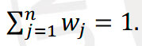
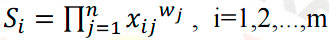
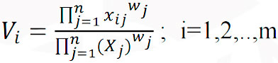
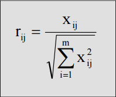
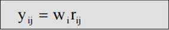
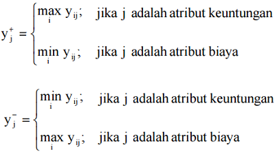
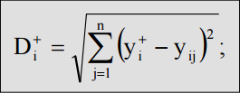
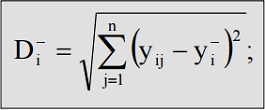
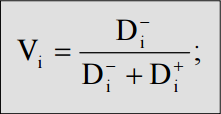

# Kuis WP dan TOPSIS

## 1. Berikan penjelasan mengenai metode WP dan TOPSIS dalam sistem pendukung keputusan!

Weighted Product (WP) merupakan salah satu metode sistem pendukung keputusan yang termasuk ke dalam kategori Multiple Criteria Decision Making (MCDM), metode ini menggunakan perkalian untuk menghubungkan rating atribut, dimana rating setiap atribut harus dipangkatkan dulu dengan bobot atribut yang bersangkutan.

TOPSIS adalah metode analisis keputusan multi-kriteria yang dibuat oleh Hwang dan Yoon pada tahun 1981. Metode ini membandingkan setiap alternatif dengan alternatif terbaik dan terburuk untuk memberikan solusi terbaik. TOPSIS menggunakan jarak untuk perbandingan dan mengasumsikan bahwa setiap kriteria dapat dimaksimalkan atau diminimalkan. Solusi ideal positif dan negatif ditentukan berdasarkan kriteria manfaat dan biaya. Metode ini banyak digunakan karena sederhana, mudah dipahami, efisien, dan mampu mengukur kinerja relatif dari alternatif keputusan. TOPSIS juga dapat menggabungkan bobot relatif dari kriteria penting.

## 2. Berikan penjelasan langkah-langkah dalam menerapkan kedua algoritma tersebut!

### Langkah-langkah penyelesaian WP sebagai berikut:

#### 1. Menentukan kriteria-kriteria

Yaitu kriteria yang akan dijadikan acuan dalam pengambilan keputusan, yaitu Ci dan sifat dari masing-masing kriteria.

#### 2. Menentukan rating kecocokan

Yaitu rating kecocokan setiap alternatif pada setiap kriteria, dan buat matriks keputusan.

#### 3. Melakukan normalisasi bobot

Bobot Ternormalisasi = Bobot setiap kriterian / penjumlahan semua bobot kriteria.

Nilai dari total bobot harus memenuhi persamaan:

#### 4. Menentukan nilai vektor S

Dengan cara mengalikan seluruh kriteria bagi sebuah alternatif dengan bobot sebagai pangkat positif untuk kriteria benefit dan bobot berfungsi sebagai pangkat negatif pada kriteria cost.

Rumus untuk menghitung nilai preferensi untuk alternatif Ai, diberikan sebagai berikut:

Keterangan:  
S : menyatakan preferensi alternatif yang dianalogikan sebagai vektor S  
x : menyatakan nilai kriteria  
w : menyatakan bobot kriteria  
i : menyatakan alternatif  
j : menyatakan kriteria  
n : menyatakan banyaknya kriteria

#### 5. Menentukan nilai vektor V

Yaitu nilai yang akan digunakan untuk perangkingan.

Nilai preferensi relatif dari setiap alternatif dapat dihitung dengan rumus:

Keterangan:  
V : menyatakan preferensi alternatif yang dianalogikan sebagai vektor V  
x : menyatakan nilai kriteria  
w : menyatakan bobot kriteria  
i : menyatakan alternatif  
j : menyatakan kriteria  
n : menyatakan banyaknya kriteria

#### 6. Merangking Nilai Vektor V

Sekaligus membuat kesimpulan sebagai tahap akhir.

### Tahapan dalam Metode TOPSIS

#### 1. Menentukan kriteria dan sifat

Kriteria-kriteria yang akan dijadikan acuan dalam pengambilan keputusan, yaitu Ci dan sifat dari masing-masing kriteria.

#### 2. Menentukan rating kecocokan topsis

Rating kecocokan setiap alternatif pada setiap kriteria.

#### 3. Membuat matriks keputusan yang ternormalisasi

TOPSIS membutuhkan rating kinerja setiap alternatif Ai pada setiap kriteria Cj yang ternormalisasi, yaitu:

#### 4. Perkalian antara bobot dengan nilai setiap atribut

Perkalian ini untuk membentuk matrik Y. dapat ditentukan berdasarkan ranking bobot ternormalisasi (yij) sebagai berikut:

dengan i=1,2,...,m dan j=1,2,...,n

#### 5. Menentukan matriks solusi ideal positif dan matriks solusi ideal negatif

#### 6. Menentukan jarak antara nilai setiap alternatif dengan matriks solusi ideal positif dan negatif

Jarak antara alternatif Ai dengan solusi ideal positif dirumuskan sebagai:

Jarak antara alternatif Ai dengan solusi ideal negatif dirumuskan sebagai:

#### 7. Menentukan nilai preferensi untuk setiap alternatif

Nilai preferensi untuk setiap alternatif (Vi) diberikan sebagai:

Nilai Vi yang lebih besar menunjukkan bahwa alternatif Ai lebih dipilih.
