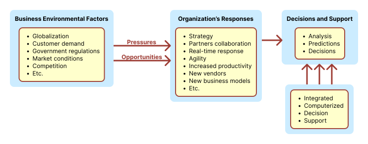

# Pengambilan Keputusan dan Analisis

## Capaian Pembelajaran

- Mampu menjelaskan metodologi fondasi konseptual dari `Sistem Pendukung Keputusan (Decision Support System) [SPK/DSS]`
- Mampu menjelaskan metodologi `Bisnis Cerdas (Business Intelligence) [BC/BI]` dan konsep yang berkaitan dengan `SPK/DSS`

## Pendahuluan

- Lingkungan bisnis **selalu berubah dengan cepat dan semakin kompleks**.
- Organisasi baik private atau umum harus **cepat merespon** kepada perubahan kondisi dan harus segera **berinovasi agar tetap bertahan dan maju**.
- Maka dari itu, sebuah organisasi haruslah agile (tangkas/lincah/gesit) dan harus terus menerus **membuat strategi yang cepat, taktis dan keputusan operasional yang semakin kompleks**.
- Membuat keputusan yang sulit seperti itu membutuhkan data yang relevan, informasi dan pengetahuan yang cukup besar. Untuk memproses ini semua, **dibutuhkan sebuah framework untuk membuat keputusan yang dihasilkan secara cepat, terus menerus secara real time, dan kadang kala membutuhkan bantuan komputasi**. Dari sinilah bisnis cerdas muncul sebagai solusi dari permasalahan yang dikemukakan sebelumnya

## Contoh Skema: Rantai Pasok Vaksin

### Masalah

- Magpie Sensing meluncurkan analytics untuk mengatur rantai pasok (supply chain) vaksin secara efektif dan aman.
- Pada umumnya, vaksin dikirim dengan menggunakan metode cold chain, dalam artian: rantai pasok yang terkontrol oleh temperature baik dalam waktu transportasi maupun dalam waktu penyimpanan dalam Gudang.
- Cold chain mempunyai tiga factor utama:
  - transport dan peralatan penyimpanan;
  - pegawai yang terlatih;
  - prosedur management yang efisien. Sebagian besar vaksin disimpan dalam temperature 2-8 centigrade. Menjaga suhu temperature penyimpanan vaksin merupakan hal yang paling penting dan krusial, karena jika penyimpanan dan penanganan yang tidak tepat menyebabkan vaksin menjadi rusak dan tidak bisa terpakai dan akan menyebabkan efek samping jika dikonsumsi.

### Solusi

- Magpie sensing menyediakan solusi berupa aplikasi cold chain monitoring dan teknologi analisis untuk industry kesehatan (healthcare).
- Aplikasi tersebut bisa memonitor temperature dan kelembapan secara real-time, memanfaatkan GPS untuk melacak vaksin selama pengiriman dan koneksi data terhubung secara wireless.
- Aplikasi tersebut menyediakan algoritma analisis dimana data yang dikumpulkan dari alat monitor digunakan untuk meningkatkan efisiensi pada cold chain process dan memprediksi masalah penyimpanan sebelum terjadi.

Solusi Part 1

- Magpie menerapkan tiga tipe teknis analisis: descriptive, predictive dan prescriptive.
- Teknis analisis tersebut mengubah data mentah dari alat monitor menjadi rekomendasi yang bisa dilakukan serta memberikan peringatan.

Solusi Part 2

- Untuk analisis deskriptif: properties pada system cold storage dimonitor dan dilaporkan secara real time antara lain set point thermostat, range nilai temperature pada system penyimpanan dan perputaran compresor. Semua informasi tersaji pada dashboard yang memperlihatkan graph temperature didalam masing-masing unit storage sehingga personel yang terlatih dapat memastikan bahwa storage unit sudah terkonfigurasi secara tepat.
- Untuk analisis prediktif: berdasarkan informasi yang didapat dari alat monitor, predictive analytic algorithm dapat menentukan set point thermostat pada unit dan memberikan peringatan kepada user jika system salah konfigurasi sesuai dengan type produk yang disimpan. Aplikasi tersebut juga mengecek jumlah putaran pada kompresor AC dan temperature unit tersebut dan akan memberikan peringatan. Aplikasi juga memberikan beberapa prediksi mengapa suhu turun atau naik, seperti pintu tidak tertutup sempurna.
- Untuk analisis prescriptive: aplikasi dapat memberikan rekomendasi untuk meningkatkan cold storage process dan pengambilan keputusan bisnis (business decision making). Lebih lanjut, aplikasi memberikan panduan dalam keputusan pembelian alat dengan selalu menganalisa performa dari storage unit yang tersedia.

Solusi Part 3

- Pada akhirnya, aplikasi tersebut membantu meningkatkan waktu manufaktur dan pengeluaran dapat dikurangi dengan memastikan bahwa keamanan vaksin dapat dijamin dan sampai ke pasien dengan kondisi prima.

### Pertanyaan

1. Informasi apa yang disediakan oleh analisis deskriptif tersebut?
2. Pelayanan apa yang disediakan oleh analisis prediktif tersebut?
3. Bagaimana analisis prescriptive membantu dalam business decision making?
4. Dengan cara apa informasi dapat dilaporkan secara real-time?
5. Dalam situasi seperti apa saja aplikasi tersebut diperlukan untuk melaporkan secara real-time?

### Kesimpulan

Dari studi kasus rantai pasok vaksin, dapat kita simpulkan sebagai berikut:

- laporan Analisa keadaan dalam bentuk dashboard membantu user memahami kondisi yang terjadi;
- Data mining dapat digunakan sebagai predictive analysis yaitu Teknik yang dapat memprediksi hal yang akan terjadi melihat dari pola yang ada;
- Analisis dari data mining tersebut bisa digunakan sebagai panduan user dalam pengambilan keputusan, sehingga tahap ini disebut analisis prescriptive.

## Mengubah Business Environment dan Computerized Decision Support

- Dari kasus rantai pasok vaksin, dapat dilihat bahwa sebuah perusahaan menggunakan teknologi untuk memahami data dan membuat user menghasilkan keputusan yang lebih baik
- Maka dari itu, banyak perusahaan menerapkan Decision Support System / Business Intelligence
- Lalu kenapa harus pakai DSS/BI

### Alasan menggunakan DSS/BI

- Business ressures (tekanan bisnis) adalah hasil yang terjadi dari iklim bisnis hari ini,
- Responses (respon) atau aksi yang diambil oleh perusahaan untuk mengatasi pressures (atau mengambil alih keuntungan yang saat ini tersedia dilingkungan), dan
- Support komputerisasi (support model) yang melayani tugas memonitor lingkungan dan meningkatkan respon yang diambil oleh perusahaan.
- Environment (lingkungan) tempat organisasi beroperasi menjadi semakin komplek.
- Kompleksitas ini bisa menjadi opportunity (keuntungan) atau malah menjadi problem (masalah).
- Contoh: kita dapat dengan mudah mendapatkan suppliers dan konsumen dibanyak tempat (daerah/negara), yang berarti kita dapat lebih mudah mendapatkan barang dengan harga lebih murah dan kita dapat lebih banyak menjual produk dan jasa kita ke konsumen. Bagaimanapun juga, masalah yang timbul adalah competitor yang ada menjadi semakin banyak dan kuat. Factor business environment dapat dibagi menjadi empat kategori utama: markets, consumer demands, technology, and societal.

#### Faktor: Market

- Persaingan yang kuat
- Memperluas pasar global
- Pasar elektronik yang booming di Internet
- Metode pemasaran yang inovatif
- Peluang untuk melakukan outsourcing dengan dukungan TI
- Kebutuhan akan real-time, transaksi on-demand (sesuai permintaan)

#### Faktor: Consumer Demands

- Keinginan untuk kustomisasi
- Menginginkan kualitas, keragaman produk, dan kecepatan pengiriman
- Pelanggan menjadi kuat dan kurang loyal

#### Faktor: technology

- Lebih banyak inovasi, produk baru, dan layanan baru
- Meningkatnya tingkat keusangan produk
- Meningkatnya informasi yang berlebihan
- Jejaring sosial, Web 2.0 dan seterusnya

#### Faktor: societal

- Peraturan dan deregulasi pemerintah yang berkembang
- Tenaga kerja lebih beragam, lebih tua, dan terdiri dari lebih banyak wanita
- Perhatian utama keamanan dalam negeri dan serangan teroris
- Perlunya Sarbanes-Oxley Act dan undang-undang terkait pelaporan lainnya
- Meningkatnya tanggung jawab sosial perusahaan
- Penekanan lebih besar pada keberlanjutan (sustainability)

### Lalu respon organisasi harus bagaimana?

Studi kasus: vodafone

- Gunakan perencanaan strategis.
- Gunakan model bisnis baru dan inovatif.
- Merestrukturisasi proses bisnis.
- Berpartisipasi dalam aliansi bisnis.
- Meningkatkan sistem informasi perusahaan.
- Tingkatkan hubungan kemitraan
- Dorong inovasi dan kreativitas.
- Peningkatan layanan dan hubungan pelanggan

---

- Gunakan media sosial dan platform seluler untuk e-commerce dan lainnya.
- Pindah ke produksi sesuai pesanan dan manufaktur serta layanan sesuai permintaan.
- Gunakan IT baru untuk meningkatkan komunikasi, akses data (penemuan informasi), dan kolaborasi.
- Tanggapi tindakan pesaing dengan cepat (mis., Dalam penetapan harga, promosi, produk dan layanan baru).
- Mengotomatiskan banyak tugas karyawan professional (manager, administrasi).
- Otomatiskan proses pengambilan keputusan tertentu, terutama yang berhubungan dengan pelanggan.
- Peningkatan pengambilan keputusan dengan menggunakan analitik

### Closing strategy gap

Salah satu tujuan utama dari pendukung keputusan terkomputerisasi adalah untuk memfasilitasi penutupan kesenjangan antara kinerja organisasi saat ini dan kinerja yang diinginkan, sebagaimana dinyatakan dalam misi, obyektif, sasaran, dan strategi untuk mencapainya.

Lalu kenapa dukungan terkomputerisasi diperlukan dan bagaimana itu disediakan, terutama dalam dukungan pengambilan keputusan (decision-making support) ? Silakan lihat slide berikutnya

## Pengambilan Keputusan Manajerial

Manajemen adalah proses dimana tujuan organisasi dicapai dengan menggunakan sumber daya. Sumber daya dianggap input, dan pencapaian tujuan dipandang sebagai output dari proses. Tingkat keberhasilan organisasi dan manajer sering diukur dengan rasio output terhadap input. Rasio ini merupakan indikasi produktivitas organisasi, yang merupakan cerminan dari kinerja organisasi dan manajerial.

Tingkat produktivitas atau keberhasilan manajemen tergantung pada kinerja fungsi manajerial, seperti perencanaan, pengorganisasian, pengarahan, dan pengendalian. Untuk menjalankan fungsinya, manajer terlibat dalam proses pengambilan keputusan yang berkelanjutan. Membuat keputusan berarti memilih alternatif terbaik dari dua atau lebih solusi.

### Sifat Pekerjaan Manajer

Interpersonal

- Figurehead: Hanya sebagai symbol, wajib melakukan sejumlah tugas rutin yang bersifat hukum atau social
- Leader: bertanggung jawab atas motivasi dan aktivasi bawahan; bertanggung jawab atas penempatan staf, pelatihan, dan tugas terkait
- Liaison (hubungan): Mempertahankan jaringan yang dikembangkan sendiri dari kontak luar dan informan yang memberikan bantuan dan informasi

Informational

- Monitor: Mencari dan menerima beragam informasi khusus (sebagian besar saat ini) untuk mengembangkan pemahaman menyeluruh tentang organisasi dan lingkungan; muncul sebagai pusat saraf dari informasi internal dan eksternal organisasi
- Disseminator (Penyebar): mentransmisikan informasi yang diterima dari orang luar atau dari bawahan ke anggota organisasi; beberapa informasi ini faktual, dan beberapa melibatkan interpretasi dan integrasi
- Juru Bicara: Mengirimkan informasi kepada orang luar tentang rencana, kebijakan, tindakan, hasil, dan sebagainya organisasi; berfungsi sebagai pakar di industri organisasi

Decisional

- Enterpreneur: Mencari organisasi dan lingkungannya untuk peluang dan memulai proyek perbaikan untuk membawa perubahan; mengawasi desain proyek tertentu
- Ahli menangani gangguan: Bertanggung jawab atas tindakan korektif ketika organisasi menghadapi gangguan penting yang tidak terduga
- Pengalokasi Sumber Daya: Bertanggung jawab atas alokasi sumber daya organisasi dalam segala jenis; pada dasarnya, bertanggung jawab atas pembuatan atau persetujuan semua keputusan organisasi yang signifikan
- Negoitator: Bertanggung jawab untuk mewakili organisasi pada negosiasi besar

### Cara mengambil keputusan ala Manager

- Mendefinisikan akar masalah (contoh: situasi pengambilan keputusan yang berkaitan dengan beberapa kendala atau keuntungan)
- Rancang sebuah model yang mendeskripsikan masalah dunia nyata
- Identifikasi solusi-solusi pada model yang dirancang tadi, kemudian evaluasi solusi-solusi tersebut
- Bandingkan, pilih dan rekomendasikan solusi potensial ke akar masalah

Pertimbangan

- Teknologi, system informasi, search engine, dan hasil globalisasi dapat memberikan banyak solusi
- Peraturan pemerintah yang harus ditaati, ketidakstabilan iklim politik, kompetisi dan perubahan permintaan dari konsumen harus dipertimbangkan dalam pengambilan keputusan
- Faktor-faktor lain yang dibutuhkan dalam pengambilan keputusan, perubahan-perubahan yang tidak bisa diprediksi dan kerugian saat salah dalam mengambil keputusan
- Perubahan lingkungan yang semakin cepat dan beragam.
