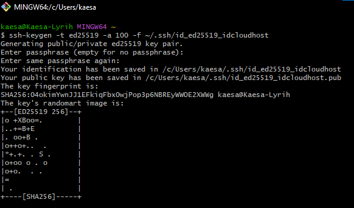

# Catatan Deploy 2026


Pastikan saat membuat vps masukan PUB KEY SSH kalian.

Example:
- IP Public VPS: 100.100.100.100
- Port: 22
- User: kaesa

- Pada file `~/ssh/config` silahkan tambahkan:
```txt
Host idcloud
   User kaesa
   Hostname 100.100.100.100
   Port 22
   IdentityFile ~/.ssh/id_ed25519_vpsidcloud
   IdentitiesOnly yes
```

Untuk akses vps:
```bash
ssh idcloud
```

Jika sebelumnya ada pharapharse silahkan masukan pharapharse anda.


---

## VPS
```
sudo apt update
sudo apt upgrade
```

```
curl -fsSL https://get.casaos.io | sudo bash
```
