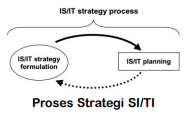
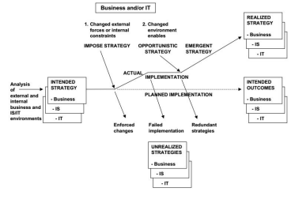
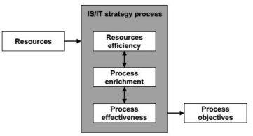
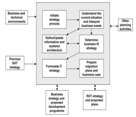

# Mengembangkan Strategi SI/TI

## Pengembangan Strategi SI/TI

Mengembangkan sebuah strategi SI/TI berarti berpikir secara strategis dan merencanakan manajemen yang efektif untuk jangka waktu yang lama, dan dampak yang optimal dari informasi, baik dalam bentuk sistem informasi dan teknologi informasi yang menggabungkan manual dan sistem komputer, teknologi komputer dan telekomunikasi. Termasuk juga aspek organisasional dari manajemen SI/TI.

Pengembangan strategi SI/TI adalah proses memutuskan tujuan bagi komputasi organisasi dan mengidentifikasi aplikasi komputer yang potensial yang baik untuk di implementasikan di organisasi.

Strategi SI dapat membantu mencapai tujuan bisnis organisasi. Pemahaman terhadap kebutuhan informasi dapat mendukung tujuan tersebut, kemudian implementasi dari sistem komputer untuk menyediakan informasi. Hal ini merupakan rencana untuk pengembangan sistem menuju visi dari peran SI di organisasi.

Tujuan umum organisasi mengadaptasi Proses Strategi SI/TI:

- Keselarasan SI/TI dengan bisnis untuk mengidentifikasikan dimana SI/TI paling banyak berkontribusi,dan menetapkan prioritas untuk investasi.
- Memperoleh keunggulan kompetitif dari kesempatan bisnis yang muncul karena penggunaan SI/TI.
- Membangun keefektifan biaya, juga infrastruktur teknologi yang feksibel untuk masa yang akan datang
- Membangun sumberdaya dan kompetensi yang layak untuk menjalankan SI/TI secara sukses di seluruh organisasi.

## Proses Strategi SI/TI

Formulasi Strategi SI/TI fokus dengan pengembangan strategi SI/TI melalui proses keselarasan dan dampak kompetitif.

Ketika Strategi telah ditetapkan, rencana implementasi kemudian dapat dibangun, Perencanaan SI/TI.

Proses Strategi SI/TI mengacu pada formulasi dan perencanaan. Dimana Strategi SI/TI mendorong Perencanaan SI/TI, dan dalam membangun perencanaan SI/TI akan timbul aspek-aspek yang menyebabkan tinjauan ulang terhadap Strategi SI/TI.

## Evolusi Proses Strategi SI/TI

> Technology Focus to Strategic Focus

### Stage 01

Departemen TI perlu untuk merencanakan antarmuka antar aplikasi dikembangkan secara terpisah, proyek demi proyek, agar dapat berkerja dengan efektif dan efisien, baik pada operasional bisnis dan di penggunaan teknologi.

Mendapat pemahaman dari manajemen untuk meningkatkan dependensi bisnis terhadap sistemnya.

Aplikasi pendukung dikembangkan dan manajemen mengartikan SI/TI dalam batasan tertentu, namun tingkat dependensinya perlahan meningkat.

### Stage 02

Manajemen menyadari adanya inisiasi review top-down dari aplikasi SI/TI terhadap dependensinya dengan bisnis. penentuan prioritas disetujui berdasarkan kebutuhan bisnis yang berhubungan.

Konsep Helpdesk diterapkan sebagai sistem pendukung.

### Stage 03

Fokus pada perencanaan SI/TI secara detail, untuk menetapkan cara terbaik dalam menerapkan aplikasi dan teknologi pendukung, atau untuk kasus tertentu, penerapan kembali sistem yang ada dengan lebih layak, terintegrasi dan lebih hemat biaya.

Ada waktu untuk penerapan yang efektif, dan saat strategi berjalan, tidak ada kendala yang terjadi karen sumber daya TI digunakan sesuai budget.

### Stage 04

User memegang kendali, tidak diarahkan oleh manajemen senior tetapi tidak juga diabaikan.

Penggunaan SI/TI yang kreatif oleh user memperlihatkan adanya kesempatan baru, menggunakan informasi dengan cara baru untuk perluasan keunggulan kompetitif bisnis.

### Stage 05

Merupakan tahap yang paling sulit untuk diraih.

Menyelaraskan antara SI/TI dengan strategi bisnis menjadi tugas utama, dan hal ini membutuhkan perhatian dari eksekutif senior, manajemen dan spesialis TI (ketiga pihak harus berkerja bersama)

Penerapan strategis di identifikasi dan disetujui dalam konteks strategi bisnis.

## Pendekatan Pengembangan Strategi SI/TI

### Business Led

- Dilakukan oleh spesialis TI yang mendefinisikan rencana investasi SI/TI berdasarkan strategi bisnis yang ada saat ini.
- Mengakui bahwa SI merupakan sumberdaya strategis, melalui pendekatan ini organisasi melihat bahwa strategi bisnis harus memimpin strategi SI/TI dan bukan sebaliknya.
- Strategi bisnis tidak ditentang, dan pendekatan ini tidak mengembangkan kesempatan kompetitif melalui penggunaan SI/TI kecuali tergabung di dalam strategi bisnis.

### Method Driven

- Penggunaan teknik (metodologi dan konsultan) untuk mengidentifikasi kebutuhan SI dengan menganalisa proses bisnis.

### Technological

- Perencanaan SI/TI dilihat sebagai sebuah proses pelatihan dan pembentukan informasi.
- Profesional SI menggunakan model analisa dan alat untuk menghasilkan rencana SI dalam bentuk blueprint, masing-masing satu untuk aplikasi, data, komunikasi, dan komputasi.
- Kata arsitektur menggantikan kata perencanaan dan strategi

### Administratif

- Tujuan utamanya adalah untuk menyusun IT capital dan pengeluaran budget serta perencanaan sumber daya untuk mencapai aplikasi SI yang disetujui.
- Biasanya berdasarkan pada prioritas oleh user.
- Perencanaan bisnis biasnaya pada level fungsional, dianalisa untuk mengidentifikasi dimana SI/TI dapat memenuhi kebutuhan jangka pendek hingga jangka menengah.

### Organisasional

- Pengembangan investasi SI/TI diarahkan dari persetujuan bisnis atas bagaimana SI/TI dapat membantu memenuhi semua tujuan bisnis, disetujui oleh manajemen senior.

## Kendala dan Rintangan

Kendala dalam menjalankan proses Strategi SI/TI

- Gagal mendapatkan dukungan top management
- Tidak ada komunikasi dan komitmen untuk berubah dalam tubuh organisasi
- Tidak memperoleh cukup karyawan yang berkualifikasi untuk melakukan pekerjaan dengan benar
- Menyerahkan tanggungjawab kepada individu yang tidak berpengalaman, mempengaruhi waktu saat melakukan pekerjaan
- Tidak ada steering committee yang berkomitmen
- Bisnis strategi tidak dapat mengarahkan usaha strategi SI
- Gagal untuk mengantisipasi pengembangan baru dalam TI yang mungkin berdampak pada strategi
- Mengabaikan orang dan politik dalam formulasi dan perencanaan strategi

Kendala dalam proses strategi TI

- Gagal untuk mengikutsertakan top manajemen yang mencukupi
- Mengabaikan tujuan bisnis
- Gagal untuk menerjemahkan tujuan dan strategi bisnis ke dalam rencana aktivitas
- Gagal mengikutsertakan user
- Mengandalkan hanya pada permintaan aplikasi dari user
- Mengabaikan penilaian secara realistik kelemahan internal dari fungsi SI dalam memutuskan penerapan strategi
- Tidak melakukan analisa top-down untuk mengidentifikasi fungsi kritis yang harus didukung oleh strategi SI
- Gagal untuk mempertimbangkan strategi SI alternatif untuk memberikan pilihan kepada top manajemen
- Gagal dalam mengevaluasi strategi SI bersama dengan seluruh manajer untuk memperoleh dukungan dan kerjasama pada implementasinya

## Faktor Pendukung dan Penghambat Keselarasan

| Pendukung (Enabler)                           | Penghambat (Inhibitor)                            |
| --------------------------------------------- | ------------------------------------------------- |
| Dukungan eksekutif senior terhadap TI         | Kurangnya hubungan yang erat antara Bisnis dan TI |
| TI diikutsertakan dalam pengembangan strategi | TI tidak diprioritaskan dengan baik               |
| TI memahami bisnis                            | TI gagal memenuhi komitmen                        |
| Parnership antara Binis dan TI                | TI tidak memahami bisnis                          |
| Proyek TI diprioritaskan dengan baik          | Eksekutif Senior tidak mendukung TI               |
| TI menunjukkan kepemimpinan                   | Manajemen TI kurang kepemimpinan                  |

## Tantangan dalam Perencanaan Strategis SI/TI

## Elemen Kunci dalam Pendekatan Perencanaan yang Efektif

- Pencarian keunggulan kompetitif melalui aplikasi SI/TI
- Ruang lingkup yang lebih luas dari perencanaan, dengan menggabungkan spektrum teknologi yang lebih luas, dan bukan hanya penggunaan tradisional TI dalam memproses data dan informasi.
- Kebutuhan untuk menyatukan teknologi
- Pengembangan arsitektur informasi, sistem, dan teknologi untuk mengarahkan pengenalan dan integrasi dari sistem dan teknologi yang baru dan yang ada saat ini.
- Mengembangkan perencanaan yang tersetruktur menuju pendekatan yang lebih fleksibel, yang bertujuan untuk menemukan dan mengimplementasikan inisiasi yang penting untuk kepentingan bisnis.

## Menyususn Proses Strategi SI/TI

**1) Sebuah Proses yang berkelanjutan**

Rencana muncul dari Strategi SI/TI yang perlu untuk diperbaharui atas permintaan, frekuensi ditentukan oleh laju perubahan

Pengembangan dan akuisisi aplikasi merupakan respon terhadap prioritas permintaan, terkait erat dengan inisasi bisnis yang lebih luas

Dukungan terhadap infrastruktur TI, setelah didefinisikan untuk memenuhi kebutuhan strategi bisnis, harus dijaga dalam jangka waktu yang lama

Mekanisme pengawasan internal dan eksternal terhadap bisnis dan SI/TI merupakan hal penting dalam proses manajemen strategis

**2) Proses Pembelajaran**

Perencanaan Strategi SI/TI juga merupakan sebuah proses pembelajaran. Spesialis SI dan orang bisnis menjadi lebih sadar akan isu bisnis dan teknologi, kemudian belajar untuk mengidentifikasi dan mengembangkan kesempatan dalam lingkungan yang kompetitif.

**3) Inisiasi Siklus Strategi**

Pentingnya menyediakan waktu untuk merencanakan perencanaan, karena ini yang akan menentukan kesuksesan.

Strategi dapat maju tergantung pada kematangan prosesnya, pengalaman, starting poin, tujuan perencanaan serta target yang ingin dicapai.

**4) Kriteria Kesuksesan**

Kriteria Kesuksesan dapat diidentifikasikan sebagai berikut:

- Meningkatkan kotribusi SI/TI terhadap performa organisasi
- Tingkat keselarasan investasi TI dan strategi bisnis
- Memperoleh keunggulan kompetitif melalui penggunaan SI/TI
- Identifikasi aplikasi baru dan lebih baik
- Identifikasi aplikasi strategis
- Meningkatkan komitmen top manajemen
- Meningkatkan komunikasi antar user
- Peramalan yang lebih baik terhadap kebutuhan sumberdaya TI
- Meningkatkan alokasi sumber daya TI
- Pengembangan arsitektur sumber daya TI
- Meningkatkan pengakuan SI/TI di dalam organisasi.

## Tujuan dan Dorongan yang menggerakkan Pengembangan Strategi SI/TI

Tujuan mengembangkan strategi SI/TI adalah untuk menjamin nilai terbaik didapatkan dari investasi SI/TI.

Terdapat beberapa sumber pendorong pengembangan strategi SI/TI:

- **Faktor Eksternal Bisnis**  
Faktor ini dapat menggerakkan pengembangan dan revisi dari strategi bisnis.
- **Faktor Eksternal Teknologi**  
Ancaman dan kesempatan yang secara langsung mendorong aktivitas strategi SI/TI. Contohnya:
  - Kesempatan dan ancaman kompetisi berdasarkan pada perkembangan SI/TI (internet, teknologi wireless)
  - Produk dan pasar baru yang diciptakan oleh SI/TI
  - Kebutuhan yang mendesak untuk meningkatkan produktivitas via teknologi atau resiko kehilangan bisnis.
- **Faktor Internal Bisnis**  
  - Pemilik baru atau datangnya CEO baru
  - Restrukturisasi tata kelola perusahaan
  - Produk atau pasar baru yang menyadarkan bahwa infrastruktur yang dimiliki saat ini tidak mampu beradaptasi dengan kebutuhan baru.
  - Menyadari pentingnya formulasi dan perencanaan strategi SI/TI, berdasarkan kebutuhan untuk meningkatkan kontribusi langsung terhadap bisnis.
- **Faktor Internal Teknis**
  - Faktor ini muncul dari kebutuhan untuk peningkatan dalam mengantarkan nilai untuk uang, untuk mengurangi biaya, dan meningkatkan kerjasama antara fungsi SI dan bisnis.
  - Menyadari bahwa lingkungan saat ini sudah tidak tepat
  - Dorongan terhadap manajemen SI dan Bisnis untuk menilai peran SI/TI terhadap strategi saat ini.

## Ruang Lingkup, Tujuan, dan Harapan

Tujuan Formulasi dan Perencanaan Strategi SI/TI:

- Identifikasi kebutuhan saat ini dan dimasa depan yang merefleksikan keselarasan strategi Bisnis/TI
- Respon fungsi SI menjadi lebih cepat dalam perubahan kebutuhan bisnis
- Menentukan kebijakan bagi manajemen, menciptakan, merawat, mengendalikan, dan menilai sumberdaya ifnormasi organisasi
- Memposisikan SI pada central bisnis
- Membangun arsitektur informasi
- Menjamin bahwa fungsi SI fokus pada isu teknologi, dan tujuannya terikat langsung dengan bisnis
- Menjamin adanya penerimaaan dari tanggungjawab antara orang SI/TI dan bisnis

## Framework Strategi SI/TI

## Referensi

- John Ward & Joe Peppard. Strategic Planning for Information Systems. 2002

## ❓ Kuis

1. Sebutkan apa saja faktor pendukung dan penghambat keselarasan Strategi SI/TI!
2. Sebutkan pendekatan dalam pengembangan Strategi SI/TI dan sebutkan juga kendala dan rintangannya!
3. Sebutkan elemen kunci dalam pendekatan perencanaan SI/TI yang Efektif!
4. Sebutkan dan jelaskan secara singkat Faktor pendorong pengembangan Strategi SI/TI!
