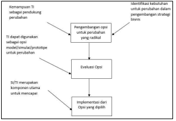
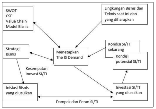
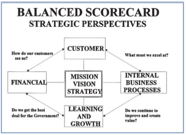
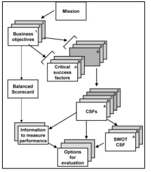
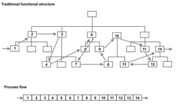
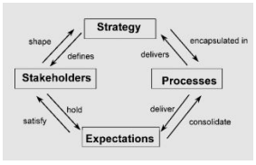
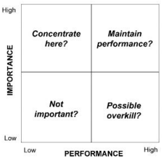
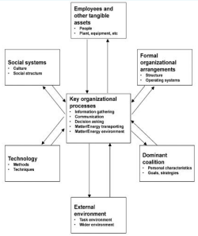

# Analisa Strategis SI/TI: Menilai dan Memahami Kondisi Saat Ini

## Pengantar

Dalam proses mencapai keselarasan dan dampaknya, diperlukan adanya pemahaman akan lingkungan bisnis dan teknologi, serta kesempatan dan acaman. Begitu juga dengan pengetahuan mengenai bagaimana SI/TI dapat digunakan secara inovatif untuk merubah bisnis bersamaan dengan dimensi lainnya, seperti, strategi, struktur, proses, budaya, dll.

Penting juga untuk mendapat gambaran yang jelas dari manfaat yang diharapkan. Serta penilaian yang objektif terhadap kekuatan dan kelemahan dari bisnis secara keseluruhan dan kemampuan SI/TI.

Bedasarkan pemahaman yang jelas mengenai kondisi saat ini, perspektif bisnis dan strategi SI di masa depan, dilakukan analisa terhadap gap dalam rangka kebutuhan SI/TI dan rencana pencapaian tujuan.

Hasil dari formulasi Strategi SI merupakan target portofolio aplikasi yang harus memenuhi kebutuhan perusahaan dan bisnis, serta dapat mempertahankan kelangsungan teknologi dan sumberdaya.

Banyak cara yang dapat digunakan untuk mencapai campuran dari penemuan fakta dan analisa dalam rangka menetapkan _IS demand_.

## Business Process Re-engineering and Strategic IS

Business Process Re-engineering (BPR) adalah pemikiran ulang atas dasar dan perancangan ulang yang radikal dari proses bisnis inti untuk mencapai peningkatan yang dramatis dalam pengukuran kinerja kritis (critical performance measures) seperti kualitas, biaya, dan waktu.

Proses adalah seperangkat aktivitas yang terstruktur dan terukur yang dirancang untuk menghasilkan keluaran spesifik untuk konsumen dan pasar

BPR merupakan pendekatan yang populer yang digunakan oleh organisasi untuk meningkatkan kinerja mereka. Organisasi melihat pentingnya BPR terutama pada sektor peningkatan inisiasi layanan terhadap konsumen, lelang proyek, dan pada kebanyakan proses pengurangan biaya.

Penelitian tentang peran SI/TI dalam BPR telah banyak dilakukan, namun hingga kini masih belum bisa ditetapkan apakah, SI/TI merupakan penggerak BPR ataukah SI/Ti merupakan bagian dari implementasi BPR.

Intinya terdapat pada dua kunci utama berikut:

- Bagaimana proses bisnis dapat ditransformasikan dengan menggunakan TI (berdasarkan pemahaman mengenai kemampuan dari TI)
- Bagaimana TI dapat mendukung proses bisnis?

Kondisi ini disebut "policy loop", dimana salah satu fokus pada inovasi bisnis (dengan sedikit pengaruh SI/TI), dan yang lain fokus pada implementasi SI/TI menjadi bagian terpenting dalam mencapai manfaat perubahan.

Hubungan antara SI/TI dan BPR, adalah SI/TI harus dipandang berbeda dari sekedar tahapan identifikasi, evaluasi, dan implementasi perubahan bisnis yang radikal.

Hal ini akan memungkinkan rekonsiliasi dari pertanyaan dasar mengenai dampak keselarasan pengembangan Strategi SI/TI dengan inisiasi re-engineering.

Rekonsiliasi SI/TI dan BPR

| Pertanyaan   | Business Process Re-engineering                                             | Formulasi dan Perencanaan SI/TI                                     |
| ------------ | --------------------------------------------------------------------------- | ------------------------------------------------------------------- |
| Formulasi    | Bagaimana kita bisa merancang kembali bisnis untuk mendapatkan keuntungan?  | Bagaimana kita bisa mengeksploitasi SI/TI untuk kepentingan bisnis? |
| Implementasi | Bagaimana kita bisa meningkatkan proses untuk menjamin kesuksesan strategi? | Bagaimana SI/TI dapat menjamin kesuksesan strategi bisnis?          |

## Memahami Kondisi Saat Ini

Memahami kondisi saat ini menyangkut memiliki pemahaman yang mendalam mengenai strategi bisnis, lingkungan bisnis, dan teknologi serta kondisi SI/TI dalam bisnis saat ini.

Hal ini akan memungkinkan dalam penetapan kesempatan, ancaman, dan kebutuhan dalam strategi bisnis, serta untuk mengenali kekuatan dan kelemahan dari operasional Bisnis dan SI/TI.

### Menetapkan Kebutuhan SI/TI: The Information System Demand

Strategi SI paling baik jika dikembangkan secara pararel dengan strategi bisnis. Dengan memasukkan tren, kesempatan dan ide ke dalam proses strategi bisnis, kemudian bekerja bersama dengan seluruh area bisnis, dalam membangun inisiasi Bisnis SI/TI yang akan mengantarkan tujuan kinerja.

Untuk mendapatkan hasil yang diinginkan, perlu untuk dicapai pemahaman mengenai apa penggerak perubahan dan kondisi saat ini, kemudian menetapkan tujuan/target, dan mulai mengusulkan rencana untuk memperkecil gap.

Hal tersebut didapatkan melalui analisa yang fokus pada elemen dalam lingkungan bisnis dan SI/TI.

### Mengumpulkan Data yang Relevan

Kualitas dan nilai dari Strategi SI/TI yang dikembangkan bergantung pada seberapa dalam pemahaman terhadap bisnis dan kebutuhannya, serta interpretasi kebutuhan tersebut ke dalam informasi, serta sistem layanan TI yang tepat.

Kebanyakan informasi yang dibutuhkan harus di diskusikan dengan pegawai di seluruh level organisasi, melalui workshop.

Workshop tidak dapat berjalan dengan baik jika orang-orang bisnis terbiasa membangun fakta berdasarkan dokumentasi yang ada.

Masalah tersebut dapat diatasi dengan meninjau sebanyak mungkin dokumen yang dapat ditemukan sebelum workshop diadakan.

## Interpretasi Strategi Bisnis

### Lingkungan Bisnis Internal

Elemen yang harus diidentifikasi, dianalisa, dan dipahami adalah:

- Strategi bisnis, bukan hanya tujuannya tetapi juga cara untuk mencapainya.
- Proses bisnis, aktivitas dan entitas informasi utama (konsumen, persediaan barang, kas) saat ini, serta bagaimana hubungannya dengan entitas lain.
- Lingkungan organisasi, mencakup struktur, aset dan kemampuan, pengetahuan, kompetensi, nilai, gaya, budaya, dan hubungan.

Dari sini, informasi, sistem, dan teknologi yang muncul pada strategi bisnis dan aktivitas saat ini dapat diprioritaskan.

Entitas utama/Kunci: berada di dalam aktivitas, merupakan hal yang fundamental/mendasar dan penting dalam proses bisnis, dan untuk itu terhubung dengan informasi. Termasuk didalamnya people (konsumen, supiler, pegawai), tujuan (produk),tempat (workshop, lab), atau kejadian (penjualan, pemesanan)

Hubungan ketiganya dapat digambarkan melalui contohnya: Data Flow Diagram

### Lingkungan Organisasional

Penting untuk mempertimbangkan struktur organisasi saat ini, hubungan serta orang yang ada di dalamnya.

Penting untuk tahu kemampuan, sumberdaya, nilai, budaya, dan interaksi sosial dalam lingkungan organisasi, juga management style dan hubungannya dengan lingkungan eksternal.

### Lingkungan Bisnis Eksternal

Bagian ini penting untuk dianalisa untuk mengetahui dan mengeksplore kesempatan SI/TI yang dapat berdampak terhadap pembentukan strategi bisnis.

## Menganalisa Lingkungan SI/TI Saat Ini

Penilaian terhadap lingkungan internal SI/TI terdiri dari:

- Evaluasi kindisi portofolio aplikasi saat ini dan aplikasi yang sedang dikembangkan untuk menetapkan konten, cakupan, dan kontribusinya.
- Evaluasi terhadap sumberdaya informasi saat ini
- Evaluasi infrastruktur dan layanan TI saat ini

Hasil dari analisa dasar ini adalah untuk menilai gap antara kondisi saat ini dan target yang dibutuhkan.

### Evaluasi Portofolio Saat Ini

- Kategorisasi segmen portofolio aplikasi - strategi, high potential, key operational, support
- Penilaian cakupan dan kontribusi dari sistem untuk kebutuhan bisnis dan kesempatan lain untuk meningkatkan nilai bisnis
- Sejauh mana sistem dapat beroprasi dan berintegrasi
- Penelian efektivitas
- Kesempatan yang mungkin muncul untuk meningkatkan kualtias informasi
- Penilaian resiko atas kegagalan dari portofolio saat ini

Sumber fakta ataupun informasi subjektif didapatkan dari:

- User SI dan database
- Staff Pengembangan dan Teknikal TI

### Kebijakan dan Strategi Saat Ini

- Pengembangan dan Perencanaan Strategi SI/TI merupakan proses yang berkelanjutan, maka dari itu akan sangat mungkin adanya strategi sebelumnya.
- Dokumentasi dari kebijakan dan strategi sebelumnya dapat diadopsi untuk menghadapi perubahan strategi baru.

### SI Organisasi dan Prosess

- Fungsi, ukuran, struktur, dan hubungan dengan bisnis pada level organisasi, fungsional, departemen, dan individu.
- Strategi alokasi sumberdaya dan layanan TI
- Pengelolaan fungsi SI
- Struktur tata kelola SI
- Budget investasi SI/TI

### Aset, Sumberdaya, dan Keahlian Saat Ini

- Hardware, software, kemampuan komunikasi, informasi, SDM, kemampuan user SI/TI.

### Metode dan Training yang Diinginkan

- Business Process Re-engineering, data management, project management, jaminan mutu
- RAD, expert system, DSS

### Bagaimana anggapan bisnis terhadap SI?

Akan lebih baik untuk mengetahui peran dan kontribusi SI/TI terhadap bisnis, juga kontribusi SI/TI terhadap dirinya.

### Lingkugnan SI/TI Eksternal

- Masukan terakhir dalam proses strategi berhubungan dengan lingkungan SI/TI eksternal, dimana tujuannya adalah untuk mendapatkan perspektif pada tren  teknologi dan kesempatan untuk menggunakan SI/TI dengan cara yang baru dan inovatif.
- Tidak harus dalam rangka menggunakan teknologi baru. Tetapi lebih fokus pada cara menggunakan teknologi yang sudah ada dengan biaya yang lebih murah dan dengan cara yang belum diterapkan sebelumnya.

## Teknik Interpretasi dan Analisis

Ada banyak cara yang dapat digunakan untuk menganalisa kondisi saat ini dan strategi bisnis, beberapa diantaranya:

- Analisa CSF (Critical Success Factor)
- Analisa SWOT (Strength, Weakness, Opportunities, Threat)
- Analisa Balanced Scorecards

## Kegunaan CSF dan BSC

### Balanced Scorecards

Balanced Scorecards (BSC) dapat di deskriptiskan sebagai kumpulan yang dipilih dengan hati-hati dan berasal dari strategi organisasi. BSC menyediakan perangkat bagi pimpinan untuk digunakan dalam berkomunikasi dengan pegawai dan stakeholder eksternal.

BSC mengidentifikasikan informasi yang dibutuhkan untuk mengukur kinerja terhadap tujuan bisnis.

BSC melakukan pemeriksaan terhadap kinejra kinerja dari 4 prespektif yang saling berhubungan, masing-masing digambarkan dalam sebuah pertanyaan.

### Perspektif Balanced Scrorecards

- Perspektif Kuangan (Financial Perspective)  
  Bagaimana penampilan kita dimata shareholder dan orang-orang yang mempunyai kepentingan keuangan dalam organisasi?
- Perspektif Bisnis Internal (Internal Business Perspective)  
  Apa yang harus kita unggulkan jika kita ingin memenuhi harapan pegawai dan partner kita?
- Perspektif Konsumen (Customer Perspective)  
  Bagaimana konsumen melihat produk, layanan, dan hubungannya dengan kita?
- Perspektif Pembelajaran dan Inovasi (Innovation and Learning Perspective)  
  Untuk mencapai visi organisasi. Bagaimana kita akan terus meningkat dan menciptakan nilai dimasa depan bagi stakeholder?

### Critical Success Factor Analysis

Merupakan teknik yang populer dalam pengembangan Strategi SI/TI dan Strategi Bisnis.
Critical Success Factor (CSF) menurut Rockart didefinisikan sebagai sejumlah area yang terbatas yang hasilnya dapat menjamin kesuksesan performa kompetitif organisasi.
Mereka merupakan area utama dimana hal-hal harus dilakukan dengan benar untuk keuntungan bisnis, sehingga harus mendapat perhatian khusus dari manajemen.

CSF bukan merupakan perangkat/alat manajemen, alasannya:

Agar berhasil, CSF dapat dengan mudah dihubungkan dengan tujuan dari unit bisnis. Teknik ini biasanya tidak berhasil jika diterapkan dibawah level ketiga dalam hirarki organisasi.
Fokus utama CSF adalah pada pengendalian manajemen dan biasnaya lebih ke analitycal dari pada kreatif.
Sifat CSF dan KPI merefleksikan satu sama lain dari management style eksekutif. Chief Executive (CEO, CIO, CFO) mengukur kinerja dari faktor beban, kemudian bawahannya melihat kinerja sebagai kumpulan komplain.

## Analisa Proses Bisnis

Analisa Proses Bisnis merupakan teknik untuk menilai ke-efektifan dari proses bisnis inti dalam mendukung tujuan bisnis.

Sebagai hasil dari analisa proses bisnis, keputusan dapat dibuat untuk memulai proses redesign pada satu atau beberapa proses bisnis. Adapun hasilnya, element SI/TI tetap dapat ditetapkan dan dinilai kemudian dibangun menjadi sebuah IS demand.

Penilaian proses bisnis bertujuan untuk mendefiniskan area dimana kesempatan ada untuk meningkatkan kinerja.

- Pada level tertinggi, analisa ini dapat merupakan penilaian atas seberapa efektif proses saat ini dalam mencapai tujuan bisnis.
- Selanjutnya, analisa ini dapat digunakan untuk meramalkan seberapa efektif proses dapat berjalan dan memberikan kontribusi penuh terhadap penggerak tujuan bisnis. Contohnya, jika penggerak tujuan bisnis berhubungan dengan saham, maka proses akuisisi konsumen memainkan peran penting daripada merawat kontrak yang sudah ada.

### Mengadopsi Perspektif Proses

Fokus pada proses berarti memeriksa cara kebutuhan konsumen dipenuhi atau pengembangan produk baru.
Menurut kamus Bahasa Inggris Oxford, proses didefinisikan sebagai aktivitas yang umum dan berkelanjutan atau kesuksesan aktivitas, dilakukan dengan perilaku yang terdefinisi, dan menuju pada pencaipaian hasil tertentu.

### Identifikasi Proses

Salah satu pendekatan untuk mengidentifikasi proses adalah memeriksa harapan stakeholder dan menetapkan proses yang dibutuhkan untuk menyampaikan harapan tersebut.
Berikut gambar yang menunjukan hubungan antara strategi, stakeholder, harapan, dan proses.

### Pentingnya Proses - Penilaian Kinerja

Agar dapat mengidentifikasi kandidat potensial untuk redesign proses bisnis, perlu untuk memeriksa tingkat kepentingan sebuah proses dalam mencapai tujuan bisnis dan menunjukkan peggerak bisnis serta mengarahkan hal tersebut terhadap kinerja organisasi.

Matriks ini juga dapat digunakan untuk mendapatkan feedback dari stakeholder, baik internal maupun eksternal.

## Organizational Modelling

### Lingkungan Eksternal

Fokus pada dampak legislatif dan kebijakan fiskal, tren ekonomi dan industri, kompetisi pada industri tertentu, standar, produk, dan praktik kompetitor.

### Koallsi Domain

Pengaruh internal utama yang menggerakkan kekuatan dibalik organisai. Penting untuk mengidentifikasi kelompok ini karena mereka yang akan memberikan kebutuhan untuk berubah dalam sistem informasi mencapai keunggulan kompetitif.

### Aturan Formal Organisasi

Rencana, budget, struktur organisasi, job desk, pengukuran kinerja, dan sistem pengendalian.

### Pegawai dan Aset Berwujud Lainnya

Kualitas dan kuantitas dari orang, kemampuan dan pelatihan mereka, aset finansial, aset intelektual.

### Struktur Sosial

Aturan formal dalam organisasi yang direview bersama dengan pegawai dan hubungannya.

### Teknologi Yang Digunakan

Level penggunaan teknologi dalam enterprise, hubungannya dengan teknologi yang digunakan dalam dunia industri.

### Proses Inti

Proses dan aktivitas dalam organisasi yang mengkonversikan bahan mentah menjadi sebuah produk

## Evaluasi Gap Kondisi Saat Ini dan Target Yang Diinginkan

Evaluasi Gap digunakan untuk mengidentifikasi kebutuhan perubahan:

- Penyederhanaan proses, sesuai dengan kebutuhan SI/TI.
- Pengadaan sumberdaya baru atau pembaharuan
- Perubahan dalam supply seumberdaya TI dan kompetensinya untuk mendukung peran SI/TI

## Referensi

- John Ward & Joe Peppard. Strategic Planning for Information Systems. 2002

## ❓ Kuis

1. Jelaskan konsep Business Process Re-engineering!
2. Jelaskan hubungan antara proses, aktivitas, dan entitas utama!
3. Sebutkan apa saja yang perlu diketahui dalam menganalisa lingkungan SI/TI saat ini!
