# Pengantar Sistem Pendukung Keputusan

## Agenda

1. Pengambilan Keputusan
   - Data, Informasi, dan Pengetahuan
   - Pengambilan Keputusan Manajerial
   - Pendekatan Pengambilan Keputusan
   - Pengambilan Keputusan Manajer
   - Tipe Keputusan
2. Sistem Pendukung Keputusan
   - Fase Pengambilan Keputusan
   - Sistem Pendukung Keputusan
   - Karakteristik Sistem Pendukung Keputusan
   - Tujuan Sistem Pendukung Keputusan
   - Sistem Informasi Manajemen [SIM] vs Sistem Pendukung Keputusan [SPK]

## Luaran Belajar

1. Ketepatan dalam menjelaskan **konsep pengambilan keputusan manajerial**
2. Ketepatan menjelaskan **pendekatan pengambilan keputusan**
3. Ketepatan dalam membedakan **tipe atau jenis keputusan**
4. Ketepatan menjelaskan **fase pengambilan keputusan**
5. Ketepatan dalam menjelaskan **konsep, karakteristik, manfaat dan tujuan SPK**
6. Ketepatan dalam **membedakan SPK dan SIM**

## Pengambilan Keputusan

### Data

**Data**, merupakan fakta mentah (raw facts) yang menyampaikan sesuatu yang spesifik, tetapi tidak diatur dengan cara apapun, sehingga tidak memberikan pola, konteks, dll.

Thierauf (1999), mendefinisikan data sebagai: "fakta dan angka yang tidak terstruktur yang berdampak paling kecil pada manajer pada umumnya. ”

> Types of data

| Data              | Represented By                       |
| ----------------- | ------------------------------------ |
| Alphanumeric data | Number, letter, and other characters |
| Audio data        | Sound, noises, or tone               |
| Image data        | Graphic images dan pictures          |
| Video data        | Moving image or pictures             |

### Informasi

**Informasi**, kumpulan data yang diorganisir sedemikian rupa sehingga memiliki nilai di luar fakta itu sendiri.

- Essentially information is found "in answers to questions that begin with such words as who, what, where, when, and how many" (Ackoff 1999);
- “For data to become information, it must be contextualized, categorized, calculated and condensed.” (Davenport & Prusak 2000).
- “Data endowed with relevance and purpose” (Drucker, 2001);
- “Organized data” (Saint-Onge, 2002);
- “Interpreted data” (Probst et al, 2002);

Definisi tersebut mengerucut pada fakta **bahwa informasi adalah data yang telah diproses**, memiliki lebih banyak arti, dan memberikan pengetahuan kepada mereka yang menerimanya.

Proses merupakan serangkaian tugas (task) yang terkait secara logis yang dilakukan untuk mencapai hasil yang ditentukan.

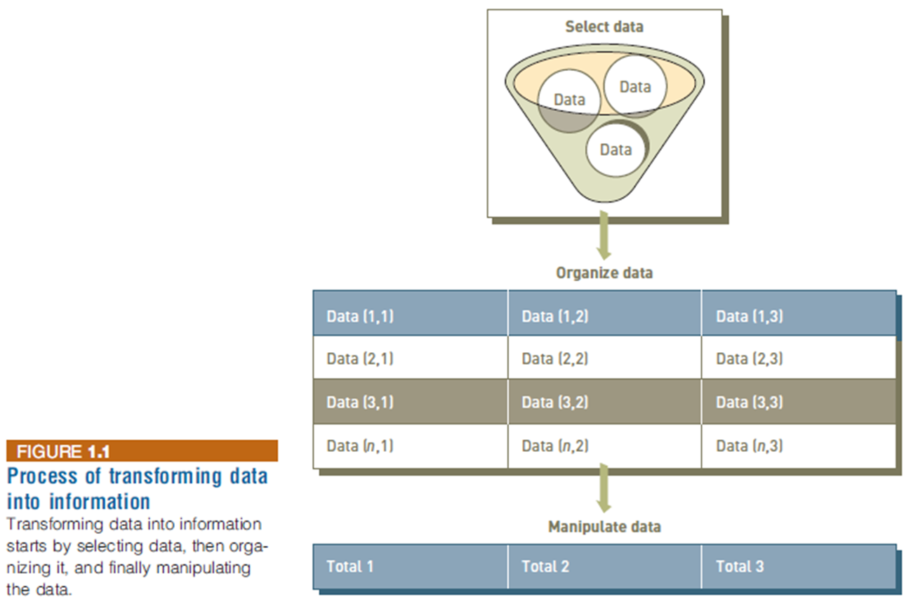

**Proses**, merupakan tahapan untuk merubah data menjadi informasi.
Jenis informasi yang dihasilkan bergantung pada hubungan yang didefinisikan dari sejumlah data yang ada.
Proses mendefinisikan hubungan antar data agar dapat menghasilkan informasi yang berguna membutuhkan pengetahuan.

### Pengetahuan

**Pengetahuan (Knowledge)**, merupakan kesadaran dan pemahaman tentang sekumpulan informasi dan cara membuatnya berguna untuk mendukung tugas tertentu.

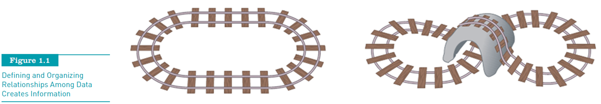

The Process of Transforming Data into Information

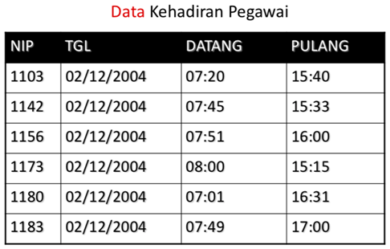

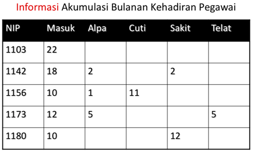

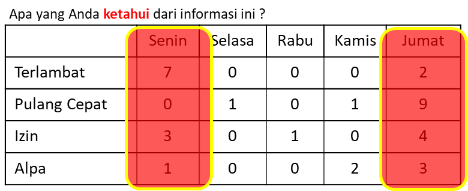

`Pengolahan data` kehadiran pegawai `menghasilkan informasi` yang memungkinkan perusahaan menghitung besaran gaji tiap bulannya, mengidentifikasi performa atau kinerja pegawai.

Informasi yang dihasilkan `bergantung kepada proses` yang dilakukan (seperti klasifikasi, kalkulasi, summary)

Sekumpulan informasi yang membentuk pola tertentu akan `memberikan pengetahuan` untuk mendukung tugas atau kebutuhan tertentu.

Pengetahuan yang didapat akan menjadi bekal dalam `pengambilan keputusan atau kebijakan`

## Pengambilan Keputusan Manajerial

Keputusan yang diambil manajer berbeda-beda sesuai dengan tingkat manajemen, sehingga masalah yang diselesaikan juga berbeda.

- Low level manager : operasional
- Middle level manager : manajemen (taktis)
- Top level manager : strategis

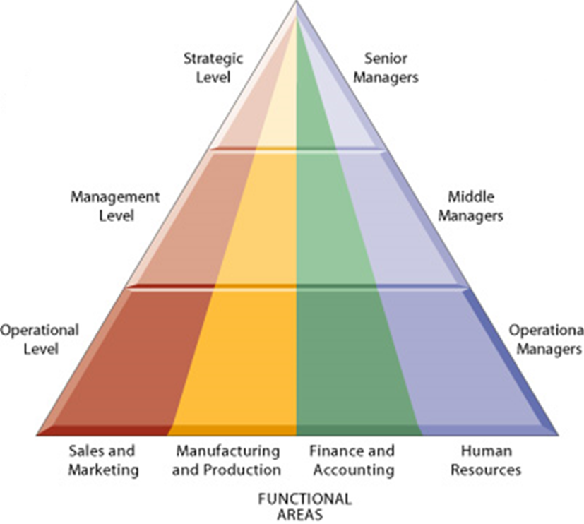

### Masalah dan Struktur Masalah

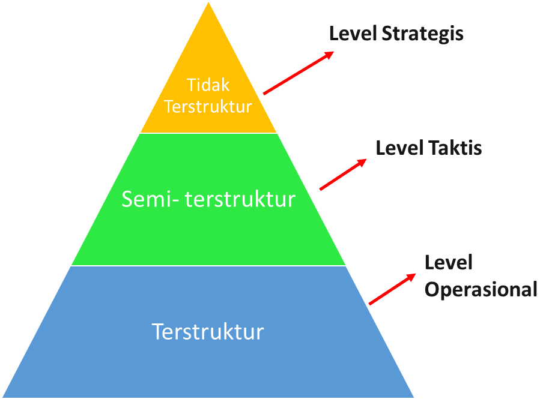

Masalah merupakan suatu kondisi yang berpotensi menimbulkan kerugian atau juga dapat menghasilkan keuntungan.

Tindakan dalam memberi respon terhadap masalah untuk menekan akibat buruk maupun memanfaatkan peluang keuntungannya disebut  pemecahan masalah.

Strategi yang dipilih atau tindakan yang diambil dalam pemecahan masalah disebut keputusan.

### Masalah Terstruktur

Dalam masalah terstruktur penanganan masalah dapat ditangani dengan menggunakan komputer, artinya sistem komputer mampu melakukan pengambilan keputusan tanpa ada campur tangan manager

Contoh

- Penanganan aktivitas pemrosesan order barang oleh customer dapat diselesaikan oleh sistem computer
- Penanganan kalkulasi piutang dagang perusahaan yang dilakukan oleh sistem komputer

### Masalah Semi Terstruktur

Dalam masalah semi terstruktur penanganan masalah membutuhkan bantuan dari komputer dan peran user (manager).

Contoh:

- Dalam kasus penentuan pembelian bahan baku kepada supplier dimana harga bahan dipengaruhi oleh beberapa aspek lingkungan seperti kondisi perekonomian yang sedang tak menentu, seperti adanya pandemi.
- Komputer akan berperan sebagai pendukung keputusan dalam mengetahui kondisi persediaan yang ada, dengan konsep informasi dari database.
- Manajer kemudian menentukan keputusan untuk melakukan pembelian atau tidak atas kondisi persediaan bahan baku yang semakin menipis. Serta seberapa besarnya nilai pembelian.
- Sistem komputer mendukung pengambilan keputusan manajer namun bukan pengambil keputusan.

### Masalah Tidak Terstruktur

Dalam masalah tidak terstruktur penanganan masalah hanya dilakukan sepenuhnya oleh manajer.

Contoh

- Kasus penentuan nilai besaran investasi bisnis perusahaan yang dipengaruhi oleh lingkungan diluar perusahaan seperti nilai mata uang (kurs), harga saham, issue nasional maupun isue internasional, atau hal ini ditentukan oleh pasar.
- Permasalahan yang timbul akibat lingkungan yang tidak terkondisi dan tidak terkontrol dengan sistem komputer.
- Sehingga peran manajer sangat mendominasi dalam hal pengambilan keputusan.

## Pendekatan Pengambilan Keputusan

| Dulu                                                                                      | Sekarang                                                                                       |
| ----------------------------------------------------------------------------------------- | ---------------------------------------------------------------------------------------------- |
| Kemahiran yang diperoleh dari pengalaman yang bertambah                                   | Lingkungan manajemen, cepat berubah dan semakin kompleks, tidak bisa bergantung pada cara lama |
| Mengikuti pengalaman untuk menentukan keputusan, perlu kreativitas, intuisi – trial error | Faktor- faktor yang mempengaruhi pengambilan keputusan semakin banyak                          |
| Tidak menggunakan metode kuantitatif yang sistematis berdasarkan pendekatan ilmiah        | Manager perlu dukungan teknologi informasi                                                     |
| Pengambilan keputusan tradisional                                                         | Memanfaatakan cara yang lebih modern                                                           |
| Mengikuti prosedur yang baku                                                              | Menggunakan teknik operation research (formula matematika, simulasi computer)                  |
| Saluran informasi sederhana                                                               | Berdasarkan pengolahan data berbantu komputer                                                  |

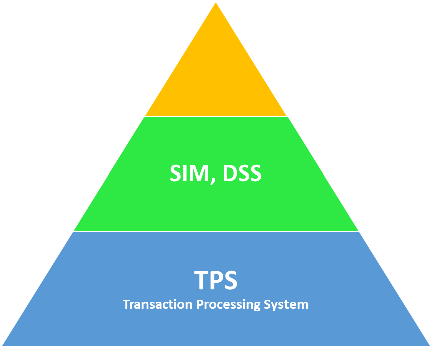

Aplikasi komputer bergeser dari kegiatan proses transaksi dan monitoring kepada aplikasi analisis solusi permasalahan **(problem analysis solution)**

Sistem informasi melayani manajer dalam kegiatan yang sangat penting yaitu pengambilan keputusan

Pengembangan sistem informasi ditingkatkan kepada efektivitas pengambilan keputusan manajer, terutama dalam pekerjaan yang kompleks

### Tipe Keputusan

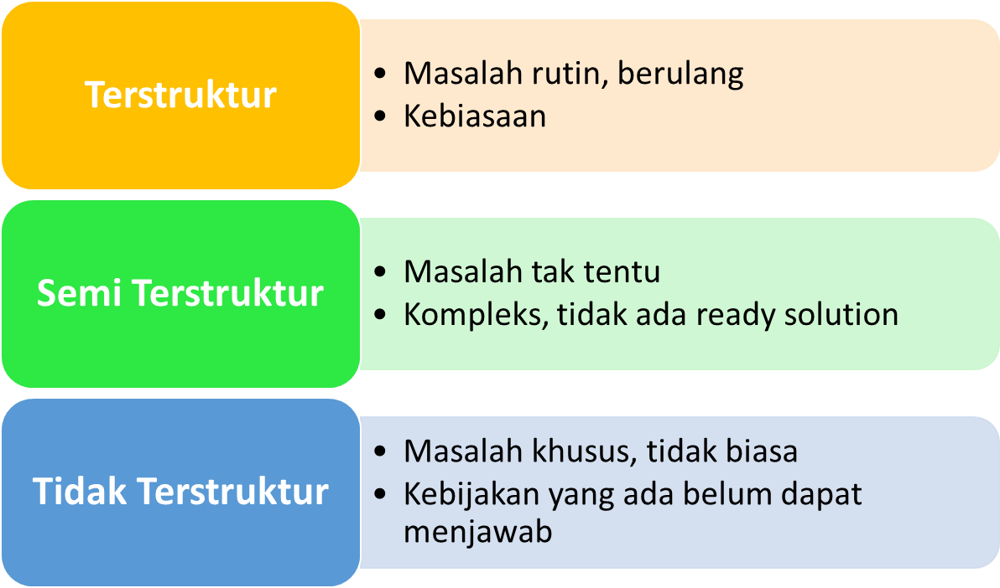

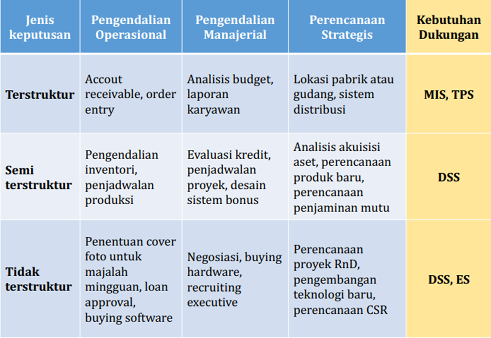

## Sistem Pendukung Keputusan

### Fase Pengambilan Keputusan

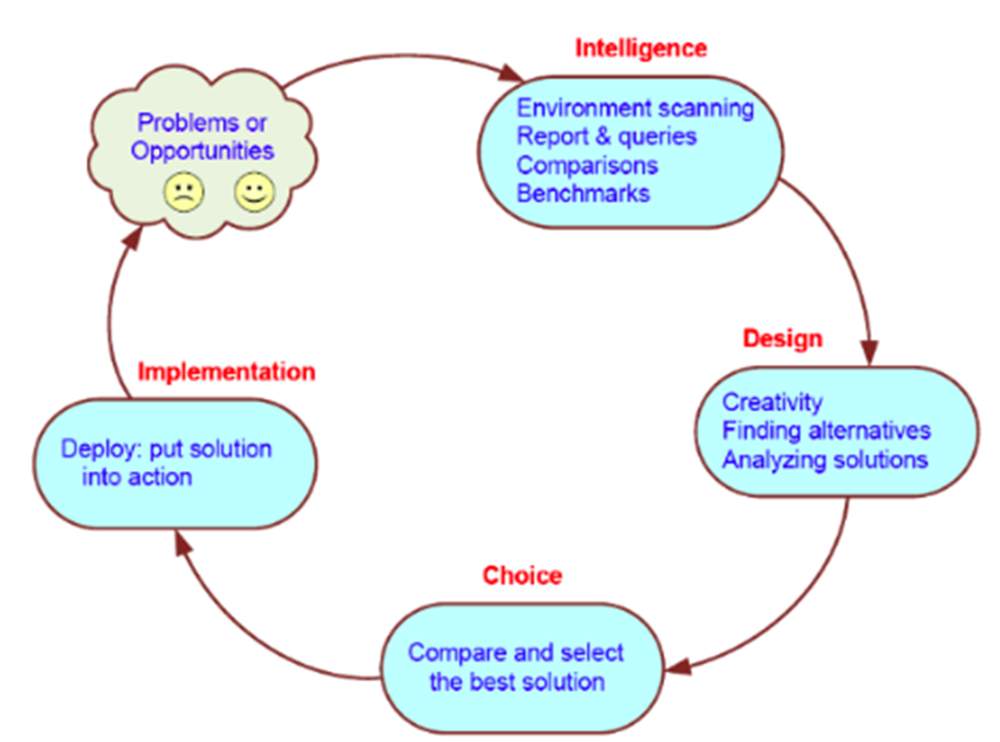

### Fase Intelligence

- Melakukan analisis lingkungan dan tujuan organisasi
- Pengumpulan data yang diperlukan
- Identifikasi dan kategorisasi masalah
- Penguraian masalah dalam bagian kecil
- Analisis penanggung jawab

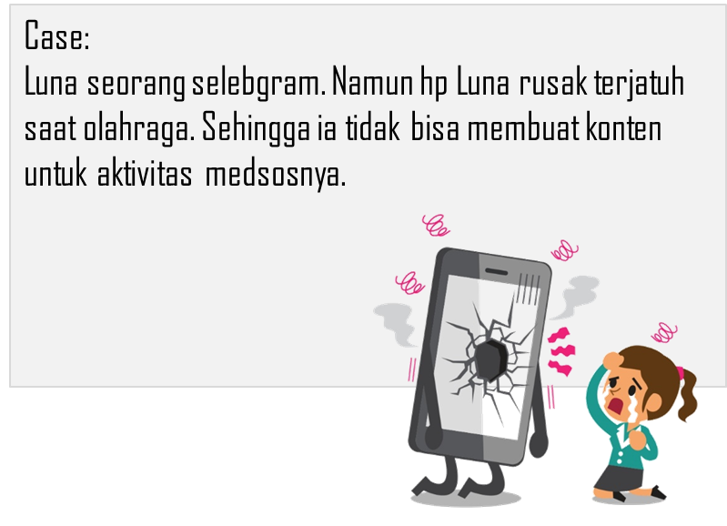

### Fase Design

- Penyusunan alternatif tindakan
- Analisis solusi potensial
- Buat model – uji kelayakan – validasi hasil
- Tentukan prinsip pemilihan

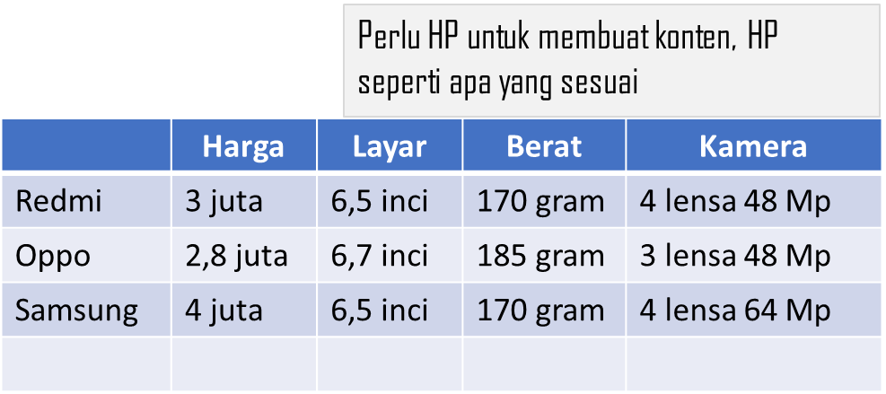

### Fase Pemilihan

- Uraian penerimaan dari pendekatan solusi
- Pemodelan normatif- deskriptif
- Normatif
  - Optimalisasi
  - §Rasionalisasi
  - §Suboptimasi
- Deskriptif
  - Uraikan bagaimana sesuatu diyakini
  - Berbasis pemodelan secara matematis
  - Menerapkan serangkaian alternatif

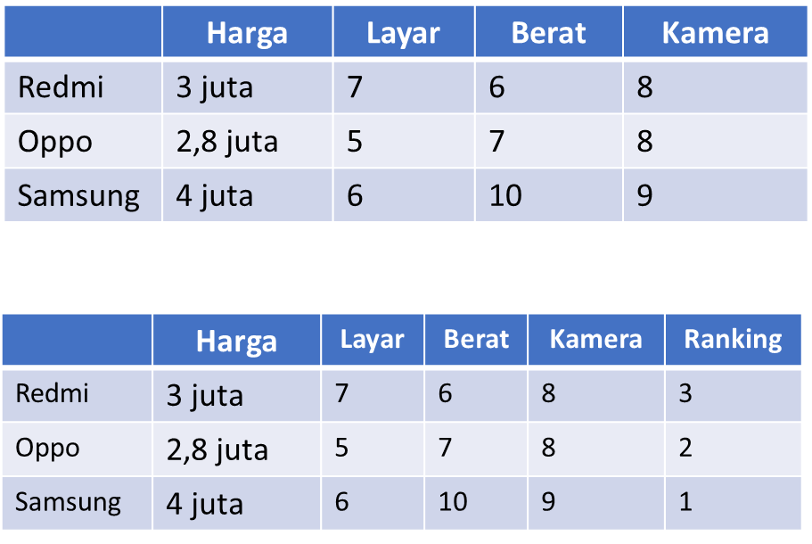

### Fase Implementasi

- Menentukan penerapan solusi
- Menerapkan dalam tindakan
- Perhatikan batas tak jelas
  - Resistensi perubahan
  - User training
  - Dukungan manajemen tingkat atas

---
SPK, merupakan sistem informasi interaktif yang menyediakan informasi, pemodelan, dan pemanipulasian data.

Sistem ini untuk membantu pengambilan keputusan dalam situasi yang semi terstruktur dan tidak terstruktur, dimana tidak seorang pun tahu secara pasti bagaimana keputusan dibuat. [Alter, 2002]

Sistem berbasis computer interaktif yang membantu pengambil keputusan dengan memanfaatkan data  dan model untuk menyelesaikan permasalahan tidak tersetruktur [Gorry and Scott-Morton, 1971]

SPK, merupakan pendekatan (atau metodologi) untuk mendukung pengambilang keputusan.

- Menggunakan cara yang interaktif, fleksibel, mudah beradaptasi dengan CBIS
- Dikembangkan (by end user) untuk mendukung solusi ke masalah manajemen non terstruktur tertentu
- Menggunakan data, model dan pengetahuan berbasis antarmuka yang mudah
- Mengkombinasikan wawasan pengambil keputusan
- Mendukung seluruh tahapan pengambilan keputusan

### Karakteristik Sistem Pendukung Keputusan

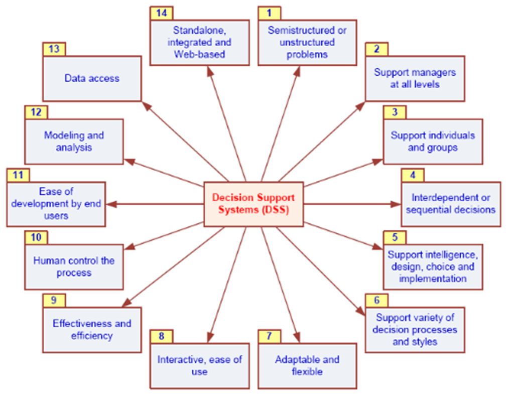

### Tujuan Sistem Pendukung Keputusan

- Membantu manajer pengambilan keputusan atas masalah semi terstruktur
- Memberikan dukungan atas pertimbangan manajer, bukan menggantikan fungsi manajer
- Meningkatkan efektivitas keputusan yang diambil manajer lebih daripada perbaikan efisiensinya
- Komputer memungkinkan para pengambil keputusan untuk melakukan banyak komputasi secara cepat
- Mengatasi keterbatasan kognitif dalam pemrosesan dan penyimpanan

## Sistem Informasi Manajemen [SIM] vs Sistem Pendukung Keputusan [SPK]

| SIM                                                       | SPK                                                                                                              |
| --------------------------------------------------------- | ---------------------------------------------------------------------------------------------------------------- |
| Beroperasi pada tugas yang terstruktur                    | Dukungan kepada pengambilan keputusan, terutama pada situasi semi terstruktur dan tidak terstruktur              |
| Bersifat rangkuman dari aktivitas operasional bisnis      | Menyertakan penilaian manusia dan informasi terkomputerisasi, masalah tidak bisa dipecahkan oleh sistem komputer |
| Fokus pada meningkatkan efisiensi dengan mengurangi biaya | Fokus pada peningkatan efektivitas pengambilan keputusan (akurasi, timelines, kualitas) daripada efisiensinya    |

## ❓ Tugas / Class Activity

1. Temukan 1 masalah atau kasus dalam kehidupan Anda yang memerlukan adanya pengambilan keputusan
2. Buatlah ilustrasi pengambilan keputusan untuk kasus tersebut dengan mengikuti Fase pengambilan keputusan
