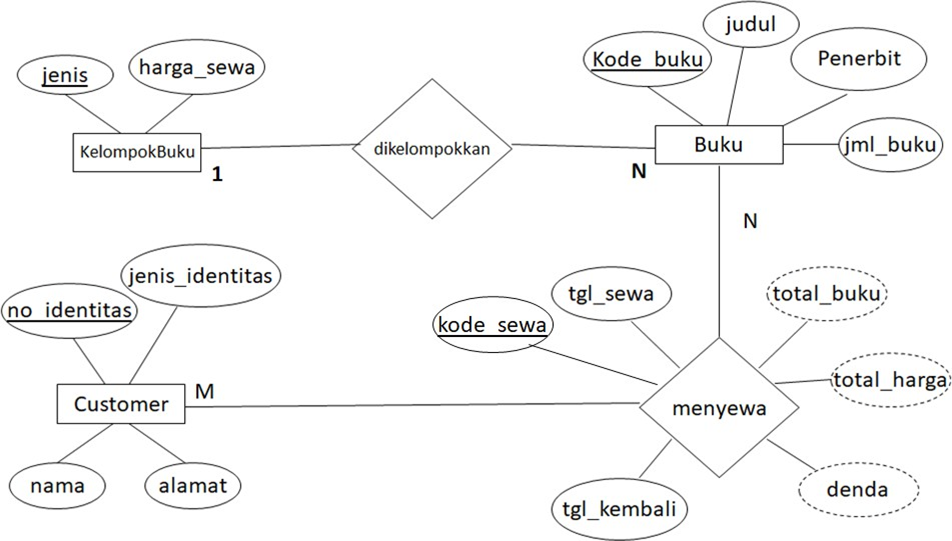

# Latihan Database Administrator

## Sistem Persewaan Buku

Ahmad ingin membangun sebuah `sistem persewaan buku` dimana hasil rancangan `Entity Relational Diagram [ERD]` yang terbentuk:



Implementasi rancangan entitas dan keterkaitan antar entitas:


## PuTTY

### IP Address Labs

```txt
192.168.10.253
```

### Port SSH

```txt
22
```

### Username & Password

```txt
a122006495
```

```txt
polke001
```

## mySQL Login Labs

```bash
mysql -u a122006495 -p
```

> \*Enter Password: `polke001`

### MySQL Login Local

```bash
mysql -u root -p
```

> \*Enter Password: `biasanya tidak ada password`
### Melihat Semua Database

```sql
SHOW DATABASES;
```

### Membuat Database

```sql
CREATE DATABASE perpustakaan;
```

### Menggunakan Database

```sql
USE perpustakaan;
```

### Membuat Table

> Membuat Table `kelompokbuku`

```sql
CREATE TABLE kelompokbuku (
	jenis VARCHAR(10) PRIMARY KEY,
	harga_sewa INT(5)
);
```

> Membuat Table `buku`

```sql
CREATE TABLE buku (
	kode_buku CHAR(4) PRIMARY KEY,
	jenis VARCHAR(10),
	judul VARCHAR(30),
	penerbit VARCHAR(15),
	jml INT(2)
);
```

> Membuat Table `customer`

```sql
CREATE TABLE customer (
	no_identitas CHAR(3) PRIMARY KEY,
	jenis_identitas VARCHAR(5),
	nama VARCHAR(30),
	alamat VARCHAR(40)
);
```

> Membuat Table `sewa`

```sql
CREATE TABLE sewa (
	kode_sewa CHAR(5) PRIMARY KEY,
	no_identitas CHAR(3),
	tgl_sewa DATE,
	total INT(2),
	tgl_kembali DATE,
	tot_hrg INT(6),
	denda INT(6)
);
```

> Membuat Table `dtlsewa` (detail sewa)

```sql
CREATE TABLE dtlsewa (
	kode_sewa CHAR(5),
	kode_buku CHAR(4)
);
```

## Soal Latihan

1. Buat `5 tabel` tersebut pada `database` Anda!
2. Buatlah `constrain` `foreign key` antara relasi tabel `buku` dengan `kelompokbuku` dan antara relasi tabel `sewa` dengan `customer`!
   
```sql
ALTER TABLE buku ADD FOREIGN KEY (jenis) REFERENCES kelompokbuku(jenis);
```

```sql
ALTER TABLE sewa ADD FOREIGN KEY (no_identitas) REFERENCES customer(no_identitas);
```

```sql
ALTER TABLE customer DROP PRIMARY KEY;
```

```sql
ALTER TABLE customer ADD PRIMARY KEY (no_identitas);
```

4. Masukan data pada masing-masing tabel di atas!
   
```sql
INSERT INTO kelompokbuku VALUES
('Komik', 3000),
('Majalah', 3000),
('Buku', 3000);
```

```sql
INSERT INTO buku VALUES
('NA3','Komik','Naruto no 3','Shuesha',3), 
('KOM2','Majalah','Info Komputer edisi5 2022','Infotek',3),
('BUK2','Buku','Basis Data','Fatansyah',3);
```

```sql
INSERT INTO customer(no_identitas, jenis_identitas, nama, alamat) VALUES 
('001','SIM','Andi','Pontianak'), 
('002','SIM','Budi','Pontianak');
```

```sql
INSERT INTO sewa VALUES 
('S0001','001','2022-01-01',2,'2022-01-02',6000,0),
('S0002','002','2022-01-03',1,'2022-01-03',3500,0),
('S0003','001','2022-01-06',3,'2022-01-08',9500,0);
```

```sql
INSERT INTO dtlsewa VALUES 
('S0001','NA4'),('S0001','BUK2'),
('S0002','KOM2'),('S0003','BUK3'),
('S0003','NA3'),('S0003','KOM2');
```

5. Buatlah `procedure` yang mengirimkan data masukan (insert) pada table `buku` dan menampilkan hasil masukannya, setelah memanggil `procedure` atau 
```sql
CALL isibuku('BUK3', 'Buku', 'Fisika', 'Erlangga', 5);
```

```sql
DELIMITER $$

CREATE PROCEDURE isibuku (
	IN p_kode_buku CHAR(4),
	IN p_jenis VARCHAR(10),
	IN p_judul VARCHAR(30),
	IN p_penerbit VARCHAR(15),
	IN p_jml INT(2)
) 
BEGIN
	INSERT INTO buku(kode_buku, jenis, judul, penerbit, jml) VALUES 
	(p_kode_buku, p_jenis, p_judul, p_penerbit, p_jml);
	
	SELECT * FROM buku;
END$$

DELIMITER ;
```

6. Menyisipkan kolom `ket` pada table `customer`
   
```sql
ALTER TABLE customer ADD ket VARCHAR(20);
```
   
7. Membuat `procedure` untuk memasukkan data pada tabel `customer` dengan ketentuan
```sql
DELIMITER $$

CREATE PROCEDURE isicustomer (
	IN p_no_identitas CHAR(3),
	IN p_jenis_identitas VARCHAR(5),
	IN p_nama VARCHAR(30),
	IN p_alamat VARCHAR(40)
)
BEGIN
	DECLARE v_ket VARCHAR(30);
	
	IF (p_jenis_identitas = 'KTP') THEN
		SET ket = 'Kartu Tanda Penduduk';
	ELSE 
		IF (p_jenis_identitas = 'SIM') THEN
			SET ket = 'Surat Ijin Mengemudi';
		ELSE 
			SET ket = 'Lainnnya';
		END IF;
	END IF;
	
	INSERT INTO customer (no_identitas, jenis_identitas, nama, alamat, ket) VALUES 
	(p_no_identitas, p_jenis_identitas, p_nama, p_alamat, v_ket);
	
	SELECT * FROM customer;
END$$

DELIMITER ;
```

Serta tampilkan data tabel `customer` dan `procedur` tersebut dipanggil
```sql
CALL isicustomer('004', 'KTP', 'Pungky', 'Semarang');
```
8. Buatlah `function` untuk mencari judul buku!
   
```sql
DELIMITER $$

CREATE FUNCTION carijudul (
	p_kode_buku CHAR(5)
) 
RETURNS VARCHAR(30) DETERMINISTIC
BEGIN
    DECLARE judul_buku VARCHAR(30);
    
    SELECT judul INTO judul_buku FROM buku WHERE kode_buku = p_kode_buku;
    
    RETURN judul_buku;
END$$

DELIMITER ;
```
   
9. Membuat `trigger` untuk mengurangi `total` pada tabel `sewa`, ketika ada data yang terhapus pada table `dtlsewa`
   
```sql
DELIMITER $$

CREATE TRIGGER trhpsdtlsewa
AFTER DELETE ON dtlsewa
FOR EACH ROW
BEGIN
  UPDATE sewa SET total = total - 1 WHERE kode_sewa = OLD.kode_sewa;
END$$

DELIMITER ;
```
   
10. Mencoba untuk menghapus tabel `dtlsewa` berdasarkan `kode_sewa` dan `kode_buku` sebagai kunci pada tabel `sewa`

```sql
DELETE FROM dtlsewa WHERE kode_sewa = 'S0003' AND kode_buku = 'NA3';
```

11. Membuat `trigger` untuk menambah `total` pada tabel `sewa`, ketika penambahan data pada tabel `dtlsewa`

```sql
DELIMITER $$

CREATE TRIGGER tradddtlsewa
AFTER INSERT ON dtlsewa
FOR EACH ROW
BEGIN
  UPDATE sewa SET total = total + 1 WHERE kode_sewa = NEW.kode_sewa;
END$$

DELIMITER ;
```

```sql
INSERT INTO dtlsewa VALUES ('S0003', 'KOM2');
```

```sql
SELECT * FROM sewa;
SELECT * FROM dtlsewa;
```

12. Menerapkan `transaction`
13. Menyimpan secara permanen `commit`
14. Mengembalikan data yang terhapus `rollback`

```sql
-- Membuat transaction
START TRANSACTION;

-- Contoh operasi pada tabel kelompokbuku
INSERT INTO kelompokbuku (jenis, harga_sewa) VALUES 
('Komik', 3000);
INSERT INTO kelompokbuku (jenis, harga_sewa) VALUES 
('Majalah', 3000);

-- Contoh operasi pada tabel buku
INSERT INTO buku (kode_buku, jenis, judul, penerbit, jml) VALUES 
('BK001', 'Komik', 'Naruto', 'Shuesha', 5);
INSERT INTO buku (kode_buku, jenis, judul, penerbit, jml) VALUES 
('BK002', 'Majalah', 'Info Komputer', 'Infotek', 3);

-- Contoh operasi pada tabel customer
INSERT INTO customer (no_identitas, jenis_identitas, nama, alamat) VALUES 
('C001', 'KTP', 'Andi', 'Jl. ABC');
INSERT INTO customer (no_identitas, jenis_identitas, nama, alamat) VALUES 
('C002', 'SIM', 'Budi', 'Jl. XYZ');

-- Contoh operasi pada tabel sewa
INSERT INTO sewa (kode_sewa, no_identitas, tgl_sewa, total, tgl_kembali, tot_hrg, denda) VALUES 
('S001', 'C001', '2022-01-01', 2, '2022-01-03', 6000, 0);
INSERT INTO sewa (kode_sewa, no_identitas, tgl_sewa, total, tgl_kembali, tot_hrg, denda) VALUES 
('S002', 'C002', '2022-01-03', 1, '2022-01-05', 3500, 0);

-- Contoh operasi pada tabel dtlsewa
INSERT INTO dtlsewa (kode_sewa, kode_buku) VALUES ('S001', 'BK001');
INSERT INTO dtlsewa (kode_sewa, kode_buku) VALUES ('S001', 'BK002');
INSERT INTO dtlsewa (kode_sewa, kode_buku) VALUES ('S002', 'BK002');

-- Menyimpan perubahan secara permanen
COMMIT;

-- Jika terdapat kesalahan, maka bisa membatalkan perubahan
-- ROLLBACK;
```