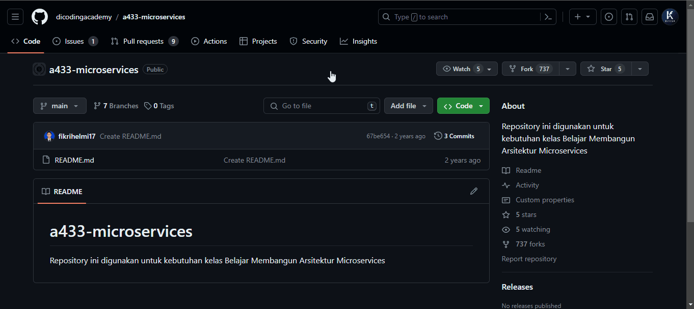
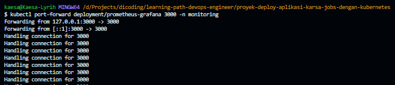

# Submission 2: Proyek Deploy Aplikasi Karsa Jobs dengan Kubernetes

- Install `minikube` dan `kubectl`

```bash
minikube start 
```


Terdapat 3 kriteria utama yang harus Anda penuhi dalam mengerjakan proyek kedua ini.

## Kriteria 1: Menggunakan Starter Project (Karsa Jobs)

Dalam mengerjakan proyek kedua ini, Anda wajib menggunakan source code dari starter project yang telah kami siapkan. Berbeda dengan sebelumnya, starter project yang digunakan pada proyek kedua ini adalah Karsa Jobs. Starter project ini berada di GitHub repository milik Dicoding Academy. Untuk itu, Anda harus fork repository tersebut ke akun GitHub Anda terlebih dahulu (jangan lupa untuk **tidak mencentang** opsi **copy the main branch only**), lalu clone ke lokal.

Berikut tautan repository dari starter project yang dimaksud:

- [https://github.com/dicodingacademy/a433-microservices/tree/karsajobs](https://github.com/dicodingacademy/a433-microservices/tree/karsajobs) 
  *\*pastikan Anda clone spesifik untuk branch `karsajobs` (backend).*
- [https://github.com/dicodingacademy/a433-microservices/tree/karsajobs-ui](https://github.com/dicodingacademy/a433-microservices/tree/karsajobs-ui) 
  *\*pastikan Anda clone spesifik untuk branch `karsajobs-ui` (frontend)*



Link fork: https://github.com/lyrihkaesa/a433-microservices

-  Backend
```bash
git clone -b karsajobs https://github.com/lyrihkaesa/a433-microservices.git karsajobs
```

- Frontend
```bash
git clone -b karsajobs-ui https://github.com/lyrihkaesa/a433-microservices.git karsajobs-ui
```

Saya membuat folder baru `proyek-deploy-aplikasi-karsa-jobs-dengan-kubernetes`. Jadi hasilnya nanti seperti ini:

```tree
proyek-deploy-aplikasi-karsa-jobs-dengan-kubernetes
├── karsajobs # git clone -b karsajobs
│   ├── cmd
│   ├── pkg
│   ├── .gitignore
│   ├── Dockerfile
│   ├── go.mod
│   ├── go.sum
│   └── README.md
├── karsajobs-ui # git clone -b karsajobs-ui
│   ├── public
│   ├── src
│   ├── .env
│   ├── .gitignore
│   ├── babel.config.js
│   ├── Dockerfile
│   ├── package.json
│   ├── package-lock.json
│   ├── postcss.config.js
│   ├── README.md
│   └── tailwind.config.js
└── kubernetes # kriteria 3
```

## Kriteria 2: Membuat Script untuk Build dan Push Docker Image

Selanjutnya, tugas Anda adalah membuat berkas shell script bernama `build_push_image_karsajobs.sh` (untuk backend) yang tersimpan di `karsajobs` source code dan `build_push_image_karsajobs_ui.sh` (untuk frontend) yang tersimpan di `karsajobs-ui` source code.

Pada dasarnya, kedua berkas tersebut berisi beberapa baris perintah untuk keperluan membuat Docker image (build) dan kemudian mengunggahnya (push) ke Docker Hub (atau GitHub Package bila menerapkan saran kedua).

Berikut adalah uraian yang mesti ada pada berkas script Anda.

1. Perintah untuk **build** Docker image dari berkas `Dockerfile` yang disediakan dengan nama `<username-docker>/karsajobs:latest` (untuk backend) dan `<username-docker>/karsajobs-ui:latest` (untuk frontend).
2. Perintah untuk **login** ke Docker Hub (atau GitHub Package bila menerapkan saran kedua).
3. Perintah untuk **push** image ke Docker Hub (atau GitHub Package bila menerapan saran kedua).

Ingat bahwa tahapan di atas mesti dilakukan secara berurutan.


```sh title=".\karsajobs\build_push_image_karsajobs.sh"
#!/bin/bash

# Nama image yang akan dibuat
IMAGE_NAME="karsajobs"
# Tag untuk image
TAG="latest"

# Mengubah nama image agar sesuai dengan format GitHub Packages (GitHub Container Registry)
NEW_IMAGE_NAME="ghcr.io/lyrihkaesa/$IMAGE_NAME:$TAG"

# Membuat Docker image dari Dockerfile dengan nama dan tag yang telah ditentukan
docker build -t $NEW_IMAGE_NAME .

# Login ke GitHub Packages (GitHub Container Registry)
echo $PAT | docker login ghcr.io --username lyrihkaesa --password-stdin

# Mengunggah image ke GitHub Packages (GitHub Container Registry)
docker push $NEW_IMAGE_NAME

```

```sh title=".\karsajobs-ui\build_push_image_karsajobs_ui.sh"
#!/bin/bash

# Nama image yang akan dibuat
IMAGE_NAME="karsajobs-ui"
# Tag untuk image
TAG="latest"

# Mengubah nama image agar sesuai dengan format GitHub Packages (GitHub Container Registry)
NEW_IMAGE_NAME="ghcr.io/lyrihkaesa/$IMAGE_NAME:$TAG"

# Membuat Docker image dari Dockerfile dengan nama dan tag yang telah ditentukan
docker build -t $NEW_IMAGE_NAME .

# Login ke GitHub Packages (GitHub Container Registry)
echo $PAT | docker login ghcr.io --username lyrihkaesa --password-stdin

# Mengunggah image ke GitHub Packages (GitHub Container Registry)
docker push $NEW_IMAGE_NAME

```


```tree
proyek-deploy-aplikasi-karsa-jobs-dengan-kubernetes
├── karsajobs # git clone -b karsajobs
│   ├── cmd
│   ├── pkg
│   ├── .gitignore
│   ├── build_push_image_karsajobs.sh # kriteria 2
│   ├── Dockerfile
│   ├── go.mod
│   ├── go.sum
│   └── README.md
├── karsajobs-ui # git clone -b karsajobs-ui
│   ├── public
│   ├── src
│   ├── .env
│   ├── .gitignore
│   ├── babel.config.js
│   ├── build_push_image_karsajobs-ui.sh # kriteria 2
│   ├── Dockerfile
│   ├── package.json
│   ├── package-lock.json
│   ├── postcss.config.js
│   ├── README.md
│   └── tailwind.config.js
└── kubernetes # kriteria 3
```

### Kriteria 3: Deploy Aplikasi ke Kubernetes

Oke, sekarang aplikasi Karsa Jobs (baik frontend maupun backend) sudah menjadi image yang tersimpan di Docker Hub (atau GitHub Package bila menerapkan saran kedua). Good!

Sekarang tugas Anda adalah deploy aplikasi tersebut ke Kubernetes di lokal dengan bantuan `minikube`. Untuk memudahkan, silakan buat directory baru (di luar directory `karsajobs` dan `karsajobs-ui`) bernama **kubernetes**.

Di dalam berkas tersebut, buatlah berbagai berkas manifest yang dibutuhkan untuk men-deploy aplikasi ke Kubernetes. Berikut panduan dari kami (yang diberi tanda tebal adalah directory).

```tree
**kubernetes**
├── **backend**
│   ├── karsajobs-service.yml
│   └── karsajobs-deployment.yml
├── **frontend**
│   ├── karsajobs-ui-service.yml
│   └── karsajobs-ui-deployment.yml
└── **mongodb**
    ├── mongo-configmap.yml
    ├── mongo-secret.yml
    ├── mongo-pv-pvc.yml
    ├── mongo-service.yml
    └── mongo-statefulset.yml
```

Hasilnya

```tree
proyek-deploy-aplikasi-karsa-jobs-dengan-kubernetes
├── karsajobs # git clone -b karsajobs
│   ├── cmd
│   ├── pkg
│   ├── .gitignore
│   ├── build_push_image_karsajobs.sh # kriteria 2
│   ├── Dockerfile
│   ├── go.mod
│   ├── go.sum
│   └── README.md
├── karsajobs-ui # git clone -b karsajobs-ui
│   ├── public
│   ├── src
│   ├── .env
│   ├── .gitignore
│   ├── babel.config.js
│   ├── build_push_image_karsajobs-ui.sh # kriteria 2
│   ├── Dockerfile
│   ├── package.json
│   ├── package-lock.json
│   ├── postcss.config.js
│   ├── README.md
│   └── tailwind.config.js
└── kubernetes # kriteria 3
    ├── backend
    │   ├── karsajobs-deployment.yml
    │   └── karsajobs-service.yml
    ├── frontend
    │   ├── karsajobs-ui-deployment.yml
    │   └── karsajobs-ui-service.yml
    └── mongodb
        ├── mongo-configmap.yml
        ├── mongo-pv-pvc.yml
        ├── mongo-secret.yml
        ├── mongo-servie.yml
        └── mongo-statefulset.yml
```

```bash
kubectl create namespace karsajobs
```

```bash
kubectl apply -f kubernetes/mongodb/mongo-pv-pvc.yml -n karsajobs
kubectl apply -f kubernetes/mongodb/mongo-configmap.yml -n karsajobs
kubectl apply -f kubernetes/mongodb/mongo-secret.yml -n karsajobs
kubectl apply -f kubernetes/mongodb/mongo-service.yml -n karsajobs
kubectl apply -f kubernetes/mongodb/mongo-statefulset.yml -n karsajobs

kubectl apply -f kubernetes/backend/karsajobs-service.yml -n karsajobs
kubectl apply -f kubernetes/backend/karsajobs-deployment.yml -n karsajobs

kubectl apply -f kubernetes/frontend/karsajobs-ui-service.yml -n karsajobs
kubectl apply -f kubernetes/frontend/karsajobs-ui-deployment.yml -n karsajobs
```

```bash
kubectl get all -n karsajobs
```

```bash
kubectl delete all --all -n karsajobs
```

```bash
minikube service karsajobs -n karsajobs
minikube service karsajobs-ui -n karsajobs
```

```bash
kubectl delete deployment karsajobs-ui -n karsajobs
kubectl delete deployment karsajobs -n karsajobs
kubectl delete service karsajobs-ui -n karsajobs
kubectl delete service karsajobs -n karsajobs
```


```bash
kubectl get pod -o wide -n karsajobs
```
---
## Monitoring with Helm

```bash
kubectl create namespace monitoring
```

- https://helm.sh/docs/intro/using_helm/

```bash
choco install kubernetes-helm -y
```

saya menggunakan WingetUI.

path
```path
C:\Users\kaesa\AppData\Local\Programs\WingetUI\choco-cli\lib\kubernetes-helm\tools\windows-amd64
```

karena ada di `users\kaesa` saya taruh di `env user`

```bash
helm repo add prometheus-community https://prometheus-community.github.io/helm-charts
```

```bash
helm repo update
```

```bash
helm install prometheus prometheus-community/kube-prometheus-stack -n monitoring
```

```bash
kubectl --namespace monitoring get pods -l "release=prometheus"
```

```bash
kubectl port-forward deployment/prometheus-grafana 3000 -n monitoring
```



Buka di http://localhost:3000

Setelah itu login, 
- username: `admin`
- password: `prom-operator`


