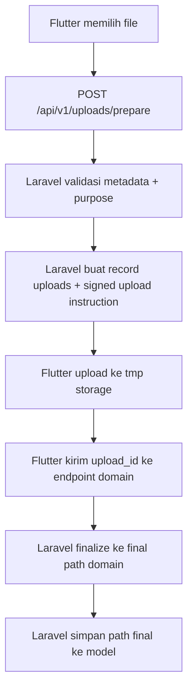
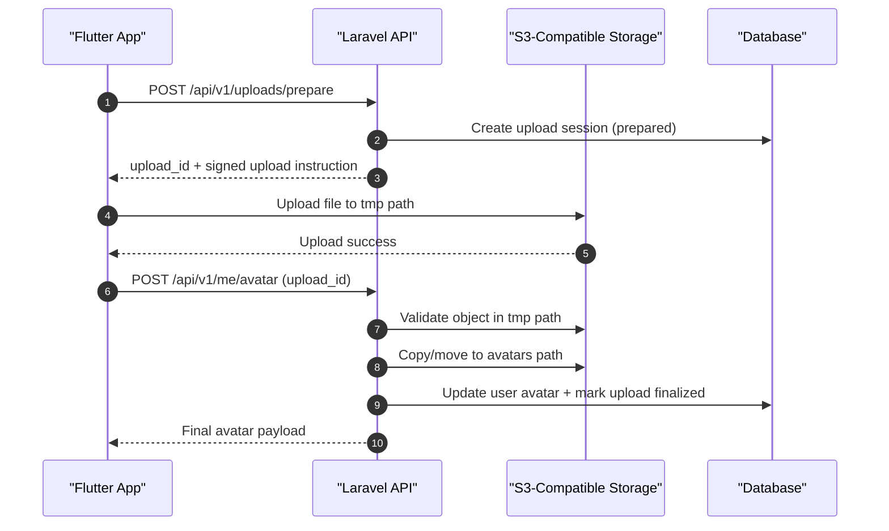
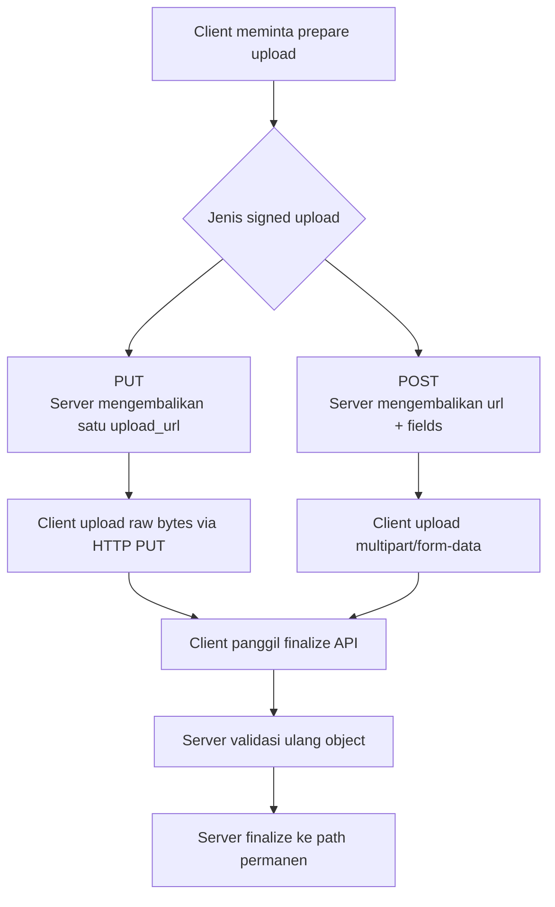
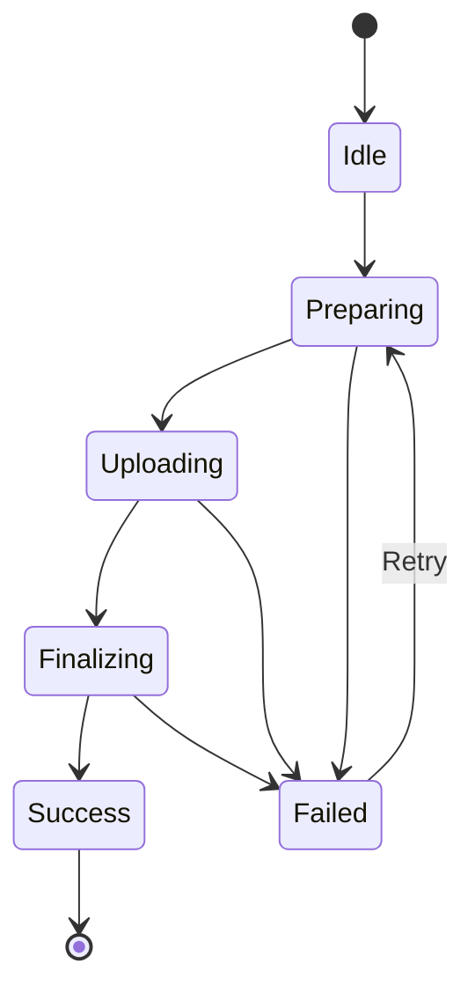
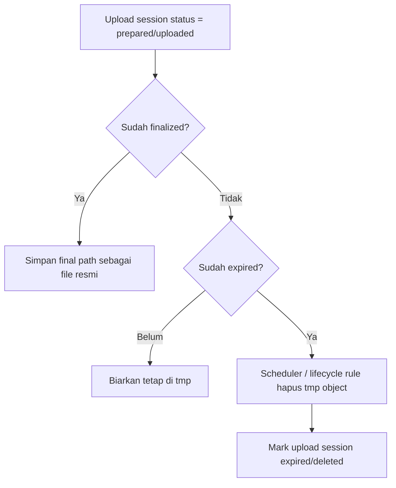
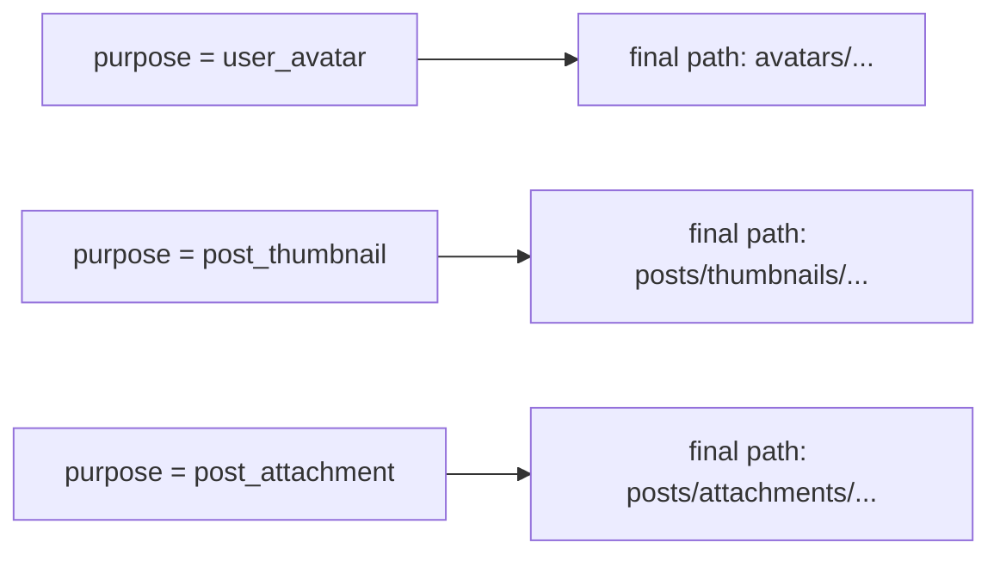

# File Upload Strategy (S3-Compatible, Filament, API Mobile)

Dokumen ini merangkum strategi upload file yang saya sarankan untuk starter kit ini, dengan fokus pada:

- tetap nyaman dipakai di Filament
- aman dan hemat storage untuk API/mobile
- mendukung `local`, `public`, dan S3-compatible bucket
- enak dirawat untuk jangka panjang
- kontrak API tetap jelas dan strict typed untuk client seperti Flutter

Dokumen ini bukan hanya membahas "cara upload", tetapi juga kapan sebuah flow layak dipakai dan kapan tidak.

## Tujuan Dokumen Ini

Dokumen ini sebaiknya dianggap sebagai fondasi upload file untuk seluruh aplikasi, bukan hanya avatar.

Pola yang dijelaskan di sini bisa dipakai ulang untuk:

- avatar user
- thumbnail post
- cover image
- lampiran artikel
- gallery image
- dokumen PDF
- file private lain yang butuh signed access

Kalau nanti aplikasi bertambah besar, kamu tidak perlu membuat flow upload baru dari nol untuk tiap modul. Yang berubah biasanya hanya:

- `purpose`
- aturan validasi
- lokasi final file
- endpoint domain yang memakai file tersebut

## Ringkasan Singkat

Kalau saya harus memilih satu arah arsitektur yang paling aman untuk jangka panjang:

- untuk **Filament admin/internal UI**, flow upload bawaan Filament + Livewire biasanya sudah cukup baik
- untuk **API mobile/public client**, lebih baik memakai **direct upload ke S3-compatible temporary path**, lalu **finalize ke path permanen lewat server**
- untuk **storage local/private**, download file private tetap bisa memakai signed URL/temporary URL
- untuk **upload direct dari mobile ke local disk**, saya **tidak menyarankan** menjadikan local disk sebagai arsitektur utama production

Kalau project ini akan dipakai serius dan ada aplikasi Flutter, saya sarankan anggap **S3-compatible object storage** sebagai jalur utama upload API, lalu local/public tetap didukung sebagai fallback untuk development atau deployment kecil.

## Kondisi Starter Kit Saat Ini

Starter kit ini sudah punya pondasi yang cukup baik:

- disk `local`, `public`, dan `s3` sudah tersedia di [`config/filesystems.php`](https://github.com/lyrihkaesa/filament-starter-kit/blob/main/config/filesystems.php)
- disk `local` sudah memakai `'serve' => true`, jadi file private lokal bisa dibuat `temporaryUrl()`
- Filament membaca disk dari [`config/filament.php`](https://github.com/lyrihkaesa/filament-starter-kit/blob/main/config/filament.php)
- upload avatar Filament sudah dipakai di [`app/Filament/Pages/Auth/EditProfile.php`](https://github.com/lyrihkaesa/filament-starter-kit/blob/main/app/Filament/Pages/Auth/EditProfile.php) dan [`app/Filament/Resources/Users/Schemas/UserForm.php`](https://github.com/lyrihkaesa/filament-starter-kit/blob/main/app/Filament/Resources/Users/Schemas/UserForm.php)
- avatar Filament saat ini dirender oleh [`app/Models/User.php`](https://github.com/lyrihkaesa/filament-starter-kit/blob/main/app/Models/User.php)

Artinya:

- project ini memang sudah support local/public/S3-compatible di level filesystem
- local private download dengan temporary URL sudah mungkin
- tetapi strategi upload API yang lebih formal untuk mobile belum didokumentasikan

## Tiga Strategy Upload yang Perlu Dibedakan

### 1. Server-mediated upload

Client mengirim file ke server Laravel, lalu server yang menyimpan ke disk.

Bagus untuk:

- Filament
- form admin internal
- file kecil
- implementasi sederhana

Kurang bagus untuk:

- mobile app
- file besar
- trafik tinggi

Kelemahan utamanya: file selalu melewati app server, jadi beban bandwidth, memory, dan request time pindah ke Laravel.

### 2. Direct-to-storage upload

Client minta signed URL/presigned POST ke server, lalu upload langsung ke object storage.

Bagus untuk:

- aplikasi mobile
- frontend publik
- file lebih besar
- sistem yang ingin scalable

Ini biasanya pilihan paling sehat untuk production.

### 3. Two-phase upload: temporary -> finalize

Ini adalah variasi direct upload yang saya paling sarankan untuk file yang nantinya dipakai model bisnis, misalnya:

- avatar
- lampiran profile
- bukti pembayaran
- dokumen verifikasi

Flow-nya:

1. client minta izin upload
2. server membuat upload session + temporary target
3. client upload ke path temporary
4. client memberi tahu server bahwa upload selesai
5. server validasi ulang object tersebut
6. server pindahkan atau copy ke path permanen
7. model bisnis menyimpan path final

Ini mencegah file liar langsung masuk ke folder final seperti `avatars/`.

## Prinsip Arsitektur yang Saya Sarankan

Kalau ingin high quality code dan maintenance jangka panjang, saya sarankan prinsip berikut:

### 1. Upload dibuat generik

Jangan buat sistem upload khusus avatar, khusus thumbnail post, khusus lampiran, lalu semuanya punya pola sendiri-sendiri.

Lebih baik punya satu fondasi upload generik yang mengenal konsep:

- `purpose`
- `disk`
- `visibility`
- `temporary_path`
- `final_path`
- `status`

Contoh `purpose`:

- `user_avatar`
- `post_thumbnail`
- `post_attachment`
- `gallery_image`
- `kyc_document`

### 2. Finalisasi tetap milik domain bisnis

Upload boleh generik, tetapi keputusan file itu akhirnya dipakai oleh model apa tetap milik domain bisnis.

Contoh:

- avatar user finalized oleh flow profile atau user
- thumbnail post finalized oleh flow post
- attachment invoice finalized oleh flow invoice

### 3. File temporary dan file final harus dibedakan jelas

Contoh:

```text
tmp/uploads/user-avatar/...
tmp/uploads/post-thumbnail/...
tmp/uploads/post-attachment/...
avatars/...
posts/thumbnails/...
posts/attachments/...
```

### 4. Semua upload API harus punya lifecycle

Minimal ada state:

- `prepared`
- `uploaded`
- `attached`
- `finalized`
- `expired`
- `deleted`

## Rekomendasi Utama Saya

### Untuk Filament

Pakai flow bawaan Filament/Livewire, karena:

- sudah ergonomis
- validasi form lebih sederhana
- user admin biasanya trusted/internal
- effort maintenance lebih kecil

Temporary file Livewire seperti `livewire-tmp` atau folder sejenis itu normal. Itu bukan masalah, selama lifecycle cleanup berjalan baik.

### Untuk API mobile

Pakai flow **temporary direct upload + finalize endpoint**.

Ini yang paling cocok dengan kebutuhan yang kamu jelaskan:

- file belum dianggap resmi hanya karena upload sukses
- file baru dianggap sah setelah request bisnis sukses
- file gagal dipakai bisa dibersihkan dari bucket temporary
- storage final seperti `avatars/` hanya berisi file yang memang aktif dipakai

Kalau saya harus menulis aturan tim, saya akan pakai:

- `Filament/internal`: server upload biasa
- `API/mobile`: direct upload ke temporary object storage

## Kenapa Temporary Dulu Baru Final

Contoh masalah yang memang sering terjadi:

1. mobile upload avatar ke `avatars/...`
2. upload sukses
3. request `PATCH /me/avatar` gagal validasi atau timeout
4. file di bucket tetap ada
5. file itu tidak pernah direferensikan database

Hasilnya bucket mulai penuh oleh orphan files.

Dengan temporary-first:

- object masuk ke `tmp/...`
- belum dihitung sebagai file resmi
- kalau step bisnis gagal, object tinggal expired / dibersihkan scheduler
- hanya file yang berhasil difinalize yang masuk ke `avatars/...`

Itu jauh lebih sehat untuk maintenance jangka panjang.

## Signed URL Itu Sebenarnya Apa?

Signed URL adalah URL sementara yang dibuat backend agar client bisa upload atau download object tertentu langsung ke storage tanpa memegang credential bucket.

Dalam konteks upload:

1. Flutter meminta izin ke Laravel API
2. Laravel memvalidasi request upload
3. Laravel membuat signed upload instruction
4. Flutter upload langsung ke storage
5. Flutter mengirim `upload_id` ke endpoint domain
6. Laravel memfinalisasi file ke lokasi final

Jadi signed URL bukan endpoint upload Laravel biasa. Signed URL adalah izin sementara untuk berbicara langsung ke storage.

## Struktur Path yang Disarankan

Saya sarankan hindari nama file final dari input client. Lebih baik pakai UUID/ULID.

Contoh:

```text
tmp/uploads/avatars/{user_uuid}/{upload_uuid}
avatars/{user_uuid}/{avatar_uuid}.jpg
tmp/uploads/documents/{user_uuid}/{upload_uuid}
documents/{user_uuid}/{document_uuid}.pdf
```

Kalau perlu simpan extension final, tentukan dari hasil inspeksi server, bukan dari nama file yang dikirim client.

## Flow yang Saya Sarankan untuk Avatar API

Sebelum masuk ke detail teknis, ini keputusan desain yang paling penting:

- **path upload sementara** sebaiknya **dipisah** dari path CRUD bisnis
- tetapi **resource bisnisnya tetap satu**, misalnya avatar user tetap menjadi bagian dari resource user/profile

Artinya:

- endpoint `prepare upload` berdiri sendiri karena tugasnya hanya menyiapkan upload
- endpoint `finalize` tetap dekat dengan domain bisnis, misalnya profile user atau user admin

Jadi bukan berarti API-nya terpisah menjadi sistem lain. Yang dipisah adalah **langkah teknis upload** dan **langkah bisnis penyimpanan model**.

## Struktur Path API yang Saya Sarankan

Supaya mudah dipahami Flutter dan tetap rapi di Laravel, saya sarankan pola berikut.

### Upload API generik

Kalau ingin reusable untuk banyak field file, saya sarankan punya endpoint upload generik seperti ini:

```text
POST /api/v1/uploads/prepare
POST /api/v1/uploads/{upload}/mark-uploaded
GET /api/v1/uploads/{upload}
DELETE /api/v1/uploads/{upload}
```

Lalu endpoint domain tetap seperti biasa:

```text
POST /api/v1/me/avatar
POST /api/v1/users
PATCH /api/v1/users/{user}
POST /api/v1/posts
PATCH /api/v1/posts/{post}
```

Dengan pola ini, upload service tetap satu, tetapi domain tetap jelas.

### Untuk user yang sedang login mengganti avatar sendiri

```text
POST /api/v1/uploads/prepare
POST /api/v1/me/avatar
DELETE /api/v1/me/avatar
```

Maknanya:

- `prepare` hanya menyiapkan upload temporary
- `POST /me/avatar` memfinalisasi avatar milik user yang sedang login
- `DELETE /me/avatar` menghapus avatar aktif user

### Untuk admin membuat user baru beserta avatar

Ada dua opsi desain yang sehat, tetapi saya lebih menyarankan opsi A.

#### Opsi A. Admin tetap buat upload dulu, lalu create user memakai `upload_id`

```text
POST /api/v1/uploads/prepare
POST /api/v1/users
PATCH /api/v1/users/{user}
DELETE /api/v1/users/{user}/avatar
```

Pada model ini:

- admin upload avatar ke temporary storage dulu
- saat create user, request `POST /users` membawa `avatar_upload_id`
- server memfinalisasi avatar sebagai bagian dari proses create user

Ini menurut saya paling rapi karena create user dan attach avatar terjadi dalam satu transaksi bisnis.

#### Opsi B. Admin create user dulu, lalu attach avatar belakangan

```text
POST /api/v1/users
POST /api/v1/uploads/prepare
POST /api/v1/users/{user}/avatar
```

Ini juga valid, tetapi lebih banyak step dan lebih cocok jika form UI memang multi-tahap.

Untuk starter kit ini, kalau tujuannya jelas dan maintainable, saya sarankan:

- **self-service profile**: pakai `me`
- **admin CRUD user**: pakai `users`
- **upload prepare**: tetap endpoint terpisah

## Kenapa Tidak Dijadikan Satu Endpoint Saja?

Misalnya ada ide seperti ini:

```text
POST /api/v1/users
```

lalu body-nya berisi file langsung atau langsung berisi URL temporary.

Masalahnya:

- kontrak API jadi bercampur antara upload teknis dan create user
- sulit di-retry dengan aman
- susah dipakai lintas channel
- debugging di Flutter jadi lebih susah

Karena itu saya lebih suka:

- endpoint upload khusus untuk prepare
- endpoint domain khusus untuk create/update/finalize

Itu lebih jelas secara arsitektur.

### Tahap 1. Client minta upload intent

Contoh endpoint:

```text
POST /api/v1/uploads/prepare
```

Body:

```json
{
  "purpose": "user_avatar",
  "file_name": "my-photo.jpg",
  "content_type": "image/jpeg",
  "size": 1832451
}
```

Header:

```http
Authorization: Bearer {token}
Accept: application/json
Content-Type: application/json
```

Server melakukan:

- autentikasi user
- validasi business rule awal
- cek ukuran maksimal, misalnya `<= 2 MB`
- cek MIME yang diizinkan, misalnya `image/jpeg`, `image/png`, `image/webp`
- buat `upload_id`
- tentukan temporary key
- buat signed upload instruction
- simpan upload session ke database

Contoh `purpose`:

- `user_avatar`
- `post_thumbnail`
- `post_attachment`
- `gallery_image`

Response yang cocok untuk Flutter:

```json
{
  "message": "Upload prepared successfully.",
  "data": {
    "upload_id": "01JQ9YV6W8Z3N9B5FJZ2G7KX1A",
    "disk": "s3",
    "bucket": "app-bucket",
    "key": "tmp/uploads/avatars/9f8.../01JQ9YV6W8Z3N9B5FJZ2G7KX1A",
    "upload_url": "https://storage.example.com/...",
    "method": "PUT",
    "headers": {
      "Content-Type": "image/jpeg"
    },
    "max_size": 2097152,
    "expires_at": "2026-03-28T10:15:30+07:00"
  }
}
```

Kalau provider mendukung presigned POST dan kamu ingin policy upload lebih ketat, response bisa berupa field POST policy, bukan PUT URL.

Contoh response yang lebih lengkap untuk mode signed `PUT`:

```json
{
  "message": "Upload prepared successfully.",
  "data": {
    "upload_id": "01JQ9YV6W8Z3N9B5FJZ2G7KX1A",
    "upload_type": "put",
    "disk": "s3",
    "bucket": "app-bucket",
    "key": "tmp/uploads/avatars/user-uuid/01JQ9YV6W8Z3N9B5FJZ2G7KX1A",
    "upload_url": "https://storage.example.com/...",
    "method": "PUT",
    "headers": {
      "Content-Type": "image/jpeg"
    },
    "max_size": 2097152,
    "expires_at": "2026-03-28T10:15:30+07:00"
  }
}
```

Contoh response untuk mode signed `POST`:

```json
{
  "message": "Upload prepared successfully.",
  "data": {
    "upload_id": "01JQ9YV6W8Z3N9B5FJZ2G7KX1A",
    "upload_type": "post",
    "disk": "s3",
    "bucket": "app-bucket",
    "key": "tmp/uploads/avatars/user-uuid/01JQ9YV6W8Z3N9B5FJZ2G7KX1A",
    "upload_url": "https://storage.example.com",
    "method": "POST",
    "fields": {
      "key": "tmp/uploads/avatars/user-uuid/01JQ9YV6W8Z3N9B5FJZ2G7KX1A",
      "Content-Type": "image/jpeg",
      "policy": "...",
      "x-amz-algorithm": "...",
      "x-amz-credential": "...",
      "x-amz-date": "...",
      "x-amz-signature": "..."
    },
    "max_size": 2097152,
    "expires_at": "2026-03-28T10:15:30+07:00"
  }
}
```

### Tahap 2. Client upload langsung ke bucket temporary

Client upload file langsung ke key temporary yang diberikan server.

Pada tahap ini:

- belum ada perubahan avatar user
- database user belum diupdate
- file belum dianggap final

Kalau ingin status upload lebih eksplisit, client juga bisa memanggil endpoint berikut setelah upload ke storage sukses:

```text
POST /api/v1/uploads/{upload}/mark-uploaded
```

Body:

```json
{
  "etag": "\"abc123\""
}
```

### Tahap 3. Client finalize avatar

Contoh endpoint:

```text
POST /api/v1/me/avatar
```

Body:

```json
{
  "upload_id": "01JQ9YV6W8Z3N9B5FJZ2G7KX1A"
}
```

Header:

```http
Authorization: Bearer {token}
Accept: application/json
Content-Type: application/json
```

Server melakukan:

- cari upload session
- pastikan milik user yang sedang login
- pastikan status masih `uploaded` atau `pending_finalize`
- cek object benar-benar ada
- cek ulang size aktual object
- cek ulang MIME/object metadata
- untuk image, baca isi file dan verifikasi benar image
- tentukan extension final yang valid
- copy/move ke `avatars/...`
- update `users.avatar` dengan final path
- tandai upload session `finalized`
- hapus object temporary jika perlu

Jika finalize gagal, file masih ada di temporary dan bisa dibersihkan belakangan. Itu jauh lebih aman daripada file liar sudah masuk folder final.

Contoh response finalize:

```json
{
  "message": "Avatar updated successfully.",
  "data": {
    "avatar_path": "avatars/user-uuid/avatar-uuid.jpg",
    "avatar_url": "https://app.example.com/temporary/...",
    "mime_type": "image/jpeg",
    "size": 1832451
  }
}
```

## Skenario Nyata yang Paling Mudah Dibayangkan

### Skenario A. User biasa ganti avatar sendiri

Path yang dipakai:

```text
POST /api/v1/uploads/prepare
POST /api/v1/me/avatar
```

Urutannya:

1. Flutter pilih file
2. Flutter kirim metadata file ke `POST /api/v1/uploads/prepare`
3. Laravel cek apakah file valid untuk avatar
4. Laravel kirim signed upload instruction
5. Flutter upload file ke storage temporary
6. Flutter panggil `POST /api/v1/me/avatar` dengan `upload_id`
7. Laravel finalize file ke folder `avatars/...`
8. Laravel update `users.avatar`
9. Flutter refresh profile

Body `prepare`:

```json
{
  "purpose": "user_avatar",
  "file_name": "avatar.jpg",
  "content_type": "image/jpeg",
  "size": 1832451
}
```

Body `finalize`:

```json
{
  "upload_id": "01JQ9YV6W8Z3N9B5FJZ2G7KX1A"
}
```

### Skenario B. Admin membuat user baru dengan avatar

Ini yang paling sering bikin bingung, jadi saya buatkan alur yang menurut saya paling jelas.

Path yang dipakai:

```text
POST /api/v1/uploads/prepare
POST /api/v1/users
```

Urutannya:

1. admin isi form create user di Flutter
2. jika admin memilih avatar, Flutter minta signed upload dulu
3. Flutter upload avatar ke temporary storage
4. setelah upload sukses, Flutter submit `POST /api/v1/users`
5. body create user membawa `avatar_upload_id`
6. Laravel membuat user
7. Laravel finalize avatar temporary ke folder `avatars/{user_uuid}/...`
8. Laravel menyimpan final path ke `users.avatar`
9. Laravel mengembalikan user yang sudah jadi

Contoh body prepare:

```json
{
  "purpose": "user_avatar",
  "file_name": "new-user-avatar.png",
  "content_type": "image/png",
  "size": 512341
}
```

Contoh body create user:

```json
{
  "name": "John Doe",
  "email": "john@example.com",
  "password": "secret-password",
  "avatar_upload_id": "01JQ9YV6W8Z3N9B5FJZ2G7KX1A"
}
```

Di sini menurut saya penting:

- `POST /users` tetap endpoint create user
- `avatar_upload_id` hanya referensi ke upload sementara
- proses finalize avatar dilakukan di backend saat create user berhasil

Jadi admin tidak perlu memanggil endpoint ketiga kalau memang flow form-nya create user satu kali submit.

### Skenario C. Admin update user dan mengganti avatar

Path yang dipakai:

```text
POST /api/v1/uploads/prepare
PATCH /api/v1/users/{user}
```

Contoh body update user:

```json
{
  "name": "John Updated",
  "email": "john@example.com",
  "avatar_upload_id": "01JQ9YV6W8Z3N9B5FJZ2G7KX1A"
}
```

Kalau avatar tidak berubah, field `avatar_upload_id` tidak perlu dikirim.

## Header yang Dipakai Laravel API dan Flutter

### Header ke endpoint Laravel

Untuk semua endpoint API Laravel seperti:

- `POST /api/v1/uploads/prepare`
- `POST /api/v1/uploads/{upload}/mark-uploaded`
- `POST /api/v1/me/avatar`
- `POST /api/v1/users`
- `PATCH /api/v1/users/{user}`

Header umumnya:

```http
Authorization: Bearer {token}
Accept: application/json
Content-Type: application/json
```

### Header ke signed upload storage

Kalau mode signed `PUT`, biasanya header minimal:

```http
Content-Type: image/jpeg
```

Kadang ada header tambahan jika diminta provider atau signature strategy backend.

Kalau mode signed `POST`, header upload ke storage biasanya tidak kamu set manual satu per satu seperti API Laravel. Biasanya Flutter mengirim request `multipart/form-data` dengan field yang sudah diberikan backend.

## Jadi Path API Harus Dipisah atau Satu?

Jawaban singkatnya:

- **resource bisnis tetap satu**
- **langkah upload sementara dipisah**

Contoh yang saya anggap paling sehat:

- upload intent: endpoint khusus
- create/update entity: endpoint bisnis biasa

Contoh final yang rapi:

```text
POST /api/v1/uploads/prepare
POST /api/v1/uploads/{upload}/mark-uploaded
POST /api/v1/me/avatar

POST /api/v1/users
PATCH /api/v1/users/{user}
```

Ini jelas karena:

- upload preparation itu masalah teknis
- create/update user itu masalah domain bisnis

Jangan dipisah menjadi service lain kecuali memang arsitekturnya microservice. Di starter kit ini cukup satu Laravel API yang sama.

## Apakah "Move" di S3 Benar-benar Move?

Perlu dicatat: pada object storage seperti S3-compatible, operasi "move" pada praktiknya biasanya adalah:

1. copy object ke key baru
2. delete object lama

Jadi jangan berasumsi itu operasi atomic seperti rename di filesystem lokal.

Karena itu, endpoint finalize sebaiknya:

- idempotent kalau memungkinkan
- mencatat status upload
- tahan terhadap retry

## Tabel `uploads` Sangat Disarankan

Untuk maintenance jangka panjang, saya sangat menyarankan jangan hanya mengandalkan path string di request. Buat satu tabel seperti `uploads` atau `pending_uploads`.

Field minimal yang berguna:

- `id`
- `user_id`
- `disk`
- `bucket`
- `category`
- `purpose`
- `visibility`
- `original_name`
- `client_mime`
- `client_size`
- `expected_max_size`
- `actual_mime`
- `actual_size`
- `temporary_path`
- `final_path`
- `attachable_type`
- `attachable_id`
- `status`
- `checksum`
- `etag`
- `uploaded_at`
- `attached_at`
- `finalized_at`
- `expires_at`
- `metadata` JSON

Status yang enak dipakai:

- `prepared`
- `uploaded`
- `attached`
- `finalized`
- `expired`
- `failed`
- `deleted`

Dengan tabel ini, kamu dapat:

- melacak file orphan
- menjalankan cleanup terjadwal
- audit siapa upload apa
- retry finalize dengan aman
- menjaga kontrak API tetap jelas

Kalau pertanyaannya "perlu tabel baru ya?", jawaban saya: **iya, sangat disarankan**.

Begitu upload file tidak hanya avatar, tabel ini akan menjadi pusat lifecycle upload untuk seluruh aplikasi.

## Validasi di Signed URL: Bisa Sejauh Mana?

Ini bagian penting, karena banyak orang berharap signed URL bisa memvalidasi semua hal. Nyatanya tidak.

### Yang bisa dibatasi saat prepare

Server bisa membatasi:

- ukuran maksimum yang diizinkan
- daftar MIME yang diizinkan
- bucket dan key tujuan
- masa berlaku upload
- apakah upload hanya boleh untuk user tertentu

Jika memakai **presigned POST policy**, biasanya kamu bisa menambahkan batas seperti:

- `content-length-range`
- `Content-Type` exact match atau awalan tertentu

Itu lebih ketat daripada presigned PUT biasa.

### Yang tidak boleh dipercaya dari client

Jangan percaya mentah-mentah:

- extension file
- `Content-Type` dari client
- nama file asli
- klaim bahwa file itu benar image

Semua itu bisa dipalsukan.

### Validasi final tetap harus dilakukan di server

Setelah upload selesai, server tetap perlu validasi ulang:

- object exists
- object size sesuai batas
- MIME/object metadata masuk akal
- isi file benar-benar image bila memang avatar
- dimensi image valid jika ada kebutuhan
- extension final ditentukan dari inspeksi server, bukan dari nama file client

Untuk avatar, saya sarankan whitelist:

- `image/jpeg`
- `image/png`
- `image/webp`

Kalau ingin lebih ketat, cukup `jpeg` dan `png`.

## Apakah Signed URL Bisa Memastikan "Harus Image"?

Tidak secara penuh.

Signed URL hanya membantu membatasi tujuan upload dan parameter tertentu. Tetapi untuk memastikan file itu benar image, kamu tetap butuh verifikasi server-side setelah object ada di storage.

Jadi desain yang aman adalah:

1. pre-validate dari metadata client
2. constrain upload via signed URL / POST policy
3. post-validate object sesudah upload
4. finalize hanya kalau lolos semua pemeriksaan

## Perbedaan Signed `PUT` vs Signed `POST`

Keduanya sama-sama dipakai untuk direct upload ke S3-compatible storage, tetapi cara kerja dan trade-off-nya berbeda.

### Signed `PUT`

Pada model ini, server mengembalikan satu URL signed. Client lalu mengirim file sebagai request body mentah dengan method `PUT`.

Flow sederhananya:

1. client minta upload intent
2. server mengembalikan `upload_url`
3. client melakukan `PUT` file langsung ke URL tersebut
4. client memanggil endpoint finalize ke Laravel

Kelebihan:

- lebih sederhana untuk Flutter/mobile
- payload request upload lebih lurus
- enak dipakai untuk file tunggal seperti avatar

Kekurangan:

- policy upload di level storage biasanya lebih terbatas
- pembatasan seperti `content-length-range` tidak sefleksibel presigned POST
- tetap wajib validasi ulang setelah upload selesai

### Signed `POST`

Pada model ini, server mengembalikan `url` dan kumpulan `fields`. Client harus upload memakai `multipart/form-data`.

Flow sederhananya:

1. client minta upload intent
2. server mengembalikan `url` dan `fields`
3. client mengirim multipart form ke object storage
4. client memanggil endpoint finalize ke Laravel

Kelebihan:

- lebih kuat untuk policy-based upload
- bisa membatasi `content-length-range`
- bisa membatasi key prefix dan field tertentu secara lebih formal

Kekurangan:

- implementasi client sedikit lebih ribet
- kurang senyaman `PUT` untuk mobile app

### Saya pilih yang mana?

Kalau fokus utama adalah **Flutter/mobile DX**:

- pilih **signed `PUT`** bila ingin flow client sesederhana mungkin

Kalau fokus utama adalah **guardrail upload yang lebih ketat sejak awal**:

- pilih **signed `POST`**

Untuk starter kit ini, saya pribadi akan memilih:

- **avatar mobile sederhana**: signed `PUT`
- **dokumen yang lebih sensitif atau rule lebih ketat**: signed `POST`

Tetapi apa pun pilihannya, arsitektur utamanya tetap sama:

- upload ke `tmp/...`
- validasi ulang di server
- finalize ke path bisnis

## Batas 2 MB dan MIME Rule

Kalau avatar memang hanya untuk profile, saya justru setuju dibuat ketat:

- maksimum `2 MB`
- hanya `jpeg`, `png`, `webp`
- resize/compress server-side bila perlu
- hapus avatar lama setelah avatar baru finalized sukses

Rule ini menekan:

- biaya storage
- bandwidth CDN
- risiko file aneh
- complexity parsing di mobile

## Saran Tambahan: Simpan Metadata Hasil Normalisasi

Untuk file yang finalized, simpan metadata final di database kalau memang berguna:

- `avatar_disk`
- `avatar_path`
- `avatar_mime`
- `avatar_size`
- `avatar_width`
- `avatar_height`

Tetapi untuk avatar sederhana, menyimpan `path` saja sering sudah cukup. Jangan overdesign kalau belum dibutuhkan.

## Bagaimana dengan Filament Upload?

Flow Filament saat ini relatif sederhana:

- user memilih file dari form
- Livewire menangani temporary upload
- Filament menyimpan path file pada field model
- model `User` merender URL avatar sesuai disk

Ini cocok untuk panel admin.

Kenapa saya tidak menyarankan memaksa Filament ikut flow API direct upload?

- kompleksitas naik
- manfaatnya kecil untuk admin internal
- Filament/Livewire memang sudah didesain nyaman dengan temporary upload sendiri

Jadi saya lebih suka memisahkan concern:

- Filament tetap pakai flow native
- API mobile pakai flow upload service yang lebih formal

Itu membuat maintenance lebih mudah daripada memaksa satu flow untuk semua channel.

## Tentang `local`, `public`, dan `private`

### `public`

Cocok untuk:

- file publik
- aset yang memang boleh diakses langsung
- deployment sederhana

Kurang cocok untuk:

- dokumen sensitif
- kebutuhan akses bertoken/berumur

### `local` private

Di starter kit ini, disk `local` mengarah ke:

```text
storage/app/private
```

Dan karena `'serve' => true`, Laravel bisa membuat temporary URL untuk file private lokal.

Ini cocok untuk:

- development
- deployment kecil
- file private yang tetap ingin dilayani lewat aplikasi

Tetapi saya tidak menyarankan local disk sebagai strategi utama direct upload mobile production.

### S3-compatible private bucket

Ini biasanya pilihan paling sehat untuk production:

- scalable
- lifecycle cleanup lebih mudah
- direct upload natural
- signed GET/PUT/POST lebih cocok
- bisa dipadukan dengan CDN/private access pattern

Kalau ingin file private, bucket tidak perlu public. URL akses dibuka via temporary URL dari backend.

## Catatan Penting untuk Implementasi Saat Nanti Mulai Coding

Ada satu hal yang perlu diperhatikan dari kode saat ini:

- method [`getFilamentAvatarUrl()`](https://github.com/lyrihkaesa/filament-starter-kit/blob/main/app/Models/User.php#L135) memakai `temporaryUrl()` hanya untuk disk `local`
- selain itu ia memakai `url()`

Artinya, jika nanti kamu memakai **bucket S3 private** untuk avatar Filament, behavior ini kemungkinan perlu disesuaikan agar disk private S3 juga memakai `temporaryUrl()`, bukan `url()`.

Untuk dokumen strategi ini, kesimpulannya sederhana:

- support filesystem dasarnya sudah ada
- tetapi saat implementasi private S3 secara penuh, avatar URL resolution sebaiknya dibuat visibility-aware atau disk-aware

## Kontrak API yang Saya Sarankan

Supaya aman untuk Flutter dan strict typed, saya sarankan kontrak seperti ini.

### Prinsip kontrak

Saya sarankan kontrak upload dibagi menjadi dua lapisan:

- **upload contract**
- **domain contract**

Upload contract dipakai untuk semua jenis file.
Domain contract dipakai untuk resource bisnis seperti user, post, invoice, dan seterusnya.

### Pola body request untuk field file

Kalau ada field yang membutuhkan file, jangan kirim binary ke endpoint domain. Kirim referensi upload.

Pola yang saya sarankan:

- single file: `*_upload_id`
- multiple files: `*_upload_ids`

Contoh:

```json
{
  "avatar_upload_id": "01JQ9YV6W8Z3N9B5FJZ2G7KX1A"
}
```

```json
{
  "title": "Post title",
  "thumbnail_upload_id": "01JQ9YV6W8Z3N9B5FJZ2G7KX1A"
}
```

```json
{
  "title": "Gallery post",
  "attachment_upload_ids": [
    "01JQ9YV6W8Z3N9B5FJZ2G7KX1A",
    "01JQ9YV6W8Z3N9B5FJZ2G7KX1B"
  ]
}
```

### Prepare upload

```json
{
  "message": "Upload prepared successfully.",
  "data": {
    "upload_id": "string",
    "disk": "s3",
    "key": "string",
    "upload_url": "string",
    "method": "PUT",
    "headers": {
      "Content-Type": "image/jpeg"
    },
    "max_size": 2097152,
    "expires_at": "2026-03-28T10:15:30+07:00"
  }
}
```

### Kontrak upload generik yang lebih lengkap

Contoh request `POST /api/v1/uploads/prepare`:

```json
{
  "purpose": "post_thumbnail",
  "file_name": "thumbnail.jpg",
  "content_type": "image/jpeg",
  "size": 512341
}
```

Contoh response:

```json
{
  "message": "Upload prepared successfully.",
  "data": {
    "upload_id": "01JQ9YV6W8Z3N9B5FJZ2G7KX1A",
    "purpose": "post_thumbnail",
    "status": "prepared",
    "upload_type": "put",
    "disk": "s3",
    "visibility": "private",
    "key": "tmp/uploads/post-thumbnail/01JQ9YV6W8Z3N9B5FJZ2G7KX1A",
    "upload_url": "https://storage.example.com/...",
    "method": "PUT",
    "headers": {
      "Content-Type": "image/jpeg"
    },
    "max_size": 2097152,
    "expires_at": "2026-03-28T10:15:30+07:00"
  }
}
```

### Finalize upload

```json
{
  "message": "Avatar updated successfully.",
  "data": {
    "avatar_path": "avatars/user-uuid/avatar-uuid.jpg",
    "avatar_url": "https://app.example.com/temporary/...",
    "mime_type": "image/jpeg",
    "size": 1832451
  }
}
```

Semua field penting harus konsisten tipenya:

- ID string
- size integer
- timestamps string ISO-8601
- flags boolean

## Lifecycle Cleanup Itu Wajib

Kalau memakai temporary upload, cleanup bukan optional.

Minimal buat scheduler untuk:

- menghapus upload session expired
- menghapus object `tmp/...` yang belum finalized
- menandai record gagal/finalized yang sudah tidak relevan

Kalau provider mendukung object lifecycle rule, itu lebih baik lagi. Tetap bagus kalau dibantu scheduler aplikasi untuk menjaga database tetap sinkron.

## Alternatif Lain Kalau Ingin Lebih Sederhana

Kalau kamu merasa two-phase upload terlalu kompleks untuk tahap awal, ada dua alternatif.

### Alternatif A. Upload ke server dulu, lalu server simpan ke S3

Lebih sederhana, tapi:

- app server lebih berat
- kurang cocok untuk mobile dan file besar

### Alternatif B. Direct upload ke final path, lalu cleanup orphan

Lebih cepat dibuat, tapi:

- folder final mudah kotor
- perlu job cleanup orphan
- audit dan retry lebih sulit

Menurut saya, untuk aplikasi yang ingin rapi sejak awal, **temporary -> finalize** tetap pilihan paling sehat.

## Keputusan Akhir yang Saya Sarankan untuk Starter Kit Ini

Kalau tujuannya high quality code, maintenance jangka panjang, dan siap dipakai API mobile, maka saya sarankan standar berikut:

- simpan file API/mobile ke **S3-compatible private bucket**
- gunakan **prepare upload endpoint**
- upload ke **temporary path**
- gunakan **finalize endpoint**
- simpan final file hanya di folder bisnis seperti `avatars/`
- gunakan **cleanup scheduler** untuk temporary uploads
- pertahankan **Filament native upload flow** untuk panel admin
- gunakan `public` atau `local` terutama untuk local development dan deployment sederhana

## Cara Kerja di Flutter

Di Flutter, saya sarankan pisahkan flow menjadi tiga langkah eksplisit:

1. `prepare upload`
2. `upload bytes ke storage`
3. `finalize upload`

Jangan campur semua step itu ke satu method besar tanpa state yang jelas. Untuk maintenance jangka panjang, lebih sehat jika ada layer seperti:

- `UploadApiService`
- `UploadRepository`
- `AvatarUploadUseCase`

Dengan begitu:

- kontrak API jelas
- error tiap tahap mudah dilacak
- retry lebih mudah
- state UI lebih rapi

Pola ini bukan hanya untuk avatar. Untuk field lain seperti thumbnail post, caranya tetap sama:

1. tentukan `purpose`
2. prepare upload
3. upload ke storage
4. kirim `*_upload_id` ke endpoint domain
5. backend finalize ke lokasi final sesuai domain

### Flow Flutter untuk signed `PUT`

Contoh urutan kerjanya:

1. user pilih file avatar dari galeri/kamera
2. Flutter baca metadata dasar file
3. client panggil `POST /api/v1/uploads/prepare`
4. backend mengembalikan `upload_url`, `headers`, `upload_id`, dan `temporary key`
5. Flutter upload bytes file dengan `PUT` ke `upload_url`
6. jika upload sukses, Flutter panggil `POST /api/v1/me/avatar`
7. backend finalize object dari `tmp/...` ke `avatars/...`
8. backend mengembalikan data avatar final
9. Flutter update state profile

### Flow Flutter untuk signed `POST`

Urutannya mirip, tetapi step upload menggunakan multipart form:

1. user pilih file
2. client panggil endpoint prepare
3. backend mengembalikan `url` dan `fields`
4. Flutter kirim `multipart/form-data` ke storage
5. jika sukses, Flutter panggil finalize endpoint
6. backend validasi ulang lalu pindahkan ke path final

### State yang Sebaiknya Ada di Flutter

Supaya mudah dirawat, saya sarankan state minimal berikut:

- `idle`
- `preparing`
- `uploading`
- `finalizing`
- `success`
- `failed`

Jangan langsung menganggap avatar berubah saat upload ke storage sukses. Avatar baru dianggap berubah setelah **finalize API** sukses.

### Error Handling yang Disarankan

Pisahkan pesan error per tahap:

- gagal prepare: biasanya masalah auth atau validasi awal
- gagal upload: biasanya koneksi, timeout, atau signature expired
- gagal finalize: upload ada, tapi belum menjadi file resmi

Ini penting untuk UX mobile. Kalau finalize gagal, Flutter sebaiknya menampilkan bahwa:

- file sudah terkirim ke temporary storage
- profil belum diperbarui
- user bisa retry finalize jika backend mendukung

### Kontrak Response yang Cocok untuk Flutter

Agar typed model di Flutter enak, saya sarankan DTO terpisah:

- `PrepareUploadResponse`
- `FinalizeAvatarResponse`
- `UploadHeadersDto`

Hindari response yang bentuknya berubah-ubah antara endpoint `PUT` dan `POST` tanpa penanda yang jelas.

Kalau ingin mendukung dua mode sekaligus, backend bisa menambahkan field:

```json
{
  "data": {
    "upload_type": "put"
  }
}
```

atau:

```json
{
  "data": {
    "upload_type": "post"
  }
}
```

Dengan begitu client bisa memilih parser yang tepat.

## Diagram Mermaid

### Arsitektur Upload Generik



### Alur Utama Upload Avatar API



### Perbedaan Signed `PUT` vs Signed `POST`



### State Upload di Flutter



### Cleanup Temporary Upload



### Reusable Upload untuk Banyak Field



## Penutup

Kalau diringkas dengan bahasa paling praktis:

- **Filament**: tetap pakai upload biasa, itu sudah oke
- **Mobile/API**: jangan langsung upload ke `avatars/`, pakai `tmp` dulu
- **Validation**: jangan hanya mengandalkan signed URL; tetap validasi lagi setelah upload
- **Production**: pilih S3-compatible private bucket sebagai arsitektur utama

Itu menurut saya balance terbaik antara performa, keamanan, kebersihan storage, dan kemudahan maintenance.
