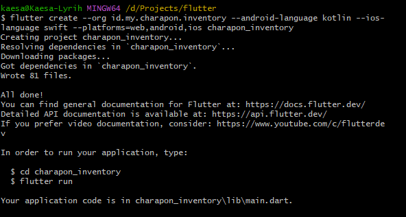

# FVM (Flutter Version Manager)

[`FVM (Flutter Version Manager)`](https://fvm.app/documentation/getting-started/installation) adalah alat untuk mengelola banyak versi Flutter di satu perangkat, mirip seperti `nvm` pada NodeJS atau `herd` pada PHP.

Menggunakan FVM lebih fleksibel dibandingkan Flutter default karena:

* Bisa memilih versi Flutter berbeda per project.
* Menghindari konflik antar project.
* Lebih mudah sync versi SDK sesuai tim.

---

## 1. Instalasi FVM di Windows

Pastikan [Chocolatey](https://chocolatey.org/install) sudah terpasang di Windows.

* Install Chocolatey lewat PowerShell (Run as Administrator):

```powershell
Set-ExecutionPolicy Bypass -Scope Process -Force; [System.Net.ServicePointManager]::SecurityProtocol = [System.Net.ServicePointManager]::SecurityProtocol -bor 3072; iex ((New-Object System.Net.WebClient).DownloadString('https://community.chocolatey.org/install.ps1'))
```

* Install FVM:

```powershell
choco install fvm
```

* Cek apakah FVM berhasil terpasang:

```powershell
fvm --version
```

---

## 2. Install Flutter via FVM

Untuk menginstall versi Flutter tertentu (misalnya `stable`):

```powershell
fvm install stable --setup
```

> ⚠️ **Gunakan `--setup`** supaya Dart juga otomatis disiapkan, sehingga bisa langsung dipakai untuk tools seperti `mason` dan `flast`.

Atau spesifik versi:

```powershell
fvm install 3.32.5 --setup
```

Set versi global (biar bisa dipakai di terminal tanpa prefix `fvm`):

```powershell
fvm global 3.32.5
```

Cek daftar versi yang sudah diinstall:

```powershell
fvm list
```

---

## 3. Menggunakan FVM di Project Flutter

Masuk ke project Flutter lalu jalankan:

```powershell
fvm use stable
```

atau

```powershell
fvm use 3.32.5
```

Ini akan membuat:

```
.fvm/             # Symlink SDK Flutter untuk project
  - flutter_sdk/  
.fvmrc            # Konfigurasi versi Flutter untuk project
```

> Tambahkan `.fvm/` ke `.gitignore`. Yang penting hanya `.fvmrc`, karena itu yang menyimpan versi SDK.

```gitignore
.fvm/
```

### FVM Global

Ini digunakan supaya anda bisa menggunakan perintah `fvm flutter`.
```bash
fvm global stable
```

```bash
fvm global 3.32.5
```

Nah untuk mengecek bisa atau sesuai versi flutter, jalankan perintah berikut:
```bash
fvm doctor
```

Ini mengecek versi flutter:
```bash
fvm flutter doctor
```

---

## 4. Catatan Khusus Windows

* Aktifkan **Developer Mode**:
  `Setting > Update & Security > For Developer > Developer Mode > On`

* Untuk tools Dart Console (`mason`, `flast`), sebaiknya tambahkan salah satu path FVM global ke environment PATH:

  ```
  C:\Users\<username>\fvm\versions\<versi>\bin
  ```

  Dengan begitu cukup:

  ```powershell
  dart pub global activate mason_cli
  mason --version
  ```

  tanpa perlu:
```powershell
fvm dart pub global run mason_cli:mason
```

* Jika `mason` atau `flast` tidak bisa dipanggil di Git Bash, gunakan **PowerShell**.

Begitu juga dengan `flast`
```bash
dart pub global activate flast
flast create
```
Karena `flast` tidak bisa pakai `fvm dart pub global run flast:flast` `create`.

---

## 5. Integrasi VS Code dengan FVM

Di `settings.json` workspace, tambahkan:

```json
{
  "dart.flutterSdkPath": ".fvm/flutter_sdk",
  "dart.flutterSdkPaths": ["C:/Users/<username>/fvm/versions"],

  // Exclude fvm from search & watcher
  "search.exclude": {
    "**/.fvm": true
  },
  "files.watcherExclude": {
    "**/.fvm": true
  }
}
```

---

## 6. Perbandingan Perintah Flutter Default vs FVM

| Aksi             | Flutter Default      | Dengan FVM Global        |
| ---------------- | -------------------- | ------------------------ |
| Cek doctor       | `flutter doctor`     | `fvm flutter doctor`     |
| Buat project     | `flutter create ...` | `fvm flutter create ...` |
| Jalankan project | `flutter run`        | `fvm flutter run`        |
| Build APK        | `flutter build apk`  | `fvm flutter build apk`  |
| Clean Package    | `flutter clean`      | `fvm flutter clean`      |

Jika sudah set **VS Code** pakai `.fvm/flutter_sdk`, cukup jalankan perintah `flutter ...` biasa.

Untuk Flutter biasa kita perlu upgrade dengan perintah:
```bash
flutter upgrade --force # upgrade paksa
```

---

## 7. Tips Alias (Biar Singkat)

Tambahkan di `.bashrc` atau `.zshrc`:

```bash
alias f="fvm flutter"
alias fmason="fvm dart pub global run mason_cli:mason"
alias brb='dart run build_runner build --delete-conflicting-outputs'
alias brw='dart run build_runner watch --delete-conflicting-outputs'
```

---
## Create Project

Membuat proyek flutter dimana saya tidak ingin menggunakan folder `com.example` > `id.my.charapon.inventory`, bahasa pemprograman android menggunakan `kotlin`, bahasa pemprograman ios menggunakan `swift` dan flutter dapat di compile ke platform `web`, `android`, dan `ios`, saya beri nama `charapon_inventory`.


- Dengan Flutter Biasa
```bash
flutter create --org id.my.charapon.inventory --android-language kotlin --ios-language swift --platforms=web,android,ios charapon_inventory
```

- Dengan FVM Global `fvm global stable`
```bash
fvm flutter create --org id.my.charapon.inventory --android-language kotlin --ios-language swift --platforms=web,android,ios charapon_inventory
```

- Buka di Visual Studio Code
```bash
cd charapon_inventory # Pindah ke directory project flutter
code . # Buka di Visual Studio Code diroctory sekarang
```

atau

```bash
code charapon_inventory # Buka di Visual Studio Code diroctory project flutter charapon_inventory
```

Jalankan project dengan perintah:

- Dengan Flutter Biasa atau FVM (Flutter Version Manager) yakin VS Code anda sudah di setting dengan benar `fvm use` maka anda bisa menjalankan perintah

```bash
flutter run
```

- Dengan FVM Global `fvm global stable`

```bash
fvm flutter run
```

---
## Build Project

```bash
flutter build apk
```

Biar aman jangan lupa di `obfuscate` kodenya, agar sulit di `reverse engineering`.

```bash
flutter build apk --obfuscate --split-debug-info=build/app/outputs/symbols
```

Dengan FVM Global `fvm global stable`
```bash
fvm flutter build apk
```

```bash
fvm flutter build apk --obfuscate --split-debug-info=build/app/outputs/symbols
```

