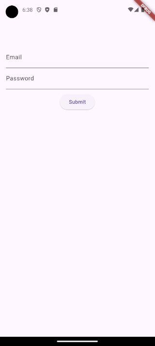

# Flutter Form

Untuk mendapatkan data user pada flutter, Anda dapat menggunakan widget `Form`. Meskipun widget `Form` sangat fleksibel, yang memiliki dukungan utama seperti `TextField`. Untungnya, terdapat package yang memberikan banyak tipe `fields`, yang mempermudah dalam membuat **forms** di flutter.

## Membuat Normal Form di Flutter

Jika Anda ingin membuat formulir sederhana di Flutter yang hanya memerlukan `TextField`, Anda dapat dengan mudah menggunakan widget `Form` Flutter bersama dengan widget `TextFormField`.

Berikut contoh simpelnya:

```dart
import 'package:flutter/material.dart';

void main() => runApp(const MyApp());

class MyApp extends StatelessWidget {
  const MyApp({super.key});

  @override
  Widget build(BuildContext context) {
    final GlobalKey<FormState> formKey = GlobalKey();
    final emailController = TextEditingController();
    final passwordController = TextEditingController();

    return MaterialApp(
      home: Scaffold(
        appBar: AppBar(),
        body: Padding(
          padding: const EdgeInsets.all(16.0),
          child: Form(
            key: formKey,
            child: Column(
              children: [
                TextFormField(
                  controller: emailController,
                  decoration: const InputDecoration(
                    label: Text('Email'),
                  ),
                ),
                TextFormField(
                  controller: passwordController,
                  decoration: const InputDecoration(
                    label: Text('Password'),
                  ),
                  obscureText: true,
                ),
                const SizedBox(height: 10),
                ElevatedButton(
                  onPressed: () => print([
                    emailController.text,
                    passwordController.text,
                  ]),
                  child: const Text('Submit'),
                )
              ],
            ),
          ),
        ),
      ),
    );
  }
}
```

Dalam contoh di atas, kita memiliki widget `MyApp` yang menampilkan widget `Scaffold`. Di dalam widget `Scaffold`, kita mengembalikan sebuah widget `Form`. Widget `Form` memiliki atribut `child` yang dapat digunakan untuk menambahkan field form. Karena kita ingin memiliki beberapa field dan sebuah tombol, kita menggunakan widget `Column`, karena widget `Column` memungkinkan kita menambahkan beberapa widget.

Pada atribut `children` dari widget `Column`, kita menampilkan beberapa widget `TextFormField`. Ini adalah widget field teks form bawaan Flutter. Widget `TextFormField` memiliki atribut `controller` yang digunakan untuk menyimpan data input. Terakhir, kita memiliki widget `ElevatedButton` yang akan mencetak data input ke terminal.



## Membuat Forms dengan baik

Seperti yang disebutkan sebelumnya, jika kita ingin membangun form yang lebih dari sekadar field teks, kita bisa menggunakan sebuah package. Package yang akan kita gunakan bernama **Flutter Form Builder**. Package ini mencakup dua belas jenis field input yang berbeda dan membuat proses validasi input pengguna menjadi jauh lebih sederhana.

### Menginstal Flutter Form Builder
Untuk membangun form yang lebih baik, kita perlu menginstal dua package berikut: **Flutter Form Builder** dan **Form Builder Validators**. Package kedua hanya diperlukan untuk validasi. Kita dapat menginstal kedua package ini dengan menjalankan perintah berikut di dalam proyek kita:

```bash
flutter pub add flutter_form_builder form_builder_validators
```

Setelah perintah dijalankan, pastikan untuk memeriksa file `pubspec.yaml` Anda untuk memastikan dependensi telah ditambahkan. Anda akan melihat package **Flutter Form Builder** dan **Form Builder Validators** tercantum di bagian `dependencies`, seperti ini:

```yaml
dependencies:
  flutter_form_builder: ^9.3.0
  form_builder_validators: ^10.0.1
```

### Create a Form in Flutter Using the Package

Setelah menginstal paket, kita dapat mulai dengan membuat formulir menggunakan kelas `FormBuilder`.

```dart
import 'package:flutter/material.dart';
import 'package:flutter_form_builder/flutter_form_builder.dart';

void main() => runApp(MyApp());

class MyApp extends StatelessWidget {
  MyApp({super.key});

  final GlobalKey<FormBuilderState> _formKey = GlobalKey<FormBuilderState>();

  @override
  Widget build(BuildContext context) {
    return MaterialApp(
      home: Scaffold(
        appBar: AppBar(),
        body: Padding(
          padding: const EdgeInsets.all(16.0),
          child: FormBuilder(
            key: _formKey,
            child: Column(
              children: [
                FormBuilderTextField(
                  name: 'email',
                  decoration: const InputDecoration(labelText: 'Email'),
                ),
                const SizedBox(height: 10),
                FormBuilderDropdown(
                  name: 'gender',
                  decoration: const InputDecoration(labelText: 'Gender'),
                  items: ['Male', 'Female', 'Other']
                      .map(
                        (gender) => DropdownMenuItem(
                          value: gender,
                          child: Text(gender),
                        ),
                      )
                      .toList(),
                ),
                const SizedBox(height: 10),
                FormBuilderDateTimePicker(
                  name: 'birthdate',
                  decoration: const InputDecoration(labelText: 'Birthdate'),
                  inputType: InputType.date,
                  initialDate: DateTime.now(),
                  initialValue: DateTime.now(),
                  firstDate: DateTime(1900),
                  lastDate: DateTime.now(),
                ),
                const SizedBox(height: 10),
                ElevatedButton(
                  onPressed: () {
                    if (_formKey.currentState!.saveAndValidate()) {
                      print(_formKey.currentState!.value.entries.toList());
                    }
                  },
                  child: const Text('Submit'),
                ),
              ],
            ),
          ),
        ),
      ),
    );
  }
}
```
