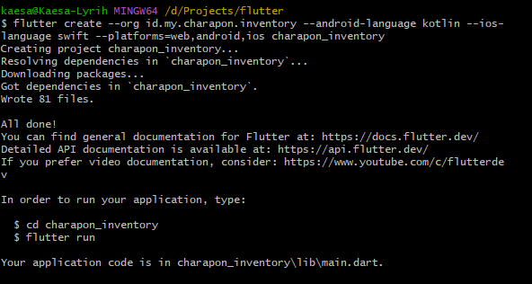

# Flutter

Artikel ini dibuat oleh Kaesa Lyrih dalam mengerjakan project, yang berisikan masalah, tips, dan trik, dan beberapa saran praktik terbaik (best practice) yang ditemukan. Anda dapat mengikutinya atau membacanya sebagai hiburan.

> Jika Anda tidak paham maksudnya, ingin bertanya, atau mungkin tanya masalah, issue, bug, dsb.
> Silahkan gabung di discord dan but post pada forum channel flutter.

---

Gunakanlah [`fvm (Flutter Version Manager)`](https://fvm.app/documentation/getting-started/installation) supaya mudah dalam berganti-ganti versi flutter. Ini mirip dengan `NodeJS`, bagi saya lebih baik menggunakan `nvm (Node Version Manager)` untuk mengelola versi `NodeJS` pada perangkat kerja (PC Desktop/Laptop) saya.

Karena saya menggunakan windows jadi saya menggunakan perintah ini (perlu [install chocolaty](https://chocolatey.org/install)):

- Install chocolaty di Windows dengan Powershell
```powershell
Set-ExecutionPolicy Bypass -Scope Process -Force; [System.Net.ServicePointManager]::SecurityProtocol = [System.Net.ServicePointManager]::SecurityProtocol -bor 3072; iex ((New-Object System.Net.WebClient).DownloadString('https://community.chocolatey.org/install.ps1'))
```

- Install `fvm (flutter version manager)` dengan chocolaty:
```powershell
choco install fvm
```


- Check apakah `fvm` sudah terpasang dengan baik:
```bash
fvm --version
```

- Pergi ke project flutter yang Anda miliki, lalu ketik perintah:
```bash
fvm use stable
```
- atau spesifik versi flutter
```bash
fvm use 3.24.0
```

> 📔 Catatan, pada kondisi tertentu Anda perlu mengaktifkan `Developer Mode` pada Windows Anda.
> `Setting > Update & Security > For Developer > Developer Mode > On`

Perintah di atas akan membuat berapa folder dan file configuration:
```txt
# Ini folder berisi symlink (symbolik link) flutter sdk dll.
.fvm/
  - fvm_config.json
# Ini adalah file konfigurasi project Anda menggunakan flutter versi tertentu
.fvrc
```

Oh yaa jangan lupa tambahkan `.fvm/` pada `.gitignore`. Karena tidak dibutuhkan oleh perangkat programmer lain, karena pasti beda path `symlink`. Yang penting itu adalah file `.fvrc` ini berisi informasi versi`SDK Flutter` apa yang digunakan dalam project tersebut.
```gitignore
.fvm/
```

Nah untuk mengecek bisa atau sesuai versi flutter, jalankan perintah berikut:
```bash
fvm doctor
```

Ini mengecek versi flutter:
```bash
fvm flutter doctor
```

## Pengaturan VSCode menggunakan FVM

Pada `setting.json` pada `workspace` tambahkan hal berikut:
```json
  "dart.flutterSdkPath": ".fvm/flutter_sdk",
  "dart.flutterSdkPaths": ["/Users/kaesa/fvm/versions"],

  // Remove .fvm files from search
  "search.exclude": {
    "**/.fvm": true
  },

  // Remove from file watching
  "files.watcherExclude": {
    "**/.fvm": true
  }
```

---
## Perintah Flutter Default

```bash
flutter doctor -v
```

```bash
flutter clean
```

```bash
flutter upgrade --force # upgrade paksa
```

---
## Membuat Proyek Flutter

```bash
flutter create --org io.github.lyrihkaesa --android-language kotlin --ios-language swift --platforms=web,android,ios kaesa_app
```

---
## Build `apk`

```bash
flutter build apk
```

Biar aman jangan lupa di `obfuscate` kodenya, agar sulit di `reverse engineering`.

```bash
flutter build apk --obfuscate --split-debug-info=build/app/outputs/symbols
```

---
## Build Runner

### `build_runner watch`

Selalu memantau perubahan, jadi tidak perlu menjalankan perintah build ulang.

Before:

```bash
flutter pub run build_runner watch --delete-conflicting-outputs
```

After:

```bash
dart run build_runner watch --delete-conflicting-outputs
```

### `build_runner build`

Hanya sekali melakukan build, tanpa memantau perubahan yang terjadi ada kode, jadi lebih ringan. Tapi perlu menjalankan perintah build untuk mengimplementasikan perubahan.

Before:

```bash
flutter pub run build_runner build --delete-conflicting-outputs
```

After:

```bash
dart run build_runner build --delete-conflicting-outputs
```

---

## Git

### Git Commit

Sebelum commit sebaiknya `fix import` terlebih dahulu sampai 3x. Shortcut: `CTRL + LEFT SHIFT + P` nanti akan form search seperti ini `> ...` lalu cari atau ketik `> fix all imports`.

```bash
(feature) git checkout dev
(dev) git fetch --all
(dev) git pull --all
(dev) checkout profile
(profile) git rebase origin/dev  # solusi selain migrate
resolve conflic via VSCode
(profile) git push -f
```

```bash
git log --oneline --graph
```

```bash
git checkout -b <nama-branch> # ganti branch + membuat branch baru
git checkout <nama-branch> # hanya ganti branch
```

Aturan penulisan branch untuk Kaesa:

- jika fiturnya tidak tergantung dengan perannya (role)
  - feature/app
- jika fiturnya hanya dimiliki oleh user dengan peran (role) sebagai admin
  - feature/admin/list-user
  - feature/admin/edit-waste-price
  - feature/admin/report

---

## Package: Firebase

Firebase membutuhkan `flutter.minSdkVersion = 19`. 
Jadi ubah versinya pada path `C:\Development\flutter\packages\flutter_tools\gradle`, temukan file yang namanya `flutter.gradle`, buka dan ubah kode `flutter.minSdkVersion = 16` menjadi `19`.
Path `C:\Development\flutter` ini adalah path dimana flutter berada, jadi anda bisa mengeceknya lewat `fvm flutter doctor`

```gradle
/** flutter/packages/flutter_tools/gradle/flutter.gradle */
static int minSdkVersion = 16 // Defaultnya
static int minSdkVersion = 20 // Diubah karena BLOC minimal itu 19.

/** flutter\packages\flutter_tools\gradle\src\main\groovy\flutter.groovy*/
/** Sets the minSdkVersion used by default in Flutter app projects. */
static int minSdkVersion = 19 // Default flutter versi 3.13.1
```

---

## Create Flutter Project

Membuat proyek flutter dimana saya tidak ingin menggunakan folder `com.example` > `id.my.charapon.inventory`, bahasa pemprograman android menggunakan `java` > `kotlin`, bahasa pemprograman ios menggunakan `swift` dan flutter dapat di compile ke platform `web`, `android`, dan `ios`, saya beri nama `charapon_inventory`:

```bash
flutter create --org id.my.charapon.inventory --android-language kotlin --ios-language swift --platforms=web,android,ios charapon_inventory
```



Pindah ke directory app flutter:

```bash
cd charapon_inventory
```

Buka di Visual Studio Code:

```bash
code .
```

Jalankan project dengan perintah:

- Jika menggunakan flutter default:

```bash
flutter run
```

- Jika menggunakan FVM (Flutter Version Manager) atau Anda yakin VS Code anda sudah di setting dengan benar maka anda bisa menjalankan perintah `flutter run` seperti biasa.

```bash
fvm flutter run
```

```bash
fvm flutter create --org io.github.lyrihkaesa.flutterstarterkit --android-language kotlin --ios-language swift --platforms=web,android,ios flutter_starter_kit
```
