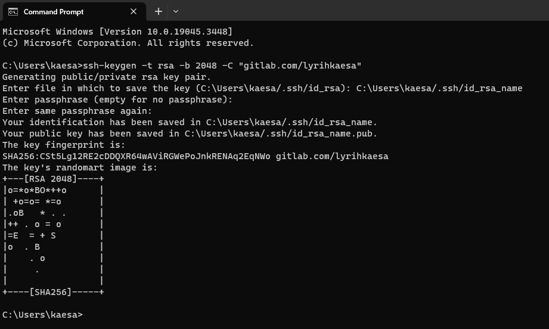
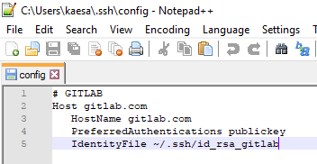

# Initial Project

Menggunakan tech stack:

- Laravel Framework `v9.52.15`
- Minimum PHP `v8.1.0`
- GitLab

---

## Memasang SSH untuk GitLab for Windows 10

Buka `Command Promp (CMD)` lalu ketik perintah berikut:

```cmd
ssh-keygen -t rsa -b 2048 -C "gitlab.com/lyrihkaesa"
```

- gitlab.com/lyrihkaesa adalah `<comment>`



Setelah itu ada tulisan:

> **Enter file in which to save the key (C:\\Users\\kaesa/.ssh/id_rsa): ....**

Silakan ketik ulang lalu ubah `id_rsa` menjadi `id_rsa_name` kalau GitLab bisa seperti ini `id_rsa_gitlab`.

> **Enter passphrase (empty for no passphrase):**  
> **Enter same passphrase again:**

Sementara abaikan saja `passpharse`

Sekarang pada folder `.ssh` yang ada pada path `C:\Users\kaesa/.ssh` terdapat dua file baru yaitu:

- `id_rsa_name`
- `id_rsa_name.pub`

atau Jika tadi Anda menamainya menjadi `gitlab`, akan menjadi:

- `id_rsa_gitlab`
- `id_rsa_gitlab.pub`

Selanjutnya buka file `id_rsa_gitlab.pub` Open with `Notepad` atau `Notepad++` atau text editor lainnya. Copy isinya lalu paste ke ....

Buka dulu [GitLab Profile Keys](https://gitlab.com/-/profile/keys) lalu klik tombol `Add new key`, lalu masukan isi file `id_rsa_gitlab.pub` ke dalam text field `Key` setelah itu klik tombol `Add key`.

Setelah itu buat file namanya `config` tanpa extension file apa pun. Pada folder `.ssh` dengan path `C:\Users\kaesa/.ssh`



Lalu masukan pengaturan berikut:

```txt
# GITLAB
Host gitlab.com
   HostName gitlab.com
   PreferredAuthentications publickey
   IdentityFile ~/.ssh/id_rsa_gitlab
```

lalu silakan tulis perintah berikut untuk mengecek apakah sudah terhubung dengan GitLab:
``

```bash
ssh -T git@gitlab.com
```

jika sudah muncul `Welcome to GitLab` berarti ssh sukses dikonfigurasi:


Setelah itu saya bisa clone repository:

```bash
git clone git@gitlab.com:username/repository-name.git
```

Catatan:
Jika gagal kemungkinan pada file `known_hosts` tidak ada nilai berikut:

```txt
gitlab.com ssh-ed25519 AAAAC3NzaC1lZDI1NTE5AAAAIAfuCHKVTjquxvt6CM6tdG4SLp1Btn/nOeHHE5UOzRdf
gitlab.com ssh-rsa AAAAB3NzaC1yc2EAAAADAQABAAABAQCsj2bNKTBSpIYDEGk9KxsGh3mySTRgMtXL583qmBpzeQ+jqCMRgBqB98u3z++J1sKlXHWfM9dyhSevkMwSbhoR8XIq/U0tCNyokEi/ueaBMCvbcTHhO7FcwzY92WK4Yt0aGROY5qX2UKSeOvuP4D6TPqKF1onrSzH9bx9XUf2lEdWT/ia1NEKjunUqu1xOB/StKDHMoX4/OKyIzuS0q/T1zOATthvasJFoPrAjkohTyaDUz2LN5JoH839hViyEG82yB+MjcFV5MU3N1l1QL3cVUCh93xSaua1N85qivl+siMkPGbO5xR/En4iEY6K2XPASUEMaieWVNTRCtJ4S8H+9
gitlab.com ecdsa-sha2-nistp256 AAAAE2VjZHNhLXNoYTItbmlzdHAyNTYAAAAIbmlzdHAyNTYAAABBBFSMqzJeV9rUzU4kWitGjeR4PWSa29SPqJ1fVkhtj3Hw9xjLVXVYrU9QlYWrOLXBpQ6KWjbjTDTdDkoohFzgbEY=
```

---

## Setup Local Laravel Project

Setelah clone tidak lupa untuk mengatur `.env` dari salinan `.env.example`.

```env
APP_NAME=Laravel
APP_ENV=local
APP_KEY=<genrate key>
APP_DEBUG=true
APP_URL=http://localhost

LOG_CHANNEL=stack
LOG_DEPRECATIONS_CHANNEL=null
LOG_LEVEL=debug

DB_CONNECTION=mysql
DB_HOST=127.0.0.1
DB_PORT=3306
DB_DATABASE=socha_lms_app
DB_USERNAME=root
DB_PASSWORD=
```

- `<genrate key>` jangan lupa generate key untuk laravelnya.
- dan mengatur database `DB_DATABASE`

Setelah database sudah di konfigurasi selanjutnya jalankan perintah:

```bash
php artisan install
```

```bash
php artisan migrate --seed
```

jika lupa `--seed` jalankan perintah:

```bash
php artisan db:seed
```

untuk menjalankan servernya tidak lupa dengan perintah

```bash
php artisan serve
```
