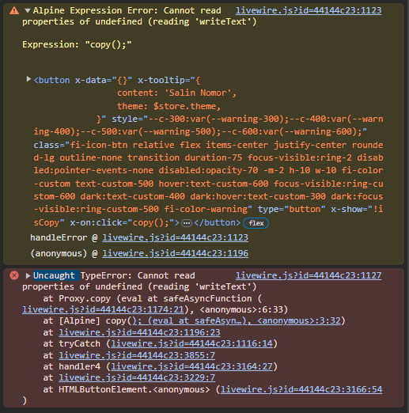

# Alpine JS

## Cannot read properties of undefined (reading `writeText`)

```txt
Alpine Expression Error: Cannot read properties of undefined (reading 'writeText')

Expression: "copy();"

----
Uncaught TypeError: Cannot read properties of undefined (reading 'writeText')
    at Proxy.copy (eval at safeAsyncFunction (livewire.js?id=44144c23:1174:21), <anonymous>:6:33)
    at [Alpine] copy(); (eval at safeAsyncFunction (http://pondokmbodo.test/livewire/livewire.js?id=44144c23:1174:21), <anonymous>:3:32)
    at livewire.js?id=44144c23:1196:23
    at tryCatch (livewire.js?id=44144c23:1116:14)
    at livewire.js?id=44144c23:3855:7
    at handler4 (livewire.js?id=44144c23:3164:27)
    at livewire.js?id=44144c23:3229:7
    at HTMLButtonElement.<anonymous> (livewire.js?id=44144c23:3166:54)
```


