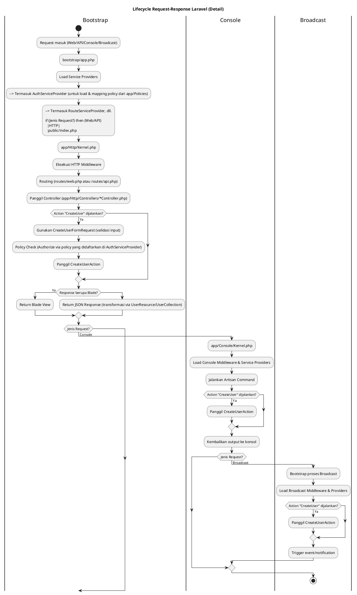

# Flow Laravel (Request Lifecycle)

`public/index.php` > `bootstrap\app.php` > `app/Console/Kernel.php` or `app/Http/Kernel.php` > (Service Provider) `app/Providers/*.php`, `app/Providers/RouteServiceProvider.php` > `Middlewire` > `routes/web.php` > `app/Http/Controllers/*Controller.php` > `View`

## Dependency Injection

`__constructor`
### Service Container

```php
$foo = $this->app->make(Foo::class); // Always New like `new Foo();`
```

```php
// Not Singletone
$this->app->bind(Person::class, function ($app){
	return new Person('Kaesa', 'Lyrih');
})

$person1 = $person->app->make(Person::class); // closure() // new Person('Kaesa', 'Lyrih');
$person2 = $person->app->make(Person::class); // closure() // new Person('Kaesa', 'Lyrih');

self::assertNotSame($person1, $person2); // success
self::assertSame($person1, $person2); // failed
```

```php
// Singletone
$this->app->singletone(Person::class, function ($app){
	return new Person('Kaesa', 'Lyrih');
})

$person1 = $person->app->make(Person::class); // new Person('Kaesa', 'Lyrih'); if not exists
$person2 = $person->app->make(Person::class); // return existing

self::assertNotSame($person1, $person2); // failed
self::assertSame($person1, $person2); // success
```

```php
// Singletone with Instance
$person = new Person('Kaesa', 'Lyrih');
$this->app->instance(Person::class, $person);

$person1 = $person->app->make(Person::class); // $person
$person2 = $person->app->make(Person::class); // $person

self::assertNotSame($person1, $person2); // failed
self::assertSame($person1, $person2); // success
```

```php
// Binding Interface to Class
$this->app->bind(HelloService::class, function ($app){
	return new HelloServiceImpl();
}); // Not Singletone with Closure

$this->app->singletone(HelloService::class, function ($app){
	return new HelloServiceImpl();
}); // Singletone with Closure

$this->app->singletone(HelloService::class, HelloServiceImpl::class); // Singletone with Class


$helloService = $this->app->make(HelloService::class);
```


### Service Provider

Fitur laravel sebagai penyedia service atau dependency. Di dalam `Service Provider` terdapat `Service Container`
Lokasi: `app\Providers`.

```bash
php artisan make:provider NamaServiceProvider # harus akhiri Provider
```

```php
class FooBarServiceProvider extends ServiceProvider
{
	// Default tidak ada, Binding singletone with property
	public array $singletons = [
		HelloService::class => HelloServiceImpl::class,
	];
		
	// Dijalankan dulu, setelah itu menjalankan boot();
	public function register(): void
	{
		$this->app->singleton(Foo::class, function () {
			return new Foo();
		});
		
		$this->app->singleton(Bar::class, function ($app) {
			return new Bar($app->make(Foo:class));
		});
	}
	
	public function boot(): void
	{
		// Kode
	}
}
```

Secara default `ServiceProvider` tidak otomatis di load oleh Laravel. Untuk memberitahu Laravel jika kita ingin menambahkan `ServiceProvider`, kita perlu menambahkan pada `config/app.php` pada key `providers` yang berisi class-classs `ServiceProvider` yang akan dijalankan oleh Laravel.

```php

return [
	// kode disembunyikan
	 'providers' => ServiceProvider::defaultProviders()->merge([
        /*
         * Package Service Providers...
         */

        /*
         * Application Service Providers...
         */
        App\Providers\AppServiceProvider::class,
        App\Providers\AuthServiceProvider::class,
        // App\Providers\BroadcastServiceProvider::class,
        App\Providers\EventServiceProvider::class,
        App\Providers\Filament\AdminPanelProvider::class,
        App\Providers\RouteServiceProvider::class,
        App\Providers\FooBarServiceProvider::class, // new `ServiceProvider`
    ])->toArray(),
]
```

### Deferred Provider

Membuat `ServiceProvider` menjadi `Deferred/Lazy Load` karena secara default `ServiceProvider` itu `Eager Load`;

Digunakan untuk menandai sebuah `ServiceProvider` agar tidak di load jika tidak dibutuhkan dependency-nya.

```php
implements DeferrableProvider
```

```php
class FooBarServiceProvider extends ServiceProvider implements DeferrableProvider
{
	// Default tidak ada, Binding singletone with property
	public array $singletons = [
		HelloService::class => HelloServiceImpl::class,
	];
		
	// Dijalankan dulu, setelah itu menjalankan boot();
	public function register(): void
	{
		$this->app->singleton(Foo::class, function () {
			return new Foo();
		});
		
		$this->app->singleton(Bar::class, function ($app) {
			return new Bar($app->make(Foo:class));
		});
	}
	
	public function boot(): void
	{
		// Kode
	}
	
	// Method dari implements DeferrableProvider
	public function providers()
	{
		return [
			HelloService::class,
			Foo::class,
			Bar::class,
		];
	}
}
```

```bash
php artisan clear-compiled
```

### Facade

Facade digunakan untuk mengakses `$app` jika tidak bisa mengaksesnya seperti biasanya, dengan `static method`.
## Testing

```bash
php artisan test
```

### Unit Test (Tanpa Fitur Laravel)

`tests\Unit\*Test.php`

```bash
php artisan make:test NamaTest --unit
```

### Integration Test (Dengan Fitur Laravel)

`tests\Feature\*Test.php`

```bash
php artisan make:test NamaTest
```


## Environment `.env` 

Harus interrogation test.

```php
env('key'); // function magic laravel

// or

Env::get('key'); // class
```

## Cache

### Config Cache

```bash
php artisan config:cache
```

`bootstrap\cache\config.php`

```bash
php artisan config:clear
```



