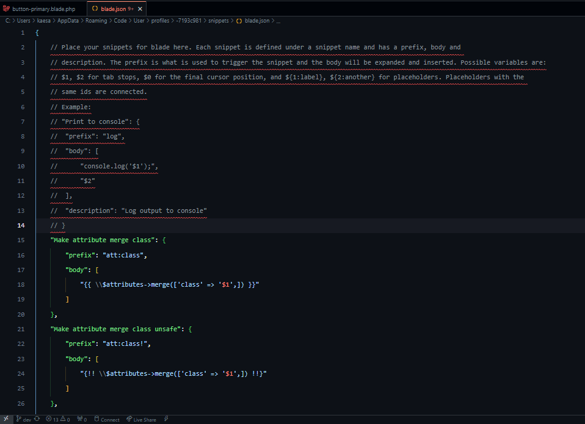

# Laravel Blade Template

## Menggunakan `@section()` and `@yield()`

```php
// resources/views/layouts/app.blade.php

<!DOCTYPE html>
<html>
	<head>
		// <title>@yield('title')</title>
		<title>{{ $title ?? 'Default Title' }}</title> 
	<head>
	<body>
		@yield('content') // identifiernya: 'content'
	</body>
</html>
```

```php
// resources/views/posts/index.blade.php

@extends('layouts.app', [
	'title' => 'Ini Title Laravel App' // masuk ke <title>{{ $title ?? '' }}</title>  pada .../layouts/app.blade.php
]) // didapat dari resources/views/layouts/app.blade.php

@section('title', 'Ini Title Laravel App') // masuk ke <title>@yield('title')</title> pada .../layouts/app.blade.php

@section('content') // masuk ke @yield('content') pada layouts/app.blade.php
	<p>Lorem Ipsu Dolar...</p>
	<p>Lorem Ipsu Dolar...</p>
@endsection
```

## Menggunakan Blade Component

```php
// resources/views/components/layouts/app.blade.php

<!DOCTYPE html>
<html>
	<head>
		// <title>@yield('title')</title>
		<title>{{ $title ?? 'Default Title' }}</title> 
	<head>
	<body>
		{{ $slot }} // sama seperti childern pada reactjs
	</body>
</html>
```

```php
// resources/views/posts/index.blade.php
<x-layouts.app title="Daftar Post"> // opsional @slot('title', 'value')
	@slot('title', 'Daftar Post') // masuk ke <title>{{ $title ?? 'Default Title' }}</title> 
	// Sisanya masuk ke {{ $slot }} pada .../views/components/layouts/app.blade.php
	<p>Lorem Ipsu Dolar...</p>
	<p>Lorem Ipsu Dolar...</p>
</x-layouts.app>
```

### Mengubah `x-layout.app` menjadi `x-app-layout`

Saya ingin mengubah `layout` tidak berada pada folder `.../view/components/layouts` maka perlu membuat `class` untuk mengelola `view` Blade Component. Anda dapat menggunakan `php artisan` untuk membuat component `AppLayout`

```bash
php artisan make:component AppLayout
```

```php
// app\View\Components\AppLayout.php

<?php

namespace App\View\Components;

use Illuminate\View\Component;
use Illuminate\View\View;

// AppLayout nanti akan di convert menjadi <x-app-layout>...</x-app-layout>
// Jika namanya LayoutApp conver `<x-layout-app>...</x-layout-app>`
class AppLayout extends Component
{
	public $title;
	
	public function __construct($title = null)
	{
		$this->title = $title ?? 'Default Title';
	}
	
    /**
     * Get the view / contents that represents the component.
     */
    public function render(): View
    {
	    // return view('components.app-layout'); // Default saat membuat view component menggunakan `php artisan make:component AppLayout`
        return view('layouts.app'); // menuju ke file resources/views/layouts/app.blade.php
    }
}

```


```php
// ❌ resources/views/components/layouts/app.blade.php
// ✅ resources/views/layouts/app.blade.php

<!DOCTYPE html>
<html>
	<head>
		// <title>@yield('title')</title>
		// <title>{{ $title ?? 'Default Title' }}</title> 
		<title>{{ $title }}</title> // Default Value di taruh pada app\View\Components\AppLayout.php
	<head>
	<body>
		{{ $slot }} // sama seperti childern pada reactjs
	</body>
</html>
```

Pemakaian pada `posts/index.blade.php`

```php
// resources/views/posts/index.blade.php
<x-app-layout title="Daftar Post"> // opsional @slot('title', 'value') untuk menggunakan atribute 'title' pastikan ada properti public $title; pada app\View\Components\AppLayout.php
	@slot('title', 'Daftar Post') // masuk ke <title>{{ $title ?? 'Default Title' }}</title> 
	// Sisanya masuk ke {{ $slot }} pada .../views/components/layouts/app.blade.php
	<p>Lorem Ipsu Dolar...</p>
	<p>Lorem Ipsu Dolar...</p>
</x-app-layout>
```


## `@isset($variable)`

`@isset()` digunakan untuk mengecek apakah `$variable` bernilai `null` atau tidak.

```php
// resources/views/layouts/app.blade.php

<!DOCTYPE html>
<html>
	<head>
		<title>{{ $title }}</title>
	<head>
	<body>
		@isset($header) // jika $header tidak `null` maka <div> dibawah akan ditampilkan/dirender
			<div class='header'>
				{{ $header }}
			</div>
		@endisset
		{{ $slot }} // sama seperti childern pada reactjs
	</body>
</html>
```


## `@stack('styles')`, `@stack('scripts')`, `@push('styles')`, dan `@push('scripts')`

- stack = tumpukan
- push = dorong ke tumpukan

```php
// resources/views/layouts/app.blade.php

<!DOCTYPE html>
<html>
	<head>
		<title>{{ $title }}</title>
		@stack('styles')
	<head>
	<body>
		{{ $slot }} // sama seperti childern pada reactjs
		
		@stack('scripts')
	</body>
</html>
```

Pemakaian pada `posts/index.blade.php`

```php
// resources/views/posts/index.blade.php
<x-app-layout title="Daftar Post">
	@push('styles')
		<link rel="stylesheet" href="..."/>
	@endpush
		
	<p>Lorem Ipsu Dolar...</p>
	<p>Lorem Ipsu Dolar...</p>
	
	@push('scripts')
		<script>
			console.log('Ini Daftar Post');
		</script>
	@endpush
</x-app-layout>
```


## Example Blade Component: `button`

- `resource/views/components/button.blade.php`
```php 
<button {{ $attributes
				->merge([
					'class' => 'rounded bg-black px-3 text-sm font-semibold text-white shadow-sm hover:bg-gray-500'
				])
}}>
	{{ $slot }}
</button>
```

- Penggunaan
```php
<x-app-layout>
	<x-button>Submit</x-button>
</x-app-layout>
```

## Snippets Custom for Blade Component

- `xxx\snippets\blade.json`
```json
{
	// ...
	"Make attribute merge class": {
		"prefix": "attr:class",
		"body": [
			"{{ \\$attributes->merge(['class' => '$1',]) }}"
		]
	},
	"Make attribute merge class unsafe": {
		"prefix": "attr:class!",
		"body": [
			"{!! \\$attributes->merge(['class' => '$1',]) !!}"
		]
	},
	"Make variable $slot": {
		"prefix": "slotvar",
		"body": [
			"{{ \\$slot }}"
		]
	}
}
```



## Tailwind Merge Laravel

```bash
composer require gehrisandro/tailwind-merge-laravel
```

### Snippets Custom for Blade Component twMarge

- `xxx\snippets\blade.json`
```json
{
	// ...
	"Make attribute twMerge class": {
		"prefix": "attr:twclass",
		"body": [
			"{{ \\$attributes->twMerge(['class' => '$1',]) }}"
		]
	},
	"Make attribute twMerge class unsafe": {
		"prefix": "attr:twclass!",
		"body": [
			"{!! \\$attributes->twMerge(['class' => '$1',]) !!}"
		]
	},
}
```