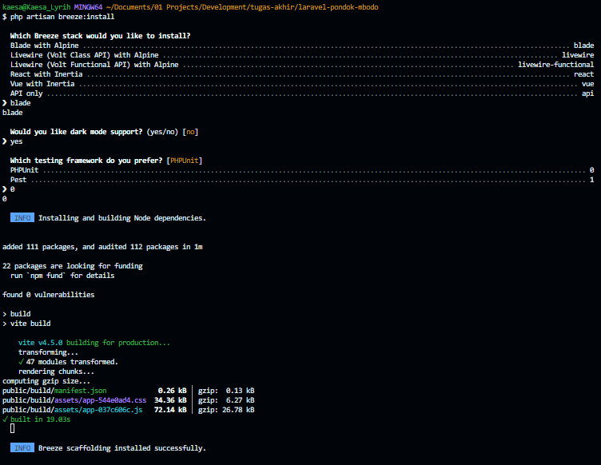

# Breeze

```bash
composer require laravel/breeze --dev
```

```bash
php artisan breeze:install
```



```bash
php artisan migrate:fresh --seed
```

```bash
npm install
```

```bash
npm run dev
```
