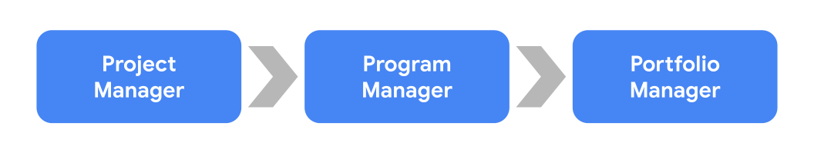

# Menjelajahi peran manajemen proyek (Explore project management roles)

Anda akan memulai jalur Anda untuk mengamankan posisi perminataan tinggi sebagai manajer proyek (project manager). Salah satu manfaat terbesar dari bidang manajemen proyek adalah mencakup berbagai pisisi di banyak industri. Saat Anda menyelesaikan sertifikasi ini, Anda akan memperoleh keterampilan yang akan membuat Anda memenuhi syarat untuk berbagai jabatan. Di sini, kita akan membahas beberapa kategori pekerjaan manajemen proyek yang berbda dan beberapa peran umum dalam kategori tersebut. Kami juga akan menjelaskan potensi besar untuk kemajuan karir dalam manajemen proyek, dari pisisi tingkat awal hingga peran manajemen program senior dan banyak peluang di antaranya!

## Kategori pekerjaan manajemen proyek dan peran umum

### Peran manajemen proyek tingkat-pengantar

Posisi manajemen proyek tingkat pemula (entry-level project management positions) adalah peluang besar untuk memulai dan mempelajari seluk beluk bagaimana perusahaan mengoperasikan dan mengelola proyek. Pelajaran yang Anda pelajari dari pengalaman ini sangat berharga untuk pertumbuhan Anda dalam manajemen proyek. Beberapa posisi manajemen proyek tingkat pemula meliputi:

- `Junior Project Manager`: Melakukan semua aspek dari manajemen proyek bersama dengan profesional yang lebih berpengalaman.
- `Project Administrator`: Membantu tim proyek dalam tugas administratif.
- `Project/Program Assistant`: Mendukung anggota tim yang bekerja pada sebuah proyek dan memberikan dukungan administratif. Mungkin melakukan enelitian atau membuat dokumen pelatihan bersama dengan pekerjaan lain yang ditugaskan oleh `pemimpin program (program leader)`.
- `Project/Program Coordinator`: Terlibat dalam pekerjaan proyek secara langsung dan tugas administratif. Bekerja di bawah seorang `project manager` untuk memastikan proyek selesai tepat waktu dan dalam anggaran yang ditetapkan.
- `Project Support Specialist`: Bekerja bersama seorang `project manager` dan anggota tim untuk mengawasi proyek yang ditugaskan. Mungkin juga bertanggung jawab untuk melatih dan mengembangkan karyawan untuk melakukan tugas yang ditetapkan.

### Peran manajemen proyek tradisional (Traditional project management roles)

Setelah Anda memperoleh beberapa pengalaman dalam posisi tingkat pengantar, Anda dapat menjelajahi peran manajemen proyek tradisional, seperti:

- `Project Manager`: Bertanggung jawab untuk `memulai (initiating)`, `merencanakan (planning)`, `melaksanakan (executing)`, `memantau (monitoring)`, dan `menutup (closing)` proyek. Mencakup gelar khusus industri seperti IT project manager, construction project manager, atau engineering project manager, yang memanfaatkan keterampilan yang dapat ditransfer antar industri.
- `Project Analyst`: Menggerakkan sebuah proyek dengan berbagi informasi, memberikan dukungan melalui analisis data, dan berkontribusi pada strategi dan kinerja.
- `Project Leader/Director`: Mengambil keputusan inti dan menetapkan arah proyek. Biasanya memiliki pengetahuan yang mendalam tentang produk atau deliverable.
- `Project Controller`: Bertanggung jawab utama untuk perencanaan proyek. Anda kemungkinan akan melihat gelar pekerjaan ini di industri seperti engineering dan construction.
- `Technical Project Manager`: Melakukan perencanaan dan manajemen proyek untuk tujuan yang diidentifikasikan di dalam sebuah perusahaan. Memastikan bahwa proyek selesai sesuai dengan persyaratan dalam watku dan anggaran yang ditentukan.
- `Project Management Office (PMO) Analyst`: Mengelola kemajuan proyek yang kompleks untuk memastikan pelaksanaan dan penyelesaian tepat waktu.

### Peran manajemen program dan portofolio (Program and portfolio management roles)

Seperti yang telah Anda pelajari, project managers bertangung jawab atas pengelolaan proyek sehari-hari. Mereka mengembalakan proyek dari awal hingga akhir dan menjadi pemandu bagi tim mereka. Project managers harus menerapkan alat (tools), teknik (techniques), dan menyelesaikan proyek dengan sukses, tepat waktu, dan sesuai anggaran.

Setelah Anda berhasil menyelesaikan proyek-proyek dengan sukses dan merasa siap untuk bertanggung jawab yang lebih besar, posisi `program manager` mungkin menjadi langkah berikutnya bagi Anda. Sementara proyek adalah suatu usaha yang berfokus pada satu hal, **program** adalah kumpulan dari beberapa proyek. Program Manager bertanggung jawab untuk mengelola banyak proyek. Di Google, semua project manager disebut program manager karena mereka mengelola beberapa proyek secara simultan.

Mengimplementasikan program-program dengan sukses sebagai program manager dapat membuat Anda cocok untuk posisi yang lebih senior, seperti senior program manager atau portfolio manager. **Portfolio** adalah kumpulan proyek dan program di seluruh organisasi. Portfolio Manager bertanggung jawab untuk portfolio proyek atau program untuk satu klien. Selama karir Anda, Anda mungkin akan berkembang dari peran project manager ke program manager dan kemudian ke portfolio manager.

Sementara project, program, dan portfolo managers memiliki jenis dan tingkat tanggungjawab yang berbeda, mereka semua dalah project managers. Dalam kursus 4 program sertifikat ini, Anda akan belajar lebih banyak tentang membedakan projects, programs, dan portfolios.

- Program managers: Mengelola sekelompok proyek yang berkaitan atau serupa dan menangani koordinasi proyek-proyek tersebut. Mereka memfasilitasi komunikasi yang efektif antara peoject manager individual dan memberikan dukungan di mana diperlukan. Mereka juga membantu menciptakan dan mengelola tujuan jangka panjang untuk organisasi mereka.

- Portfolio managers: Bertanggung jawab untuk mengelola sekelompok program terkait dalam satu organisasi. Mereka mengkoordinasikan berbagai program untuk memastikan program berjalan sesuai rencana dan bahwa organisasi memenuhi inisiatif strategisnya. Portfolio managers melihat semua proyek dan program di dalam organisasi dan memprioritaskan pekerjaan yang diperlukan.

### Peran manajemen operasional (Operational management roles)

Dalam peran manajemen perasional, Anda akan mendapatkan kesempatan untuk mengalami beberapa departemen yang berbeda dan bagaimana mereka berinteraksi dan beroperasi. Peran manajemen operasional memungkinkan Anda bekerja bersama rekan kerja dan manajemen dari berbagai segmen bisnis, memberi Anda penghargaan untuk apa yang dilakukan setiap segmen setiap hari. Beberapa posisi manajemen operasional meliputi:

- Operations Analyst: Mengelola dan mengkoordinasikan penelitian, menyelidiki alur kerja, menciptakan prosedur bisnis, dan merekomendasikan perubahan untuk meningkatkan proyek dan perusahaan.
- Operations Manager: Mengawasi pengambilan keputusan strategis dan meluncurkan rencana tindakan berdasarkan laporan keuangan, jadwal, dan sumber daya.
- Chief Operating Officer: Bertanggung jawab atas mengawasi fungsi administratif dan operasional sehari-hari bisnis.

Peran gesit (Agile roles)

Kita akan membahas pendekatan Agile project management secara mendalam nanti, tetapi di sini adalah beberapa posisi yang terkait dengan pendekatan tersebut:

- Scrum Master: Mengkoordinasikan dan memandu tim Scrum. Mengetahui Agile framework dan Scrum dan mampu mengajarkan nilai dan prinsip-prinsip Scrum kepada orang lain. Juga dapat terdaftar sebagai Technical Program Manager atau Technical Project Manager.
- Product Owner: Menentukan arah pengembangan dan kemajuan produk.

### Peran manajemen khusus industri (Industry-specific management roles)

Ketika Anda mencari pekerjaan manajemen proyek, Anda mungkin melihat posisi dengan judul seperti "engineering project manager" atau "construction project manager". Ingatlah bahwa keterampilan yang Anda pelajari di satu indsutri dapat diterapkan pada industri lain. Misalnya, Anda mungkin memiliki pengalaman sebagai software engineer tetapi tertarik untuk mengejar karir di bidang project management. Anda akan dapat menerapkan apa yang telah Anda pelajari bekerja di bidang teknis, serta dengan keterampilan yang Anda peroleh dalam kursus sertifikasi ini, ke posisi project manager di berbagai industri. Memiliki pegalaman bekerja dalam tim untuk mencapai tugas dan memahami cara melaksanakan upaya sesuai jadwal dan anggaran adalah aspek dari pengelaman profesional Anda - yang digabungkan dengan pengetahuan manajemen proyek Anda - yang membuat Anda dapat berpindah-pindah antara industri.

## Pengambilan kunci (Key takeaway)

:::info
Project management adalah jalur karir dengan potensi besar!
:::

Setiap langkah jalur karir Anda, Anda sedang membangung diri Anda untuk menjadi kontributor yang signifikan bagi setiap perusahaan. Kami telah membahas sejumlah judul pekerjaan yang mungkin Anda cari saat Anda mulai menjelajahi peran manajemen proyek. Terlepas dari industri di mana Anda saat ini bekerja, Anda telah memperoleh **transferable skills**. Transferable skills adalah kemampuan yang dapat digunakan dalam banyak pekerjaan dan jalur karir yang berbeda. Kemampuan transferable Anda kemungkinan dapat digunakan dalam peran manajemen proyek di banyak industri lain.
