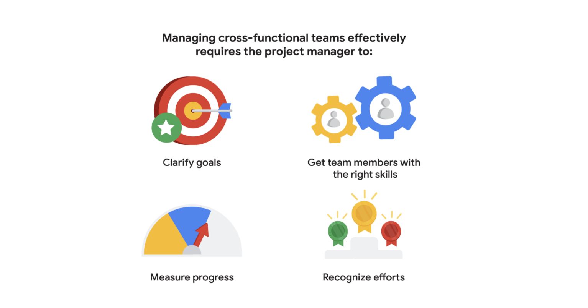

# Bekerja dengan tim lintas fungsi (Working with cross-functional teams)

Sebagai seorang manajer proyek, Anda kemungkinan akan bekerja dengan tim lintas fungsi. Tim lintas fungsi terdiri dari anggota tim yang memiliki latar belakang, jenis keahlian, dan fungsi pekerjaan yang berbeda. Meskipun anggota tim ini memiliki keterampilan yang berbeda, menempati peran yang berbeda, dan bahkan mungkin bekerja di departemen yang berbeda, mereka semua bekerja menuju tujuan bersama: menyelesaikan proyek dengan sukses.

Terkadang anggota tim lintas fungsi disebut "profesional bertipe T. “T-shaped professionals.”" Mereka memiliki keterampilan dalam berkolaborasi dan berinovasi dengan orang-orang dalam fungsi pekerjaan yang berbeda dan di berbagai departemen, tetapi mereka juga memberikan kontribusi dalam bidang keahlian mereka sendiri. Setiap anggota tim lintas fungsi memiliki perspektif dan pengalaman yang unik, membawa ide dan strategi yang berbeda ke dalam proyek.

Mari jelajahi masing-masing ide ini dengan lebih mendetail.

## Memperjelas Tujuan (Clarify goals)
Ketika bekerja dengan tim lintas fungsi, penting untuk memastikan setiap anggota tim memahami peran mereka, bagaimana mereka saling mendukung, dan tujuan bersama proyek. Menetapkan tujuan yang jelas untuk tim dan memastikan bahwa tim memahami tujuan tersebut sangat penting. Berbicara secara langsung dan singkat, hindari rincian dan penjelasan yang tidak perlu. Ketika mengkomunikasikan tujuan tugas atau proyek, pastikan Anda mendefinisikan elemen kunci, seperti anggaran, batas waktu, persyaratan kualitas, atau sumber daya penting. Pastikan anggota tim Anda memahami tujuan tugas dan proyek dengan mendorong mereka untuk bertanya dan mengklarifikasi informasi. Tugas Anda adalah terus memantau kemajuan tim untuk memastikan bahwa mereka semua mencapai tujuan mereka, tetap berada pada jalur yang benar, dan menyelesaikan pekerjaan dengan kualitas yang baik. Tim lintas fungsi mungkin bekerja di departemen yang berbeda, berlokasi di tempat yang berbeda, dan memiliki kepemimpinan yang berbeda, tetapi semua anggota tim bekerja sama dengan manajer proyek untuk mendukung proyek saat ini. Proyek Anda mungkin bersaing dengan prioritas lain, jadi berkomunikasi dengan jelas dan sering dengan tim Anda - dan sebaliknya - membantu Anda mengidentifikasi masalah atau kekhawatiran potensial sebelum timbul.

## Mendapatkan Anggota Tim dengan Keterampilan yang Tepat (Get team members with the right skills)
Memastikan Anda memiliki anggota tim dengan keterampilan yang sesuai untuk setiap fungsi proyek adalah kritis. Jika Anda sedang membangun pesawat dan Anda memiliki lima insinyur tetapi tidak ada mekanik, maka Anda kehilangan elemen kunci dari tim lintas fungsi Anda. Sebagai manajer proyek, Anda harus membantu memastikan bahwa tim Anda memiliki orang yang tepat dengan keterampilan yang diperlukan untuk kesuksesan proyek. Nanti dalam program ini, kami akan membahas beberapa alat yang dapat Anda gunakan untuk membantu mengidentifikasi keterampilan yang diperlukan untuk menyelesaikan tugas proyek Anda.

## Mengukur Kemajuan (Measure progress)
Menunjukkan kepada tim sejauh mana mereka telah mencapai membantu menjaga motivasi mereka. Luangkan waktu untuk mengukur dan mengkomunikasikan kemajuan proyek di seluruh tim lintas fungsi. Hal ini membantu setiap orang melihat gambaran lengkap dan mengenali dampak mereka pada proyek. Anda dapat mengukur kemajuan dengan berbagai cara, termasuk mencapai tonggak penting, menyelesaikan tugas proyek, dan mencapai tujuan proyek tepat waktu dan sesuai anggaran. Secara teratur berkomunikasi dengan anggota tim Anda untuk memeriksa kemajuan mereka. Tanyakan apakah mereka memperkirakan selesai tepat waktu. Jika tidak, tanyakan bagaimana Anda dapat membantu mereka berhasil. Pantau kemajuan tim sepanjang proyek dengan mendokumentasikan kapan tugas dan tujuan diselesaikan, dan beri tahu anggota tim Anda apakah proyek berjalan sesuai rencana atau tidak. Pastikan Anda mengkomunikasikan keberhasilan, penundaan, atau masalah kepada tim sehingga mereka mengetahui perkembangan proyek. Menjaga semua orang terinformasi adalah kunci keberhasilan proyek.

## Mengakui Upaya (Recognize efforts)
Terkadang, ketika bekerja dengan tim lintas fungsi, ada keterampilan tertentu yang lebih diakui daripada yang lain. Seorang mekanik bisa mendapatkan pujian atas solusi yang ditemukan dalam proyek, sementara anggota keuangan yang mencari sumber pendanaan mungkin terlupakan. Sebagai manajer proyek, tugas Anda adalah memastikan setiap anggota tim lintas fungsi Anda mengakui nilai upaya mereka setiap langkahnya. Anda telah memahami pentingnya membangun hubungan dengan pemangku kepentingan, dan membangun hubungan dengan anggota tim lintas fungsi Anda sama pentingnya. Memahami apa yang membuat anggota tim Anda merasa didukung, memberikan dan menerima umpan balik, serta memperhatikan latar belakang, identitas pribadi, dan gaya kerja masing-masing individu dapat membantu meredakan beberapa perbedaan di antara anggota tim.

## Poin Penting (Key takeaway)
Kemampuan untuk berkomunikasi dengan jelas dengan anggota tim, menjelaskan tujuan proyek, mendapatkan anggota tim dengan keterampilan yang tepat, mengukur kemajuan tim, dan mengakui upaya anggota tim adalah bagian penting dari peran Anda sebagai manajer proyek dan kunci keberhasilan proyek Anda.