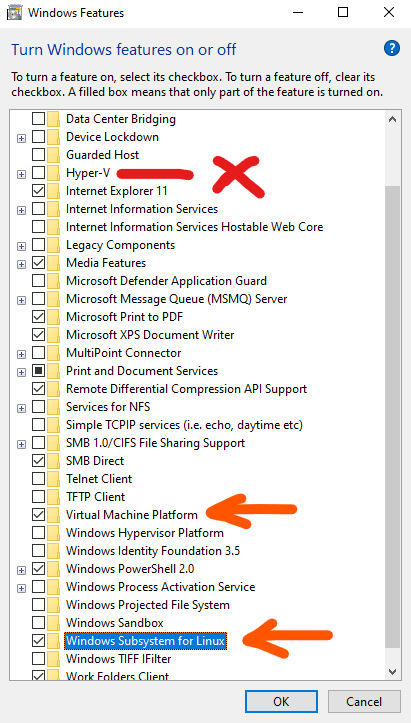

## Cara Instalasi 

- Buka **Turn Windows: feature on or off**




Pada gambar **Windows Feature** di atas Anda aktifkan fitur:
- [-] Virtual Machine Platform
- [-] Windows Subsystem for Linux
- [ ] Hyper-V (Tidak wajib diaktifkan jika menggunakan `WSL2`)

Catatan:
Anda tidak perlu enable manual dua fitur di atas, karena saat menjalankan perintah install tersebut bisa auto install dan enable fitur tersebut:
```bash
wsl --install -d ubuntu
```

```bash
# Installing: Virtual Machine Platform # Jika ada popup instalation, pilih 'Yes'
# [===== 96%      ]
# Installing: Windows Subsystem for Linux # Jika ada popup instalation, pilih 'Yes'
# [===== 96%      ]
# Installing: Ubuntu
# [===== 96%      ]
# Ubuntu has been installed.
# The requsted operation is successfull. Change will not be effective until the system is rebooted.
```

- Selanjutnya membuka `Terminal` > `PowerShell` > `Run as Administator`
- Pada `PowerShell` ketik perintah berikut:
```powershell
wsl --install
```

```powershell
wsl --list --online
```

```powershell
wsl --install -d Ubuntu-22.04 # Untuk install distro Ubuntu 22.04 LTS
```


- Tunggu instalasinya
- Setelah itu Anda akan dimintai untuk mengisi username (saran huruf kecil semua jangan KAPITAL) dan password yang mudah Anda ketik karena WSL ini biasanya Anda pakai sendiri.

```powershell
 wsl --set-default Ubuntu-22.04
```

---
## Rekomendasi Tutorial

- [Youtube Kelas Terbuka](https://www.youtube.com/watch?v=zqw4EsSMMf4)