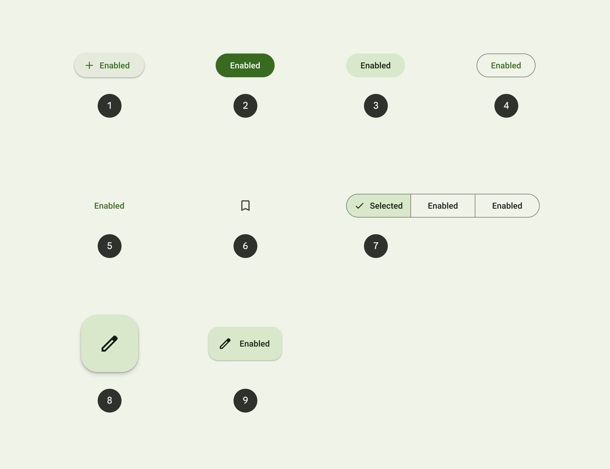
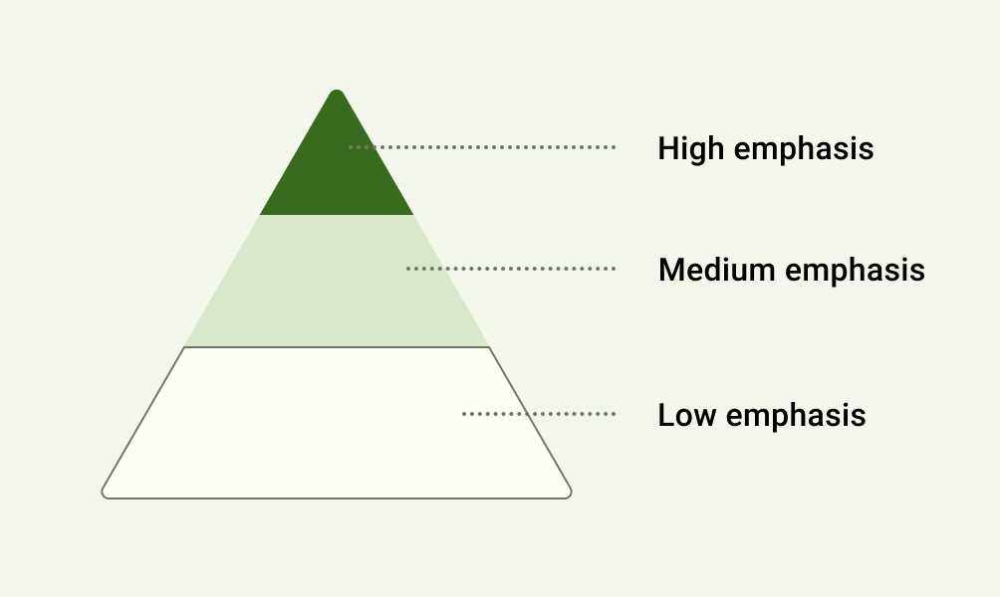
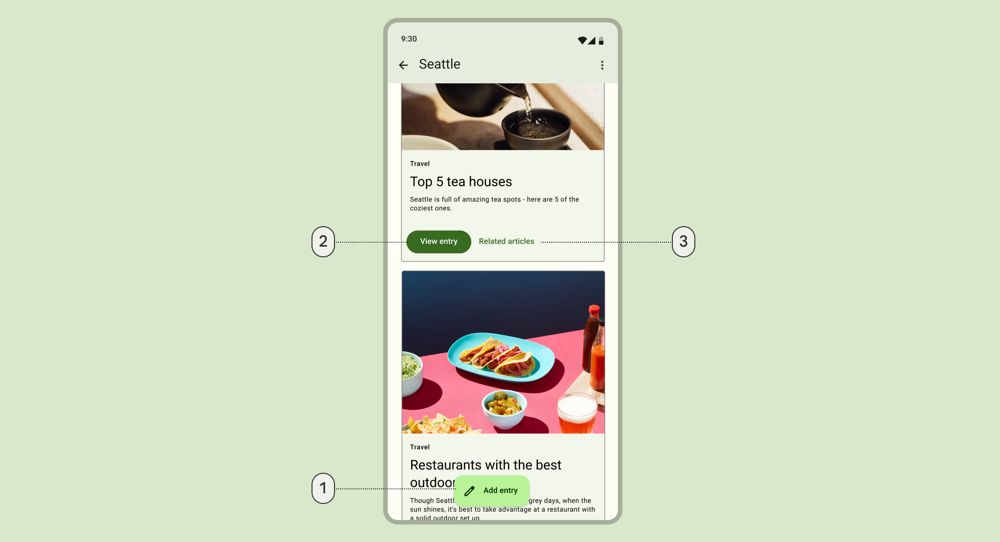
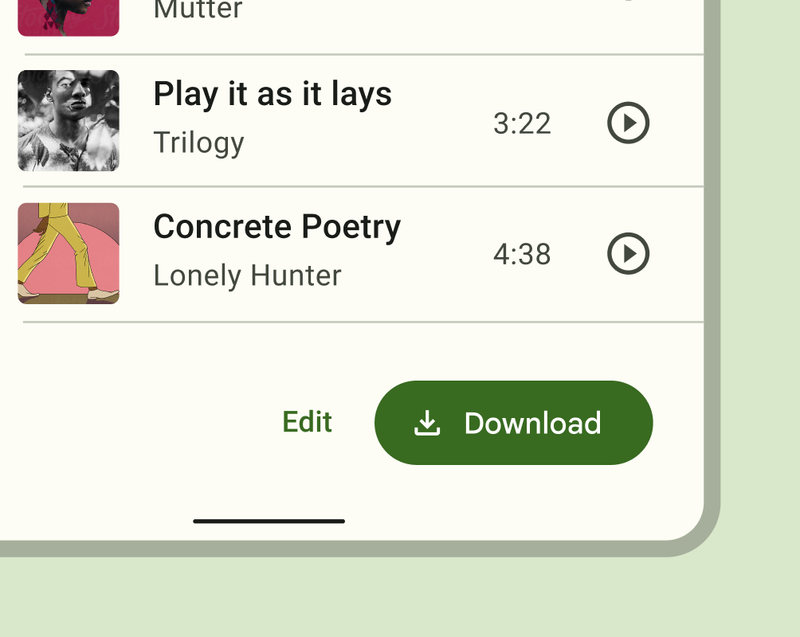
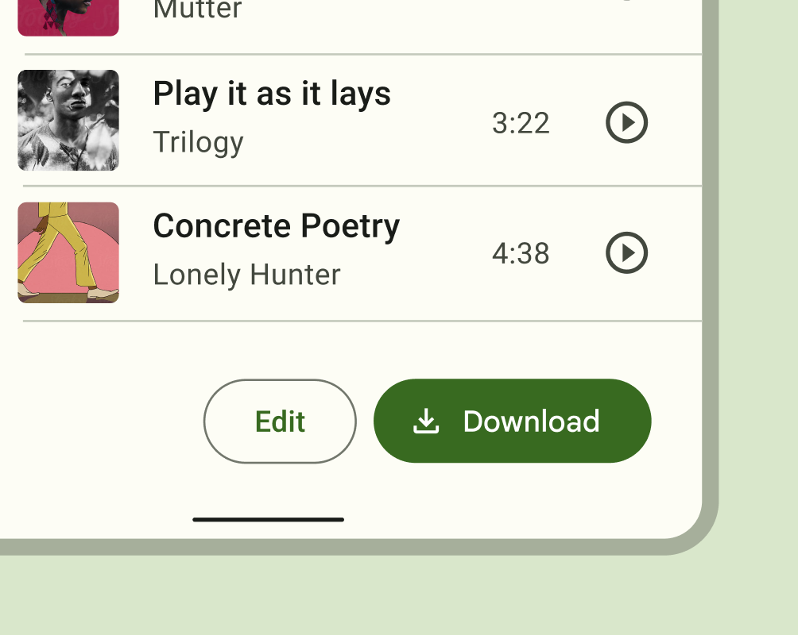
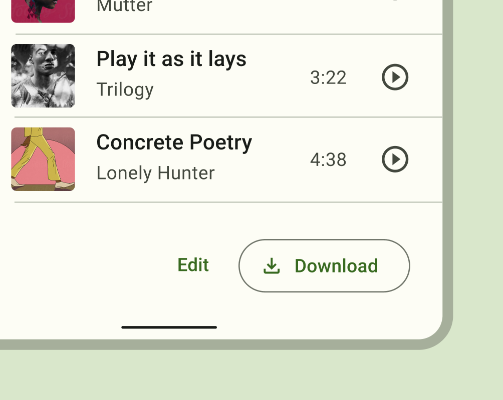
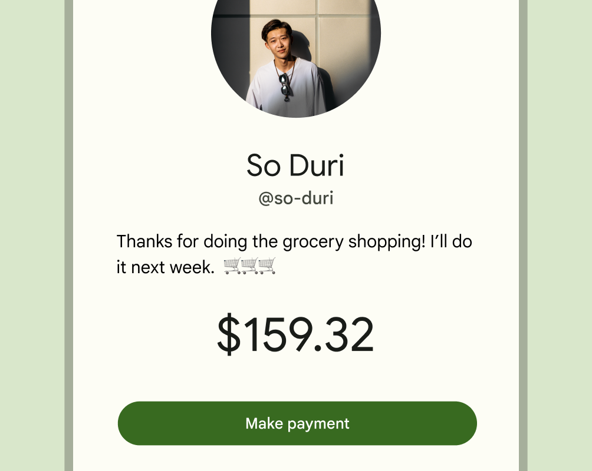
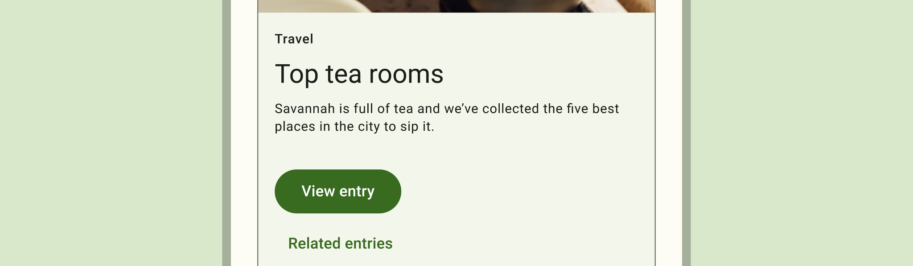

# Flutter Buttons

Tombol (Buttons) memungkinkan orang mengambil tindakan dan membuat pilihan dengan satu ketukan.

- Gunakan jenis tombol berbeda pada layar yang sama untuk mengarahkan perhatian pengguna.
- Sembilan jenis (types): 
	1. elevated (ditinggikan), 
	2. filled (terisi), 
	3. filled tonal (nada terisi), 
	4. outline (diuraikan/border/stroke), 
	5. text, 
	6. icon, 
	7. segmented, 
	8. FAB (Floating Action Button/Tombol Aksi yang Melayang), 
	9. extended FAB (Extended Floating Action Button).
- Setiap tombol (button) memiliki penekanan (emphasis) tinggi, sedang, atau rendah.

## Memilih buttons

Emphasis = penekanan.

| Tingkatan Emphasis                                                                             | Component           | Alasan                                                                                                                                                                                                                                                                                                                         | Contoh Aksi                                                                                                                    |
| ---------------------------------------------------------------------------------------------- | ------------------- | ------------------------------------------------------------------------------------------------------------------------------------------------------------------------------------------------------------------------------------------------------------------------------------------------------------------------------ | ------------------------------------------------------------------------------------------------------------------------------ |
| High emphasis - Untuk tindakan utama, paling penting, atau paling umum di layar                | Extended FAB        | Format dan label text FAB yang diperluas membuatnya lebih menonjol secara visual dibandingkan FAB. Ini sering digunakan pada layar yang lebih besar dimana FAB tampak terlalu kecil.                                                                                                                                           | Create (Membuat), Compose (Menyusun), New thread (Membuat postingan baru), New file (Membuat file baru)                        |
| High emphasis                                                                                  | FAB                 | FAB tetap menjadi *default component* untuk *primary action* pada layar. Muncul dalam tiga ukuran: small FAB, FAB, dan large FAB.                                                                                                                                                                                              | Create, Compose                                                                                                                |
| High emphasis                                                                                  | Filled button       | Warna permukaan tombol terisi yang kontras menjadikan tombol paling menonjol setelah FAB. Ini digunakan untuk tindakan terakhir atau membuka blokir dalam suatu aliran.                                                                                                                                                        | Save (Simpan), Confirm (Memasikan), Done (Selesai)                                                                             |
| Medium emphasis - Untuk tindakan penting yang tidak menggangu elemen lain di layar             | Filled tonal button | Tombol nada terisi memiliki warna latar belakang (background color) dan warna label lebih gelap, membuatnya kurang menonjol secara visual dibandingkan filled button. Mereka masih digunakan untuk tindakan terakhir atau membuka blokir dalam suatu alur, tetapi melakukannya dengan lebih sedikit penekanan (less emphasis). | Save, Confirm, Done                                                                                                            |
| Medium emphasis                                                                                | Elevated button     | Tombol yang ditinggikan pada dasarnya tombol yang diisi dengan warna latar belakang yang lebih terang dan bayangan. Untuk mencegah bayangan merayap, digunakan hanya saat benar-benar diperlukan, misalnya saat tombol memerlukan pemisahan visual dari latar belakang berpola.                                                | Reply (Menjawab), View all (Melihat semua), Add to card (Menambahkan ke keranjang), Take out of trash (Buang ke tempat sampah) |
| Medium emphasis                                                                                | Outlined button     | Gunakan tombol yang diuraikan untuk tindakan yang memerlukan perhatian namun bukan tindakan utama, seperti See all (Lihat semua), atau Add to card (Tambahkan ke keranjang). Ini juga merupakan tombol yang digunakan untuk memberi seseorang kesempatan untuk berubah pikiran atau keluar dari arus.                          | Reply, View all, Add to cart, Take out of trash                                                                                |
| Low emphasis - Untuk tindakan opsional atau tambahan dengan tingkat kepentingan paling sedikit | Text button         | Tombol teks kurang menonjol secara visual, sehingga sebaiknya digunakan tindakan dengan penekanan rendah, seperti opsi alternatif.                                                                                                                                                                                             | Learn more, View all, Change account, Turn on                                                                                  |
| Low emphasis                                                                                   | Segmented button    | Tombol tersegmentasi memiliki tampilan visual yang lebih menonjol dibandingkan icon button.                                                                                                                                                                                                                                                                                                                               | Left align, Middle align, Righ align                                                                                                                               |
| Low emphasis                                                                                   | Icon button                    | Jenis button yang paling ringkas dan halus, icon button digunakan untuk tindakan tambahan opsional seperti "Bookmark" atau "Star".                                                                                                                                                                                                                                                                                                                               | Add to Favorites, Print                                                                                                                               |

## Hirarki (Hierarchy)

**Primary action button**
Setiap layar harus berisi satu tombol yang menonjol untuk tindakan utama (primary action). Tombol dengan penekanan tinggi (high-emphasis) ini paling menarik perhatian. Susunan elemen di layar harus menyampaikan dengan jelas bahwa tombol lain kurang penting.

**Other buttons**
Sebuah produk dapat menampilkan lebih dari satu tombol sekaligus dalam sebuah tata letak (layout). Saat menggunakan beberapa tombol, pastikan status tersedia pada satu tombol tidak menyerupai status nonaktif (disabled) tombol lainnya.

Tingkat penekanan tombol membantu menentukan tampilan (appearance), typography, dan penempatan (placement).

# Penempatan (Placement)

Gunakan kombinasi gaya tombol pada layar yang sama untuk memusatkan perhatian pada tindakan utama, sekaligus menawarkan alternatif.

1. Extended Floating Action Button untuk penekanan tindakan tertinggi (highest-emphasis action)
2. Filled Button untuk penekanan tindakan tinggi (high-emphasis action)
3. Text Button untuk penekanan tindakan rendah (low-emphasis action)

✅ Do
Untuk beberapa tindakan, pilih button dengan (higher-emphasis) untuk tindakan yang lebih penting, seperti field button di samping text button.

✅ Do
Saat menggunakan beberapa tombol, Anda dapat menempatkan outlined button (medium-emphasis) di sebelah filled button (high-emphasis)

✅ Do
Saat menggunakan beberapa tombol, Anda dapat menempatkan text button (low-emphasis) di sebelah outlined button (medium-emphasis)

✅ Do
Gunakan filled button sendiri untuk satu tindakan penting (single important action)

❌ Don't
Hindari menempatkan tombol di bawah tombol lain jika ada ruang untuk menempatkan berdampingan (side-by-side)
## Referensi

- https://m3.material.io/components/all-buttons