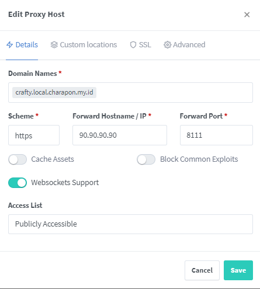
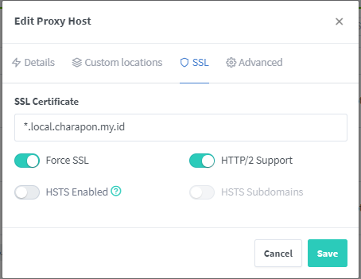

# CasaOS

Your Personal Cloud OS.

- Website: https://casaos.io/

## Pemasangan `CasaOS`

```bash
curl -fsSL https://get.casaos.io | sudo bash
```

- Masuk ke `CasaOs`. `http://your-ip-address:80`, misal: `http://100.100.100.100:80`
- Setelah itu, masukkan `username` dan `password`, `confirm-password`.
- Ubah port dari `80` menjadi `9090`. `http://your-ip-address:9090`, misal: `http://100.100.100.100:9090`

---

## `Nginx Proxy Manager`

> ⚠️ Warning!  
> This is a technical app, please make sure you know what you are doing.  
> Nginx Proxy Manager occupies ports 80 and 443 by default for built-in Nginx use. It occupies port 81 for the admin page.  
> Please change the CasaOS WebUI port to a port other than 80/81/443. And pay attention to whether the ports conflict with other apps. Otherwise, it may cause your CasaOS to run abnormally.

Username Default:

```txt
admin@example.com
```

Password Default:

```txt
changeme
```

| Key         | Value                |
| ----------- | -------------------- |
| Name:       | Kaesa Lyrih          |
| Short Name: | Kaesa                |
| Email:      | kaesalyrih@gmail.com |
| Password:   | rahasia              |

### Membuat `Proxy Host`

- Buat subdomain untuk `CasaOS`
  - **Details**
    - Domain Names: `casa.example.com`
    - Scheme: `http`
    - Forward Hostname / IP: `100.100.100.100` (your-ip-address)
    - Port: `9090` (Port `CasaOS` jika tidak diganti maka default-nya `80`)
  - **Custom locations** (Skip)
  - **SSL**
    - SSL Certificate: `Request a new SSL Certificate`
    - Force SSL: `true`
    - HTTP/2 Support: `true`
    - Email Address for Let's Encrypt: `youremail@gmail.com`
    - I Agree to the Let's Encrypt Terms of Service: `true`
  - **Advanced** (Skip)
- Buat subdomain untuk `Nginx Proxy Manager`
  - **Details**
    - Domain Names: `proxy.example.com`
    - Scheme: `http`
    - Forward Hostname / IP: `100.100.100.100` (your-ip-address)
    - Port: `81` (Sesuaikan dengan yang di docker)
  - **Custom locations** (Skip)
  - **SSL**
    - SSL Certificate: `Request a new SSL Certificate`
    - Force SSL: `true`
    - HTTP/2 Support: `true`
    - Email Address for Let's Encrypt: `youremail@gmail.com`
    - I Agree to the Let's Encrypt Terms of Service: `true`
  - **Advanced** (Skip)

---

## `PostgreSQL`

| Key               | Value    |
| ----------------- | -------- |
| Default user:     | `casaos` |
| Default password: | `casaos` |
| Default database: | `casaos` |
```bash
psql -h 100.100.100.100 -U casaos
```

- Masukan password default `casaos`

```sql
ALTER USER casaos WITH PASSWORD 'new-password';
```

1. Login ke `PostgreSQL Client` bisa menggunakan `pgsql` atau lainnya. Lalu jalankan perintah SQL berikut:

```sql
CREATE USER pondokmbodo WITH PASSWORD 'inipasswordpondokmbodo';

CREATE DATABASE pondokmbodo OWNER pondokmbodo;

CREATE USER kaesa;

GRANT ALL PRIVILEGES ON DATABASE pondokmbodo TO kaesa;
```

## `Nextcloud`

```bash
chown www-data:www-data data/
```

## `Crafty`

Default Account

| Username | Password                       |
| -------- | ------------------------------ |
| `admin`  | `app/config/default-creds.txt` |

Jangan lupa ganti password.

### Setting Proxy Server





### Mengatur Word Minecraft

```bash
cd /DATA/AppData/crafty/servers/uuid-dari-server/
```

```bash
sudo chmod -R 777 world/
```

```bash
sudo chown -R kaesa:root world/
```

### Mengatur Memory Server

```txt title="/DATA/AppData/crafty/servers/uuid-dari-server/user_jvm_args.txt"
# Xmx and Xms set the maximum and minimum RAM usage, respectively.
# They can take any number, followed by an M or a G.
# M means Megabyte, G means Gigabyte.
# For example, to set the maximum to 3GB: -Xmx3G
# To set the minimum to 2.5GB: -Xms2500M

# A good default for a modded server is 4GB.
# Uncomment the next line to set it.
# -Xmx4G

-Xms4G -Xmx6G
```

## MariaDB

| User     | Password | Database | Keterangan                           |
| -------- | -------- | -------- | ------------------------------------ |
| `casaos` | `casaos` | `casaos` |                                      |
| `root`   | `casaos` |          | Ini bisa digunakan `CREATE DATABASE` |
