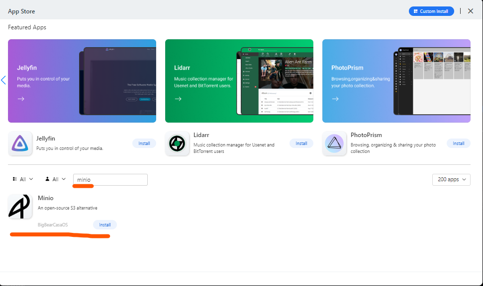

# `MinIO`

## Pemasangan `MinIO` pada `CasaOS`

Pada App Store jika kita mencari dengan keyword `minio` tidak ditemukan karena secara default `app store` pada `CasaOS` tidak ada, maka kita perlu menambahkan dependency apps baru pada `CasaOS`.


```txt
https://github.com/bigbeartechworld/big-bear-casaos/archive/refs/heads/master.zip
```

Jika loading lama, silahkan `close` lalu `open` lagi `App Store CasaOS`. Jika sudah ada `200 Apps` berarti sudah berhasil menambahkannya.




Setelah muncul `Minio` silahkan klik `Install` tunggu beberapa saat sampai selesai. 

```env
MINIO_BROWSER_REDIRECT_URL="http://minio.pondokmbodo.local"
MINIO_ROOT_PASSWORD=minioadmin
MINIO_ROOT_USER=minioadmin
MINIO_SERVER_URL="http://s3.pondokmbodo.local"
```

Environment di atas dapat anda ganti-ganti misal:
```env
MINIO_BROWSER_REDIRECT_URL="http://minio.pondokmbodo.local"
MINIO_ROOT_PASSWORD=rahasia
MINIO_ROOT_USER=kaesa
MINIO_SERVER_URL="http://s3.pondokmbodo.local"
```

## `MinIO` Client `mc`

Ini adalah aplikasi client yang digunakan untuk mengakses server.

### Pemasangan `mc`
```bash
wget https://dl.min.io/client/mc/release/linux-amd64/mc
```

```bash
chmod +x mc
```

```bash
sudo mv mc /usr/local/bin/
```
### Membuat alias url tujuan
```bash
mc alias set local http://s3.pondokmbodo.local:9010 kaesa rahasia
```
### Copy data minio
```bash
mc cp --recursive local/pondokmbodo/ pondokmbodo/
```
### Error: `mc: <ERROR> Unable to prepare URL for copying. Unable to guess the type of copy operation.`

Error di atas bisa jadi karena tidak ada object/data pada bucket yang dituju.
