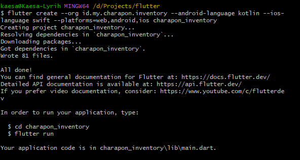

# Flutter Starter Kit

Catatan yang berisi cara setup flutter sesuai dengan kebutuhan KAESA. 

Membuat proyek flutter dimana saya tidak ingin menggunakan folder `com.example` > `id.my.charapon.inventory`, bahasa pemprograman android menggunakan `java` > `kotlin`, bahasa pemprograman ios menggunakan `swift` dan flutter dapat di compile ke platform `web`, `android`, dan `ios`, saya beri nama `charapon_inventory`:

```bash
flutter create --org id.my.charapon.inventory --android-language kotlin --ios-language swift --platforms=web,android,ios charapon_inventory
```



Pindah ke directory app flutter:
```bash
cd charapon_inventory
```

Buka di Visual Studio Code:
```bash
code .
```

## Package

- Environment Variable
	- `flutter_dotenv`
- State Management
	- `flutter_bloc`
	- `provider`
- Dependency Injection
	- `get_it` or `injectable`
- Navigation Router
	- `go_router`
- Utility/Tools/Helper
	- `freezed_annotation json_annotation`
		- `build_runner freezed json_serializable‎ --dev`
	- `rxdart`
	- `fpdart‎
	- `path`
	- `connectivity_plus`
	- `logger`
- Internationalization
	- `intl`
- Image
	- `image_cropper`
	- `image_picker`
	- `cached_network_image`
- Local Storage
	- `shared_preferences`
	- `flutter_secure_storage`
- HTTP Client
	- `http`
	- `dio`
- File
	- `path_provider`
	- `file_picker`
	- `open_file`

- UI Widget
	- `flutter_form_builder`
	- `form_builder_validator`
	- `form_builder_extra_fields`
	- `salomon_bottom_bar`

- Unique ID (Optional)
	- `ulid`

## 💡 Idea

Saya ingin membawa fitur bagus pada laravel ke dalam flutter.

Untuk data yang bentuknya masa lampau bisa disimpan pada local storage karena tidak akan pernah berubah.

