# Space, grids, and layouts

Penataan ruang (space) adalah kunci dari setiap desain yang hebat. Sistem spasial, grid, dan tata letak (layouts) memberikan aturan-aturan yang memberikan irama atau ritme yang konsisten pada desain Anda, membatasi pengambilan keputusan, dan membantu tim tetap selaras atau sejalan. Kerangka dasar ini adalah syarat mutlak bagi semua sistem desain. Dalam panduan ini, kami akan menjelaskan dasar-dasar menentukan unit dasar spasial (Space), menciptakan aturan hubungan dengan grid, dan menggabungkannya untuk tata letak (layouts) UI modern.

## Apa itu sistem spasial?

Para desainer membuat keputusan spasial setiap hari, mulai dari tinggi tombol hingga ruang di sekitar ikon. Sistem spasial adalah sejumlah aturan yang mengatur cara Anda mengukur, menentukan ukuran, dan menata elemen-elemen UI Anda. Keseragaman pada tingkat spasial memungkinkan produk Anda menjadi lebih konsisten, tim Anda berkomunikasi dengan lebih baik, dan mengurangi jumlah keputusan yang harus diambil oleh desainer setiap harinya. Contoh dari sistem spasial adalah "grid 8pt". Namun, ada banyak variasi dan konfigurasi yang dapat dipilih.

Sebagai contoh, perhatikan bagaimana tampilan formulir login terasa ketika tidak memiliki pola spasial yang dapat langsung dikenali. Bagi pengguna, desain tersebut dapat terasa murah, tidak konsisten, dan umumnya tidak dapat dipercaya. Prediktabilitas irama tersebut memberikan kesan visual yang menarik dan sesuatu yang diharapkan dari merek-merek yang Anda percayai.

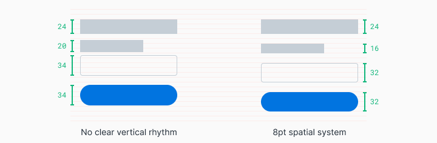

Ketika formulir login yang sama disesuaikan dengan mengikuti sistem spasial 8pt, iramanya menjadi lebih mudah ditebak dan menarik secara visual. Bagi pengguna, pengalaman ini terasa lebih terpelihara dan dapat diprediksi. Hal ini meningkatkan kepercayaan dan afeksi terhadap merek.

Tak peduli siapa yang bekerja pada desainnya, sekarang ada bahasa spasial yang konsisten, dan pilihan yang harus Anda buat sangat berkurang. Anda dapat dengan mudah melanjutkan dari titik dimana keputusan-keputusan ini juga terdokumentasi dalam kode, Anda menghemat waktu dalam hal persiapan untuk para insinyur (engineers).

## Bagaimana cara memulai sistem spasial?

Menentukan unit dasar Anda akan memungkinkan Anda untuk membuat skala ukuran yang didukung dalam sistem spasial Anda. Saat melihat berbagai produk di seluruh web, Anda akan melihat beberapa pendekatan yang berbeda terkait hal ini. Anda akan menemui sistem peningkatan 4pt, 5pt, 6pt, 8pt, 10pt, dan lainnya. Tidak ada jawaban yang salah di sini, selama Anda menyadari apa yang beberapa arah ini mendorong dan cegah.

Metode yang saya lebih sukai adalah skala linear 8pt untuk elemen dengan selang 4pt untuk penataan icon atau blok teks kecil. Saya lebih suka menggunakan grid dasar 4pt untuk tipografi saya, yang berarti tinggi garis pilihan font saya akan selalu dibagi dengan 4. Sistem ini dimaksudkan untuk mengurangi kebingungan dan mudah diimplementasikan.

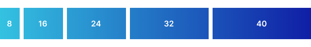

---

Bersikaplah masuk akal tentang kebutuhan Anda saat Anda mengeksplorasi pembangunan sistem tata ruang (layout system) Anda sendiri. Berikut beberapa hal yang perlu dipertimbangkan:

- Kebutuhan pengguna (User needs)  
  Pertimbangkan pengguna desain Anda dan estetika merek secara umum. Apakah Anda menginginkan UI yang lapang dengan gaya huruf besar dan jumlah tindakan terbatas? Apakah Anda perlu membangun untuk kepadatan informasi dengan tabel data yang rumit dan beragam tindakan untuk pengguna teknis? Survei desain yang sudah ada dan buat mood board untuk mendapatkan pemahaman dan keselarasan bagi Anda dan tim Anda.
- Jumlah variabel (Number of variables)  
  Memilih unit dasar yang lebih kecil seperti 4pt, 5pt, atau 6pt dapat membuka peluang untuk terlalu banyak variable dalam sistem Anda. Ini bisa membuat lebih sulit untuk melihat perbedaan antara selisih padding 12pt dan 16pt, yang dapat membuat sulit untuk menjaga konsistensi di seluruh tim. Saya menemukan bahwa penambahan 8pt adalah keseimbangan yang tepat antara jarak visual dan jumlah variabel yang wajar. Saya juga menggunakan setengah unit 4pt untuk menata ikon atau menyesuaikan blok teks kecil.

- Angka ganjil (Odd numbers)  
  Memperkenalkan angka ganjil, seperti dasar 5p, dalam aturan spasial bisa membuat sulit untuk menengahkan elemen tanpa pemecah pixel. Sebagai contoh, menengahkan teks dan ikon dalam tombol dengan tinggi 25px dapat membuat pixel pecah yang buram bagi sebagian pengguna. Dalam hal yang sama, menyesuaikan UI untuk layar ponsel dan desktop yang berbeda yang memerlukan skalabilitas 1.5x akan menghasilkan keburaman pixel yang pecah.

## Bagaimana cara menerapkan sistem spasial?

Menerapkan skala spasial pada elemen-elemen UI Anda dapat melibatkan penggunaan `padding`, `margin`, definisi `tinggi (height)` dan `lebar (width)`. Contoh-contoh berikut menunjukkan bahwa terkadang penambahan tidak dapat diterapkan pada saat yang sama dengan definisi tinggi yang ke tata.

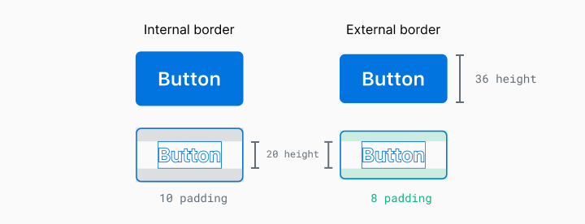

Dalam contoh ini, Anda dapat melihat bahwa tinggi teks ini adalah 20px, tetapi jika saya menggunakan penambahan 8px di atas dan di bawah, tombol akan memiliki tinggi sebesar 36px. Pengukuran mana yang sebaiknya diutamakan? Ada dua cara untuk mengatasi ini:

### Elemen terlebih dahulu (penyisipan elemen yang ketat)

Dalam pendekatan ini, penentuan ukuran elemen-elemen solid menjadi prioritas ketika disesuaikan dengan sistem spasial yang telah ditentukan. Ini mencakup hal-hal seperti tombol dan input formulir. Elemen-elemen ini lebih mungkin memiliki konten yang dapat diprediksi dan merupakan kunci dalam menciptakan irama dalam komposisi keseluruhan.

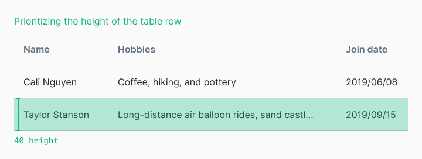

### Konten terlebih dahulu (penambahan internal yang ketat)

Ketika kontennya kurang dapat diprediksi dan kami peduli tentang tampilannya, kami akan ingin menerapkan penambahan internal yang ketat dan memungkinkan ukuran elemen ditentukan oleh kontennya. Ukuran elemen ini masih mungkin sesuai dengan aturan sistem spasial Anda, tetapi yang utama adalah ruang di sekitar kontennya. Ini berguna untuk tabel dengan konten pengguna yang tidak pasti.

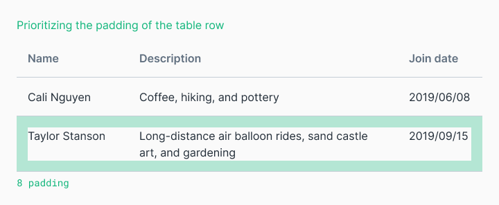

## Penempatan batas dalam atau luar

Elemen-elemen yang diberi outline seperti `button` atau `card` dapat menimbulkan masalah. Bagaimana Anda menghitung border 2px itu? Ini dihitung dengan cara yang berbeda dalam kode dibandingkan dengan di Figma. Yang mana yang menjadi sumber kebenaran Anda?

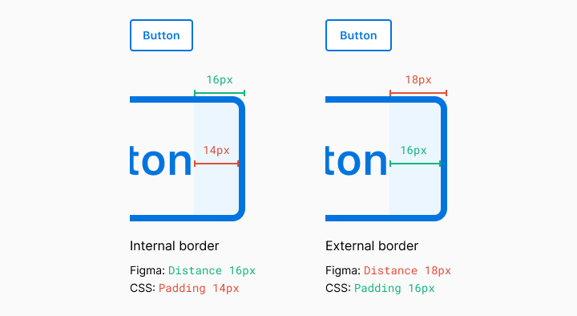

Figma mengukur elemen dan bukan batasannya. Di web, ini ditangani dalam dua cara berbeda. Properti `box-sizing` dapat berupa `border-box` atau `content-box`. Untuk melihat dalam aksi, lihat [codepen](https://codepen.io/elliotdahl/pen/wgQxNG/) ini dan [baca artikel ini](https://builttoadapt.io/8-point-grid-borders-and-layouts-e91eb97f5091/). Intinya di sini adalah bahwa sebagian besar web modern menggunakan `border-box`.

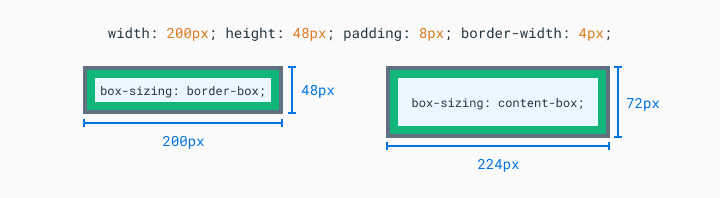

Anda hampir selalu dapat menyesuaikan kode untuk menjadi sempurna dalam pixel, tetapi Anda mungkin harus mengorbankan kesederhanaan dan keluwesan jika Anda tidak sejalan dengan tim Anda dalam hal implementasinya. Sekali lagi, lakukan percakapan dengan tim Anda untuk mendefinisikan posisi Anda sendiri.

## Apa itu grid?

Sistem spasial menentukan aturan ukuran dan jarak sementara grid membantu Anda mengatur konten Anda ke dalam proposisi terstruktur. Desainer cetak awal menggunakan grid untuk mengatur blok teks dan gambar menjadi hierarki visual yang menyenangkan yang membantu dalam keterbacaan. Saat desain berkembang, prinsip dasar yang sama masih belaku untuk organisasi informasi dalam dimensi dua.

### Grid kolom (Column grid)

Grid kolom membantu Anda mengatur konten ke dalam kolom vertikal yang tersebar rata. Ruang antara kolom disebut sebagai ukuran `gutter`. Mengaplikasikan aturan sistem spasial Anda pada gutter akan membantu menciptakan irama yang konsisten dalam desain Anda. Contoh umumnya adalah grid 12 kolom karena ini memungkinkan Anda membagi area yang diberikan menjadi setengah, sepertiga, seperempat, atau per-enam.

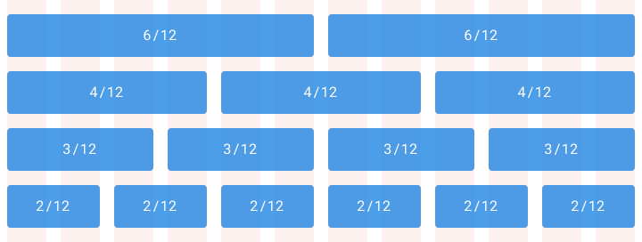

### Grid modular (Modular grids)

Grid modular mempertimbangkan kolom dan baris untuk mengatur konten ke dalam struktur matriks. Grid modular ideal untuk tata letak format yang ketat, seperti buku, tetapi bisa diadaptasi untuk tata letak web responsif dengan ukuran yang lebih fleksibel. Ingatlah bahwa ini tidak harus mencakup seluruh tata letak halaman. Grid modular adalah alat organisasi. Anda yang menentukan dimulai dan berakhir.

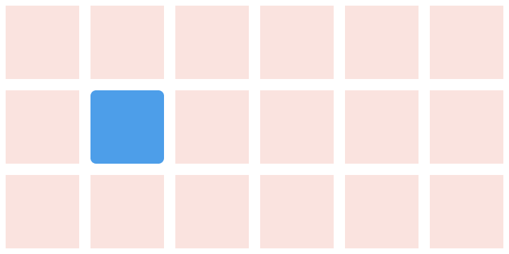

### Grid dasar (Baseline grid)

Secara tradisional dalam desain grafis, grid dasar digunakan untuk mengatur leading dari satu baris teks ke baris berikutnya. Namun, di web, kita menempatkan teks berdasarkan `line-height` daripada dasar. Ini adalah perbedaan yang halus tetapi Anda harus menyadari saat merancang di berbagai platform. Terlepas dari bagaimana tipografi Anda diukur, prinsip dasar yang sama berlaku-menyusun tipografi ke dalam grid yang konsisten akan memudahkan dalam pengorganisasian, menciptakan irama vertikal, dan lebih estetis.

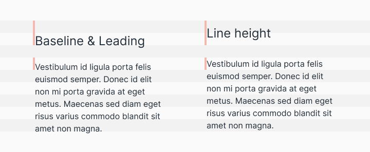

## Menggabungkan Tata Letak (Composing a layout)

Tata letak adalah hasil dari aturan spasial yang telah ditentukan dan pengorganisasian konten ke dalam satu komposisi tunggal. Mengumpulkan konten Anda ke dalam struktur yang berpikir adalah bagian yang mudah, namun menjadikannya suatu kesatuan dengan hierarki yang jelas di tengah beragam platform dan ukuran layar yang berubah-ubah adalah bagian yang tersulit.

Menentukan logika skalabilitas kini menjadi keharusan baik untuk aplikasi native maupun web. Dari desktop hingga ponsel, serta segala hal di antaranya, ukuran layar dan skalanya dapat bervariasi secara signifikan. Ada tiga konsep utama dalam merancang tata letak yang dapat berkembang dengan baik. Beberapa desain akan memerlukan ketiga konsep ini sekaligus.

### Adaptif (Adaptive)

Tata letak adaptif adalah tata letak yang sepenuhnya berubah berdasarkan format yang dipresentasikan. Misalnya, mengunggah pengalaman yang berbeda berdasarkan perangkat desktop, tablet, dan ponsel. Ini mendorong pengalaman yang lebih sesuai dengan perangkat pengguna, namun dapat menjadi mahal untuk membangun kembali fungsionalitas yang sama ke dalam berbagai format.

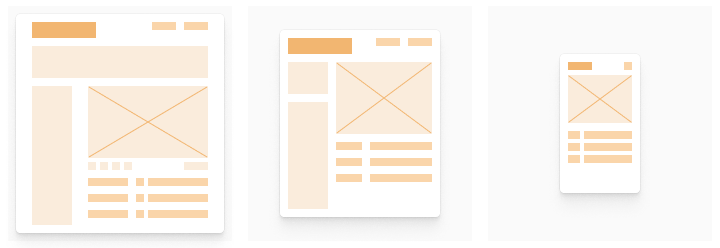

### Responsif (Responsive)

Tata letak responsif bersifat fluid dan dapat beradaptasi dengan perubahan ukuran format. Ini adalah praktik umum di web dan telah menjadi keharusan untuk aplikasi native seiring dengan peningkatan variasi ukuran layar. Ini memungkinkan Anda membangun fitur satu kali dan mengharapkan agar itu berfungsi pada semua ukuran layar. Kekurangannya adalah interaksi sentuhan dan perangkat masukan berbeda, serta mahal untuk memperhitungkan semua perangkat dan kasus penggunaan.

### Ketat (Strict)

Tata letak ini tidak fleksibel dengan perubahan ukuran format. Tata letak tetap sering digunakan untuk mempromosikan interaksi tertentu atau tata letak informasi yang akan menurun kualitasnya pada ukuran yang lebih kecil. Tabel data dan grafik sering kali menciptakan tata letak ketat yang dapat di-scroll pada ukuran tertentu karena keterbacaan dan interaksi akan menurun secara signifikan di bawah ukuran tertentu.

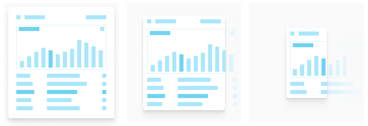

## Bagaimana cara menerapkan sistem spasial pada sekumpulan desain yang sudah ada?

Memulai dari awal adalah hal yang mudah. Tantangan sebenarnya adalah menyesuaikan sistem spasial ke dalam sekumpulan desain yang sudah ada. Langkah pertama adalah melibatkan rekan kerja Anda dalam percakapan ini. Meyakinkan anggota tim dan pemangku kepentingan untuk mengubah proses pengembangan produk yang sudah ada dapat sulit tanpa kejelasan nilai relatif terhadap peran mereka. Insinyur (engineer) ingin persyaratan lebih jelas dan menghabiskan waktu lebih sedikit dengan seorang desainer yang rewel karena padding tidak sesuai. Manajer produk ingin memberikan nilai bagi pengguna dan bisnis dengan cepat. Desainer ingin desain mereka diterjemahkan langsung ke dalam pengalaman pengguna yang koheren dengan cepat dan efisien. Semua hal ini dapat dicapai dengan berinvestasi dalam sistem spasial bersama.

Mulailah dengan hal yang kecil. Membangun ulang segalanya agar sesuai dengan sistem spasial yang baru ditentukan dapat terasa menakutkan. Cari komponen-komponen sederhana yang dapat diubah, seperti tombol, dan kemudian luaskan ke elemen-elemen sejenis yang umum seperti bidang formulir. Bangun momentum dan pemahaman dengan tim Anda sepanjang jalan. Mengawasi sistem desain seperti menggembalakan kucing. Membekali orang-orang, seperti insinyur (engineer), yang akan menerapkan sistem untuk memelihara dan menegakkannya.

Ambil keputusan yang seimbang. Buktikan kepada pemangku kepentingan bagaimana pekerjaan ini mengurangi utang desain/teknis dan meningkatkan kecepatan sepanjang jalan. Setelah menyelesaikan bagian pekerjaan tertentu, seperti mengatur alur kerja ikon dan desain hingga implementasi, luangkan waktu sejenak untuk mendokumentasikan sebelum dan sesudahnya dengan mewawancarai tim. Gunakan kutipan dari rekan-rekan tim tentang waktu yang terselamatkan untuk memperkuat nilai pekerjaan Anda. Baik Anda bekerja untuk startup kecil atau perusahaan besar, alasan umum untuk tidak berinvestasi dalam inisiatif sistem desain adalah bahwa bisnis secara langsung dipertahankan dengan memberikan nilai kepada pengguna, bukan mengorganisir sistem spasial yang sempurna.

Pertahankan momentum. Setelah Anda memulai, milikilah visi dan tanggal penyelesaian perubahan dalam pikiran. Terjebak dengan setengah pekerjaan yang mengikuti sistem spasial dan setengah lagi dalam kebuntuan adalah tempat yang sulit. Ini membuat penciptaan nilai baru bagi pengguna Anda menjadi lebih kompleks. Memiliki rencana dengan tonggak-tonggak yang jelas, ciptakan visibilitas untuk tim, dan bagikan kemajuan sepanjang jalan.
