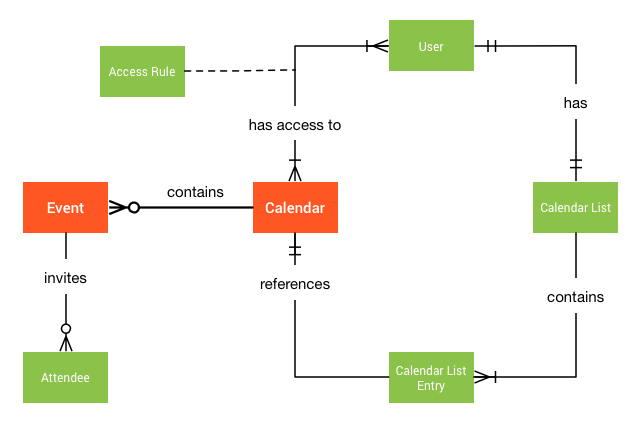

# Filament Full Calendar and Google Calendar

## Google Calendar API overview

Google Calendar API adalah RESTful API yang dapat diakses melalui panggilan HTTP eksplisit atau menggunakan Google Client Libraries. API memperlihatkan sebagian besar fitur yang tersedia di antarmuka Web Google Calendar.

Berikut adalah daftar istilah umum yang digunakan di Google Calendar API:

- Event (Acara)
  - Event (Acara) di kalender yang berisi informasi seperti `title` (judul), waktu `start` (mulai) dan `end`(berakhir), serta `attendees` (peserta). Acara dapat berupa single event (acara tunggal) atau recurring events (acara berulang). Suatu Event diwakili oleh `Event resource`.
- Calendar (Kalender)
  - Events Collection (Kumpulan acara). Setiap Calendar memiliki metadata terkait, seperti `description` atau default `time_zone` calendar. Metadata untuk satu kalender diwakili oleh `Calendar resource`.
- Calendar List (Daftar Kalender)
  - Daftar semua kalender di daftar kalender pengguna di UI Kalender. Metadata untuk satu kalender yang muncul dalam daftar kalender direpresentasikan oleh resource CalendarListEntry. Metadata ini mencakup properti kalender khusus pengguna, seperti warna atau notifikasi untuk acara baru.
- Setting (Pengaturan)
  - Preferensi pengguna dari UI Kalender, seperti zona waktu pengguna. Satu preferensi pengguna direpresentasikan oleh [Resource Setelan](https://developers.google.com/calendar/v3/reference/settings?hl=id).
- ACL (Access Control List)
  - Aturan kontrol akses yang memberi pengguna (atau sekelompok pengguna) tingkat akses tertentu ke kalender. Aturan kontrol akses tunggal direpresentasikan oleh [resource ACL](https://developers.google.com/calendar/v3/reference/acl?hl=id).

## Memahami Google Calendar API

### Overview

Setiap pengguna Kalender dikaitkan dengan kalender utama dan sejumlah kalender lain yang juga dapat mereka akses. Pengguna dapat membuat peristiwa dan mengundang pengguna lain, seperti yang ditunjukkan dalam diagram berikut:


Contoh ini menunjukkan dua pengguna, Susan A dan Wei X. Masing-masing memiliki kalender utama dan beberapa kalender terkait lainnya. Contoh tersebut juga menunjukkan dua acara: presentasi akhir tahun dan tim di luar lokasi.

Berikut adalah beberapa fakta yang ditampilkan dalam diagram:

- Daftar kalender milik Susan mencakup kalender utamanya serta kalender untuk pelajaran tim dan pelajaran selo.
- Daftar kalender Wei termasuk kalender utamanya serta kalender tim, kalender pelacakan status, dan kalender utama Susan.
- Acara presentasi akhir tahun ini menampilkan Susan sebagai penyelenggara dan Wei sebagai peserta.
- Tim di luar lokasi acara Hawaii memiliki kalender tim sebagai penyelenggara (artinya, kalender tersebut dibuat dalam kalender tersebut) dan disalin ke Susan dan Wei sebagai peserta.
  Konsep ini: kalender, acara, peserta, dan lainnya akan dijelaskan lebih lanjut di bagian lain panduan ini:
- [Kalender dan Acara](https://developers.google.com/calendar/api/concepts/events-calendars?hl=id)
- [Berbagi kalender](https://developers.google.com/calendar/api/concepts/sharing?hl=id)
- [Mengundang pengguna ke acara](https://developers.google.com/calendar/api/concepts/inviting-attendees-to-events?hl=id)
- [Pengingat dan Notifikasi](https://developers.google.com/calendar/api/concepts/reminders?hl=id)
- [Google Workspace Fitur](https://developers.google.com/calendar/api/concepts/domain?hl=id)

### Jenis Resource Calendar API

#### Latar belakang Calendar API

#### Konsep kalender

Google Kalender dibuat berdasarkan beberapa konsep dasar:

Event

Satu acara di kalender yang berisi informasi seperti judul acara, waktu mulai dan waktu berakhir, serta tamu.

Kalender

Satu entri kalender yang berisi metadata untuk kalender seperti deskripsi.

Daftar Kalender

Daftar semua kalender di daftar kalender pengguna di UI Kalender.

Pembahasan

Preferensi pengguna dari UI Kalender, seperti zona waktu pengguna.

ACL

Aturan kontrol akses tunggal yang berisi informasi seperti jenis dan cakupan aturan.

#### Model data Calendar API

Resource adalah entity data individual dengan ID unik. Calendar API beroperasi pada lima jenis fasilitas:

Referensi Acara

Merepresentasikan satu acara di kalender.

Sumber Daya Kalender

Merepresentasikan metadata untuk setiap kalender.

Sumber Daya Daftar Kalender

Merepresentasikan metadata untuk setiap kalender yang muncul di daftar kalender pengguna di UI.

Resource Setelan

Merepresentasikan satu preferensi pengguna dari UI Kalender.

Resource ACL

Merepresentasikan ACL.

Model data Calendar API didasarkan pada grup fasilitas yang disebut koleksi:

Koleksi Acara

Terdiri dari semua Fasilitas Acara dalam Fasilitas Kalender tertentu.

Koleksi CalendarList

Terdiri dari semua Fasilitas CalendarList untuk pengguna tertentu.

Koleksi Setelan

Terdiri dari semua Resource Setelan untuk pengguna tertentu.

Pengumpulan ACL

Terdiri dari semua Resource ACL yang diterapkan ke kalender tertentu.

### Kalender & acara

Panduan ini menjelaskan kalender, acara, dan hubungan mereka satu sama lain.

## Kalender

[Kalender](https://developers.google.com/calendar/v3/reference/calendars?hl=id#resource-representations) adalah kumpulan acara terkait, beserta metadata tambahan seperti ringkasan, zona waktu default, lokasi, dll. Setiap kalender diidentifikasi dengan ID yang merupakan alamat email. Kalender dapat memiliki beberapa pemilik.

## Peristiwa

[Peristiwa](https://developers.google.com/calendar/v3/reference/events?hl=id#resource-representations) adalah objek yang terkait dengan rentang tanggal atau waktu tertentu. Peristiwa diidentifikasi dengan ID unik. Selain waktu tanggal mulai dan akhir, peristiwa berisi data lain seperti ringkasan, deskripsi, lokasi, status, pengingat, lampiran, dll.

### Jenis peristiwa

Google Kalender mendukung acara *tunggal* dan *berulang*:

- *Satu* peristiwa mewakili satu kejadian unik.
- Peristiwa *berulang* menentukan beberapa kejadian.

Peristiwa juga dapat memiliki *waktu* atau *sepanjang hari*:

- Peristiwa *timed* terjadi di antara dua titik waktu tertentu. Peristiwa berjangka waktu menggunakan kolom `start.dateTime` dan `end.dateTime` untuk menentukan waktu terjadinya.
- Acara *sepanjang hari* berlangsung selama satu hari penuh atau serangkaian hari berturut-turut. Peristiwa sepanjang hari menggunakan kolom `start.date` dan `end.date` untuk menentukan waktu terjadinya. Perhatikan bahwa kolom zona waktu tidak memiliki signifikansi untuk acara sepanjang hari.

Awal dan akhir acara harus memiliki waktu atau sepanjang hari. Misalnya, menentukan `start.date` dan `end.dateTime` adalah **tidak valid**.

### Penyelenggara

Acara memiliki satu *penyelenggara*, yaitu kalender yang berisi salinan utama acara. Acara juga dapat memiliki beberapa [peserta](https://developers.google.com/calendar/concepts/sharing?hl=id#inviting_attendees_to_events). Tamu biasanya merupakan kalender utama dari pengguna yang diundang.

Diagram berikut menunjukkan hubungan konseptual antara kalender, acara, dan elemen terkait lainnya:



## Kalender utama & kalender lainnya

Kalender *utama* adalah jenis kalender khusus yang terkait dengan satu akun pengguna. Kalender ini dibuat secara otomatis untuk setiap akun pengguna baru dan ID-nya biasanya cocok dengan alamat email utama pengguna. Selama akun masih ada, kalender utamanya tidak akan dapat dihapus atau "tidak dimiliki" oleh pengguna. Namun, foto tersebut masih dapat dibagikan kepada pengguna lain.

Selain kalender utama, Anda dapat membuat sejumlah kalender lain secara eksplisit. Kalender ini dapat diubah, dihapus, dan dibagikan kepada beberapa pengguna.

## Kalender & daftar kalender

Koleksi [Kalender](https://developers.google.com/calendar/v3/reference/calendars?hl=id) mewakili semua kalender yang ada. Alat ini dapat digunakan untuk membuat dan menghapus kalender. Anda juga dapat mengambil atau menetapkan properti global yang dibagikan ke semua pengguna yang memiliki akses ke kalender. Misalnya, judul kalender dan zona waktu default adalah properti global.

[CalendarList](https://developers.google.com/calendar/v3/reference/calendarList?hl=id) adalah kumpulan semua entri kalender yang telah ditambahkan pengguna ke daftar mereka (ditampilkan di panel kiri UI web). Anda dapat menggunakannya untuk menambahkan dan menghapus kalender yang ada ke/dari daftar pengguna. Anda juga menggunakannya untuk mengambil dan menetapkan nilai properti kalender khusus pengguna, seperti pengingat default. Contoh lainnya adalah warna latar depan, karena pengguna yang berbeda dapat menetapkan warna yang berbeda untuk kalender yang sama.

Tabel berikut membandingkan arti operasi kedua koleksi:

| Operasi          | Kalender                                                                                                  | CalendarList                                                                                      |
| ---------------- | --------------------------------------------------------------------------------------------------------- | ------------------------------------------------------------------------------------------------- |
| `insert`         | Membuat kalender sekunder baru. Secara default, kalender ini juga ditambahkan ke daftar kalender pembuat. | Menyisipkan kalender yang ada ke daftar pengguna.                                                 |
| `delete`         | Menghapus kalender sekunder.                                                                              | Menghapus kalender dari daftar pengguna.                                                          |
| `get`            | Mengambil metadata kalender, misalnya judul, zona waktu.                                                  | Mengambil metadata **plus** penyesuaian khusus pengguna seperti warna atau pengingat penggantian. |
| `patch`/`update` | Memodifikasi metadata kalender.                                                                           | Memodifikasi properti kalender spesifik per pengguna.                                             |

## Acara rutin

Beberapa peristiwa terjadi beberapa kali dalam jadwal rutin, seperti pertemuan mingguan, hari ulang tahun, dan hari libur. Selain memiliki waktu mulai dan waktu berakhir yang berbeda, peristiwa berulang ini sering kali identik.

Acara disebut *berulang* jika berulang sesuai jadwal yang ditentukan. Peristiwa *tunggal* tidak berulang dan hanya terjadi sekali.

### Aturan pengulangan

Jadwal untuk acara rutin didefinisikan dalam dua bagian:

- Kolom awal dan akhirnya (yang menentukan kemunculan pertama, seolah-olah ini hanya peristiwa tunggal yang berdiri sendiri), dan
- Kolom pengulangannya (yang menentukan cara peristiwa harus diulang dari waktu ke waktu).

Kolom pengulangan berisi array string yang mewakili satu atau beberapa properti `RRULE`, `RDATE`, atau `EXDATE` seperti yang didefinisikan dalam [RFC 5545](http://tools.ietf.org/html/rfc5545).

Properti `RRULE` adalah yang paling penting karena menentukan aturan reguler untuk mengulangi peristiwa. Hal ini terdiri dari beberapa komponen. Beberapa di antaranya adalah:

- `FREQ` — Frekuensi pengulangan peristiwa (seperti `DAILY` atau `WEEKLY`). Wajib.
- `INTERVAL` — Berfungsi bersama dengan `FREQ` untuk menentukan seberapa sering peristiwa harus diulang. Misalnya, `FREQ=DAILY;INTERVAL=2` berarti sekali setiap dua hari.
- `COUNT` — Berapa kali peristiwa ini harus diulang.
  Anda dapat menggunakan COUNT atau Hai untuk menentukan akhir pengulangan acara. Jangan gunakan keduanya dalam aturan yang sama.
- `UNTIL` — Tanggal atau tanggal-waktu saat acara harus diulang (inklusif).
- `BYDAY` — Hari saat acara harus diulang (`SU`, `MO`, `TU`, dll.). Komponen serupa lainnya mencakup `BYMONTH`, `BYYEARDAY`, dan `BYHOUR`.

Properti `RDATE` menentukan tanggal atau tanggal-waktu tambahan saat peristiwa harus terjadi. Misalnya, `RDATE;VALUE=DATE:19970101,19970120`. Gunakan ini untuk menambahkan kemunculan tambahan yang tidak tercakup oleh `RRULE`.

Properti `EXDATE` mirip dengan RDATE, tetapi menentukan tanggal atau tanggal-waktu saat peristiwa *tidak* seharusnya terjadi. Artinya, kemunculan tersebut harus dikecualikan. Ini harus mengarah ke instance valid yang dihasilkan oleh aturan pengulangan.

`EXDATE` dan `RDATE` dapat memiliki zona waktu, dan harus berupa tanggal (bukan tanggal-waktu) untuk acara sepanjang hari.

Setiap properti dapat muncul dalam kolom pengulangan beberapa kali. Pengulangan didefinisikan sebagai gabungan dari semua aturan `RRULE` dan `RDATE`, dikurangi aturan yang dikecualikan oleh semua aturan `EXDATE`.

Berikut beberapa contoh peristiwa berulang:

Acara yang terjadi dari pukul 06.00 hingga 07.00 setiap hari Selasa dan Jumat mulai dari 15 September 2015 dan berhenti setelah kejadian kelima pada 29 September:

```
..."start": { "dateTime": "2015-09-15T06:00:00+02:00", "timeZone": "Europe/Zurich"},"end": { "dateTime": "2015-09-15T07:00:00+02:00", "timeZone": "Europe/Zurich"},"recurrence": [ "RRULE:FREQ=WEEKLY;COUNT=5;BYDAY=TU,FR"],…
```

1. Acara sepanjang hari yang dimulai pada 1 Juni 2015 dan berulang setiap 3 hari sepanjang bulan, kecuali 10 Juni, tetapi termasuk 9 dan 11 Juni:

   ```
   ..."start": { "date": "2015-06-01"},"end": { "date": "2015-06-02"},"recurrence": [ "EXDATE;VALUE=DATE:20150610", "RDATE;VALUE=DATE:20150609,20150611", "RRULE:FREQ=DAILY;UNTIL=20150628;INTERVAL=3"],…
   ```

### Instance & pengecualian

Peristiwa berulang terdiri dari beberapa *instance*: kemunculan khususnya pada waktu yang berbeda. Instance ini berfungsi sebagai peristiwa itu sendiri.

Perubahan peristiwa berulang dapat memengaruhi seluruh peristiwa berulang (dan semua instance-nya), atau hanya instance individual. Instance yang berbeda dari acara rutin induknya disebut *pengecualian*.

Misalnya, pengecualian mungkin memiliki ringkasan yang berbeda, waktu mulai yang berbeda, atau tamu tambahan yang hanya diundang ke instance tersebut. Anda juga dapat membatalkan instance sepenuhnya tanpa menghapus peristiwa berulang (pembatalan instance akan tercermin dalam peristiwa [`status`](https://developers.google.com/calendar/v3/reference/events?hl=id#status)).

Contoh cara bekerja dengan acara dan instance rutin melalui Google Calendar API dapat ditemukan [di sini](https://developers.google.com/calendar/recurringevents?hl=id).

## Zona waktu

Zona waktu menentukan wilayah yang mengamati waktu standar yang seragam. Di Google Calendar API, Anda menentukan zona waktu menggunakan ID [zona waktu IANA](http://www.iana.org/time-zones).

Anda dapat menyetel zona waktu untuk kalender dan acara. Bagian berikut menjelaskan efek setelan ini.

### Zona waktu kalender

Zona waktu kalender juga dikenal sebagai *zona waktu default* karena implikasinya terhadap hasil kueri. Zona waktu kalender memengaruhi cara nilai waktu ditafsirkan atau ditampilkan oleh metode [`events.get()`](https://developers.google.com/calendar/v3/reference/events/get?hl=id), [`events.list()`](https://developers.google.com/calendar/v3/reference/events/list?hl=id), dan [`events.instances()`](https://developers.google.com/calendar/v3/reference/events/instances?hl=id).

Konversi zona waktu hasil kueri

Hasil metode [`get()`](https://developers.google.com/calendar/v3/reference/events/get?hl=id), [`list()`](https://developers.google.com/calendar/v3/reference/events/list?hl=id), dan [`instances()`](https://developers.google.com/calendar/v3/reference/events/instances?hl=id) ditampilkan dalam zona waktu yang Anda tentukan dalam parameter `timeZone`. Jika Anda menghilangkan parameter ini, semua metode ini akan menggunakan zona waktu kalender sebagai default.

Mencocokkan acara sepanjang hari dengan kueri terjadwal

Metode [`list()`](https://developers.google.com/calendar/v3/reference/events/list?hl=id), dan [`instances()`](https://developers.google.com/calendar/v3/reference/events/instances?hl=id) memungkinkan Anda menentukan filter waktu mulai dan berakhir, dengan metode tersebut menampilkan instance yang berada dalam rentang yang ditentukan. Zona waktu kalender digunakan untuk menghitung waktu mulai dan berakhir acara sepanjang hari untuk menentukan apakah acara tersebut berada dalam spesifikasi filter.

### Zona Waktu Acara

Instance peristiwa memiliki waktu mulai dan berakhir. Spesifikasi untuk waktu ini dapat mencakup zona waktu. Anda dapat menentukan zona waktu dengan beberapa cara; semua cara berikut menentukan waktu yang sama:

- Sertakan offset zona waktu di kolom `dateTime`, misalnya `2017-01-25T09:00:00-0500`.
- Tentukan waktu tanpa offset, misalnya `2017-01-25T09:00:00`, dan biarkan kolom `timeZone` kosong (secara implisit menggunakan zona waktu default).
- Tentukan waktu tanpa offset, misalnya `2017-01-25T09:00:00`, tetapi gunakan kolom `timeZone` untuk menentukan zona waktu.

Anda juga dapat menentukan waktu acara dalam UTC jika mau:

- Tentukan waktu dalam UTC: `2017-01-25T14:00:00Z` atau gunakan offset nol `2017-01-25T14:00:00+0000`.

Representasi internal waktu acara sama dalam semua kasus, tetapi menetapkan kolom `timeZone` akan menyertakan zona waktu ke acara, sama seperti saat Anda [menetapkan zona waktu acara menggunakan UI Kalender](https://support.google.com/calendar/answer/37064?ref_topic=6272668&hl=id):


Untuk satu peristiwa, Anda dapat menentukan zona waktu yang berbeda untuk waktu mulai dan berakhir acara. (Hal ini dapat membantu peristiwa—seperti perjalanan—yang benar-benar dimulai dan berakhir di zona waktu yang berbeda.) Untuk acara rutin, lihat di bawah.

### Zona waktu acara berulang

Untuk acara berulang, satu zona waktu harus selalu ditentukan. Kolom ini diperlukan untuk memperluas pengulangan kejadian.

# Berbagi kalender

Ada dua cara untuk berbagi data kalender dan acara dengan orang lain.

Pertama, Anda dapat *membagikan* seluruh kalender, dengan tingkat akses yang ditentukan. Misalnya, Anda dapat membuat kalender tim, dan kemudian melakukan hal-hal seperti:

- Berikan hak kepada semua anggota tim Anda untuk menambahkan dan mengubah acara di kalender
- Beri atasan Anda hak untuk melihat acara di kalender Anda
- Beri pelanggan hak untuk hanya melihat saat Anda punya waktu luang atau sibuk, tetapi bukan detail acara

Anda juga dapat menyesuaikan akses ke setiap acara di kalender bersama.

Atau, Anda dapat mengundang orang lain ke setiap acara di kalender Anda. Mengundang seseorang ke acara akan membuat salinan acara tersebut di kalendernya. Orang yang diundang kemudian dapat menerima atau menolak undangan, dan sampai batas tertentu juga mengubah salinan acara mereka — misalnya, mengubah warna yang ada di kalender, dan menambahkan pengingat. [Pelajari cara mengundang pengguna ke acara lebih lanjut](https://developers.google.com/calendar/api/concepts/inviting-attendees-to-events?hl=id).

## Berbagi kalender

Pemilik kalender dapat membagikan kalender dengan memberikan akses kepada pengguna lain. Setelan berbagi kalender tertentu diwakili oleh [koleksi ACL](https://developers.google.com/calendar/v3/reference/acl?hl=id) (daftar kontrol akses) kalender tersebut. Setiap resource dalam koleksi ACL memberikan *grantee* yang ditentukan sebuah *peran* akses, yang merupakan salah satu yang tercantum dalam tabel berikut:

| Role             | Hak istimewa akses yang diberikan oleh peran                                                                                                                                                                                                                                                             |
| ---------------- | -------------------------------------------------------------------------------------------------------------------------------------------------------------------------------------------------------------------------------------------------------------------------------------------------------- |
| `none`           | Tidak menyediakan akses.                                                                                                                                                                                                                                                                                 |
| `freeBusyReader` | Memungkinkan penerima hibah melihat apakah kalender kosong atau sibuk pada waktu tertentu, tetapi tidak mengizinkan akses ke detail acara. Informasi senggang/sibuk dapat diambil dengan menggunakan operasi [freeBusy.query](https://developers.google.com/calendar/v3/reference/freebusy/query?hl=id). |
| `reader`         | Mengizinkan penerima hibah membaca acara di kalender.                                                                                                                                                                                                                                                    |
| `writer`         | Mengizinkan penerima hibah membaca dan menulis acara di kalender.                                                                                                                                                                                                                                        |
| `owner`          | Memberikan kepemilikan kalender. Peran ini memiliki semua izin peran penulis dengan kemampuan tambahan untuk melihat dan memanipulasi ACL.                                                                                                                                                               |

Penerima hibah yang mungkin diterima adalah:

- pengguna individu lain
- grup pengguna
- domain
- publik (memberikan akses ke semua orang).

Secara default, setiap pengguna memiliki akses pemilik ke kalender utamanya, dan akses ini tidak dapat dilepaskan. Hingga 6.000 ACL dapat ditambahkan per kalender.

Untuk Google Workspace pengguna, ada juga setelan domain yang mungkin membatasi akses maksimum yang diizinkan. Misalnya, domain Anda memiliki setelan yang hanya mengizinkan berbagi kalender yang sibuk. Dalam hal ini, meskipun Anda memberikan akses penulis ke publik, pengguna di luar domain hanya akan melihat detail senggang/sibuk.

**Catatan:** Berbagi kalender dengan pengguna tidak lagi otomatis menyisipkan kalender ke dalam `CalendarList` mereka. Jika ingin pengguna melihat dan berinteraksi dengan kalender bersama, Anda harus memanggil metode [`CalendarList: insert()`](https://developers.google.com/calendar/v3/reference/calendarList/insert?hl=id).

## Visibilitas acara

Setelah kalender dibagikan, Anda dapat menyesuaikan akses ke setiap acara di kalender dengan mengubah [properti visibilitas](https://developers.google.com/calendar/v3/reference/events?hl=id#visibility) acara. Properti ini tidak berarti untuk kalender yang tidak dibagikan. Tabel berikut mencantumkan kemungkinan nilai properti visibilitas:

| Visibilitas | Arti                                                                                                        |
| ----------- | ----------------------------------------------------------------------------------------------------------- |
| `default`   | Visibilitas acara ditentukan oleh ACL kalender.                                                             |
| `public`    | Detail acara ini dapat dilihat oleh siapa saja yang memiliki setidaknya `freeBusyReader` akses ke kalender. |
| `private`   | Detail acara ini hanya dapat dilihat oleh pengguna yang memiliki setidaknya `writer` akses ke kalender.     |
|             |                                                                                                             |

# Mengundang pengguna ke acara

## Membuat peristiwa

Jika memiliki akses tulis ke Google Kalender penyelenggara, Anda dapat menambahkan acara menggunakan metode [`Events: insert`](https://developers.google.com/calendar/api/v3/reference/events/insert?hl=id).

Metode ini menambahkan acara langsung ke kalender penyelenggara, terlepas dari setelan mereka untuk menambahkan undangan.

## Tambahkan tamu

Dengan metode ini, Anda juga dapat menambahkan tamu ke acara yang sama dengan menambahkan alamat email mereka ke properti [`attendees`](https://developers.google.com/calendar/api/v3/reference/events?hl=id#attendees) acara. Perubahan mendatang apa pun yang dibuat oleh penyelenggara pada acara tersebut [diterapkan](https://developers.google.com/calendar/api/concepts/inviting-attendees-to-events?hl=id#event-propagation) kepada tamu.

Peserta akan menerima undangan dari alamat email penyelenggara. Pengguna Google Kalender akan menerima undangan di email dan/atau di kalender mereka, bergantung pada setelan Acara dalam setelan Google Kalender mereka:

- Jika mereka memiliki setelan `From everyone`, acara akan ditambahkan langsung ke kalender mereka
- Jika mereka memiliki setelan `Only if the sender is known`, acara akan ditambahkan langsung ke kalender mereka jika sebelumnya telah berinteraksi dengan penyelenggara, jika penyelenggara berada di organisasi yang sama, atau jika penyelenggara ada dalam [kontak Google](https://contacts.google.com/?hl=id) mereka. Jika tidak dikenali oleh penyelenggara, mereka dapat mengklik **Saya kenal pengirim ini** atau RSVP dengan mengklik **Ya** atau **Mungkin** di email undangan. Kemudian acara tersebut ditambahkan ke kalender mereka.
- Jika pengguna memiliki setelan `When I respond in email`, semua undangan tidak ditambahkan ke kalender mereka sampai pengguna merespons dengan mengklik **Ya**, **Mungkin**, atau **Tidak** di email undangan.

Untuk informasi selengkapnya tentang cara undangan ditambahkan ke Google Kalender, lihat [Mengelola undangan di Kalender](https://support.google.com/calendar/answer/13159188?hl=id).

Jangan tetapkan respons tamu menggunakan properti [`attendees[].responseStatus`](https://developers.google.com/calendar/api/v3/reference/events?hl=id#attendees.responseStatus) ke apa pun selain `needsAction`. Mengisi otomatis respons tamu tidak secara otomatis menambahkan acara ke kalender pengguna.

## Menampilkan acara langsung di kalender tamu

Untuk menampilkan acara secara langsung di kalender tamu Google Kalender untuk setelan apa pun yang mungkin dimiliki tamu, Anda dapat [menyetel RSVP tamu](https://developers.google.com/calendar/api/concepts/inviting-attendees-to-events?hl=id#set-attendees-rsvp) atau [mengimpor salinan acara langsung di kalender tamu](https://developers.google.com/calendar/api/concepts/inviting-attendees-to-events?hl=id#import-copy). Untuk kedua metode tersebut, Anda memerlukan [akses tulis](https://developers.google.com/identity/protocols/oauth2/scopes?hl=id#calendar) ke kalender tamu; jika tidak, pertimbangkan untuk [menambahkan penyelenggara ke kontak peserta](https://developers.google.com/calendar/api/concepts/inviting-attendees-to-events?hl=id#add-organizer), yang mungkin memerlukan akses tulis ke kontak tamu.

### Tetapkan RSVP tamu

Untuk menyetel RSVP tamu ke acara, lakukan langkah-langkah berikut:

1. Buat acara di kalender penyelenggara Google Kalender dan tambahkan tamu ([lihat di atas](https://developers.google.com/calendar/api/concepts/inviting-attendees-to-events?hl=id#add-attendees)).
2. Gunakan metode [`Events: update`](https://developers.google.com/calendar/api/v3/reference/events/update?hl=id) untuk menetapkan [RSVP peserta](https://developers.google.com/calendar/api/v3/reference/events?hl=id#attendees.responseStatus) ke `accepted` atau `tentative`. Anda harus memiliki akses tulis ke kalender tamu. Mungkin ada sedikit keterlambatan sebelum acara muncul di kalender peserta. [Pelajari lebih lanjut cara menggunakan metode `Events: update`](https://developers.google.com/calendar/api/v3/reference/events/update?hl=id).

Metode ini akan menambahkan acara ke kalender tamu, tetapi tamu mungkin masih melihat banner di email mereka bahwa undangan tersebut dikirim dari alamat yang sebelumnya tidak mereka kenal.

### Mengimpor salinan acara langsung di kalender tamu

Untuk mengimpor salinan acara ke kalender tamu, lakukan langkah-langkah berikut:

1. Jika Anda memiliki akses tulis ke Google Kalender penyelenggara, impor salinan acara menggunakan metode [`Events: import`](https://developers.google.com/calendar/api/v3/reference/events/import?hl=id).
2. Impor salinan lain dari acara yang sama di kalender tamu menggunakan [`Events: import`](https://developers.google.com/calendar/api/v3/reference/events/import?hl=id). Anda harus memiliki akses tulis ke kalender tamu. Gunakan ID acara yang sama ([`iCalUID`](https://developers.google.com/calendar/api/v3/reference/events/import?hl=id#iCalUID)) untuk salinan penyelenggara dan tamu, serta pastikan untuk menentukan penyelenggara dalam salinan tamu.

Dengan metode ini, tamu dapat melihat acara di kalendernya, tetapi tidak menerima email undangan dari Google Kalender.

**Penting:** jika Anda tidak menggunakan ID acara yang sama, perubahan mendatang pada acara yang dibuat oleh penyelenggara tidak akan otomatis diterapkan kepada tamu.

### Tambahkan penyelenggara ke kontak tamu

Jika tidak memiliki kredensial tamu, Anda dapat meminta tamu atau organisasi untuk menambahkan alamat email penyelenggara ke kontak Google mereka terlebih dahulu untuk menampilkan acara langsung di kalender mereka. Mungkin ada sedikit penundaan agar kontak yang baru dibuat diterapkan.

- Minta pengguna Google Kalender untuk [menambahkan penyelenggara ke kontak Google mereka](https://support.google.com/contacts/answer/1069522?hl=id).
- Jika tamu adalah anggota organisasi, Anda dapat meminta administrator organisasi untuk menambahkan alamat email secara terprogram ke kontak pengguna mereka. Minta administrator untuk mengaktifkan [delegasi tingkat luas domain](https://support.google.com/a/answer/162106?hl=id), meniru identitas pengguna, dan menggunakan metode [`People: createContact`](https://developers.google.com/people/api/rest/v1/people/createContact?hl=id) untuk membuat kontak bagi setiap pengguna, guna memastikan bahwa undangan mendatang dari alamat email ini akan otomatis muncul di kalender pengguna mereka.
- Jika memiliki akses ke kontak tamu, Anda juga dapat menambahkan alamat email penyelenggara ke kontak tamu menggunakan metode [`People: createContact`](https://developers.google.com/people/api/rest/v1/people/createContact?hl=id).

## Mengundang pengguna dari alamat email

Jika Anda tidak memiliki akses tulis ke Google Kalender penyelenggara, atau jika tidak ingin mengekspos alamat email penyelenggara, gunakan protokol iCalendar ([RFC-5545](https://icalendar.org/RFC-Specifications/iCalendar-RFC-5545/)) untuk mengundang pengguna dengan email menggunakan file .ICS.

Jika tamu adalah pengguna Google Kalender dengan setelan `Only if the sender is known` dan mereka belum pernah berinteraksi dengan atau mencatat alamat yang mereka ketahui, undangan tidak akan ditambahkan ke kalender mereka hingga mereka mengklik **Saya kenal pengirim ini** atau mereka melakukan RSVP ke acara tersebut.

**Tips:** Jangan gunakan alamat email umum (misalnya: undangan@example.com) untuk mengirim undangan karena penyalahgunaan dapat memengaruhi semua pengguna yang mengirim undangan dari alamat ini. Jika Anda tidak dapat menggunakan alamat email penyelenggara, sebaiknya gunakan alamat email yang unik dan statis untuk setiap penyelenggara.

## Berikan link bagi pengguna untuk menambahkan acara

Atau, jika Anda ingin memudahkan pengguna Google Kalender untuk menambahkan acara sebagai acara satu kali tanpa memperbaruinya, Anda dapat memberikan link dengan acara yang telah diisi sebelumnya untuk ditambahkan sendiri oleh pengguna. Metode ini membuat acara yang berbeda di kalender pengguna, yang tidak dapat diperbarui kecuali jika Anda memiliki akses ke kalender pengguna.

Gunakan template link berikut:

```

https://calendar.google.com/calendar/r/eventedit?action=TEMPLATE&dates=20230325T224500Z%2F20230326T001500Z&stz=Europe/Brussels&etz=Europe/Brussels&details=EVENT_DESCRIPTION_HERE&location=EVENT_LOCATION_HERE&text=EVENT_TITLE_HERE

```

dengan memperbarui informasi berikut:

- **Tanggal dan waktu mulai dan akhir**: Gunakan format ISO 8601. Pada contoh di atas, ganti `20230325T224500Z` dan `20230326T001500Z`.
- **Zona waktu mulai dan akhir**: Format sebagai nama Database Zona Waktu IANA. Tempatkan zona waktu di kolom `stz` dan `etz`.
- **Deskripsi peristiwa**: Harus dienkode ke URL.
- **Lokasi acara**: Harus dienkode ke URL.
- **Judul acara**: Harus dienkode ke URL.

## Contoh

Mari kita perhatikan contoh membuat layanan reservasi janji temu untuk membantu pengguna membuat janji temu di sebuah bisnis. Saat pengguna membuat janji temu, Anda ingin layanan Anda menambahkan acara ke pemesan dan Google Kalender bisnis.

Untuk pengalaman pengguna terbaik, sebaiknya bisnis tersebut memberikan akses tulis ke kalender mereka, sehingga Anda dapat menambahkan acara langsung ke kalender bisnis ([Buat acara](https://developers.google.com/calendar/api/concepts/inviting-attendees-to-events?hl=id#create-event)) dan mengundang pemesan ke acara tersebut ([Tambahkan tamu](https://developers.google.com/calendar/api/concepts/inviting-attendees-to-events?hl=id#add-attendees)). Untuk memastikan pemesanan melihat acara di kalender dan diingatkan tentang acara tersebut, beri tahu mereka untuk memeriksa email dan RSVP **Ya** ke acara segera setelah melakukan pemesanan. Setelah melakukan RSVP ke acara, mereka akan menerima [notifikasi acara dari Google Kalender](https://support.google.com/calendar/answer/37242?hl=id) sesuai dengan setelan notifikasi mereka.

Jika Anda ingin menambahkan acara secara langsung ke kalender pemesan, beri tahu pemesan untuk [menambahkan ke kontak mereka](https://support.google.com/contacts/answer/1069522?hl=id) alamat email yang akan digunakan untuk menerima undangan. Atau, minta pemesanan akses tulis ke kalender mereka untuk melakukan RSVP secara terprogram atas nama mereka ([Tetapkan RSVP tamu](https://developers.google.com/calendar/api/concepts/inviting-attendees-to-events?hl=id#set-attendees-rsvp)) dan kirimkan notifikasi email kepada mereka tentang pemesanan yang dikonfirmasi.

Jika bisnis tidak ingin mengekspos alamat emailnya, gunakan alamat email khusus pengguna untuk mengirim acara ke pemesan menggunakan email ([Undang pengguna dari alamat email](https://developers.google.com/calendar/api/concepts/inviting-attendees-to-events?hl=id#invite-by-email)).

## Penerapan peristiwa

Diagram berikut menjelaskan dinamika. Pertama, Jack membuat acara di kalender utamanya (dan dengan demikian memiliki salinan penyelenggara). Kemudian, dia mengundang kalender sekunder grup pelajaran Celo dan Susan, yang memiliki setelan acara `Only if the sender is known`. Salinan peserta dibuat di kalender sekunder grup pelajaran Cello, dan di kalender Susan jika dia mengenal Jack, sebaliknya saat dia melakukan RSVP atau menunjukkan bahwa dia mengenal Jack. Saat Susan merespons, perubahan RSVP akan disebarkan kembali ke penyelenggara, yang memperbarui salinan penyelenggara dengan respons Susan. Perubahan ini dibuat pada salinan acara penyelenggara dan disebarluaskan kepada tamu lain.


### Properti peristiwa bersama

Kalender tempat acara dibuat adalah *kalender penyelenggara*. Kalender ini memiliki informasi acara bersama, termasuk ID, waktu mulai dan berakhir, ringkasan, serta deskripsi. Saat informasi ini diperbarui di kalender penyelenggara, perubahan akan diterapkan ke salinan tamu.

### Properti peristiwa pribadi

Tidak semua informasi dibagikan di antara semua salinan acara. Beberapa properti bersifat pribadi, seperti pengingat, `colorId`, transparansi, atau properti `extendedProperties.private`. Properti ini dikontrol oleh setelan tamu, bukan oleh kalender penyelenggara.

Tamu juga dapat mengubah properti bersama dalam acara tersebut. Namun, perubahan ini hanya diterapkan pada salinannya sendiri dan mungkin akan hilang jika penyelenggara membuat perubahan.

Satu-satunya perubahan peristiwa yang disebarkan dari tamu kembali ke penyelenggara adalah status respons tamu, yang disimpan di properti [`attendees[].responseStatus`](https://developers.google.com/calendar/v3/reference/events?hl=id#attendees.responseStatus).

# Pengingat & notifikasi

Calendar API menyediakan dukungan untuk pengingat dan notifikasi.

- *Pengingat* adalah alarm yang dipicu pada waktu tertentu sebelum acara dimulai.
- *Notifikasi* memungkinkan pengguna mencari tahu perubahan pada acara di kalender mereka.

Item kedua jangan samakan dengan [notifikasi push](https://developers.google.com/calendar/v3/push?hl=id) yang, bukan dikirim kepada pengguna, akan memberi tahu server lain tentang perubahan pada kalender.

> Untuk mengetahui detail selengkapnya tentang notifikasi di Google Kalender, buka [Mengubah notifikasi Google Kalender](https://support.google.com/calendar/answer/37242?hl=id).

## Reminders

Pengingat terdiri dari:

- Waktu menampilkan pengingat, dinyatakan dalam menit sebelum waktu mulai acara
- Metode penayangan yang akan digunakan (lihat [Mekanisme penayangan](https://developers.google.com/calendar/concepts/reminders?hl=id#delivery_mechanisms))

Pengingat dapat ditentukan untuk seluruh kalender dan untuk acara individual. Pengguna dapat menyetel *pengingat default* untuk setiap kalender; default ini berlaku untuk semua acara dalam kalender tersebut. Namun, pengguna juga dapat mengganti setelan default ini untuk setiap acara, menggantinya dengan kumpulan pengingat yang berbeda.

### Pengingat default

Pengingat adalah informasi pribadi, khusus untuk pengguna yang diautentikasi; pengingat *tidak* dibagikan kepada beberapa pengguna. Hasilnya:

- Pengingat default dimanipulasi melalui koleksi CalendarList, yang berisi metadata kalender khusus pengguna
- Kalender tersebut *tidak* dapat diakses melalui koleksi Kalender, yang berisi metadata global yang dibagikan kepada semua pengguna.

Pengingat default juga ditampilkan ketika melakukan kueri daftar Acara.

### Mengganti pengingat default

Untuk mengganti pengingat default saat Anda menyisipkan atau mengubah acara, setel [reminders.useDefault](https://developers.google.com/calendar/v3/reference/events?hl=id#reminders.useDefault) ke `false` dan isi [reminders.overrides](https://developers.google.com/calendar/v3/reference/events?hl=id#reminders.overrides) dengan pengingat baru yang disetel.

```
"reminders": {  "useDefault": false,  # Overrides can be set if and only if useDefault is false.  "overrides": [      {        "method": "reminderMethod",        "minutes": "reminderMinutes"      },      # ...  ]}
```

Untuk kembali ke kumpulan pengingat default, lakukan setelan update [reminders.useDefault](https://developers.google.com/calendar/v3/reference/events?hl=id#reminders.useDefault) kembali ke `true`.

## Notifikasi

Kalender mendukung jenis notifikasi berikut:

- _Pembuatan acara_: acara baru ditambahkan ke salah satu kalender pengguna.
- _Perubahan acara_: penyelenggara mengubah acara yang mengundang pengguna.
- _Pembatalan acara_: acara dibatalkan yang mengundang pengguna.
- _Respons tamu_: tamu acara yang dibuat oleh pengguna mengubah status responsnya.
- _Agenda_: daftar semua acara di kalender pengguna, yang dikirim di awal hari.

Pengguna dapat memutuskan notifikasi yang akan diaktifkan per kalender dan metode pengiriman untuk setiap jenis notifikasi. Setelan ini tidak dibagikan kepada pengguna lain. Serupa dengan pengingat default, pengingat dapat diakses melalui koleksi CalendarList.

Untuk mengirim notifikasi email kepada tamu untuk peristiwa yang disisipkan atau diupdate melalui API, tetapkan parameter `sendNotifications` dalam permintaan penyisipan/pembaruan ke benar (true).

**Catatan:** Untuk peserta yang memiliki alamat email non-Google, email notifikasi ini adalah satu-satunya cara untuk mengetahui tentang acara tersebut; email notifikasi ini tidak ditambahkan ke kalender mereka secara otomatis.

## Mekanisme pengiriman

Metode pengiriman yang ditawarkan oleh Google Kalender adalah:

- _Pop-up_. Fitur ini didukung di platform seluler dan di klien web.
- *Email* yang dikirim oleh server.

Tabel berikut menunjukkan metode yang didukung untuk setiap jenis pengingat atau notifikasi:

|                  |                     | Munculan | Email |
| ---------------- | ------------------- | -------- | ----- |
| **Pengingat**    | Pengingat default   | ✓        | ✓     |
| Ganti pengingat  | ✓                   | ✓        |
| **Notifikasi**   | Pembuatan peristiwa | ❌       | ✓     |
| Perubahan acara  | ❌                  | ✓        |
| Pembatalan acara | ❌                  | ✓        |
| Tanggapan tamu   | ❌                  | ✓        |
| Agenda           | ❌                  | ✓        |

# Sumber daya domain, ruang & kalender

Calendar API menawarkan beberapa konsep yang terutama berguna untuk pelanggan [Google Workspace](https://workspace.google.com/?hl=id). Pelanggan ini sering kali memiliki sumber daya—ruang, proyektor, dan sebagainya—yang mungkin ingin mereka pesan untuk acara tertentu. Selain itu, merupakan hal umum untuk mem-build aplikasi internal yang memerlukan akses ke semua kalender pengguna di domain, misalnya untuk menambahkan acara perusahaan ke mereka.

## Resource & ruang domain

Anda dapat memesan fasilitas dan ruang dengan menambahkannya ke acara sebagai tamu, menggunakan alamat email mereka. Saat menerima undangan, mereka akan otomatis menerima atau menolak acara berdasarkan ketersediaan dan hak akses pengguna yang mengundang.

**Catatan:** Calendar API tidak menawarkan cara untuk membuat kalender fasilitas. Untuk melakukannya, Anda harus menggunakan objek [Calendar Resource](https://developers.google.com/admin-sdk/directory/reference/rest/v1/resources.calendars?hl=id) Directory API. CalendarId sesuai dengan kolom resourceEmail dari representasi Resource Kalender.

## Mengakses kalender domain sebagai aplikasi

Aplikasi dapat mengakses kalender milik domain tanpa memerlukan kredensial pengguna jika melakukan autentikasi menggunakan [akun layanan](https://developers.google.com/identity/protocols/OAuth2ServiceAccount?hl=id). Akun layanan harus memiliki akses yang diperlukan menggunakan [delegasi otoritas seluruh domain](https://developers.google.com/identity/protocols/OAuth2ServiceAccount?hl=id#delegatingauthority). Untuk meniru identitas akun pengguna, tentukan alamat email akun pengguna dengan metode `setServiceAccountUser` dari factory `GoogleCredential`.
