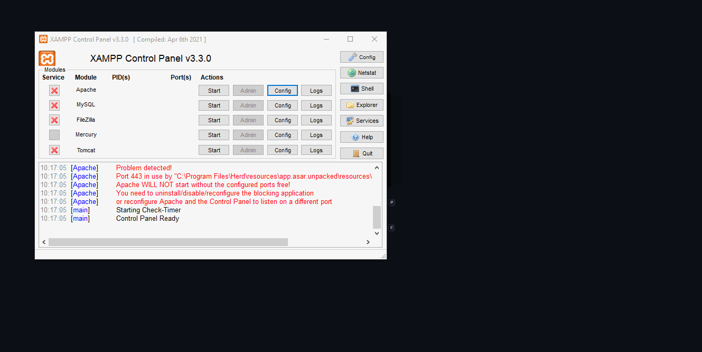

# XAMPP

XAMPP itu perangkat lunak yang membundel beberapa perangkat lunak lainnya.
- X = Cross Planform // Artinya bisa pasang di banyak OS (Windows, Linux, MacOS)
- A = Apache2 // Web Server 
- M = MariaDB atau MySQL // Database + bundle dengan PHPMyAdmin (Database Client buat MySQL)
- P = PHP 
- P = Perl // Gak tahu ini buat apa 

Saya sudah menggunakan laravel herd atau laragon karena saya perlu mengganti versi dari `PHP`, `nodejs` saat mengembangkan aplikasi dengan laravel. Jika saya tetap menggunakan XAMPP saya harus Re-Install terus XAMPP saat butuh pindah versi `PHP` ke yang lama dan baru, ini sangat merepotkan, dengan Laravel Herd dan Laragon ini mempermudah saya bergantian antar berbagai versi `PHP` bahkan versi dari `nodejs` saat membutuhkan kompilasi/build project yang ada Tailwind CSS.
## XAMPP `php.ini`
Biasanya `php.ini` untuk menyalakan beberapa extension PHP yang diperlukan saat pengembangan project tertentu. Biasanya ekstensi yang sering dipakai itu `gd`, `intl`, `pdo_mysql`, `pdo_pgsql`,  `pgsql`, `pdo_sqlite` dan lainnya.  

Berikut contoh mengaktifkan (enable) extension PHP yang saya butuhkan:
