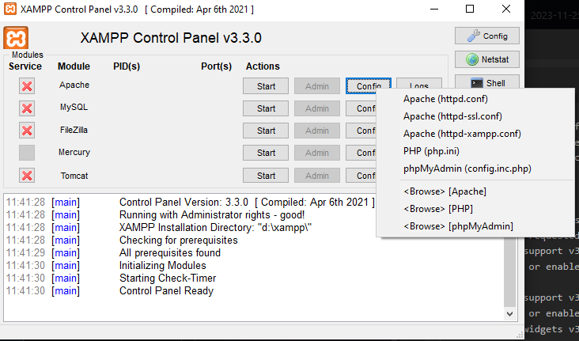
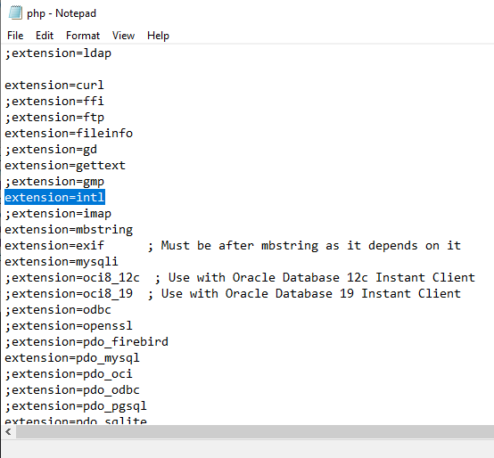
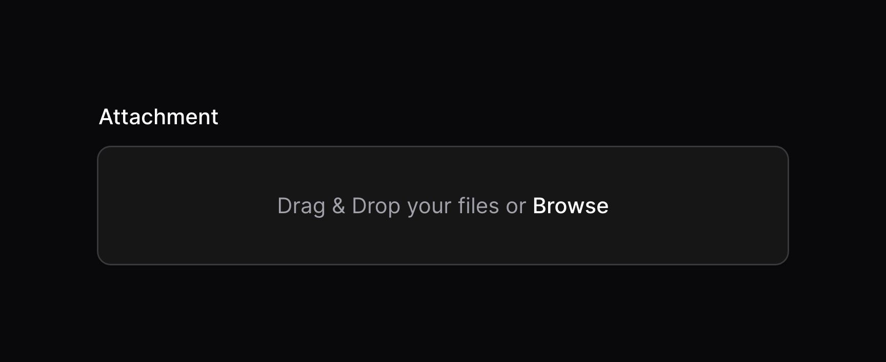
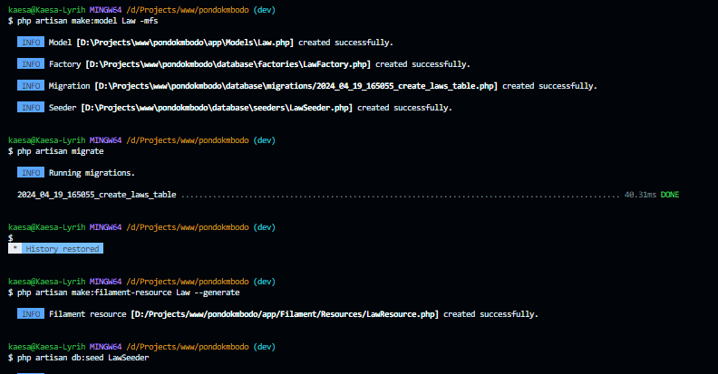
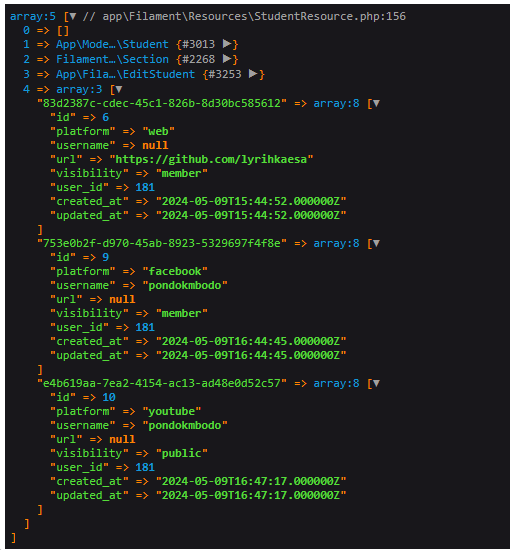
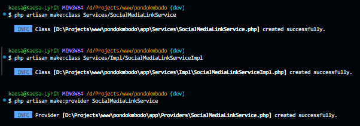
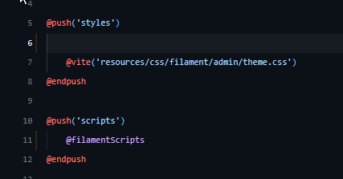

# Filament v3

## Requirements (Kebutuhan)

Filament memerlukan hal-hal berikut agar dapat berjalan:

- PHP 8.1+
- Need Extension PHP
  - `extension=zip`
- Laravel v10.0+
- Livewire v3.0+


:::tip Livewire v3 baru saja dirilis!
Tim Livewire telah melakukan pekerjaan yang sangat baik dalam membuatnya stabil, namun ini merupakan penulisan ulang lengkap dari Livewire v2. Anda mungkin mengalami isu, oleh karena itu kami merekomendasikan untuk menguji aplikasi Anda secara menyeluruh sebelum menggunakan Filament v3 secara produksi.
:::

Pasang Pembangun Panel Filament dengan menjalankan perintah-perintah berikut di directory proyek Laravel Anda:

```bash
composer require filament/filament:"^3.0-stable" -W php artisan
```

```bash
filament:install --panels
```

Hal ini akan membuat dan mendaftarkan [Laravel service provider](https://laravel.com/docs/providers) baru yang disebut `app/Providers/Filament/AdminPanelProvider.php`.

> Jika Anda mendapatkan kesalahan saat mengakses panel Anda, periksa bahwa penyedia layanan tersebut terdaftar di `config/app.php` Anda. Jika tidak, Anda sebaiknya menambahkannya secara manual ke dalam `providers` array.

## Membuat Resource

Simple Resource

```bash
php artisan make:filament-resource Student --simple
```

Resource Standard

```bash
php artisan make:filament-resource Student
```

## Publishing translations (Mempublikasikan penerjemah)

```bash
php artisan vendor:publish --tag=filament-panels-translations
```

`app.php`

```php
 /*
    |--------------------------------------------------------------------------
    | Application Locale Configuration
    |--------------------------------------------------------------------------
    |
    | The application locale determines the default locale that will be used
    | by the translation service provider. You are free to set this value
    | to any of the locales which will be supported by the application.
    |
    */
   
    // 'locale' => 'en', // Default
    'locale' => env('LOCALE', 'en'),
```

`.env`

```env
LOCALE='id' # create new this is not default env
```

```txt
Installing dependencies from lock file (including require-dev)
Verifying lock file contents can be installed on current platform.
Your lock file does not contain a compatible set of packages. Please run composer update.

  Problem 1
    - filament/support is locked to version v3.0.88 and an update of this package was not requested.
    - filament/support v3.0.88 requires ext-intl * -> it is missing from your system. Install or enable PHP's intl extension.
  Problem 2
    - filament/support v3.0.88 requires ext-intl * -> it is missing from your system. Install or enable PHP's intl extension.
    - filament/widgets v3.0.88 requires filament/support v3.0.88 -> satisfiable by filament/support[v3.0.88].
    - filament/widgets is locked to version v3.0.88 and an update of this package was not requested.

To enable extensions, verify that they are enabled in your .ini files:
    - D:\xampp\php\php.ini
You can also run `php --ini` in a terminal to see which files are used by PHP in CLI mode.
Alternatively, you can run Composer with `--ignore-platform-req=ext-intl` to temporarily ignore these required extensions.
```






## `FileUpload`

`FileUpload` field didasarkan pada  [Filepond](https://pqina.nl/filepond).

```php
use Filament\Forms\Components\FileUpload;

FileUpload::make('attachment')
```



### Mengonfigurasi `disk()` dan `directory()` penyimpanan

Secara default, `File` akan diunggah (uploaded) secara `public` ke disk penyimpanan Anda yang ditentukan dalam file [`config/filament.php`](https://filamentphp.com/docs/3.x/forms/installation#publishing-configuration) . Anda juga dapat mengatur `FILAMENT_FILESYSTEM_DISK` pada `.env`  untuk mengubahnya.

```php title="config/filament.php"
return [
	// ... kode lainnya
    /*
    |--------------------------------------------------------------------------
    | Default Filesystem Disk
    |--------------------------------------------------------------------------
    |
    | This is the storage disk Filament will use to put media. You may use any
    | of the disks defined in the `config/filesystems.php`.
    |
    */
    
    'default_filesystem_disk' => env('FILAMENT_FILESYSTEM_DISK', 'public'),
    
    // ... kode lainnya
    ];
```

> **Catatan**
> Untuk menampilkan (preview) gambar dan file lainnya dengan benar, `FilePond` mengharuskan file diberikan dari domain yang sama dengan aplikasi, atau header `CORS` yang sesuai harus ada. Pastikan variabel lingkungan `APP_URL` sudah benar, atau ubah driver [`filesystem`](https://laravel.com/docs/filesystem) untuk menyetel URL yang benar. Jika Anda hosting file di domain terpisah seperti S3, pastikan header CORS sudah disiapkan.
> 
> Jika tidak tampil saat preview gambar, mungkin `storage:link` tidak bekerja dengan benar. Atau `.env` > `APP_URL` tidak sesuai misal menggunakan `http://localhost` atau `http://pondokmbodo.test` atau `https://pondokmbodo.test` pastikan protocol `http`/`https` dan domainnya sesuai.

Untuk mengubah disk dan directory untuk field tertentu, dan visibility file, gunakan method `disk()`, `directory()` dan `visibility()`:

```php
use Filament\Forms\Components\FileUpload;
 
FileUpload::make('attachment')
    ->disk('s3')
    ->directory('form-attachments')
    ->visibility('private'),
    
FileUpload::make('pdf')
    ->disk('local')
    ->directory('pdfs'),
```

> Pengembang bertanggung jawab untuk menghapus file-file ini dari disk jika dihapus, karena Filament tidak mengetahui jika file-file tersebut bergantung pada tempat lain.
> Salah satu cara untuk melakukan ini secara otomatis adalah dengan observing [model event](https://laravel.com/docs/eloquent#events).

### Rename File

```php
use \Livewire\Features\SupportFileUploads\TemporaryUploadedFile;

Forms\Components\FileUpload::make('avatar')
	->getUploadedFileNameForStorageUsing(
        function (TemporaryUploadedFile $file, Forms\Get $get): string {
            $extension = pathinfo($file->getFileName(), PATHINFO_EXTENSION);
            return (string) $get('nik') . '-avatar' . '.' . $extension;
        })
    ->image()
    ->downloadable()
    ->openable()
    ->directory('avatars')
```





## Forms `Section`

### Section `footerActions(actions: [])`

```php
Section::make(__('Website and Social Media'))
	->schema([
		 Forms\Components\Repeater::make('socialMediaLinks')
		 ->schema([
			 // Forms\Components
		 ]),
		 // orther component
    ])
    ->footerActions([
		Action::make('saveSocialMediaLinks')
	        ->action(function ($data, $record, $component, $livewire, Forms\Get $get) {
	            dd([$data, $record, $component, $livewire, $get('socialMediaLinks')]);
				// ...
		    }),
	]),
```






```bash
php artisan make:interface Services/SocialMediaLinkService
```

```bash
php artisan make:class Services/Impl/SocialMediaLinkServiceImpl
```

```bash
php artisan make:provider SocialMediaLinkServiceProvider
```

```bash
php artisan config:clear
```

## Masalah pada Extension `VSCode` `PHP by DEVSENSE`

> Name: PHP
> Id: DEVSENSE.phptools-vscode
> Description: All-in-One PHP support - IntelliSense, Debug, Formatter, Code Lenses, Code Fixes, Linting, Refactoring, PHPUnit Tests, Web Server, and more.
> Version: 1.46.15409
> Publisher: DEVSENSE
> VS Marketplace Link: https://marketplace.visualstudio.com/items?itemName=DEVSENSE.phptools-vscode

Jika terjadi masalah `PHP2014` itu karena ada tanda kurung kosong `()`. Jadi hapus tanda kurung tersebut. 



- Atau anda bisa hiraukan (ignore) pada `setting.json` pada Visual Studio Code. Seperti berikut:
```json
  "php.problems.exclude" : {
     "resources/views/livewire/" : [2014], // error dari directive @filamentStyles() and @filamentScripts()
  }
```


## Avoid Duplicate Queries in Filament Closures For Eloquent Records

You may run into this problem when you want to display or use additional properties from an Eloquent model, but you only have its ID. This may happen with select fields, where the model isn't fully loaded and a user may select any record. Here is a small but notable trick:


## The Scenario

You may have a select field bound to a relation:

```php
Forms\Components\Select::make('company_id')
	->label(__('company.singular'))
	->live()
	->searchable()
	->relationship('company', 'name')
	->required(),
```

Now you want to display the company name, if the user has selected one:

```php
Forms\Components\Placeholder::make('company_name')
	->hidden(fn (Get $get) => ! $get('company_id'))
	->content(fn (Get $get): string => Company::find($get('company_id'))->name ?? ''),
	
Forms\Components\Placeholder::make('company_address')
	->hidden(fn (Get $get) => ! $get('company_id'))
	->content(fn (Get $get): string => Company::find($get('company_id'))->address ?? ''),
```

### The Problem

With the code above, you are firing an additional unnecessary query for every **Company::find()** call. This can lead to a huge **N+1 problem**, depending on how many records or fields you are displaying.

### The Solution

In Laravel 11 and above, you can easily mitigate this problem by caching the response using the **once()** helper in a **static method**:

```php
public static function getCompany(int|string $id) {
	return once(fn () => Company::find($id));
}
```

And use it like so:

```php
Forms\Components\Placeholder::make('company_name')
	->hidden(fn (Get $get) => ! $get('company_id'))
	->content(fn (Get $get): string => static::getCompany($get('company_id'))->name ?? ''),	

Forms\Components\Placeholder::make('company_address')
	->hidden(fn (Get $get) => ! $get('company_id'))
	->content(fn (Get $get): string => static::getCompany($get('company_id'))->address ?? ''),
```

Now you can use and display all available properties in your Eloquent model as much as you like or need. :)