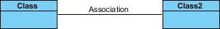

# UML Association vs Aggregation vs Composition

Perhatikan perbedaan dan persamaan classes objects berikut: `pets`, `dogs`, `tails`, `owners`.


Kita dapat melihat relationships/hubungan berikut:

- `owners`(pemilik) memberi makan `pets`(hewan peliharaan), `pets`(hewan peliharaan) tolong `owners`(pemiliknya) (`association`(asosiasi))
- `tail`(ekor) merupakan `part`(bagian) dari `dogs`(anjing) dan `cats`(kucing) (`aggregation` (agregasi) / `composition` (komposisi))
- `cat`(kucing) adalah sejenis `pet`(hewan peliharaan) (`inheritance`(pewarisan) / `generalization`(generalisasi)).

Gambar di bawah menunjukkan tiga jenis association connectors: `association`, `aggregation`, dan `composition`. Kami akan membahas dalam panduan UML ini:  
  
  


Gambar di bawah menunjukkan `generalization`. Kami akan membicarakan nanti di panduan UML ini:


Jika di bahasa pemprograman maksud dari generalization di atas adalah `Class2` inheritance/mewarisi `Class`.

## Association (Asosiasi)

Jika dua `classes` dalam sebuah model perlu berkomunikasi satu sama lain, harus ada hubungan di antara mereka, dan hal ini dapat direpresentasikan dengan sebuah `association` (`connector`).

`Association` dapat direpresentasikan dengan sebuah garis antara kelas-kelas tersebut dengan panah yang menunjukkan arah navigasi. Jika ada panah di kedua sisi, `association` tersebut dikenal sebagai `association` dua arah (`bidirectional association`).

Kita dapat menunjukkan `multiplicity` dari sebuah `association` dengan menambahkan hiasan `multiplicity` pada garis yang menunjukkan `association` tersebut. Contohnya menunjukkan bahwa seorang `Student` memiliki satu atau lebih `Instructor`:

Seorang `Student` tunggal dapat berhubungan dengan beberapa `Instructor` (One to One or Many):  
  
Contoh ini menunjukkan bahwa setiap `Instructor` memiliki satu atau lebih `Student`:  
  
Kita juga dapat menunjukkan perilaku sebuah objek dalam sebuah `association` (misalnya, `role` sebuah `objects`) menggunakan nama peran (role names).  


- `Studet` belajar dari `Instructor`
- `Instructor` mengajari `Student`

## Association vs Aggregation vs Composition

> Asosiasi vs Agregasi vs Komposisi

Pertanyaan "Apa perbedaan antara `association`, `aggregation`, dan `composition`" sering ditanyakan belakangan ini.

`aggregation` dan `composition` adalah bagian dari `association`, yang berarti mereka adalah kasus khusus dari `association`. Dalam `aggregation` dan `composition`, objek dari satu kelas "memiliki" objek dari kelas lain. Namun, ada perbedaan halus:

- **`aggregation`** menunjukkan hubungan di mana child dapat exist secara independen dari parent. Contoh: class `Parent` (parent) dan `Student` (child). Jika class `Parent` dihapus, class `Student` tetap ada.
- **`composition`** menunjukkan hubungan di mana child tidak dapat exist secara independen dari parent. Contoh: `House` (parent) dan `Room` (child). `Room` tidak ada secara terpisah dari `House`.

**Contoh `composition`:**  
Kita harus lebih spesifik dan menggunakan `composition` link dalam kasus di mana selain hubungan bagian dari antara `Class A` dan `Class B` - ada ketergantungan siklus hidup yang kuat di antara keduanya, yang berarti bahwa ketika `Class A` dihapus, maka `Class B` juga dihapus sebagai akibatnya.  


Dapat dilihat contoh class `Person` di atas, jika Anda menghapus `Person` maka class `Head`, `Hand`, `Leg` akan ikutan terhapus karena menggunakan hubungan `composition`.

**Contoh `aggregation`:**  
Penting untuk dicatat bahwa tautan `aggregation` tidak menyatakan dengan cara apa pun bahwa `Class A` memiliki `Class B` atau bahwa ada hubungan **parent-child** (ketika parent dihapus, semua children's dihapus sebagai akibatnya) antara keduanya. Sebenarnya, justru sebaliknya! Tautan `aggregation` biasanya digunakan untuk menekankan bahwa instance `Class A` bukan satu-satunya wadah dari instance `Class B`, karena sebenarnya instance `Class B` yang sama memiliki wadah lain.  


**Kesimpulan:**  
Secara ringkas, `association` adalah istilah yang sangat umum digunakan untuk menggambarkan ketika satu kelas menggunakan fungsionalitas yang disediakan oleh kelas lain. Kita menyebutnya `composition` jika objek kelas parent memiliki objek kelas child dan objek kelas child tersebut tidak dapat bermakna exist tanpa objek kelas parent. Jika bisa, maka disebut `aggregation`.

## Generalization vs Specialization

> Generalisasi vs Spesialisasi

**Generalisasi** adalah mekanisme untuk menggabungkan kelas-kelas objek yang serupa ke dalam satu kelas yang lebih umum. Generalisasi mengidentifikasi kesamaan di antara sekumpulan entitas. Kesamaan tersebut bisa berupa atribut, perilaku, atau keduanya. Dengan kata lain, sebuah kelas induk (superclass) memiliki atribut, operasi, dan hubungan yang paling umum yang dapat dibagikan dengan kelas turunan (subclass). Kelas turunan mungkin memiliki atribut dan operasi yang lebih spesifik.

**Spesialisasi** adalah proses kebalikan dari Generalisasi, yaitu menciptakan kelas turunan baru dari kelas yang sudah ada.

Contoh: Sebuah `Bank Account` memiliki dua jenis - `Savings Account` dan `Credit Card Account`. `Savings Account` dan `Credit Card Account` mewarisi properti umum/tergeneralisasi seperti Account Number, Account Balance, dll. Dari sebuah `Bank Account` dan juga memiliki properti khusus mereka sendiri seperti pembayaran yang belum diselesaikan, dll.


## Generalization vs Inheritance

> Generalisasi vs Pewarisan

Generalisasi adalah istilah yang kita gunakan untuk menunjukkan abstraksi dari properti umum ke dalam kelas dasar dalam UML. Asosiasi generalisasi dalam diagram UML juga dikenal sebagai `Inheritance/Pewarisan`. Ketika kita mengimplementasikan Generalisasi dalam bahasa pemrograman, itu sering disebut sebagai `Inheritance`. Generalisasi dan pewarisan adalah hal yang sama. Terminologi ini hanya berbeda tergantung pada konteks penggunaannya.

## Contoh dalam PHP Laravel

### Association (Asosiasi) A

Asosiasi adalah hubungan antara dua kelas yang memungkinkan satu kelas untuk berkomunikasi dengan kelas lain. Dalam konteks PHP Laravel, asosiasi bisa dilihat dalam bentuk relasi antara model.

**Contoh:**  
Misalkan kita memiliki model `User` dan `Profile`. Seorang `User` dapat memiliki satu `Profile`.


```php
// User.php
class User extends Model
{
    public function profile(): HasOne
    {
        return $this->hasOne(Profile::class);
    }
}
```

```php
// Profile.php
class Profile extends Model
{
    public function user(): BelongTo
    {
        return $this->belongsTo(User::class);
    }
}
```

### Aggregation (Agregasi)

Agregasi adalah hubungan di mana satu objek dapat eksis secara independen dari objek lain. Misalnya, sebuah `Course` dapat memiliki banyak `Student`, tetapi menghapus `Course` tidak akan menghapus `Student`.

**Contoh:**


```php
// Course.php
class Course extends Model
{
    public function students(): BelongToMany
    {
        return $this->belongsToMany(Student::class);
    }
}
```

```php
// Student.php
class Student extends Model
{
    public function courses(): BelongToMany
    {
        return $this->belongsToMany(Course::class);
    }
}
```

### Composition (Komposisi)

Komposisi adalah hubungan di mana satu objek tidak dapat eksis tanpa objek lain. Misalnya, sebuah `Order` memiliki beberapa `Item`, dan menghapus `Order` akan menghapus `Item`.

**Contoh:**


```php
// Order.php
class Order extends Model
{
    public function items(): HasMany
    {
        return $this->hasMany(Item::class);
    }
}
```

```php
// Item.php
class Item extends Model
{
    public function order(): BelongsTo
    {
        return $this->belongsTo(Order::class);
    }
}
```

### Generalization vs Specialization (Generalisasi vs Spesialisasi)

Generalisasi adalah proses mengabstraksi properti umum ke dalam kelas dasar. Spesialisasi adalah proses membuat sub-kelas dari kelas dasar tersebut.

**Contoh:**  
Misalkan kita memiliki kelas dasar `Account` dengan kelas turunan `SavingsAccount` dan `CreditCardAccount`.


```php
// Account.php
abstract class Account extends Model
{
    protected $accountNumber;
    protected $balance;

    // common methods
}
```

```php
// SavingsAccount.php
class SavingsAccount extends Account
{
    private $interestRate;

    // specific methods
}
```

```php
// CreditCardAccount.php
class CreditCardAccount extends Account
{
    private $creditLimit;

    // specific methods
}
```

### Generalization vs Inheritance (Generalisasi vs Pewarisan)

Generalisasi dalam UML dikenal sebagai Pewarisan dalam pemrograman. Ketika kita mengimplementasikan generalisasi dalam PHP, itu disebut pewarisan.

**Contoh:**  
Misalkan kita memiliki kelas dasar `Vehicle` dan kelas turunan `Car` dan `Bike`.


```php
// Vehicle.php
abstract class Vehicle
{
    protected $make;
    protected $model;

    // common methods
}
```

```php
// Car.php
class Car extends Vehicle
{
    private $numberOfDoors;

    // specific methods
}
```

```php
// Bike.php
class Bike extends Vehicle
{
    private $type;

    // specific methods
}
```
