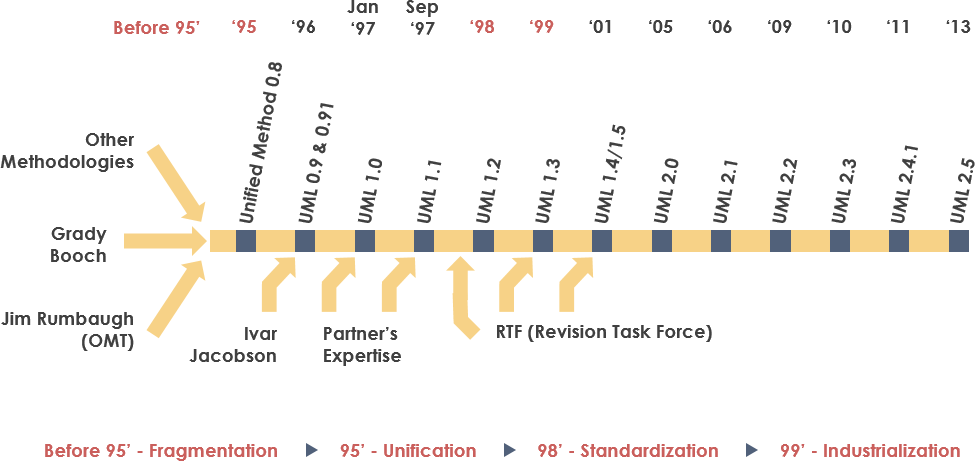
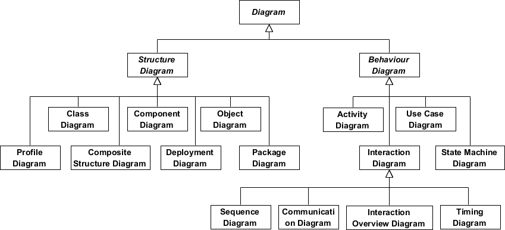
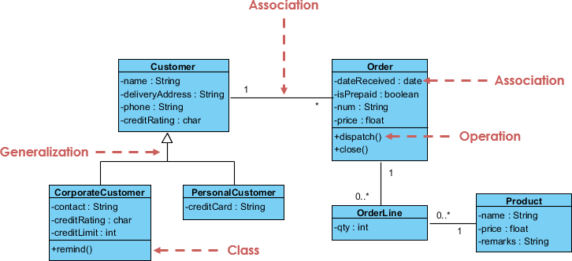
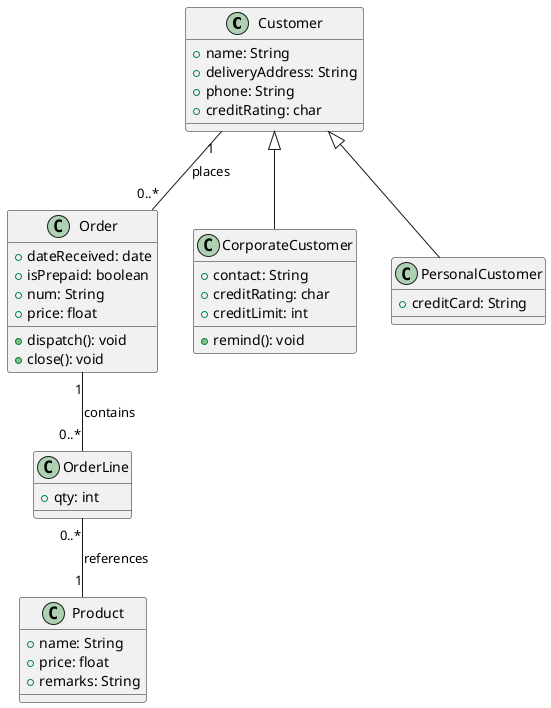
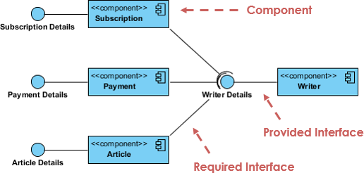
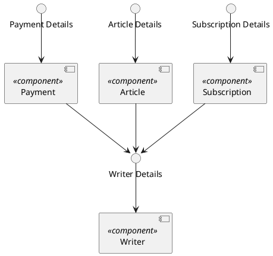

# Apa itu Unified Modeling Language (UML)?

**UML**, singkatan dari **Unified Modeling Language**, adalah sebuah bahasa pemodelan standar yang terdiri dari sekumpulan diagram terintegrasi. Bahasa ini dikembangkan untuk membantu pengembangan sistem dan perangkat lunak dalam **menspesifikasi, memvisualisasikan, membangun, dan mendokumentasikan artefak-artefak dari sistem perangkat lunak**, serta untuk **pemodelan bisnis** dan sistem non-perangkat lunak lainnya.

UML mewakili kumpulan praktik rekayasa terbaik yang telah terbukti berhasil dalam memodelkan sistem besar dan kompleks. UML adalah bagian yang sangat penting dalam **pengembangan perangkat lunak berorientasi objek** dan proses pengembangan perangkat lunak secara keseluruhan. UML sebagian besar menggunakan notasi grafis untuk mengekspresikan desain dari proyek perangkat lunak.

Menggunakan UML membantu tim proyek untuk berkomunikasi, mengeksplorasi potensi desain, dan memvalidasi desain architectural perangkat lunak. Dalam artikel ini, kami akan memberikan Anda gambaran mendetail tentang apa itu UML, sejarah UML, serta penjelasan mengenai setiap jenis diagram UML disertai dengan contoh UML.

## Asal Usul UML

Tujuan UML adalah untuk menyediakan **notasi standar** yang dapat digunakan oleh semua metode berorientasi objek, serta untuk memilih dan mengintegrasikan element-element terbaik dari notasi pendahulunya. UML dirancang untuk berbagai jenis aplikasi. Oleh karena itu, UML menyediakan konstruksi untuk berbagai jenis sistem dan aktivitas (misalnya, sistem terdistribusi, analisis, desain sistem, dan penerapan).
UML adalah sebuah notasi yang muncul dari penyatuan beberapa metode, yaitu:

1. Object Modeling Technique (OMT) [James Rumbaugh, 1991]
   - Terbaik untuk analisis dan sistem informasi yang intensif data.
2. Booch Method [Grady Booch, 1994]
   - Sangat baik untuk desain dan implementasi. Grady Booch banyak bekerja dengan bahasa Ada dan menjadi pemain utama dalam pengembangan teknik berorientasi objek untuk bahasa tersebut. Meskipun metode Booch kuat, notasinya kurang diterima dengan baik karena penggunaan banyak bentuk awan yang mendominasi modelnya, sehingga terlihat kurang rapi.
3. Object-Oriented Software Engineering (OOSE) [Ivar Jacobson, 1992]
   - Menampilkan model yang dikenal sebagai **Use Cases**. Use Cases adalah teknik yang sangat kuat untuk memahami perilaku dari seluruh sistem, sebuah area yang secara tradisional menjadi kelemahan pendekatan berorientasi objek.

Pada tahun 1994, Jim Rumbaugh, pencipta OMT, mengejutkan dunia perangkat lunak ketika ia meninggalkan General Electric dan bergabung dengan Grady Booch di Rational Corp. Tujuan dari kemitraan ini adalah untuk menyatukan ide-ide mereka ke dalam sebuah metode terpadu (judul sementara untuk metode ini adalah "Unified Method")

Pada tahun 1995, Ivar Jacobson, pencipta OOSE, juga bergabung dengan Rational. Ide-idenya, terutama konsep "Use Cases", dimasukkan dalam metode terpadu yang baru, yang sekarang disebut Unified Modeling Language (UML). Tim yang terdiri dari Rumbaugh, Booch, dan Jacobson dikenal dengan sebutan "Tree Amigos".

UML juga dipengaruhi oleh notasi berorientasi objek lainnya, seperti:

- Mellor dan Shlaer (1998)
- Coad dan Yourdon (1995)
- Wirfs-Brock (1990)
- Martin dan Odell (1992)

UML juga mencakup konsep-konsep baru yang tidak terdapat pada metode utama lainya saat itu, seperti mekanisme ekstensi dan bahasa pembatasan.

## Sejarah UML

Pada tahun 1996, permintaan proposal pertama (**Request for Proposal** atau **RFP**) yang diterbitkan oleh **Object Management Group (OMG)** menjadi katalisator bagi berbagai organisasi untuk bekerja sama dalam menghasilkan tanggapan bersama terhadap RFP tersebut.

**Rational Software** membentuk konsorsium **UML Partners** bersama beberapa organisasi lain yang bersedia mengalokasikan sumber daya untuk mendefinisikan UML 1.0 secara kuat. Organisasi yang memberikan kontribusi terbesar untuk definisi UML 1.0 meliputi:

- Digital Equipment Corp
- HP
- i-Logix
- IntelliCorp
- IBM
- ICON Computing
- MCI Systemhouse
- Microsoft
- Oracle
- Rational Software
- TI
- Unisys

Kolaborasi ini menghasilkan UML 1.0, sebuah bahasa pemodelan yang **terdefinisi dengan baik, ekspresif, kuat, dan berlaku secara umum**. Bahasa ini diajukan kepada OMG pada Januari 1997 sebagai tanggapan awal terhadap RFP.

Pada bulan Januari 1997, perusahaan lain seperti **IBM, ObjecTime, Platinum Technology, Ptech, Taskon, Reich Technologies**, dan **Softeam** juga mengajukan tanggapan RFP mereka masing-masing kepada OMG. Perusahaan-perusahaan ini kemudian bergabung dengan **UML Partners** untuk memberikan ide-ide mereka. Bersama-sama, mereka menghasilkan tanggapan revisi untuk UML 1.1.

Fokus dari rilis UML 1.1 adalah untuk **meningkatkan kejelasan semantik UML 1.0** dan **mengintegrasikan kontribusi dari mitra baru**. Versi ini diajukan kepada OMG untuk dipertimbangkan dan akhirnya diadopsi pada musim gugur tahun 1997.

Setelah itu, UML terus dikembangkan dari versi 1.1 ke 1.5, kemudian menjadi UML 2.1 pada tahun 2001 hingga 2006. Saat ini, versi terbaru UML adalah **UML 2.5**.

## Mengapa UML?

Seiring dengan meningkatnya nilai strategis perangkat lunak bagi banyak perusahaan, industri mencari teknik untuk **mengotomatisasi produksi perangkat lunak**, **meningkatkan kualitas**, serta **mengurangi biaya dan waktu ke pasar**. Teknik-teknik ini mencakup teknologi komponen, pemrograman visual, pola, dan kerangka kerja.

Selain itu, bisnis juga membutuhkan teknik untuk **mengelola kompleksitas sistem** yang semakin bertambah dalam cakupan dan skala. Secara khusus, mereka menyadari perlunya menyelesaikan masalah arsitektural yang sering terjadi, seperti **distribusi fisik, concurrency (keserempakan), replikasi, keamanan, load balancing**, dan **fault tolerance (ketahanan terhadap kegagalan)**.

Pengembangan untuk **World Wide Web** (WWW), meskipun membuat beberapa hal lebih sederhana, juga memperburuk masalah arsitektural ini. **Unified Modeling Language (UML)** dirancang untuk menjawab kebutuhan-kebutuhan ini.

Tujuan utama dalam perancangan UML dirangkum oleh **Page-Jones** dalam bukunya _Fundamental Object-Oriented Design in UML_ sebagai berikut:

1. **Menyediakan bahasa pemodelan visual yang siap digunakan dan ekspresif** sehingga pengguna dapat mengembangkan dan bertukar model yang bermakna.
2. **Menyediakan mekanisme untuk ekstensibilitas dan spesialisasi** guna memperluas konsep inti.
3. **Bersifat independen** dari bahasa pemrograman tertentu dan proses pengembangan tertentu.
4. **Menyediakan dasar formal** untuk memahami bahasa pemodelan.
5. **Mendorong pertumbuhan pasar alat bantu berorientasi objek** (OO tools).
6. **Mendukung konsep pengembangan tingkat tinggi**, seperti kolaborasi, kerangka kerja, pola, dan komponen.
7. **Mengintegrasikan praktik terbaik** dalam pengembangan perangkat lunak.

## UML - Gambaran Umum

Sebelum kita mulai membahas teori UML, mari kita lihat secara singkat beberapa konsep utama dalam UML.

Hal pertama yang perlu diperhatikan tentang UML adalah terdapat **banyak jenis diagram (model)** yang perlu dipahami. Alasannya adalah karena sebuah sistem dapat dilihat dari banyak sudut pandang yang berbeda. Dalam pengembangan perangkat lunak, terdapat berbagai pemangku kepentingan yang berperan.

**Contoh pemangku kepentingan:**

- **Analis**
- **Desainer**
- **Programmer (Coder)**
- **Penguji (Tester)**
- **Tim Jaminan Kualitas (QA)**
- **Pelanggan (Customer)**
- **Penulis Teknis (Technical Authors)**

Semua pihak ini tertarik pada aspek yang berbeda dari sistem, dan masing-masing membutuhkan tingkat detail yang berbeda. Misalnya, seorang **programmer** perlu memahami desain sistem dan mampu mengubah desain tersebut ke dalam kode tingkat rendah. Sebaliknya, seorang **penulis teknis** lebih tertarik pada perilaku sistem secara keseluruhan dan perlu memahami cara produk berfungsi.

**UML** berusaha menyediakan **bahasa yang cukup ekspresif** sehingga setiap pemangku kepentingan dapat memanfaatkan setidaknya satu diagram UML.

### Struktur UML 2.0

Berikut gambaran singkat dari masing-masing **13 diagram UML** yang ditampilkan dalam struktur diagram UML 2.0:

#### Diagram Struktur (Structure Diagrams)

Diagram struktur menunjukkan **struktur statis** dari sistem dan bagian-bagiannya pada berbagai tingkat abstraksi dan implementasi, serta bagaimana mereka saling berhubungan. Elemen-elemen dalam diagram struktur merepresentasikan konsep bermakna dari sistem, yang dapat mencakup konsep abstrak, dunia nyata, dan implementasi. Terdapat **7 jenis diagram struktur** sebagai berikut:

1. **Diagram Kelas (Class Diagram)**
2. **Diagram Komponen (Component Diagram)**
3. **Diagram Deployment (Deployment Diagram)**
4. **Diagram Objek (Object Diagram)**
5. **Diagram Paket (Package Diagram)**
6. **Diagram Struktur Komposit (Composite Structure Diagram)**
7. **Diagram Profil (Profile Diagram)**

#### Diagram Perilaku (Behavior Diagrams)

Diagram perilaku menunjukkan **perilaku dinamis** dari objek-objek dalam sebuah sistem, yang dapat digambarkan sebagai serangkaian perubahan pada sistem dari waktu ke waktu. Terdapat **7 jenis diagram perilaku** sebagai berikut:

1. **Diagram Use Case**
2. **Diagram Aktivitas (Activity Diagram)**
3. **Diagram State Machine**
4. **Diagram Sekuensial (Sequence Diagram)**
5. **Diagram Komunikasi (Communication Diagram)**
6. **Diagram Ikhtisar Interaksi (Interaction Overview Diagram)**
7. **Diagram Waktu (Timing Diagram)**

### Apa itu Diagram Kelas?

**Diagram kelas** adalah teknik pemodelan utama yang menjadi inti dari hampir semua metode berorientasi objek. Diagram ini menggambarkan jenis-jenis objek dalam sistem dan berbagai jenis **hubungan statis** yang ada di antara mereka.

### Hubungan

Terdapat tiga jenis hubungan utama yang penting dalam diagram kelas:

1. **Asosiasi (Association)**
   - Mewakili hubungan antara instance dari jenis-jenis tertentu.  
      Contoh:
     - Seorang **orang** bekerja untuk sebuah **perusahaan**.
     - Sebuah **perusahaan** memiliki sejumlah **kantor**.
2. **Pewarisan (Inheritance)**
   - Penambahan paling jelas pada diagram ER (Entity-Relationship) untuk digunakan dalam desain berorientasi objek (OO).
   - Berhubungan langsung dengan pewarisan dalam desain OO.
3. **Agregasi (Aggregation)**
   - Sebuah bentuk **komposisi objek** dalam desain berorientasi objek.  
      Contoh: Sebuah **kelas** dapat memiliki **metode** dan **atribut** sebagai bagian dari komponennya.

#### Penjelasan Elemen:

1. **Kelas Utama:**
   - `Customer`:
     - Atribut: `name`, `deliveryAddress`, `phone`, `creditRating`.
   - `Order`:
     - Atribut: `dateReceived`, `isPrepaid`, `num`, `price`.
     - Operasi: `dispatch()`, `close()`.
   - `Product`:
     - Atribut: `name`, `price`, `remarks`.
2. **Kelas Turunan:**
   - `CorporateCustomer` (Turunan dari `Customer`):
     - Atribut: `contact`, `creditRating`, `creditLimit`.
     - Operasi: `remind()`.
   - `PersonalCustomer` (Turunan dari `Customer`):
     - Atribut: `creditCard`.
3. **Kelas Asosiasi:**
   - `OrderLine`:
     - Atribut: `qty`.

#### Jenis Hubungan:

1. **Generalization (Inheritance):**
   - `CorporateCustomer` dan `PersonalCustomer` merupakan turunan dari `Customer`.
2. **Asosiasi:**
   - Hubungan antara `Customer` dan `Order` (1 ke 0..\*).
   - Hubungan antara `Order` dan `OrderLine` (0..\* ke 1).
   - Hubungan antara `OrderLine` dan `Product` (0..\* ke 1).
3. **Operasi:**
   - Operasi seperti `dispatch()` dan `close()` ada dalam kelas `Order`.

Catatan:

- Generalizaition (Umum)
- Inheritance (Turunan)
- Asosiasi (Hubungan)
- Operasi (Method/Function didalam class)
- Attribute (Variable/Parameter didalam class)

### Apa itu Diagram Komponen?

Dalam **Unified Modeling Language (UML)**, **diagram komponen** menggambarkan bagaimana komponen-komponen disusun dan dihubungkan untuk membentuk komponen yang lebih besar atau sistem perangkat lunak. Diagram ini mengilustrasikan **arsitektur komponen perangkat lunak** serta **dependensi** di antara mereka.

Komponen perangkat lunak yang dimaksud mencakup:

- **Komponen run-time**,
- **Komponen yang dapat dieksekusi**,
- **Komponen kode sumber (source code)**.

#### Penjelasan:

1. **Komponen:**
   - `Subscription`, `Payment`, `Writer`, dan `Article` adalah komponen perangkat lunak.
2. **Antarmuka:**
   - `Subscription Details`, `Payment Details`, `Writer Details`, dan `Article Details` adalah antarmuka yang digunakan untuk menggambarkan dependensi dan layanan.
3. **Hubungan:**
   - Panah menandakan hubungan **required interface** (antarmuka yang dibutuhkan oleh komponen) dan **provided interface** (antarmuka yang disediakan oleh komponen).
