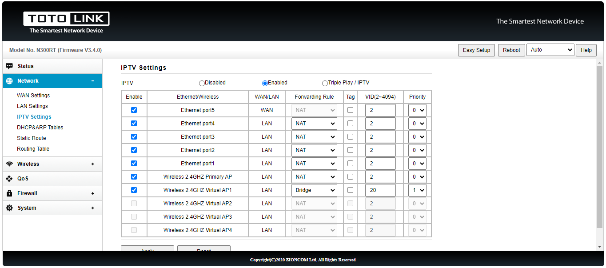

# Router Totolink N300RT

## Mengatur Remote Management lewat Mikrotik

- Masuk ke dashboard router totolink dari client dulu.
- Lalu klik tombol `Advanced Setup`
- Lalu klik tombol sidebar `Network` > `WAN Settings`
  - ☑ Enable Ping Access on WAN
  - ☑ Enable Web Server Access on WAN
- Untuk mengakses lewat jaringan mikrotik bisa menggunakan `IP PPPoE Milik Client:8080`. Misal: [http://192.168.33.2:8080](http://192.168.33.2:8080)

## Mengatur Dual SSID untuk PPPoE dan Hotspot

- `Wireless` > `Basic Setting`
  Ini adalah Access Point untuk PPPoE. Nama lain: `Wireless 2.4GHZ Primary AP`
- `Wireless` > `Multiple SSID 1`
  Ini adalah Access Point untuk Hotspot. Nama lain: `Wireless 2.4GHZ Virtual AP1`
- `Network` > `IPTV Settings` > `Enabled`
  
