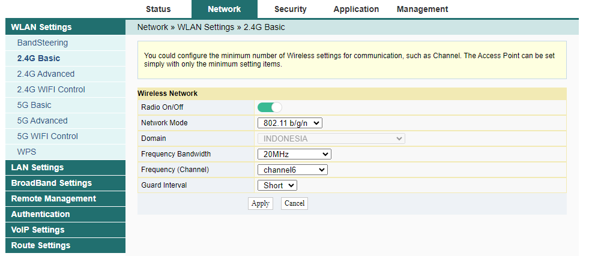
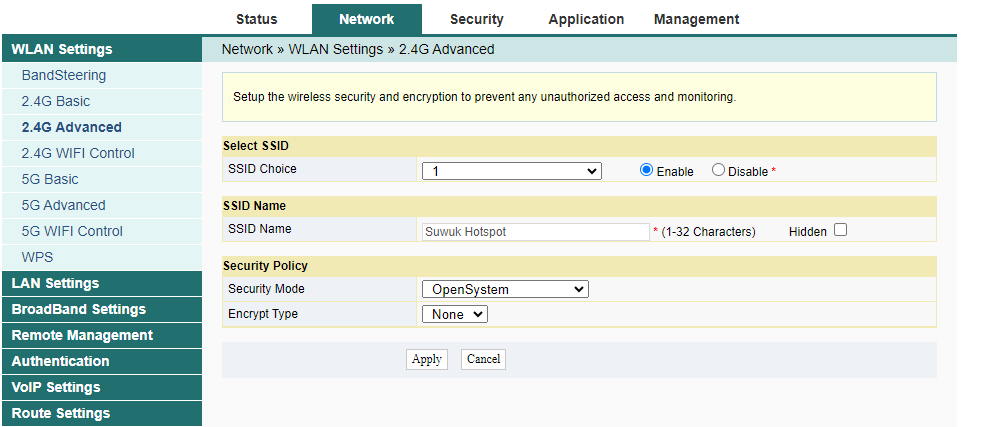
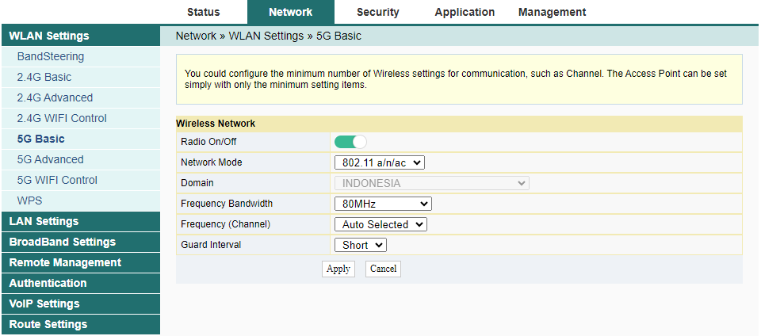
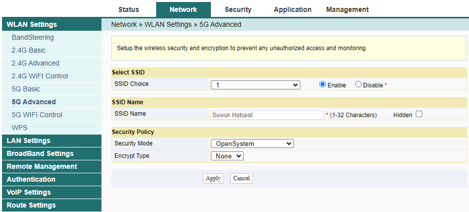
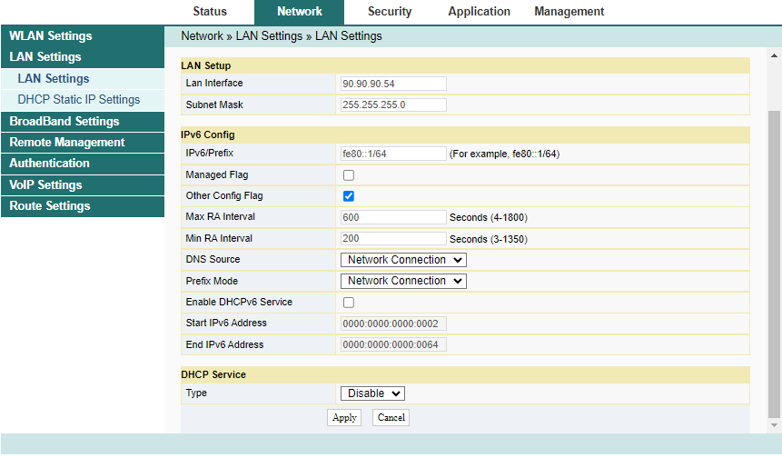
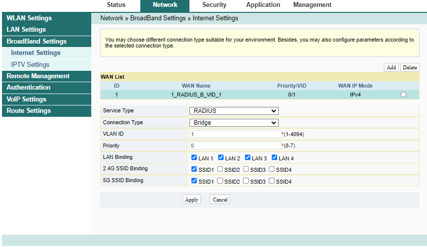

# Router ONT Fiberhome HG6145F

## Reset
- Tekan tombol reset dengan jarum selama 5-15 detik, sampai LED Power mati, tunggu beberapa saat nanti akan reset.

| Name  | Username | Password            |
| ----- | -------- | ------------------- |
| User  | `user`   | `user1234`          |
| Admin | `admin`  | `%0\|F?H@f!berhO3e` |
192.168.1.1
http://[fe80::1]/html/login_inter.html

| Device Information |                 |
| ------------------ | --------------- |
| Software Version   | RP2944          |
| Hardware Version   | WKE2.094.373A01 |
| Device Model       | HG6145F         |
| Device Description | GPON            |
| Serial Number      | FHTT9B084BA8    |
| ONU State          | O1(Intial)      |
| ONU Regist State   | INIT            |
| LOID               | fiberhome       |
| CPU Usage          | 7%              |
| Memory Usage       | 31.88%          |
| Web Server port    | 80              |

