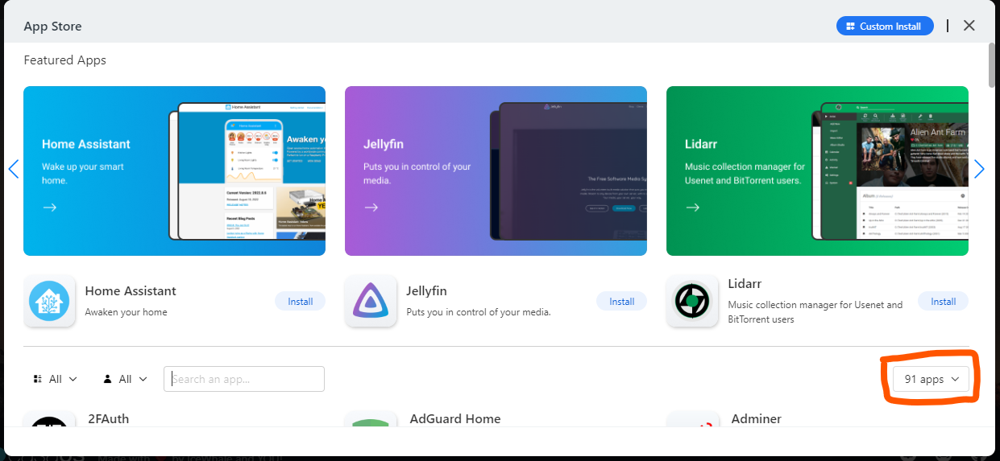
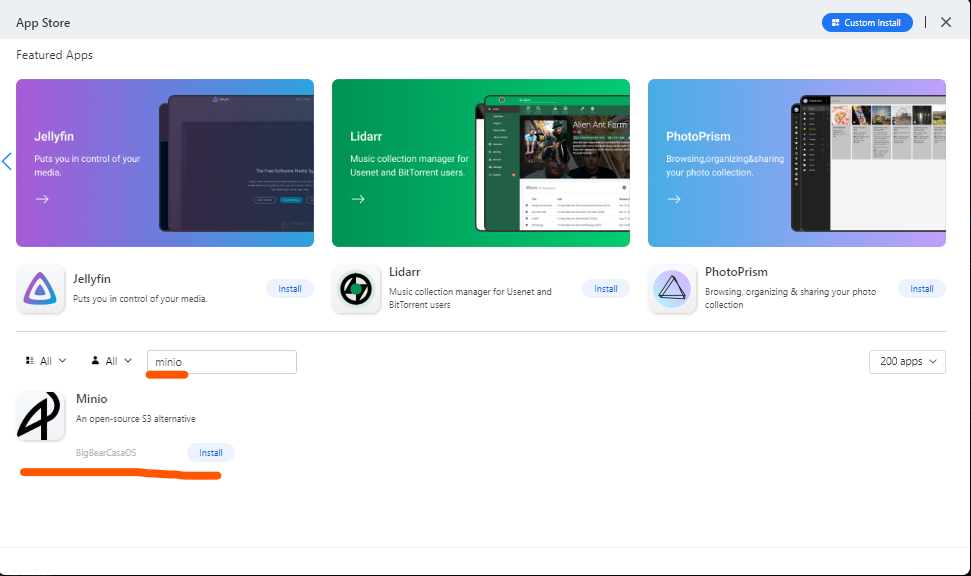

# `MinIO`

## Pemasangan `MinIO` pada `CasaOS`

Pada App Store jika kita mencari dengan keyword `minio` tidak ditemukan karena secara default `app store` pada `CasaOS` tidak ada, maka kita perlu menambahkan dependency apps baru pada `CasaOS`.


```txt
https://github.com/bigbeartechworld/big-bear-casaos/archive/refs/heads/master.zip
```

Jika loading lama, silahkan `close` lalu `open` lagi `App Store CasaOS`. Jika sudah ada `200 Apps` berarti sudah berhasil menambahkannya.






Setelah muncul `Minio` silahkan klik `Install` tunggu beberapa saat sampai selesai. 

```text
MINIO_BROWSER_REDIRECT_URL="http://minio.pondokmbodo.local"
MINIO_ROOT_PASSWORD=minioadmin
MINIO_ROOT_USER=minioadmin
MINIO_SERVER_URL="http://s3.pondokmbodo.local"
```

