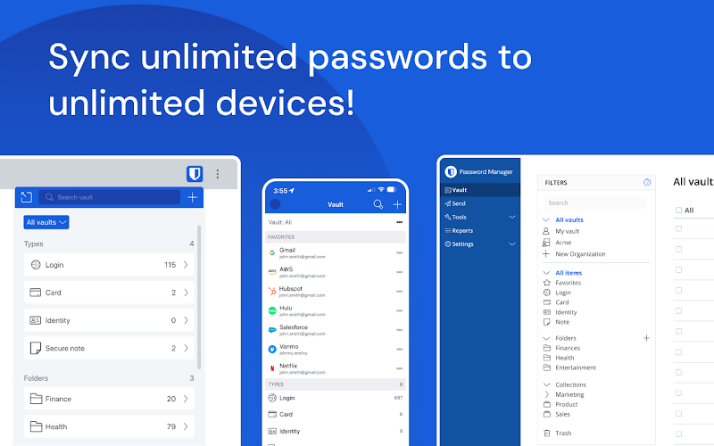
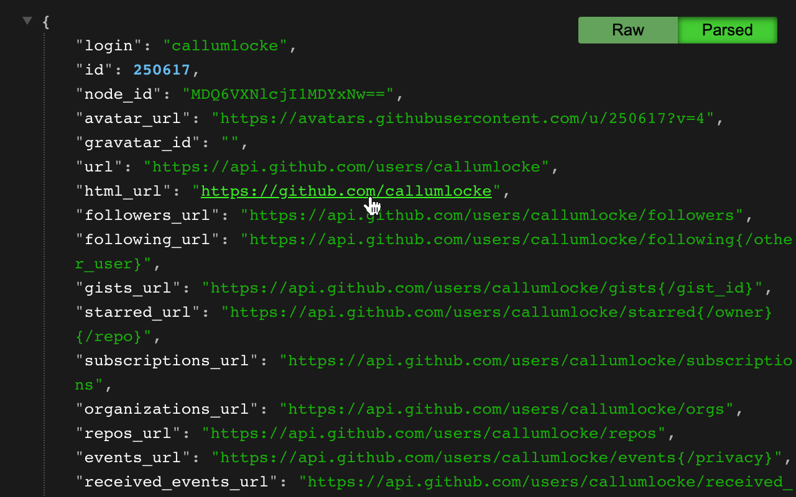
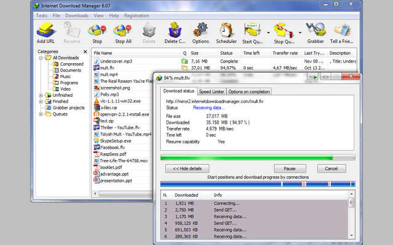
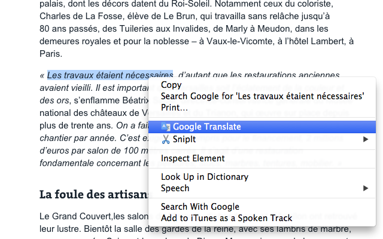
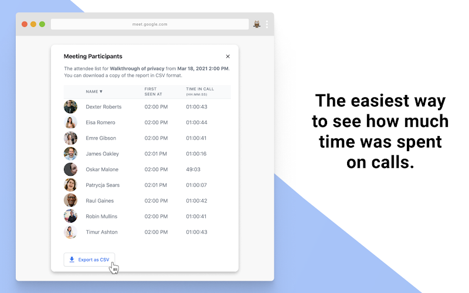

# Extensions Chromium

Ini adalah daftar ekstensi yang saya pakai di browser `chromium base` seperti `Chrome`, `Microsoft Edge`, dan `Brave`.
- [Chrome Extensions](chrome://extensions/)
- [Edge Extensions](edge://extensions/)
- [Brave Extensions](brave://extensions/)
## [Bitwarden - Free Password Manager](https://chromewebstore.google.com/detail/bitwarden-pengelola-sandi/nngceckbapebfimnlniiiahkandclblb)

Digunakan untuk mengelola kata sandi akun saya, keluarga, teman, dan tempat kerja saya.

## [JSON Formatter](https://chromewebstore.google.com/detail/json-formatter/bcjindcccaagfpapjjmafapmmgkkhgoa)

Membuat mudah membaca JSON saat `GET` data lewat browser. 

## [IDM Integration Module](https://chromewebstore.google.com/detail/idm-integration-module/ngpampappnmepgilojfohadhhmbhlaek)

Supaya bisa menggunakan IDM di browser.

## [Google Translate](https://chromewebstore.google.com/detail/google-terjemahan/aapbdbdomjkkjkaonfhkkikfgjllcleb)

Yeah buat menerjemahkan bahasa.

## [Stylish](https://chromewebstore.google.com/detail/stylish-custom-themes-for/fjnbnpbmkenffdnngjfgmeleoegfcffe?pli=1)

Supaya bisa mengedit tema desain website yang sering Saya kunjungi supaya lebih mudah saya gunakan.

🌟 Used: `Chrome` > `Mahasiswa Profile`

## [Google Meet Attendance List](https://chromewebstore.google.com/detail/google-meet-attendance-li/appcnhiefcidclcdjeahgklghghihfok)

Buat absensi di google meet saja.

🌟 Used: `Chrome` > `Mahasiswa Profile`

