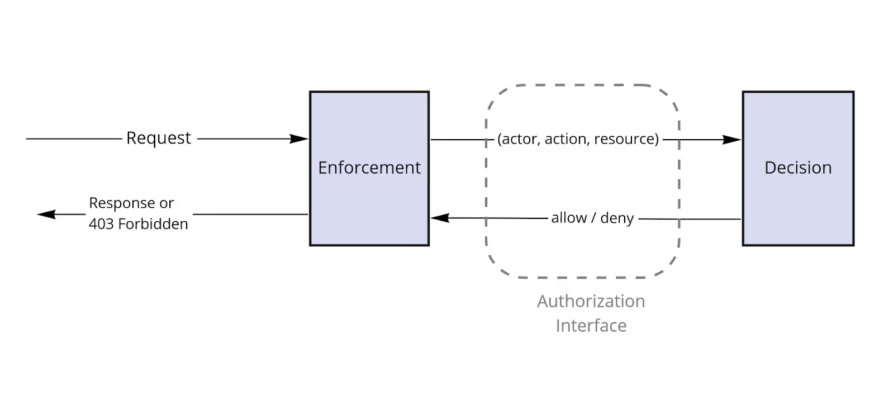

# Apa itu Otorisasi?
Otorisasi adalah mekanisme untuk mengendalikan siapa yang dapat melakukan apa di dalam sebuah aplikasi. Ini adalah cara untuk memastikan bahwa pengguna hanya memiliki akses ke data milik mereka sendiri, dan tidak diizinkan untuk melihat data yang bukan milik mereka. Terdapat serangkaian pola arsitektur otorisasi yang umum dan dapat diterapkan pada berbagai arsitektur aplikasi — dengan mengetahui pola-pola tersebut, penulisan kode otorisasi akan menjadi jauh lebih mudah. Panduan ini akan mengajarkan pola-pola tersebut.

Otorisasi merupakan elemen krusial dalam setiap aplikasi, namun hampir tidak terlihat oleh pengguna. Selain itu, otorisasi biasanya tidak terkait langsung dengan fitur inti atau logika bisnis yang sedang Anda kerjakan.

## 1. Autentikasi vs. Otorisasi

Banyak orang sering menggunakan istilah “auth” untuk merujuk pada autentikasi dan otorisasi, yang merupakan mekanisme yang saling terkait dan memiliki beberapa tumpang tindih dalam keamanan aplikasi. Namun, keduanya tidaklah sama.

- **Autentikasi** adalah mekanisme untuk memverifikasi siapa pengguna itu. Ini merupakan pintu depan ke aplikasi. Sebagai contoh, kombinasi username dan password membentuk identitas (username) serta metode verifikasi (apakah Anda mengetahui password tersebut). Bentuk-bentuk autentikasi lainnya termasuk OAuth dan OpenID Connect (OIDC), yang sering digunakan untuk menambahkan fitur seperti “Login dengan Google” atau “Login dengan Facebook”; serta SAML, yang merupakan standar yang digunakan perusahaan untuk memberikan karyawan satu login tunggal di berbagai aplikasi.
    
- **Otorisasi** adalah mekanisme untuk mengendalikan apa yang dapat dilakukan oleh pengguna. Jika autentikasi adalah pintu depan, maka otorisasi mengatur pintu-pintu mana yang dapat Anda buka setelah berada di dalam.
    

Otorisasi sering kali dibangun di atas autentikasi, dan keduanya memiliki tumpang tindih terutama ketika informasi mengenai identitas pengguna digunakan sebagai input untuk menentukan apa yang dapat mereka lakukan. Misalnya, setelah seorang pengguna terautentikasi, kita bisa menggunakan username-nya untuk mencari tahu hak aksesnya; atau kita bisa menyimpulkan hak aksesnya berdasarkan atribut lain yang bisa kita periksa.

Kursus ini berfokus pada otorisasi, dan hanya akan menyentuh autentikasi saat relevan. Kami berasumsi bahwa Anda sudah memiliki sistem autentikasi, atau Anda dapat membuatnya dengan mengikuti panduan yang sudah tersedia di tempat lain.

## 2. Bentuk Otorisasi dalam Aplikasi

Kami ingin menunjukkan kepada Anda contoh penerapan otorisasi dalam praktik, bukan hanya teori. Untuk itu, kami telah membuat sebuah aplikasi contoh di mana setiap konsep dapat didemonstrasikan.

Aplikasi kami bernama GitClub, sebuah situs web untuk hosting kode sumber, kolaborasi, dan version control. Aplikasi ini sangat mirip dengan penyedia layanan git nyata seperti GitHub dan GitLab. GitClub memberikan contoh murni tentang apa yang mendasari kebutuhan otorisasi — yaitu mengamankan akses ke sumber daya. Salah satu sumber daya di GitClub adalah repository, dan repository tersebut memiliki akses terbatas. Pengguna mungkin dapat membaca atau mengubah repository, atau mungkin tidak. Inilah sebabnya kita memerlukan otorisasi!

### Arsitektur Website

Kita akan mulai dengan sebuah arsitektur yang masuk akal untuk layanan kita, berdasarkan dokumentasi yang luar biasa dari GitLab mengenai arsitektur produksi mereka. Jika hal ini terlihat kompleks – jangan khawatir! Saat kita membahas di mana otorisasi ditempatkan dalam arsitektur ini, secara bertahap kita akan menguraikan lapisan-lapisan kompleksitasnya.

Gambar di bawah ini merupakan diagram arsitektur GitClub:


Diagram di atas memuat bagian-bagian utama dari arsitektur kami.

**gitclub.dev** menangani tiga jenis trafik yang berbeda:

1. **Mengunjungi website:** Ini akan mengembalikan HTML untuk browser Anda, seperti konten halaman depan gitclub.com.
2. **Permintaan API:** Ini menangani permintaan data dari pengguna atau integrasi pihak ketiga dan akan mengembalikan JSON atau format data terstruktur lainnya.
3. **Koneksi Git:** Misalnya, saat Anda melakukan `git clone https://gitclub.dev/oso/authzacademy`. Koneksi ini dapat menggunakan protokol SSH atau HTTP.

Semua permintaan tersebut terhubung ke satu titik: **Proxy**. Nama “proxy” diberikan karena komponen ini mewakili (atau “memproksikan”) sebuah web server. Proxy kemudian mengarahkan koneksi ke lokasi yang tepat. Dalam sistem yang lengkap, proxy dapat terdiri dari banyak bagian, seperti load balancer dan proxy autentikasi.

Website dan API dapat mengakses basis data (DB), di mana informasi seperti data akun pengguna disimpan.

API dan koneksi Git akan mengakses Sistem Berkas (FS), tempat penyimpanan repository Git.

Untuk autentikasi (sebagai pengingat: lihat bagian perbandingan autentikasi vs. otorisasi), aplikasi web kita akan menangani autentikasi pengguna menggunakan mekanisme username dan password sederhana. Setelah autentikasi awal, aplikasi web akan mengembalikan token kepada pengguna sehingga pada permintaan selanjutnya mereka tidak perlu mengirimkan password lagi. Aplikasi web juga memungkinkan pengguna membuat token API untuk berinteraksi dengan aplikasi API. Token ini dikenal sebagai “bearer tokens” — sebuah token ringan yang memberikan akses kepada pemilik token.

Layanan Git melakukan autentikasi dengan menggunakan kombinasi username dan password yang sama seperti aplikasi web.

**Sedikit catatan: monolitik vs. microservices**

Arsitektur contoh kita di sini cukup monolitik. Kita hanya menjalankan beberapa aplikasi. Untuk microservices, terdapat beberapa perbedaan yang akan kami sebutkan saat menemui, dan akan dibahas lebih mendalam di Bab VI: Otorisasi dalam Microservices.

### Model Data

Dalam sistem ini, kita memiliki banyak Git Repository.

- **Organisasi** memungkinkan akses grup ke repository. Sebuah Organisasi (seperti sebuah perusahaan atau kelompok open-source) dapat memiliki banyak Repository.
- Setiap Organisasi dapat memiliki banyak Pengguna.
- Satu orang direpresentasikan oleh sebuah Pengguna. Seorang Pengguna dapat menjadi bagian dari banyak Organisasi.

### Tujuan Otorisasi Kami

Di seluruh sistem, tujuan otorisasi kami adalah menerapkan satu aturan: Seorang Pengguna dapat mengakses sebuah Repository hanya jika dia merupakan bagian dari Organisasi yang memiliki Repository tersebut.

Aturan-aturan lainnya akan ditambahkan kemudian!

## 3. Di Mana Menempatkan Logika Otorisasi Kita

Sekarang, setelah arsitektur kita telah diuraikan, mari kita pikirkan di mana otorisasi dapat diterapkan dengan mengikuti alur sebuah permintaan saat melewati komponen-komponen aplikasi kita dan melihat apa yang terjadi.

Misalnya, salah satu pengguna GitClub, “[alice@acme.org](mailto:alice@acme.org)”, mengakses aplikasi melalui antarmuka web. Misalkan dia mencoba mengunjungi halaman repository tertentu, misalnya [https://gitclub.dev/acme/anvil](https://gitclub.dev/acme/anvil). Apa yang terjadi?

Pengguna tersebut sebelumnya telah melakukan autentikasi dengan password-nya, sehingga permintaan membawa token sebagai kredensial. Dalam kasus ini, pengguna diizinkan mengakses repository tersebut, karena “acme” adalah sebuah organisasi dan pengguna tersebut merupakan anggota organisasi itu.

Saat kita menelusuri permintaan melalui infrastruktur, kita akan selalu kembali ke tiga aspek utama otorisasi:

- **Siapa yang membuat permintaan?**
- **Apa yang ingin mereka lakukan?**
- **Terhadap apa mereka melakukannya?**

### Koneksi Awal

Pertama-tama, browser pengguna membuat koneksi dengan **Proxy** yang menghadap ke luar.

- **Siapa yang membuat permintaan?**  
    Kita belum mengetahui identitas pengguna yang membuat permintaan tersebut. Untuk mengetahuinya, kita perlu mengambil token dari permintaan. Mungkin kita hanya mengetahui alamat IP mereka.
    
- **Apa yang ingin mereka lakukan?**  
    Membangun koneksi TLS.
    
- **Terhadap apa mereka melakukannya?**  
    Host: gitclub.dev pada port 443.
    

Pada tahap ini, kita belum melakukan otorisasi aplikasi, tetapi mungkin saja dilakukan otorisasi pada tingkat jaringan, misalnya dengan menggunakan daftar alamat IP yang diizinkan atau bahkan mewajibkan mutual TLS (meskipun hal ini agak kontroversial).


### Di Proxy

Proxy dikonfigurasikan untuk mengarahkan trafik ke server Web, API, dan Git sesuai kebutuhan. Ketiga komponen tersebut pada akhirnya perlu melakukan autentikasi pengguna. Seperti yang telah dijelaskan sebelumnya, autentikasi dapat dilakukan dengan kombinasi username/password atau dengan bearer token.

Jika kita memiliki banyak layanan downstream yang memerlukan autentikasi, menambahkan proxy autentikasi menjadi sangat berguna. Misalnya, baik Aplikasi Web maupun Aplikasi API membutuhkan token untuk mengakses sebagian besar route. Jika validasi token ditangani di proxy, maka kita dapat melakukan otorisasi sebagai berikut:

- **Siapa yang membuat permintaan?**  
    Proxy memvalidasi token yang terdapat dalam permintaan, yang mungkin juga menyertakan informasi tentang pengguna. Misalnya, kita dapat menggunakan data yang dienkode dalam format JSON seperti pada JSON Web Token (JWT).  
    Misalkan token yang telah didekode terlihat seperti ini:
    
    _(Gambar struktur token)_
    
    Dengan begitu, kita mengetahui bahwa pengguna adalah “[alice@acme.org](mailto:alice@acme.org)”.
    
- **Apa yang ingin mereka lakukan?**  
    Dengan memeriksa permintaan HTTP, kita bisa mengetahui bahwa pengguna melakukan permintaan GET.
    
- **Terhadap apa mereka melakukannya?**  
    Dari inspeksi permintaan HTTP, URL yang dituju adalah `/acme/anvil`.
    

Apakah kita dapat melakukan otorisasi berdasarkan informasi yang ada?  
Itu tergantung pada jenis otorisasi yang ingin kita terapkan. Dengan hanya mengandalkan informasi yang ada di permintaan, kita hanya dapat menerapkan otorisasi pada tingkat route. Misalnya, apakah pengguna “[alice@acme.org](mailto:alice@acme.org)” diizinkan melakukan permintaan GET ke `/acme/anvil`?  
Informasi yang kita miliki tentang pengguna hanyalah alamat email mereka, dan semua pengguna diizinkan melakukan permintaan GET ke path dengan pola `/<owner>/<repository>`, sehingga ini diizinkan.

Namun, jika kita ingin menegakkan persyaratan penuh – yaitu pengguna harus berada di organisasi yang sama dengan repository – maka informasi yang ada tidaklah cukup. Bagaimana cara mendapatkan informasi tersebut? Kita bisa mempertimbangkan untuk menambahkan lebih banyak informasi ke dalam token, atau mengonfigurasi proxy agar dapat mengakses basis data. Pendekatan ini tentu menambah kompleksitas pada proxy dan menduplikasi logika akses basis data.

Meski begitu, proxy merupakan kandidat yang baik untuk menerapkan hal-hal yang berdekatan dengan otorisasi, seperti pembatasan laju akses pengguna (rate limiting), mewajibkan API key atau autentikasi, dan pemindaian payload berbahaya seperti yang biasa ditemukan di Web Application Firewall (WAF).


### Di Router Website


_(Gambar arsitektur GitClub yang menyoroti website dan database)_

Kita telah membahas proxy! Selanjutnya, mari kita lanjutkan ke website dan basis data.

Permintaan yang telah terautentikasi akhirnya tiba di router aplikasi web kita, di mana router memutuskan bagaimana menangani permintaan tersebut. Pada titik ini, biasanya ada middleware autentikasi yang mengubah identitas yang disertakan dalam permintaan menjadi model data (misalnya, objek User) yang diambil dari basis data.

- **Siapa yang membuat permintaan?**  
    Misalkan middleware autentikasi telah mengonversi identitas dalam permintaan menjadi objek User, sehingga kita memiliki akses ke semua informasi yang kita butuhkan tentang pengguna.
    
- **Apa yang ingin mereka lakukan?**  
    Kita masih bekerja dengan objek HTTP Request, dengan metode HTTP GET.
    
- **Terhadap apa mereka melakukannya?**  
    Kita masih hanya memiliki objek permintaan dan path: “/acme/anvil”.
    

Karena sekarang kita memiliki akses ke data aplikasi, kita bisa mencari informasi relevan. Misalnya, kita dapat menggunakan logika yang sudah ada untuk mencari organisasi yang sesuai dengan `/acme/anvil` dan memeriksa apakah pengguna tersebut merupakan anggota organisasi itu.

Namun, inilah yang hampir sama dengan apa yang akan kita lakukan pada langkah berikutnya di lapisan controller. Controller akan mengambil permintaan, mencari data, melakukan manipulasi data yang diperlukan, dan menerapkan logika bisnis.

Jika kita mencoba melakukan otorisasi di middleware, kita akhirnya akan menduplikasi logika dan mungkin membuat panggilan basis data yang tidak perlu.

Beberapa skenario di mana masuk akal untuk melakukan otorisasi di lapisan ini antara lain:

- Menerapkan pendekatan **defense-in-depth** dengan memeriksa properti route-level yang sederhana. Misalnya, jika terdapat area khusus admin di website (`/admin/...`) dan hak admin tersimpan pada objek User, maka pemeriksaan ini bisa dilakukan dengan cepat.
- Menjamin bahwa otorisasi telah dilakukan di salah satu titik penanganan permintaan, mungkin di lapisan yang lebih dalam dalam aplikasi. Ini memberikan manfaat memastikan otorisasi diterapkan di mana pun, tanpa dibatasi hanya pada kontrol route-level yang kasar.
- Pada aplikasi di mana routing permintaan dan akses data sangat terkait erat. Misalnya, aplikasi API dengan antarmuka REST atau GraphQL tipis di depan basis data. Dalam kasus ini, lapisan Router dan Controller secara efektif tergabung, dan otorisasi dapat diterapkan pada keduanya secara bersamaan.

### Di Aplikasi Web/Controller

Router web memetakan permintaan GET `/acme/anvil` ke metode controller kita. Misalkan metode tersebut adalah `view_repository(owner: "acme", name: "anvil")`.

Di dalam metode ini, kita bertanggung jawab untuk mengumpulkan data yang diperlukan untuk menampilkan halaman `/acme/anvil` dan meneruskan data tersebut ke view. Di GitClub, kami cenderung menggunakan kode yang sederhana, sehingga halaman di-render secara server-side. Jadi, kita akan mengambil semua data untuk UI dan me-render sebuah template untuk pengguna.

Tanpa masuk ke terlalu banyak detail, tampilan repository kita kemungkinan akan mencakup beberapa kode sumber, isu, pull request, kontributor, serta informasi dasar mengenai repository itu sendiri.

Pada akhirnya, semua data yang ditampilkan kepada pengguna harus melalui proses otorisasi. Apakah mereka diizinkan melihat repository tersebut? Bagaimana dengan data tambahan lain di halaman itu?

- **Siapa yang membuat permintaan?**  
    Berdasarkan langkah sebelumnya, kita dapat mengasumsikan bahwa objek User telah diambil melalui middleware autentikasi.
    
- **Apa yang ingin mereka lakukan?**  
    Melihat halaman repository dan mengakses informasi repository. Di dalam metode controller, kita memiliki konteks penuh mengenai apa yang sedang dilakukan oleh pengguna.
    
- **Terhadap apa mereka melakukannya?**  
    Repository `acme/anvil`, yang akan kita ambil dari basis data sebagai bagian dari metode tersebut.
    

Akhirnya, tampaknya kita sudah memiliki semua informasi yang diperlukan dan mengetahui dengan tepat apa yang ingin dicapai oleh pengguna. Repository anvil dimiliki oleh organisasi acme, dan pengguna merupakan anggota dari organisasi itu, sehingga mereka diizinkan untuk melihatnya.

**Extra credit**  
Tapi tunggu, masih ada lagi!

Bagaimana dengan data tambahan yang diakses untuk me-render view? Misalnya, anggota repository, isu, komentar, dan sebagainya. Apakah semua data ini juga harus melalui otorisasi?

Kita dapat terus membuat keputusan kontrol akses sesuai kebutuhan. Kita memiliki akses ke semua informasi relevan dan mengetahui data apa yang akan diambil untuk pengguna.

Kita bahkan dapat melangkah lebih jauh. Misalnya, jika kita mengetahui bahwa pengguna tidak memiliki akses untuk mengonfigurasi pengaturan repository karena bukan admin repository, maka informasi tersebut dapat diteruskan ke view renderer agar opsi tersebut disembunyikan dari halaman. Hal ini akan dibahas lebih lanjut di panduan mendatang.

Jika pengguna tidak diizinkan untuk melihat repository, pada titik ini juga merupakan tempat yang ideal untuk menampilkan view yang menyampaikan informasi yang berguna atau mengembalikan respons “Forbidden”.

### Di Basis Data/Konektor Basis Data

Ada satu tempat terakhir di mana kita dapat menerapkan otorisasi: saat mengambil data dari basis data. Beberapa opsi yang dapat dipertimbangkan untuk otorisasi ini antara lain:

- **Siapa yang membuat permintaan?**  
    Kita bisa menyertakan informasi tentang pengguna dalam konteks query.
    
- **Apa yang ingin mereka lakukan?**  
    Menjalankan pernyataan SQL SELECT.
    
- **Terhadap apa mereka melakukannya?**  
    Tabel repositories dengan filter nama = "acme/anvil".
    

Kini kita berada di lapisan akses data, sehingga perlu menyertakan konteks aplikasi yang diperlukan dalam koneksi atau query basis data.

Ingat logika yang ingin kita tegakkan:

> Pengguna dapat membaca repository jika mereka merupakan anggota organisasi yang sama dengan repository tersebut.

Lapisan data bisa menjadi tempat ideal untuk menerapkan aturan ini karena aturan tersebut dapat dengan mudah direpresentasikan dalam bentuk query SQL. Misalnya, saat menjalankan pernyataan SELECT pada tabel repositories, kita bisa melakukan join dengan tabel organization_members dan hanya memilih repository yang berada di organisasi yang sama dengan pengguna.

Sebagai contoh, jika query aslinya adalah:
```sql
SELECT <fields...> FROM repositories r 
	WHERE r.name = "acme/anvil";
```

_(Gambar: Pernyataan SELECT pada tabel repositories)_

maka dengan otorisasi diterapkan, query-nya menjadi:
```sql
SELECT <fields...> FROM repositories r 
	JOIN organization_members om ON r.organization_id = om.organization_id 
	WHERE r.name = "acme/anvil" AND om.member_id = $1;
```

_(Gambar: Pernyataan SELECT pada tabel repositories dengan join)_

Keuntungan dari pendekatan ini adalah memungkinkan kita melakukan lebih dari sekadar menjawab pertanyaan otorisasi dengan jawaban ya/tidak. Misalnya, kita bisa membuat daftar semua repository yang dapat dilihat pengguna pada halaman beranda mereka dengan menerapkan filter yang sama.

Tantangan di sini adalah bagaimana menghasilkan filter query untuk otorisasi tanpa menduplikasi logika dalam menyusun dan mengelola pernyataan SQL, yang seharusnya sudah kita tangani di dalam aplikasi. Karena itu, seringkali masuk akal untuk menerapkan filter otorisasi dengan menggunakan mekanisme yang sama yang digunakan di tempat lain dalam aplikasi.


### Ringkasan

Secara ringkas, terdapat beberapa kandidat untuk menerapkan otorisasi:

- **Pada lapisan jaringan:**  
    Lapisan ini memiliki data yang sangat terbatas dan hanya memungkinkan kontrol akses jaringan sederhana seperti daftar izinkan/tolak. Kita sebaiknya tidak fokus pada otorisasi di sini.
    
- **Pada Proxy atau Router:**  
    Ini paling cocok untuk otorisasi pada tingkat route, karena kontrol akses yang lebih granular umumnya memerlukan panggilan tambahan ke layanan atau basis data untuk membuat keputusan otorisasi.
    
- **Pada Aplikasi/Controller:**  
    Di sini, semua informasi tersedia, sehingga kita dapat dengan mudah menerapkan persyaratan otorisasi. Ini merupakan tempat yang baik untuk menempatkan logika otorisasi.
    
- **Pada Basis Data:**  
    Jika aplikasi menghasilkan filter basis data, kita dapat menerapkan otorisasi di sini. Pendekatan ini memungkinkan kita mengajukan pertanyaan akses yang lebih luas, sehingga jika memungkinkan, yang terbaik adalah menegakkan otorisasi di sini.
    

Secara umum, yang paling mudah adalah menerapkan otorisasi sedekat mungkin dengan sumber daya yang ingin kita lindungi, karena di sana tersedia konteks yang paling lengkap tentang apa yang sebenarnya sedang dicoba dilakukan oleh pengguna, beserta data yang diperlukan untuk mengambil keputusan.

---
## 4. Menambahkan Otorisasi ke dalam Aplikasi

Kita telah membahas di mana dalam arsitektur kita ingin menerapkan otorisasi. Kita melihat bahwa dalam banyak kasus kita ingin melakukan otorisasi di dalam aplikasi agar kita memiliki akses penuh ke konteks aplikasi.

Tetapi, bagaimana cara kita mendesain, mengimplementasikan, dan menjalankan otorisasi?

### Pendekatan Naif

Banyak orang ketika mulai mengerjakan aplikasi, mereka tidak “mengimplementasikan otorisasi” sebagai langkah pengembangan terpisah. Mereka hanya menambahkan pengecekan yang tampaknya diperlukan ke dalam kode aplikasi secara langsung. Alasannya, logika otorisasi awalnya terasa sederhana—mungkin Anda bahkan tidak menyadari kehadirannya! Misalnya, Anda bisa saja memfilter semua repository berdasarkan ID pengguna atau ID organisasi sebagai bagian dari query basis data. Karena konteks aplikasi sudah tersedia, implementasinya pun terasa mudah.

Namun, pendekatan ini dengan cepat menjadi sulit dikelola. Seiring bertambahnya titik-titik dalam aplikasi di mana otorisasi perlu diterapkan, Anda akan mulai menduplikasi logika yang sama. Setiap perubahan kemudian memaksa Anda untuk mengingat setiap tempat di mana logika tersebut telah diduplikasi.

Sebagai contoh, pada contoh sebelumnya, kita menegakkan bahwa seorang pengguna hanya dapat melihat halaman `/acme/anvil` jika dia merupakan anggota organisasi Acme. Logika yang sama juga berlaku untuk sub-halaman lain seperti `/acme/anvil/issues` dan `/acme/anvil/members` dan seterusnya. Setiap metode yang menangani halaman-halaman tersebut harus mengulangi logika yang sama.

Sekarang, misalkan kita menambahkan fitur yang mengizinkan mengundang pengguna di luar organisasi untuk berkolaborasi pada repository tertentu. Kita sekarang harus menambahkan pengecekan ini ke dalam handler otorisasi, yang dalam kasus naif berarti setiap metode yang menangani halaman repository harus dimodifikasi.

### Memisahkan Otorisasi dari Logika Aplikasi itu Sulit

Seperti halnya dengan bagian logika aplikasi lainnya, kita ingin menerapkan prinsip _separation of concerns_—yaitu menulis logika otorisasi secara terpisah dari logika bisnis aplikasi. Namun, ternyata hal ini sangat sulit dilakukan! Awalnya, mungkin kita akan melakukan refactoring pada semua tampilan repository untuk pertama-tama memuat dan memeriksa izin pada repository. Namun, kemudian kita menyadari bahwa aturan otorisasi kita tidak bersifat universal: hanya admin organisasi yang diizinkan mengakses `/acme/anvil/settings`, sehingga kita harus memodifikasi abstraksi repository untuk menyertakan informasi tentang admin organisasi. Otorisasi begitu terjalin erat dengan aplikasi sehingga sulit menemukan antarmuka yang bersih untuk memisahkan otorisasi dari logika bisnis.

Lantas, bagaimana kita mendesain sesuatu yang lebih baik?

### Memformalkan Model Otorisasi Kita

Dari contoh di atas, kita dapat merumuskan keputusan otorisasi sebagai tiga pertanyaan:

1. **Siapa** yang membuat permintaan?  
    Istilah formalnya adalah _actor_. Dalam banyak kasus, actor ini hanyalah pengguna aplikasi.
    
2. **Apa** yang ingin mereka lakukan?  
    Ini seringkali merupakan sebuah kata kerja sederhana, misalnya _create, read, update, delete_ (CRUD) seperti yang umum dalam API. Kata-kata ini kita sebut sebagai _aksi_.
    
3. **Terhadap apa** mereka melakukannya?  
    Ini adalah _resource_, yang bisa berupa objek tertentu dalam aplikasi—misalnya, dalam kasus GitLab, sebuah repository atau sebuah organisasi.
    

Tripel (actor, action, resource) ini telah sering digunakan dalam sistem otorisasi. Misalnya, literatur Microsoft Azure menggunakan istilah “Security Principal”, “Action”, dan “Resource”.

Manfaat dari memperkenalkan struktur ini ke dalam aplikasi Anda adalah dua kali lipat. Pertama, Anda mendapatkan bahasa yang konsisten untuk membicarakan otorisasi, baik untuk kasus sederhana maupun kompleks. Seorang actor bisa jadi pengguna biasa, namun bisa juga aplikasi pihak ketiga yang bertindak atas nama pengguna yang telah mendelegasikan izin kepada pengguna lain.

Kedua, struktur ini memberikan dasar untuk antarmuka yang bersih. Sebuah antarmuka otorisasi sederhana menerima tripel (actor, action, resource) dan mengembalikan keputusan _allow_ atau _deny_ untuk input tersebut.

### Antarmuka Apa yang Digunakan Untuk API Otorisasi Kita

Sampai saat ini, kita telah banyak membahas di mana kita dapat “menerapkan” otorisasi—yang mengacu pada proses evaluasi permintaan input, mengekstrak informasi relevan, menggabungkannya dengan pencarian data tambahan, menerapkan aturan dan pengecekan, hingga memfilter data berdasarkan izin.

Ada dua bagian penting dalam hal ini: **penegakan** (enforcement) dan **keputusan** (decision). Antarmuka otorisasi adalah batas antara kedua hal tersebut.

Misalnya, anggap antarmuka kita adalah sebuah metode `is_allowed(actor, action, resource)`, yang akan dipanggil dengan input yang telah kita sebutkan, misalnya:  
`is_allowed(current_user, "read", Repository(name: "acme/anvil"))`.

- **Penegakan** (Enforcement) adalah bagaimana kita memutuskan apa yang harus dilakukan berdasarkan hasil otorisasi. Ini berarti mengekstrak actor, action, dan resource dari permintaan seperti yang telah kita lihat sebelumnya, kemudian memanggil metode `is_allowed`.
    
    Di GitClub, jika pengguna tidak memiliki izin untuk membaca repository `/acme/anvil`, kita dapat mengembalikan respons HTTP 403 Forbidden atau mengarahkan pengguna ke halaman lain. Contoh penegakan lainnya termasuk penggunaan filter basis data untuk membatasi akses ke sekumpulan data tertentu.
    
- **Keputusan** (Decision) adalah bagaimana kita mengimplementasikan antarmuka otorisasi: dengan menerima tripel input (actor, action, resource) dan mengembalikan hasil. Dalam contoh sebelumnya, keputusannya adalah: pengguna diizinkan mengakses repository karena `acme/anvil` berada dalam organisasi Acme, dan pengguna merupakan anggota organisasi tersebut.



Keputusan otorisasi tidak harus selalu berupa jawaban biner ya/tidak; bisa jadi bergantung pada kejadian atau pengecekan lain, atau memiliki efek tambahan seperti mengeluarkan peringatan.

### Opsi untuk Mengimplementasikan Keputusan Otorisasi

Untuk membuat keputusan otorisasi, kita memerlukan dua komponen: **data** dan **logika**.

- **Data otorisasi** adalah subset data aplikasi yang digunakan untuk kontrol akses. Misalnya, Alice adalah anggota organisasi Acme, dan repository `acme/anvil` milik organisasi Acme.
- **Logika otorisasi** menggambarkan aturan abstrak yang diterapkan pada data untuk menentukan apakah seorang pengguna diizinkan melakukan aksi tertentu pada resource. Misalnya, anggota suatu organisasi diizinkan mengakses repository yang dimiliki oleh organisasi tersebut.

Ada dua pendekatan utama untuk membuat keputusan otorisasi:

1. **Pendekatan Terdesentralisasi (Decentralized Authorization):**  
    Di mana masing-masing aplikasi membuat keputusan otorisasi sendiri menggunakan data yang telah dimilikinya. Pendekatan ini merupakan perkembangan alami dari implementasi ad hoc. Anda bisa merefaktor kode yang ada agar penegakan (enforcement) dan keputusan (decision) dipisahkan melalui antarmuka yang telah kita usulkan.
    
    Pendekatan ini dapat berupa implementasi _do-it-yourself_ yang dibangun khusus, bagian bawaan dari framework yang Anda gunakan, atau library otorisasi khusus. Contohnya termasuk Declarative Policy framework dari GitLab, Pundit untuk Ruby/Rails, django-guardian untuk Python/Django, atau (favorit kami karena kami yang membuatnya) Oso untuk berbagai bahasa.  
    **Keuntungan:**
    
    - Menyederhanakan pengalaman pengembangan karena logika otorisasi berada dalam aplikasi itu sendiri.
    - Perubahan pada izin dilakukan seperti perubahan pada aplikasi, dengan proses yang sama untuk pengujian dan debugging.
    - Akses langsung ke data yang diperlukan untuk membuat keputusan otorisasi (misalnya, data organisasi pengguna).
    
    **Kekurangan:**
    
    - Jika ada banyak aplikasi (misalnya, Web, API, dan Git), logika otorisasi bisa jadi diduplikasi di setiap aplikasi, bahkan logika pengambilan data juga bisa terduplikasi.


2. **Pendekatan Terpusat (Centralized Authorization):**  
    Jika kita memiliki banyak aplikasi atau layanan yang menangani actor, action, dan resource yang sama, sebaiknya kita tidak menduplikasi kode otorisasi di antara mereka. Kita dapat memisahkan logika otorisasi dengan menambahkan sebuah layanan terpisah yang dipanggil oleh aplikasi-aplikasi kita.
    
    Pada model terpusat, aplikasi mengelola data mereka sendiri dan logika otorisasi dipisahkan, tetapi layanan pusat tersebut tetap perlu mengakses semua data.
    
    **Opsi untuk Layanan Pusat:**
    
    - **Mengambil Data Secara Langsung:** Layanan pusat dapat dibuat sebagai layanan biasa yang mengambil data dengan membuat permintaan ke layanan lain atau mengakses basis data secara langsung. Kelemahannya, ini menciptakan keterkaitan (coupling) antara semua layanan dan layanan pusat.
    - **Menjadikan Layanan Pusat sebagai Pemilik Data:** Seperti sistem Zanzibar dari Google, di mana layanan tersebut menjadi sumber kebenaran utama untuk data otorisasi (misalnya, peran pengguna dalam organisasi atau kepemilikan repository).
    - **Mengirim Data Aplikasi ke Layanan Pusat:** Data relevan disertakan sebagai bagian dari permintaan ke layanan otorisasi. Menentukan data mana yang “relevan” bisa jadi sama sulitnya dengan membuat keputusan otorisasi itu sendiri.
    
    **Kekurangan:**
    
    - Kompleksitas dalam mengelola layanan terpisah serta ketergantungan yang dibentuk antara aplikasi dengan layanan pusat.


3. **Pendekatan Hibrid (Hybrid Approach):**  
    Pendekatan ini menggabungkan elemen terbaik dari kedua pendekatan di atas.  
    Dalam model hibrid, setiap aplikasi atau layanan mengelola data dan otorisasi terkait secara independen. Namun, aplikasi dapat saling bergantung untuk mendukung keputusan otorisasi.
    
    Contohnya, pada aplikasi monolit yang memiliki beberapa layanan tambahan kecil, monolit pusat mengontrol semua data dan menyediakan endpoint sederhana untuk layanan lainnya. Pola yang sama bisa diterapkan di antara beberapa layanan.
    
    Misalnya, dalam contoh GitClub, mungkin layanan API mengelola organisasi, repository, dan data pengguna, sedangkan layanan Git hanya perlu mengetahui apakah seorang pengguna diizinkan membaca source code repository. Jadi, layanan Git mendelegasikan keputusan otorisasi ke layanan API.  
    Untuk mewujudkannya, antarmuka otorisasi sederhana kita perlu diperluas agar dapat mengembalikan informasi lebih lengkap, seperti daftar izin yang dimiliki pengguna pada repository tertentu.


### Panduan Singkat Mengenai Aliran Data Otorisasi

Sebagai rangkuman, terdapat beberapa pendekatan berbeda untuk membuat keputusan otorisasi:

- **Pendekatan Terdesentralisasi:**  
    Paling sederhana untuk diimplementasikan, karena setiap aplikasi mengelola otorisasi mereka sendiri. Ini adalah pendekatan terbaik untuk jumlah aplikasi yang kecil atau di mana keputusan bergantung pada data yang sudah dikelola oleh aplikasi.
    
- **Pendekatan Terpusat:**  
    Dapat membantu menjaga konsistensi logika keputusan di antara banyak aplikasi dan membuat perubahan kebijakan menjadi terpisah. Namun, pendekatan ini mengharuskan pengumpulan data otorisasi dalam jumlah besar untuk membuat keputusan. Pendekatan ini cocok ketika banyak layanan perlu membuat keputusan otorisasi berdasarkan data yang sama.
    
- **Pendekatan Hibrid:**  
    Menyerahkan pembuatan keputusan kepada aplikasi individual, namun membuat keputusan tersebut dapat diakses oleh aplikasi lain saat diperlukan. Ini adalah pendekatan terbaik untuk menyeimbangkan pemisahan logika dan data di antara aplikasi, tetapi memerlukan cara implementasi yang konsisten.

---
## 5. Menyatukan Semuanya

Mengimplementasikan otorisasi memerlukan komponen-komponen berikut:

- **Sistem autentikasi** untuk mengidentifikasi siapa yang membuat permintaan (actor).
- **Penegakan otorisasi (enforcement)**, yang mengambil permintaan, menerjemahkannya menjadi tripel (actor, action, resource), dan meneruskan informasi tersebut ke proses keputusan otorisasi.
- **Logika otorisasi**, yang menentukan bagaimana suatu keputusan dibuat, dinyatakan berdasarkan data otorisasi.
- **Implementasi keputusan**, yang menerima input (actor, action, resource) bersama dengan logika dan data otorisasi, kemudian mengembalikan keputusan.
- Keputusan yang dihasilkan kemudian digunakan oleh penegakan untuk mengembalikan respons kepada actor.

Walaupun terdapat banyak kombinasi dan variasi dari komponen-komponen di atas, untuk sebagian besar aplikasi kami biasanya merekomendasikan setup berikut:

- Gunakan penyedia identitas (identity provider) untuk menangani autentikasi.
- Lakukan penegakan otorisasi di dalam aplikasi itu sendiri.
- Pisahkan logika otorisasi dari kode aplikasi dengan menambahkan antarmuka otorisasi.
- Simpan data otorisasi di dalam aplikasi. Artinya, gunakan model terdesentralisasi yang sederhana untuk mengimplementasikan keputusan jika aplikasi Anda hanya memiliki sedikit layanan, atau gunakan pendekatan hibrid untuk banyak layanan.

Tentu saja, setiap organisasi harus menilai kasus penggunaan dan trade-off-nya secara individual. Jika ini merupakan area yang sedang Anda eksplorasi, kami mengundang Anda untuk bergabung dengan komunitas pengembang di Oso Slack! Tim inti engineering kami juga ada di Slack dan dengan senang hati akan berdiskusi serta menjawab pertanyaan Anda. Jika Anda ingin memulai proses membangun otorisasi ke dalam aplikasi, Anda bisa menggunakan Oso dan mempelajari lebih lanjut di dokumentasi Oso.


## 6. Apa Selanjutnya

Sampai saat ini, kita telah membahas berbagai arsitektur untuk mengimplementasikan penegakan otorisasi dan pengambilan keputusan. Namun, keseruannya tidak berhenti di situ.

Setelah Anda mulai membangun sistem otorisasi sebagai bagian dari keseluruhan aplikasi, area-area terkait lainnya mulai muncul.

Sebagai contoh, bagaimana jika kita ingin menyampaikan informasi otorisasi kepada pengguna akhir? Tidaklah ideal jika pengguna terus-menerus diberitahu "aksi ini dilarang"; sebaliknya, antarmuka pengguna itu sendiri harus menunjukkan apa yang dapat atau tidak dapat dilakukan oleh pengguna. Untuk melakukan ini, kita perlu agar backend mengembalikan informasi tersebut kepada pengguna: jika pengguna tidak memiliki izin untuk menulis, maka opsi untuk melakukan perubahan harus ditampilkan dalam keadaan tidak aktif (misalnya, menjadi abu-abu).

Demikian pula, kita mungkin ingin menyediakan antarmuka admin yang menampilkan izin apa saja yang dimiliki anggota organisasi dalam aplikasi. Ini bisa mencakup daftar peran yang ada dalam aplikasi, siapa saja yang memiliki akses ke resource tertentu, atau resource apa saja yang dapat diakses oleh seorang pengguna.

Semua ini melibatkan pemikiran tentang otorisasi sebagai salah satu komponen dalam keseluruhan aplikasi. Kita akan kembali membahas detail penggunaan spesifik tersebut pada bab-bab mendatang.

Selain contoh sederhana yang kita gunakan dalam panduan ini, repository juga dapat dibuat, dihapus, dibaca, atau diedit dengan berbagai cara, dan memiliki resource turunan (seperti issues, wikis, branches, dll.) yang kontrol aksesnya terkait dengan resource induknya. Selain itu, hierarki izin tidak terbatas pada resource saja. Pengguna bisa dikelompokkan ke dalam organisasi, kemudian dikelompokkan lagi ke dalam tim dan sub-tim, yang semakin mempersulit pengendalian akses.

Pada entri berikutnya, kita akan menunjukkan bagaimana menerapkan pola-pola otorisasi umum untuk jenis kasus penggunaan tersebut. Kita akan menggunakan GitClub sebagai contoh, tetapi pola-pola yang kita bahas—termasuk kepemilikan (ownership), izin hierarkis, dan resource yang bersarang (nested resources)—merupakan hal yang umum dalam banyak aplikasi yang berfokus pada pengguna.
