# Role-Based Access Control (RBAC)

Otorisasi berbasis peran, atau Role-Based Access Control (RBAC), berarti mengelompokkan hak akses ke dalam peran, seperti "User" atau "Admin," dan menetapkan peran-peran tersebut kepada pengguna. Ini adalah cara yang umum dan efektif untuk menyusun kode otorisasi Anda. Struktur ini membuat pemahaman tentang siapa yang memiliki akses ke resource apa menjadi lebih mudah, baik bagi para pengembang maupun bagi pengguna.

## 1. Bagian Sistem Mana yang Menggunakan Otorisasi Berbasis Peran?

Pada bab sebelumnya, kami memperkenalkan sebuah aplikasi web tipikal berupa GitClub dan menjelaskan bagaimana menambahkan otorisasi ke dalam aplikasi tersebut. Kami menunjukkan bahwa otorisasi dapat dipandang sebagai dua bagian: **keputusan** dan **penegakan**.

- **Keputusan (Decision):**  
    Ini adalah pertanyaan “apakah pengguna ini diizinkan untuk melakukan aksi ini terhadap resource ini?” Dalam banyak kasus, jawabannya adalah "ya" atau "tidak."
    
- **Penegakan (Enforcement):**  
    Ini adalah tindakan apa yang diambil setelah keputusan dibuat. Misalnya, jika keputusannya adalah “ditolak,” apakah kita akan mengarahkan ulang pengguna, atau menampilkan halaman “Permission Denied”? Jika pengguna diizinkan untuk melakukan aksi yang diminta, seperti apa bentuknya?
    

Pada bab ini, fokus kita adalah pada **keputusan**. Secara khusus, kita akan menanyakan: "siapa yang dapat melakukan apa di dalam aplikasi?" Selain itu, kita juga akan membahas data – ketika kita menanyakan “siapa yang dapat melakukan apa,” struktur data apa yang kita periksa?

Untuk mencegah masalah yang sepenuhnya terbuka, kita menggunakan model otorisasi sebagai panduan dalam implementasi. Sebuah model merupakan cara untuk menyusun kode otorisasi dan mengarahkan implementasinya.

Pada bab ini, kita akan membahas bagaimana menggunakan Role-Based Access Control (RBAC). Kita akan mencakup beberapa varian berbeda, dengan fokus pada berbagai jenis aplikasi business-to-business (B2B). Untuk setiap model, kita akan membahas:

- **Apa itu model otorisasi tersebut.**  
    Memilih model otorisasi yang tepat bergantung pada pengalaman pengguna yang diinginkan. Kita akan membahas apa yang diwakili oleh model tersebut secara garis besar, menampilkan contoh di dunia nyata, menunjukkan kapan model tersebut tepat digunakan, dan mendeskripsikan apa yang membuatnya cocok untuk kasus penggunaan tersebut.
    
- **Bagaimana mengimplementasikan model tersebut.**  
    Seperti yang telah kita bahas pada bab sebelumnya, keputusan otorisasi terdiri dari dua informasi: data dan logika. Logika otorisasi merupakan kumpulan aturan abstrak yang menentukan siapa yang dapat melakukan aksi tertentu. Misalnya, anggota suatu organisasi diizinkan mengakses repository yang dimiliki oleh organisasi itu. Aturan-aturan ini dinyatakan berdasarkan data otorisasi.
    

Kita juga akan menjelaskan bagaimana menyusun data otorisasi untuk mendukung logika kita, dengan menyertakan diagram skema mengenai bagaimana data tersebut dapat disimpan dalam basis data relasional (misalnya, PostgreSQL).

Dalam banyak kasus, kita akan menggunakan aplikasi contoh GitClub yang telah diperkenalkan pada bab sebelumnya. Sebagai pengingat: GitClub adalah situs web untuk hosting kode sumber, kolaborasi, dan version control, mirip dengan aplikasi nyata seperti GitLab dan GitHub. GitClub merupakan contoh murni dari apa yang memotivasi otorisasi sejak awal—yaitu mengamankan akses ke resource. Di GitClub, salah satu contoh resource adalah repository. Pengguna mungkin dapat membaca atau mengubah repository tersebut, atau mungkin tidak.

## Enforcement

Untuk setiap contoh, kita akan mengasumsikan bahwa otorisasi ditegakkan di dalam aplikasi seperti yang telah direkomendasikan sebelumnya. Misalnya, metode yang menangani pengembalian sebuah repository akan memeriksa apakah pengguna diizinkan untuk membaca repository tersebut, dan jika tidak, akan mengembalikan pesan “Permission Denied.”

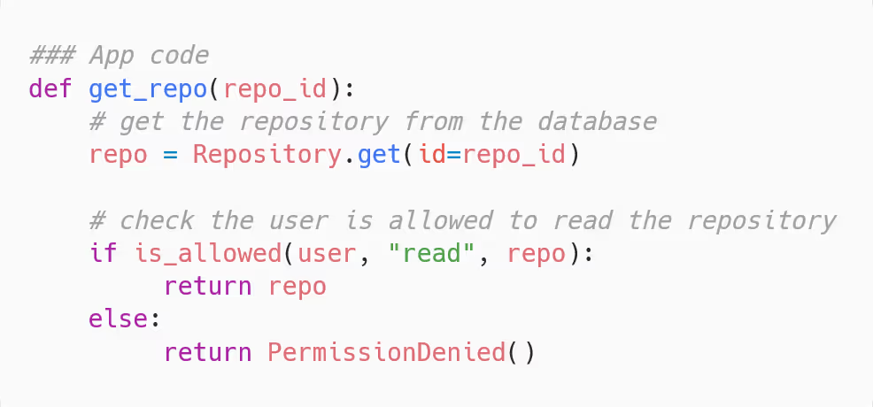
_(Gambar: Kode aplikasi yang menunjukkan penegakan otorisasi)_

Pada contoh ini, kita menggunakan antarmuka `is_allowed` yang telah diperkenalkan pada bab sebelumnya.  
Antarmuka ini menerima sebuah actor, sebuah action, dan sebuah resource, lalu mengembalikan nilai True atau False.

## Mengapa Menggunakan Model Otorisasi?

Model otorisasi membantu memberikan struktur pada pertanyaan yang terbuka: siapa yang dapat melakukan apa di dalam aplikasi kita. Ini sangat membantu dari sudut pandang implementasi—memiliki sebuah template yang bisa diterapkan. Selain itu, model otorisasi secara dramatis meningkatkan pengalaman pengguna.

Sebuah model otorisasi tidak hanya memandu implementasi kita, tetapi juga merupakan model mental yang akan kita ajarkan kepada pengguna untuk menunjukkan apa saja yang dapat mereka lakukan di dalam aplikasi kita. Dengan memiliki model otorisasi yang jelas, kita bisa menyampaikan kepada pengguna, “ini adalah tugas-tugas yang diharapkan untuk Anda lakukan dalam aplikasi kami.”

Kebanyakan dari kita sudah mengenal bentuk yang kurang baik dari otorisasi—misalnya, matriks raksasa dari hak akses yang mengharuskan Anda mengetahui secara mendalam cara kerja aplikasi untuk memahami hak akses apa yang diperlukan:

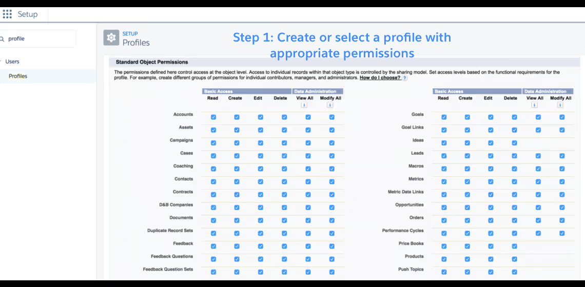
_(Gambar: Layar seleksi hak akses yang rumit)_

Atau dialog yang meminta Anda untuk menghubungi administrator:
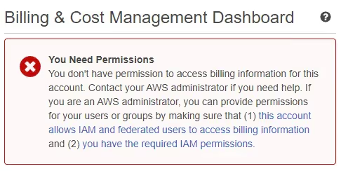

_(Gambar: Kotak dialog peringatan otorisasi)_

Lantas, bagaimana cara menghindari situasi-situasi tersebut?

Dengan menggunakan model otorisasi yang sesuai dengan kebutuhan saat ini dan cukup fleksibel untuk berkembang seiring waktu guna mengakomodasi kebutuhan baru yang muncul.

Mengakomodasi kebutuhan baru seiring waktu adalah bagian yang paling sulit, dan inilah yang sering menjadi tantangan bagi banyak tim. Pada bab ini, kita akan mengatasi hal tersebut dengan memastikan model-model kita saling membangun dan menyeimbangkan antara fleksibilitas dan kesederhanaan.

### 2. Model Role-Based Access Control (RBAC)

**Role-Based Access Control (RBAC)** adalah pendekatan otorisasi yang sangat populer. Juga dikenal sebagai “role-based access control,” model ini merupakan cara yang efektif untuk menyederhanakan logika otorisasi bagi pengembang dan pengguna.

**Peran (Role)** adalah cara untuk mengelompokkan hak akses sehingga dapat diberikan kepada pengguna.  
Ketika seorang pengguna ditetapkan ke sebuah peran, pengguna tersebut akan mendapatkan semua hak akses yang dimiliki oleh peran itu.

**Izin (Permission)** menentukan aksi apa yang dapat dilakukan oleh pengguna pada sebuah resource. Misalnya, kita dapat menyatakan bahwa seorang pengguna di dalam sebuah organisasi memiliki izin untuk membaca repository.

Izin-izin yang dimiliki oleh sebuah peran tidak dipilih secara sembarangan. Secara umum, sebuah peran seharusnya mencerminkan siapa pengguna itu, apa yang ingin mereka lakukan di dalam aplikasi, dan mungkin bahkan jabatan atau posisi mereka dalam organisasi.

Sebagai contoh, di GitClub, pengguna utama adalah para developer – itu bisa dianggap sebagai salah satu peran dalam sistem kita. Tentu saja, ada peran-peran lain, seperti administrator IT yang bertanggung jawab untuk mengonfigurasi organisasi atau pengguna bagian keuangan yang menangani penagihan. Setiap kelompok pengguna ini memiliki serangkaian hak akses yang berbeda untuk menggunakan aplikasi kita. Masing-masing akan direpresentasikan sebagai satu peran dalam model otorisasi GitClub.

Seseorang yang ditetapkan pada peran “billing” secara alami akan mengharapkan dapat mengonfigurasi penagihan bagi sebuah organisasi – seperti membayar keanggotaan baru, memperbarui informasi pembayaran, dan sebagainya.

Dengan menggunakan peran, kita telah mengurangi kompleksitas informasi hak akses yang harus ditampilkan kepada pengguna akhir. Alih-alih meminta pengguna untuk mengonfigurasi banyak izin agar bisa menggunakan aplikasi, mereka hanya perlu memilih dari sejumlah kecil opsi.

Peran sangat fleksibel—pada bagian ini, kita akan melihat beberapa cara berbeda untuk menggunakannya guna mencapai fungsi yang bervariasi—dan peran dapat digunakan di hampir semua aplikasi business-to-business (B2B).

#### Peran Organisasi

Di GitClub, seperti banyak aplikasi lainnya, kita membangun aplikasi sebagai aplikasi multi-tenant. Artinya, kita memiliki satu versi aplikasi dengan banyak instansi yang melayani permintaan untuk seluruh pengguna dan organisasi. Secara natural, kita perlu memastikan bahwa pengguna tidak dapat melihat resource dari organisasi yang bukan milik mereka. Lantas, bagaimana cara mencapainya?

**Apa itu model otorisasi ini?**  
Titik awal yang sederhana untuk peran adalah dengan mengaitkan setiap pengguna dengan satu organisasi dan menetapkan mereka ke dalam satu peran. Seluruh akses kemudian dikontrol berdasarkan peran yang dimiliki pengguna di organisasi tersebut.

**Tapi, peran apa saja yang harus kita buat?**  
Untuk menjaga pengalaman pengguna tetap sederhana, sebaiknya mulai dengan jumlah peran yang kecil. Terlalu banyak peran dapat dengan cepat menjadi membingungkan dan sulit dipelihara.

Untuk GitClub, kita akan memulai dengan hanya dua peran: _admin_ dan _member_. Ini merupakan titik awal yang umum bagi banyak aplikasi B2B. Peran _member_ akan memiliki akses ke semua fungsi inti aplikasi (misalnya, membaca dan menulis ke repository). Sementara peran _admin_ dapat melakukan semua hal yang dapat dilakukan oleh _member_, ditambah kemampuan untuk mengundang pengguna ke dalam organisasi. Dalam sistem nyata, Anda mungkin juga memberikan izin kepada admin untuk mengatur pembayaran, mengonfigurasi pengaturan, atau menghapus organisasi.

**Bagaimana mengimplementasikan model ini?**  
Pertama, kita memerlukan cara untuk mengaitkan pengguna dengan organisasi tertentu dan menetapkan mereka ke dalam sebuah peran. Salah satu cara sederhana untuk mencapai ini dalam model data adalah dengan memiliki hubungan satu-ke-banyak (one-to-many) dari organisasi ke pengguna dan menyertakan kolom _role_ terpisah pada tabel pengguna yang menyimpan nama peran sebagai string.

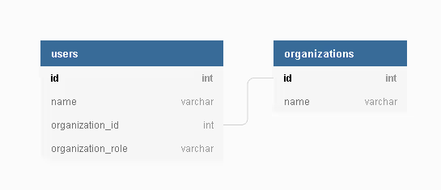

_(Gambar: Diagram basis data yang menunjukkan tabel pengguna dan organisasi)_

Dengan model data ini, logika untuk memeriksa apakah seorang pengguna dapat melakukan suatu aksi pada resource terdiri dari beberapa pemeriksaan:

1. Organisasi apa yang dimiliki pengguna dan peran apa yang mereka miliki.
2. Izin apa yang dimiliki peran tersebut.
3. Apakah izin tersebut berlaku untuk aksi dan resource yang dimaksud.

Informasi mengenai peran dan organisasi didapat dari data pengguna.

Kita akan mendefinisikan “izin apa yang dimiliki peran” dengan menyimpannya dalam sebuah dictionary sederhana, dari nama peran ke daftar string yang berisi hak akses. Sebagai permulaan, kita fokus pada beberapa izin sederhana, seperti membaca dan menulis ke repository serta menambahkan pengguna ke organisasi.  

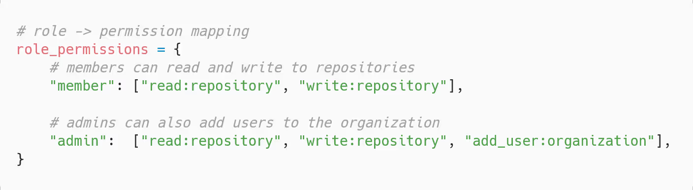
_(Gambar: Peta pemetaan role → permission)_

Untuk izin-izin kita, kita menggunakan konvensi **aksi:resource**, yang berarti jika seorang pengguna memiliki izin tersebut, mereka dapat melakukan “aksi” pada resource yang bertipe “resource.” Perhatikan bahwa pengguna memiliki peran untuk organisasi tertentu, tetapi izin tersebut dapat berlaku untuk organisasi dan repository.

Kita menganggap bahwa suatu izin berlaku untuk resource target jika resource tersebut dimiliki oleh organisasi yang sama dengan peran. Dengan menyatukan semua ini, kita mendapatkan:

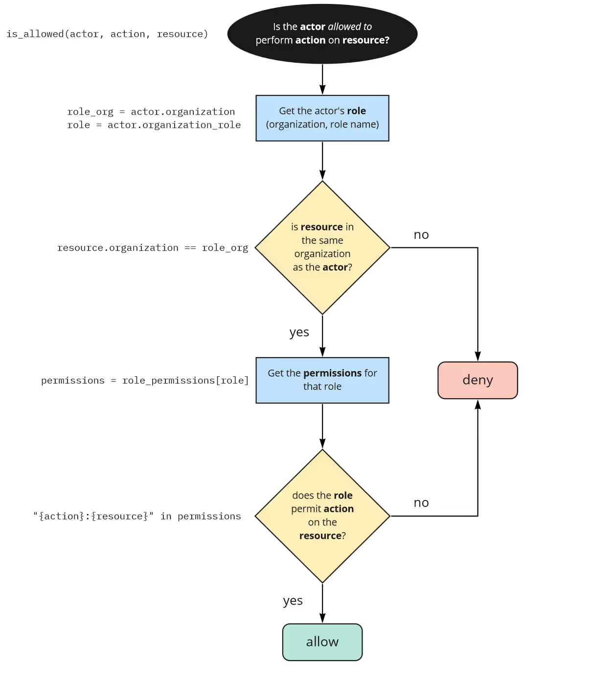
_(Gambar: Alur keputusan otorisasi)_

**Kapan menggunakan model ini?**  
Model ini memberikan solusi yang sederhana dan mudah dipelihara yang cocok ketika satu-satunya hal yang menentukan akses dalam aplikasi adalah peran pada tingkat organisasi.

Namun, model ini memiliki beberapa keterbatasan: setiap pengguna terkait dengan hanya satu organisasi, dan kita memperlakukan semua resource dalam organisasi dengan cara yang sama. Model ini tidak cukup jika kita perlu memberikan izin yang berbeda untuk repository yang berbeda. Bagian selanjutnya akan menunjukkan bagaimana memperluas model kita untuk mengatasi kasus tersebut.

---

#### Peran Lintas Organisasi (Cross-Organization Roles)

**Apa itu model otorisasi ini?**  
Dalam perangkat lunak kolaboratif seperti GitClub, sangat umum bagi seorang pengguna memiliki akun pribadi untuk proyek pribadi mereka dan juga bergabung dengan banyak organisasi untuk bekerja bersama orang lain.

Alih-alih mengaitkan setiap pengguna dengan hanya satu organisasi, kita akan memungkinkan satu pengguna untuk menjadi anggota dari banyak organisasi. Pengguna tersebut akan memerlukan peran terpisah untuk setiap organisasi yang mereka ikuti.

Untuk mendukung hal ini, kita perlu memodifikasi hubungan sebelumnya dari satu-ke-banyak antara pengguna dan organisasi menjadi hubungan banyak-ke-banyak.

**Bagaimana mengimplementasikan model ini?**  
Kita akan menyusun data dengan membuat tabel join—seperti yang biasa kita lakukan untuk hubungan many-to-many—dan menyertakan kolom untuk nama peran pada tabel tersebut.

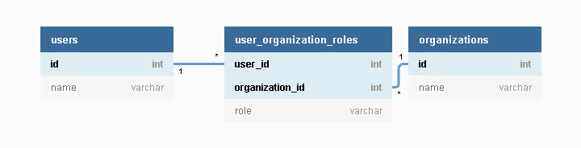
_(Gambar: Struktur basis data untuk hubungan many-to-many antara pengguna dan organisasi)_

Hal ini secara eksplisit menunjukkan bahwa menjadi anggota suatu organisasi adalah sama dengan ditetapkannya peran di dalam organisasi tersebut. Tidak mungkin bagi seorang pengguna untuk menjadi anggota suatu organisasi tanpa memiliki peran, begitu pula sebaliknya.

Untuk logikanya, kita akan menggunakan izin yang sama seperti sebelumnya. Namun, kita perlu memperbarui logika untuk mengambil semua peran pengguna dan memeriksanya terhadap organisasi target:

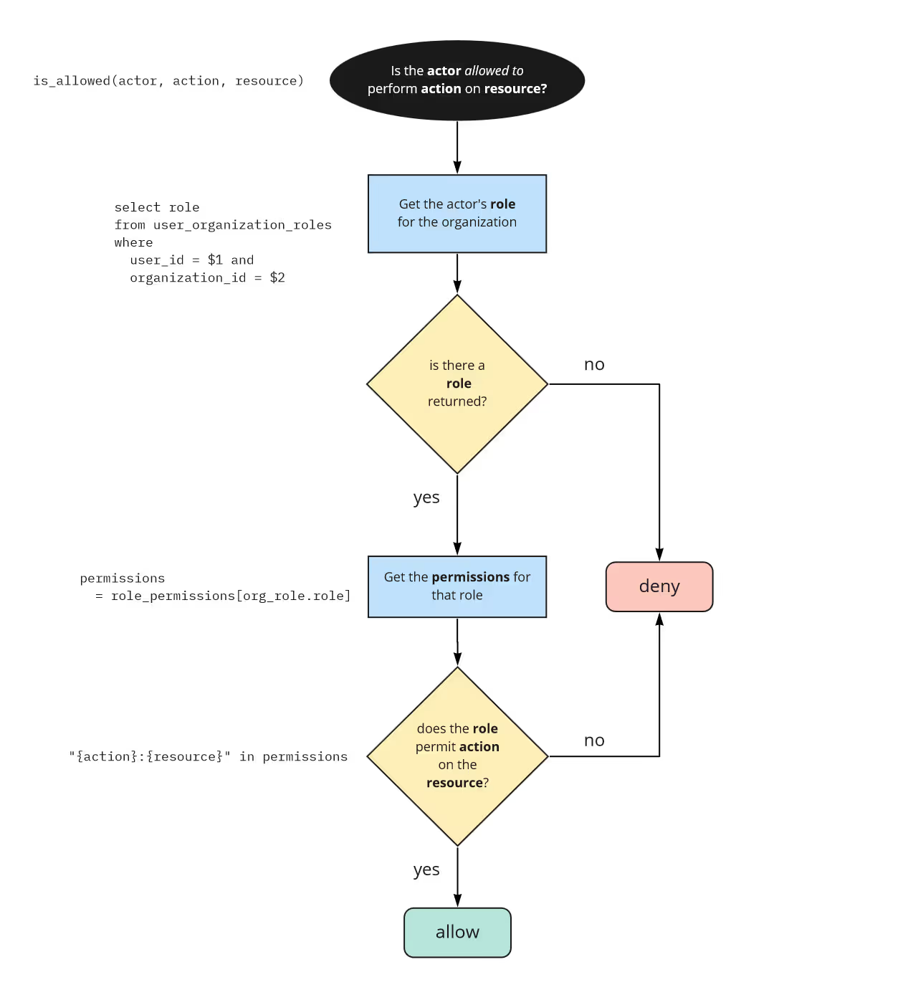
_(Gambar: Alur keputusan otorisasi dengan banyak peran)_

Logika mulai menjadi sedikit lebih kompleks. Kita sekarang memeriksa peran yang berlaku dari banyak kemungkinan dengan memfilter peran dari basis data. Namun, struktur dasarnya masih sama: ambil peran, periksa apakah cocok dengan organisasi, dan periksa apakah memiliki izin yang tepat.

**Kapan menggunakan model ini?**  
Jika Anda memerlukan pengguna untuk memiliki akun di banyak organisasi, model ini merupakan peningkatan besar dibandingkan model sederhana yang telah dibahas sebelumnya.  
Alternatifnya, seperti yang terjadi pada Slack (pada saat penulisan), di mana pengguna harus membuat akun terpisah dan login untuk setiap workspace Slack yang mereka ikuti. Hal ini dapat menyebabkan pengguna tidak mengetahui apakah mereka memiliki akun, lupa detail login, dan secara umum meningkatkan hambatan untuk bergabung dengan organisasi baru.

Model ini juga bermanfaat untuk persiapan masa depan. Meskipun aplikasi saat ini tampaknya cocok dengan model satu pengguna-per-organisasi, di masa depan mungkin diperlukan penambahan pengguna lintas organisasi. Dengan menggunakan model yang lebih fleksibel, menambahkan fungsionalitas baru di kemudian hari tidak memerlukan migrasi data besar. Kelemahan dari fleksibilitas ini adalah model data yang sedikit lebih kompleks.

---

#### Peran Spesifik Resource (Resource-Specific Roles)

Misalkan di GitClub kita mulai menarik organisasi yang lebih besar untuk menggunakan produk. Kita mulai mendengar dari pelanggan bahwa mereka membutuhkan penyesuaian lebih lanjut mengenai siapa yang dapat melihat repository tertentu. Sebagai contoh, satu pelanggan memiliki seluruh infrastruktur yang disimpan sebagai kode di dalam sebuah repository. Tidak seharusnya semua anggota tim memiliki akses tulis ke repository tersebut.

Banyak perusahaan B2B akan menemui permintaan fitur seperti ini. Peran organisasi yang telah kita definisikan bekerja dengan baik selama kita cukup puas untuk memperlakukan akses ke seluruh resource dalam organisasi secara seragam. Namun, seiring dengan pertumbuhan ukuran organisasi yang menggunakan produk kita, satu set peran tidak cukup menggambarkan apa yang dapat dilakukan semua pengguna. Pelanggan kita mungkin ingin membuat folder dan mengatur akses ke file dengan menetapkan peran pada folder, mengelompokkan resource berdasarkan proyek atau departemen, atau memungkinkan kontrol akses secara eksplisit pada resource individual.

Untuk mengatasi hal ini, kita dapat memperkenalkan **peran spesifik resource**.

**Apa itu model otorisasi ini?**  
Peran spesifik resource adalah bentuk yang lebih umum dari peran organisasi. Alih-alih mengaitkan peran dengan sebuah organisasi tertentu, kita mengaitkan peran dengan segala jenis resource. Karena sebuah organisasi sendiri adalah salah satu jenis resource, maka peran organisasi merupakan bentuk khusus dari peran resource.

Di GitClub, repository merupakan jenis resource lainnya. Kita akan memperkenalkan peran yang berlaku pada repository, selain peran organisasi.

**Bagaimana mengimplementasikan model ini?**  
Hal menyenangkan tentang model ini adalah strukturnya identik dengan peran organisasi.

Bahkan, organisasi itu sendiri adalah resource. Akses ke (atau menjadi anggota dari) sebuah organisasi diatur dengan cara yang sama seperti akses ke resource lainnya! Di sini kita membuatnya secara eksplisit—organisasi tidak lagi dianggap istimewa. Semua resource, dalam hal ini organisasi dan repository, memiliki model data yang setara, seperti pada diagram berikut:

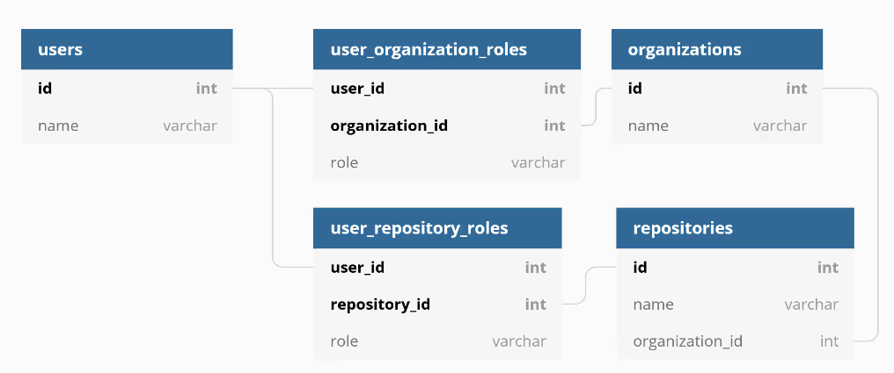
_(Gambar: Struktur basis data untuk peran organisasi dan repository)_

Sebagai praktik terbaik, sebaiknya kita meminimalkan jumlah cara berbeda yang memungkinkan pengguna mendapatkan akses ke resource yang sama. Oleh karena itu, kita menetapkan bahwa untuk mengakses repository, pengguna harus memiliki peran pada repository tersebut. Kita tidak akan lagi memberikan izin pada peran organisasi yang memungkinkan interaksi dengan repository.

Untuk GitClub, kita akan mempertahankan dua peran organisasi—“admin” dan “member”—serta mendefinisikan dua peran baru untuk repository—“maintainer” dan “contributor.”

- **Maintainer** dapat melakukan apa saja terhadap repository: membuat cabang, mengirim kode, menggabungkan pull request, dan sebagainya.
- **Contributor** hanya diizinkan untuk membaca kode, membuka isu, dan membuat pull request.

Kita dapat secara otomatis menetapkan peran “maintainer” kepada siapa pun yang membuat repository. Namun, akan merepotkan jika harus secara manual menambahkan setiap anggota organisasi ke repository agar mendapat akses. Yang kita inginkan adalah akses dasar yang berlaku untuk semua orang dalam organisasi.

Kita dapat mencapainya dengan memiliki peran default: misalnya, siapa pun yang berada di organisasi yang sama dengan repository akan secara default memiliki peran “contributor,” kecuali jika telah secara eksplisit ditetapkan peran lain.

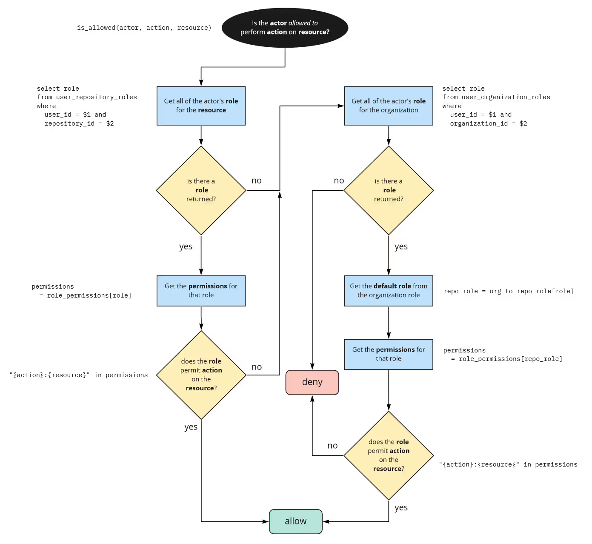
_(Gambar: Alur keputusan otorisasi untuk peran pada resource dan organisasi)_

Sementara itu, pemeriksaan akses untuk aksi pada tingkat organisasi akan tetap hanya memeriksa peran organisasi. Ini mencakup aksi seperti menambahkan pengguna baru ke dalam organisasi.

**Kapan menggunakan model ini?**  
Peran spesifik resource adalah model yang sangat kuat dan dapat mendukung hak akses yang granular untuk banyak kasus penggunaan. Kita mulai dengan beberapa resource sederhana—hanya repository dan organisasi—tetapi logika yang sama dapat diterapkan ke jenis resource lain di aplikasi yang memerlukan kontrol akses yang lebih rinci.

Model ini sangat cocok untuk apa pun yang memiliki hierarki resource, misalnya folder (seperti pada Google Drive atau Dropbox), proyek, direktori, atau yang serupa.

Jika Anda mencapai tingkat kematangan ini, Anda harus merasa yakin bahwa pendekatan berbasis peran Anda dapat mengakomodasi sebagian besar kebutuhan.

---

#### Custom Roles (Peran Kustom)

Berikut adalah satu komplikasi tambahan. Salah satu pengguna GitClub memiliki tim CI/CD yang tugas utamanya adalah mengurutkan penggabungan commit ke branch utama dan memastikan bahwa pekerjaan CI berjalan. Tim tersebut tidak seharusnya dapat membaca kode apa pun, tetapi harus dapat memicu workflow. Hal ini tidak cocok dengan peran yang telah ada.

Meskipun kita telah berupaya mendukung berbagai kasus penggunaan dan penyesuaian, ada beberapa pengguna enterprise yang membutuhkan kontrol yang sangat presisi atas apa yang dapat dilakukan oleh pengguna dalam akun mereka. Sebagai upaya terakhir, kita dapat memungkinkan pelanggan untuk membuat peran mereka sendiri dan menyesuaikannya. Pendekatan ini menambah kompleksitas pada basis data dan memerlukan antarmuka pengguna (UI) — sehingga tidak direkomendasikan untuk sebagian besar sistem.

**Apa itu model otorisasi peran kustom?**  
Peran kustom adalah model di mana pengguna akhir (yaitu, pengguna aplikasi) dapat membuat peran mereka sendiri dan menetapkan izin ke peran tersebut. Peran kustom ini kemudian dapat digunakan seperti biasa dengan menetapkan pengguna ke dalam peran tersebut. Peran kustom dapat digunakan berdampingan dengan peran yang sudah ada.

**Bagaimana mengimplementasikan model ini?**  
Model untuk peran kustom pada dasarnya sama seperti yang telah kita gunakan sebelumnya, kecuali bahwa peta dari peran ke daftar izin harus bersifat dinamis, dan kita perlu cara untuk mengaitkan pengguna dengan peran yang dibuat secara dinamis.

Untuk mencapainya, kita membuat tabel tambahan untuk mengelola peran. Setiap peran harus dikaitkan dengan resource tertentu. Jika kita ingin sebuah organisasi menyesuaikan perannya, maka peran tersebut akan dikaitkan dengan organisasi tersebut.

Sebuah peran terdiri dari nama peran dan daftar izin.

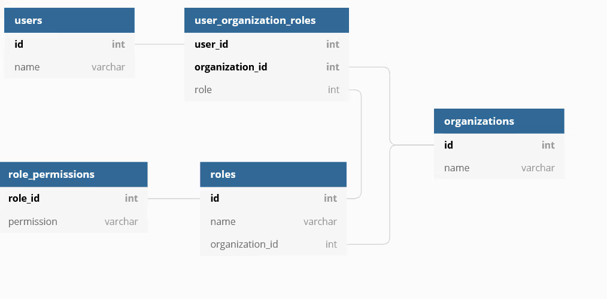
_(Gambar: Struktur basis data untuk peran kustom)_

Secara abstrak, ini terlihat hampir identik dengan logika yang telah kita tulis di skema sebelumnya. Kita memiliki langkah yang sama yaitu “memeriksa apa saja izin yang dimiliki peran.” Perbedaannya dari sisi implementasi adalah bahwa izin-izin tersebut sekarang disimpan di dalam basis data, bukan di memori.

**Kapan menggunakan model ini?**  
Memungkinkan pengguna untuk membuat peran mereka sendiri merupakan cara yang bagus untuk mendukung berbagai kasus penggunaan tanpa harus mengantisipasi semuanya dan mendefinisikan peran untuk setiap kasus tersebut.

Namun, berhati-hatilah jika memilih untuk mendukung hal ini. Agar peran kustom dapat berfungsi, Anda harus siap untuk membuat definisi izin Anda bersifat publik. Artinya, Anda harus mendokumentasikannya dan memberitahu pengguna saat terjadi perubahan. Penambahan fitur baru dengan izin baru atau perubahan struktur aplikasi mungkin memiliki efek samping yang tidak terduga.

Faktanya, jika kita melihat dua sumber inspirasi utama kita—GitHub dan GitLab—keduanya tidak mendukung peran kustom.

GitHub pernah membuka issue di roadmap publik mereka pada tahun 2020, namun perihal ini terus saja bergeser:  
[Issue GitHub #111](https://github.com/github/roadmap/issues/111)  

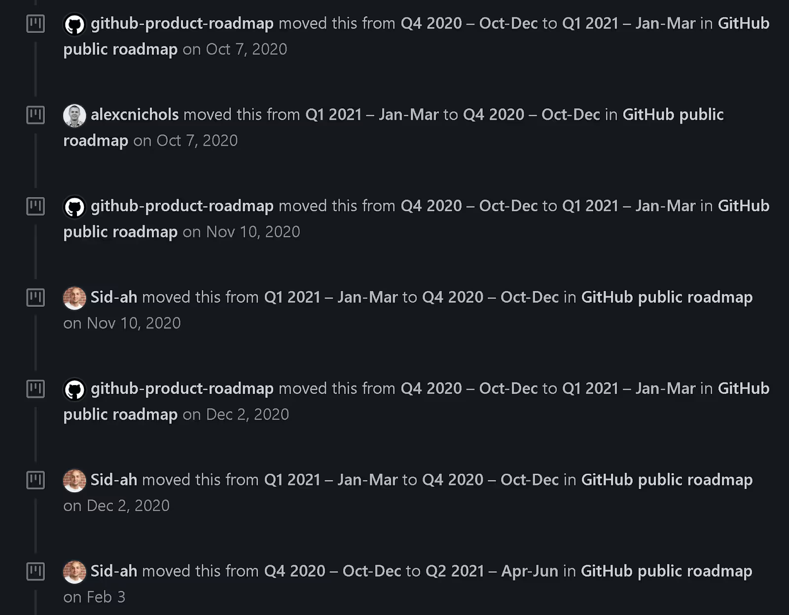
_(Gambar: Riwayat issue peran kustom di GitHub)_

Sementara itu, GitLab telah banyak mendiskusikan fitur ini dan pada akhirnya memilih untuk tidak mendukungnya:  
[Diskusi GitLab tentang peran kustom](https://gitlab.com/gitlab-org/gitlab-foss/-/issues/12736#note_50662947)

Lantas, kapan sebaiknya membangun peran kustom? Salah satu kemungkinan adalah untuk aplikasi yang membutuhkan konfigurabilitas yang sangat luas, seperti platform-as-a-service. Dalam kasus ini, Anda mungkin tidak ingin memberlakukan cara tertentu kepada pengguna mengenai bagaimana mereka mengorganisasi tim dan menggunakan produk Anda.

Memasuki dunia peran yang dapat dikonfigurasi oleh pengguna akhirnya mengarah ke sistem izin yang sepenuhnya dapat dikonfigurasi, seperti sistem AWS Identity and Access Management (IAM). Hal ini akan dibahas lebih lanjut di bab mendatang.

Berikut adalah terjemahan ke dalam bahasa Indonesia:

---
## 3. Referensi Cepat Memilih Model Otorisasi

Kami telah menunjukkan empat varian otorisasi berbasis peran, dari yang paling sederhana (dan paling tidak fleksibel) hingga yang paling kompleks.

- **Model Sederhana:**  
    Memberikan peran seperti "member" dan "admin" pada basis per-organisasi merupakan titik awal yang sangat baik untuk kebanyakan aplikasi.
    
- **Model Lintas Organisasi:**  
    Jika pengguna Anda perlu memiliki akun pribadi atau berkolaborasi di antara organisasi, Anda dapat menambahkan peran lintas organisasi. Pendekatan ini menambah kompleksitas, tetapi lebih fleksibel.
    
- **Model Resource-Spesifik:**  
    Jika Anda adalah aplikasi B2B yang melayani organisasi besar, pelanggan Anda kemungkinan besar akan membutuhkan peran spesifik untuk resource. Model data akan menjadi lebih kompleks, tetapi ini memungkinkan Anda mengontrol otorisasi pada resource tertentu.
    
- **Model Peran Kustom:**  
    Jika Anda perlu memungkinkan pengguna Anda membuat dan mengonfigurasi skema izin mereka sendiri, kami telah membahas cara mengimplementasikan peran kustom. Namun, sangat sedikit perusahaan yang benar-benar membutuhkan ini – kami menyarankan untuk tidak menggunakannya kecuali benar-benar diperlukan!
    

Peran-peran yang telah kami jelaskan di sini akan mencakup banyak situasi yang akan Anda temui di produksi. Namun, belum semuanya dapat ditangani hanya dengan peran. Berikut adalah beberapa situasi yang tidak dapat Anda atasi dengan menggunakan peran:

- Pengguna dapat menghapus komentar yang mereka buat.
- Pengguna dapat membaca potongan kode yang dibagikan kepada mereka.
- Anda dapat membaca isu apa pun yang dimiliki oleh repository yang diizinkan untuk Anda baca.

Di bab berikutnya, kami akan memperkenalkan otorisasi berbasis hubungan untuk menangani kasus-kasus tersebut.