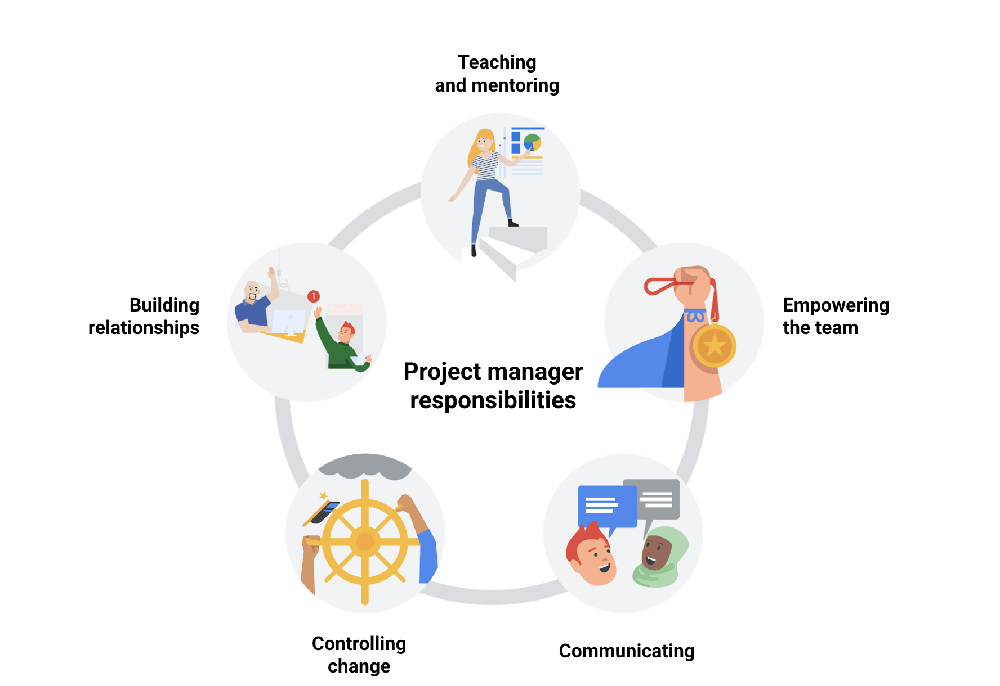

# Tanggung jawab yang memanfaatkan keterampilan interpersonal

Apa tanggung jawab inti dari seorang manajer proyek? Mari kita ringkas apa yang telah kita pelajari dalam video sebelumnya.

Manajer proyek bertanggung jawab untuk merencanakan, mengorganisir, mengelola tugas, menganggarkan, mengendalikan biaya, dan faktor-faktor lainnya untuk membantu menjaga proyek sesuai dengan anggaran dan waktu yang ditentukan.

Apa artinya itu? Pada dasarnya, sebagai manajer proyek, Anda akan bertanggung jawab untuk melacak detail harian proyek,  tetapi Anda juga akan memiliki kesempatan untuk mundur dan melihat gambaran yang lebih besar dari keseluruhan proyek.

Tergantung pada proyek dan organisasi, Anda juga mungkin memiliki tanggung jawab yang memanfaatkan keterampilan interpersonal Anda. **Keterampilan interpersonal** adalah perilaku yang Anda gunakan untuk berinteraksi dengan orang lain, seperti komunikasi, pendengaran aktif, dan kepemimpinan.

Let's review these responsibilities.

## Mengajar dan membimbing (Teaching and mentoring)
Sebagai seorang manajer proyek, Anda dapat berperan sebagai mentor bagi tim Anda. Dengan memberikan penjelasan yang komprehensif tentang harapan-harapan, Anda dapat menghindari pekerjaan ulang, kebingungan, dan frustrasi. Membimbing dan mengajarkan kepada orang lain pelajaran yang Anda, sebagai seorang manajer proyek, telah pelajari memungkinkan tim Anda untuk membuat pilihan yang lebih baik dan membangun berdasarkan pengalaman Anda. Membimbing juga melibatkan dukungan terhadap setiap individu dalam tim Anda untuk mencapai harapan dan membantu mereka melebihi potensi pribadi mereka sendiri.

## Membangun hubungan (Building relationships)
Hubungan adalah segalanya! Mengenal anggota tim Anda memungkinkan mereka mengetahui bahwa Anda peduli terhadap mereka sebagai individu, bukan hanya sebagai karyawan. Menghabiskan waktu untuk membangun hubungan dengan pelanggan, klien, vendor, dan stakeholder lainnya juga sama pentingnya. Sisihkan waktu untuk berinteraksi dengan orang-orang tersebut. Perhatikan wawasan yang mereka berikan tentang gaya kerja mereka, karena tindakan mereka dapat memberi informasi tentang cara berinteraksi secara efektif. Tanyakan tentang kehidupan mereka di luar proyek, dan kemudian ikuti pembicaraan tersebut di masa mendatang untuk menunjukkan minat Anda. Ketika Anda memupuk hubungan-hubungan ini, semua pihak akan lebih berinvestasi dalam kesuksesan proyek Anda.

## Mengendalikan perubahan (Controlling change)
Seperti yang dikatakan oleh novelis Amerika Louis L'Amour, "Satu-satunya hal yang tidak pernah berubah adalah bahwa segalanya berubah." Hal ini juga berlaku dalam proyek. Proyek dapat berubah seiring pemahaman yang semakin baik tentang harapan dan kebutuhan stakeholder. Sebagai manajer proyek, Anda perlu tetap fleksibel dan menyesuaikan diri dengan kebutuhan stakeholder. Namun, penting juga untuk melindungi tim Anda dari perubahan dan pekerjaan ulang yang terus-menerus. Cara yang baik untuk melakukannya adalah dengan mendokumentasikan harapan awal proyek dan dengan jelas mengidentifikasi perubahan yang diminta. Penting juga untuk memahami dampak perubahan terhadap anggaran dan jadwal, serta memastikan bahwa stakeholder memahami dampak-dampak tersebut. Sebagai manajer proyek, Anda bertanggung jawab untuk melindungi tim Anda.

## Memberdayakan tim Anda (Empowering your team)
Kita semua senang jika pendapat kita didengar dan dihargai dalam karir kita. Memberikan tim Anda kemampuan untuk bekerja langsung dengan stakeholder dan tim mereka akan menunjukkan bahwa Anda percaya dan meyakini kemampuan mereka! Salah satu keuntungan dari memberdayakan tim Anda adalah mendapatkan ide-ide segar dan karyawan yang antusias untuk membantu mencari solusi atas masalah. Cara lain untuk memberdayakan tim Anda adalah dengan mendistribusikan tanggung jawab kepada mereka, memungkinkan mereka mengambil keputusan untuk proyek, dan menggunakan masukan mereka dalam perencanaan dan pelaksanaan proyek. Membimbing yang efektif sering kali menghasilkan tim yang lebih berdaya.

## Mengkomunikasikan status dan kekhawatiran (Communicating status and concerns)
Sebagai seorang manajer proyek, komunikasi adalah segalanya. Dengan komunikasi yang efektif, Anda dapat bekerja sama dengan tim Anda untuk mencari solusi atas tantangan yang dihadapi. Manajer proyek menetapkan suasana dalam proyek. Menjaga kebijakan pintu terbuka dan membangun kepercayaan di antara tim Anda dan stakeholder—semuanya dengan tetap positif—akan membantu kesuksesan proyek.

## Kesimpulan penting
Anda telah belajar bahwa manajer proyek bertanggung jawab untuk mengajar dan membimbing anggota tim proyek, membangun hubungan dengan tim dan berbagai stakeholder, mengendalikan perubahan dan dampaknya terhadap proyek, memberdayakan anggota tim untuk mengambil keputusan, dan mengkomunikasikan status dan kekhawatiran potensial. Tanggung jawab interpersonal ini sama pentingnya dengan tanggung jawab konkret Anda, seperti perencanaan jadwal dan anggaran.

Selama Anda melanjutkan kursus ini, Anda akan belajar lebih banyak tentang bagaimana tanggung jawab manajer proyek ini terintegrasi dalam berbagai fase proyek.