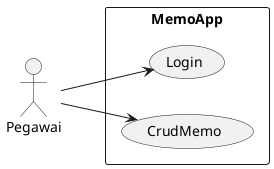
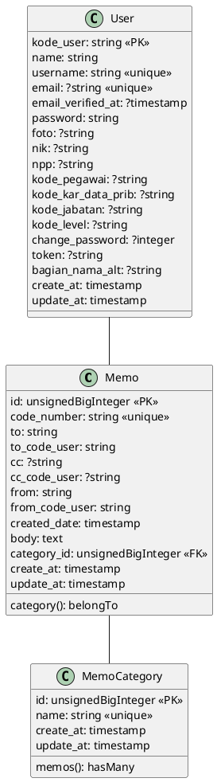

# Memo App

## Use case Diagram

```puml
@startuml
left to right direction
actor Pegawai
rectangle MemoApp {
  usecase Login
  usecase CrudMemo
}

Pegawai --> Login
Pegawai --> CrudMemo
@enduml
```

## Class Diagram

```puml
@startuml
class Memo {
	id: unsignedBigInteger <<PK>>
	code_number: string <<unique>>
	to: string
	to_code_user: string
	cc: ?string
	cc_code_user: ?string
	from: string
	from_code_user: string
	created_date: timestamp
	body: text
	category_id: unsignedBigInteger <<FK>>
	create_at: timestamp
	update_at: timestamp
	
	category(): belongTo
}

class MemoCategory {
	id: unsignedBigInteger <<PK>>
	name: string <<unique>>
	create_at: timestamp
	update_at: timestamp
	
	memos(): hasMany
}

class User {
	kode_user: string <<PK>>
	name: string
	username: string <<unique>>
	email: ?string <<unique>>
	email_verified_at: ?timestamp
	password: string
	foto: ?string
	nik: ?string
	npp: ?string
	kode_pegawai: ?string
	kode_kar_data_prib: ?string
	kode_jabatan: ?string
	kode_level: ?string
	change_password: ?integer
	token: ?string
	bagian_nama_alt: ?string
	create_at: timestamp
	update_at: timestamp
}

User -- Memo
Memo -- MemoCategory
@enduml

```