# Sistem Informasi MBG (SPPG)
Sebenarnya sudah ada aplikasi namanya `Sinutrihub`, tapi ini kurang enak jadi sepertinya saya akan membuatnya.
Kamu ingin **arsitektur sistem informasi internal berbasis Laravel + Filament**, dengan kontrol akses pakai **Spatie Laravel Permission + Laravel Policy**, dan semua diagram menggunakan **PlantUML** (bukan ERD konvensional).  
API disiapkan **belakangan** (fase integrasi Flutter/mobile), jadi saat ini fokus ke web-based workflow dulu.

---

## 📘 Rencana Pembuatan Sistem Informasi _Makan Bergizi Gratis_ (Dokumen Perencanaan Tahap 1)

### 1. Tujuan Sistem

Sistem ini mengelola operasional yayasan dalam program **Makan Bergizi Gratis (MBG)** yang menaungi banyak dapur.  
Setiap dapur mengatur jadwal menu, distribusi makanan, bahan baku, supplier, serta laporan periodik ke yayasan.

---

### 2. Struktur Role (pakai Spatie Laravel Permission)

| Role                  | Level   | Deskripsi                                             |
| --------------------- | ------- | ----------------------------------------------------- |
| **SuperAdmin**        | Global  | Mengelola seluruh tenant (yayasan & dapur)            |
| **Admin Yayasan**     | Yayasan | Membuat dapur, memantau laporan keuangan & distribusi |
| **Ketua Dapur**       | Dapur   | Mengelola staff & relawan, verifikasi laporan         |
| **PIC Dapur**         | Dapur   | Menginput data sekolah/batch & distribusi             |
| **Ahli Gizi**         | Dapur   | Menyusun menu, nilai gizi, jadwal periode             |
| **Akuntansi Dapur**   | Dapur   | Mencatat keuangan & supplier                          |
| **Admin Dapur**       | Dapur   | CRUD data umum dapur                                  |
| **Chef (Relawan)**    | Dapur   | Menginput menu harian & bahan baku                    |
| **Asisten Lapangan**  | Dapur   | Mencatat distribusi harian                            |
| **Relawan Persiapan** | Dapur   | Non-akses langsung, tercatat di sistem saja           |

---

### 3. Use Case Diagram (PlantUML)

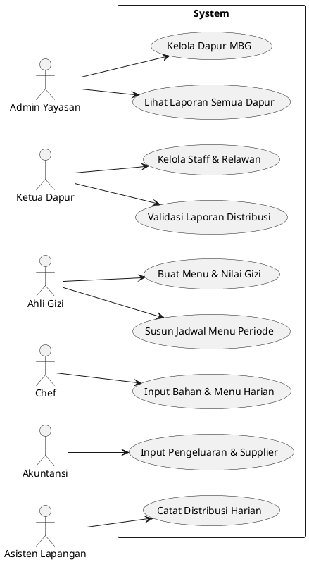

---

### 4. Activity Diagram — _Alur Distribusi Periode_

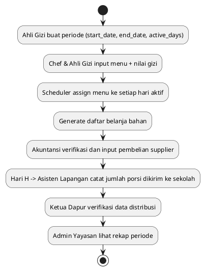

---

### 5. Activity Diagram — _Keuangan Dapur_

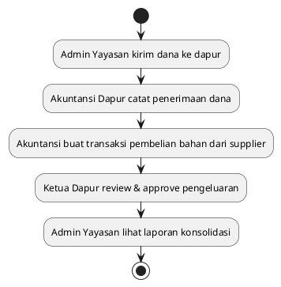

---

### 6. Tabel Utama & Relasi (PlantUML Class Diagram)

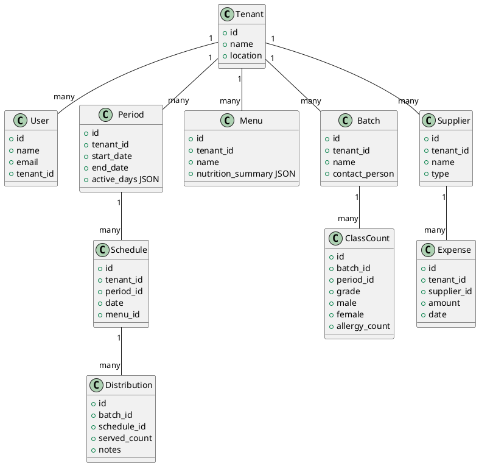

---

### 7. Kebijakan Akses (Policy Mapping)

|Model|Policy Class|Akses Role|
|---|---|---|
|Tenant|`TenantPolicy`|SuperAdmin, Admin Yayasan|
|Period|`PeriodPolicy`|Ahli Gizi, Ketua Dapur|
|Menu|`MenuPolicy`|Ahli Gizi, Chef|
|Schedule|`SchedulePolicy`|Ahli Gizi|
|Batch|`BatchPolicy`|PIC Dapur|
|Distribution|`DistributionPolicy`|Asisten Lapangan, Ketua Dapur|
|Expense|`ExpensePolicy`|Akuntansi, Ketua Dapur|

---

### 8. Flow Implementasi (Roadmap MVP Web)

1. **Fase 0 – Setup**
    
    - Laravel + Filament, install Spatie Permission.
        
    - Buat seed roles & policies.
        
2. **Fase 1 – Master Data**
    
    - CRUD Tenant/Dapur, User Management.
        
3. **Fase 2 – Menu & Periode**
    
    - CRUD Menu + Nutrition, Period & Schedule Builder.
        
4. **Fase 3 – Distribusi**
    
    - Quick Entry distribusi harian per batch.
        
5. **Fase 4 – Keuangan Dasar**
    
    - CRUD Supplier & Expense, export CSV.
        
6. **Fase 5 – Dashboard Yayasan**
    
    - Agregasi distribusi & keuangan per periode.
        

---

### 9. Standar Industri & Praktik Baik

- Gunakan **Policy + Gate** di setiap Filament Resource (integrasi dengan Spatie Permission).
- Audit trail via package seperti _spatie/laravel-activitylog_.
- Validation Rules via FormRequest.
- Migration: gunakan `uuid()` untuk id di tabel lintas tenant.
- Multi-tenant simple (single DB + tenant_id) → bisa di-upgrade ke schema-per-tenant nanti.
- Naming konvensi: `snake_case` untuk tabel, `camelCase` untuk model attributes.
- Testing: minimal _Feature Tests_ untuk setiap modul Filament.
- Deployment: staging branch + CI GitHub Actions + automatic migration & seed.

---

### 10. Rencana Iterasi

- **Phase 2 (Integrasi API / Flutter):** publish endpoint dari controller Filament.
- **Phase 3 (Analytics):** dashboard gizi & efisiensi biaya.
- **Phase 4 (Per-Siswa Data):** extend Batch → Students.

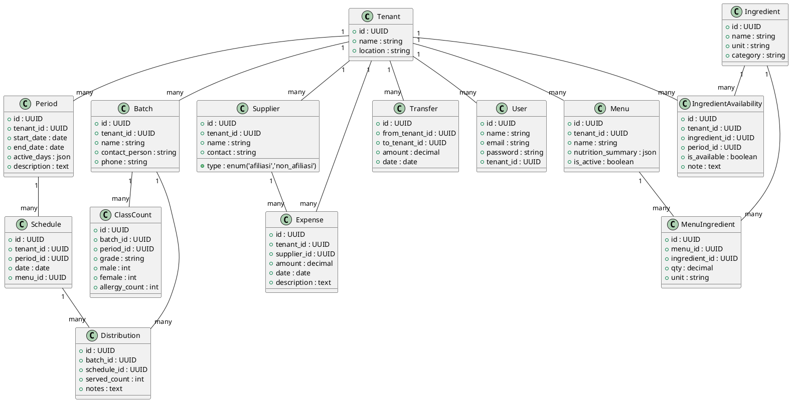

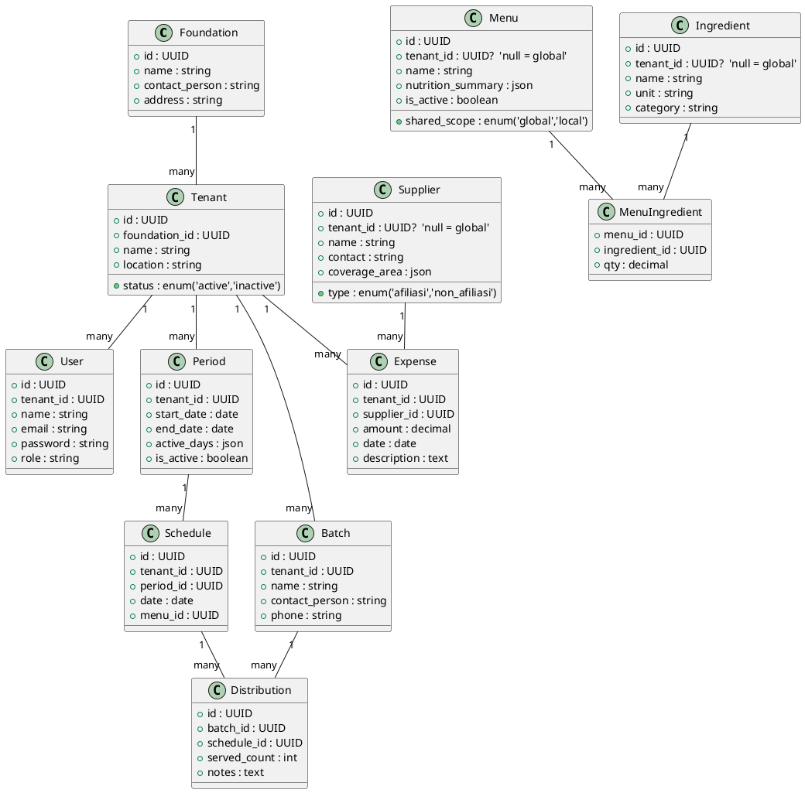

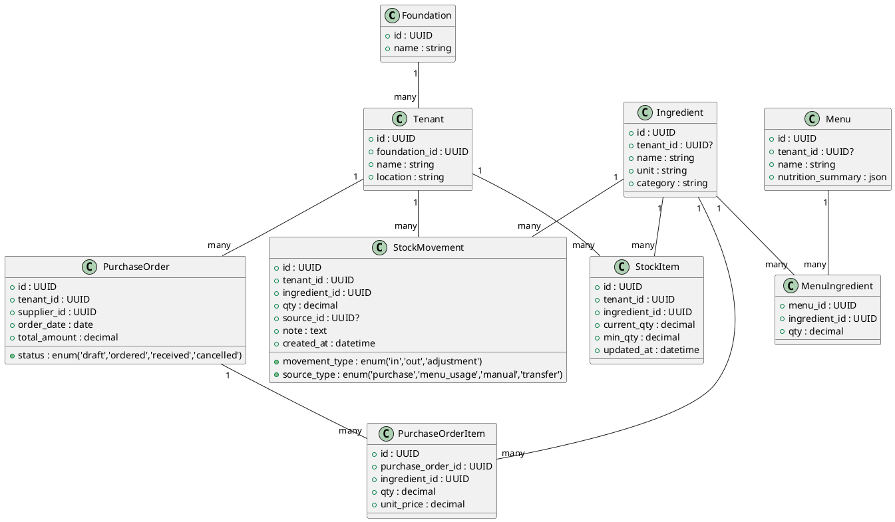

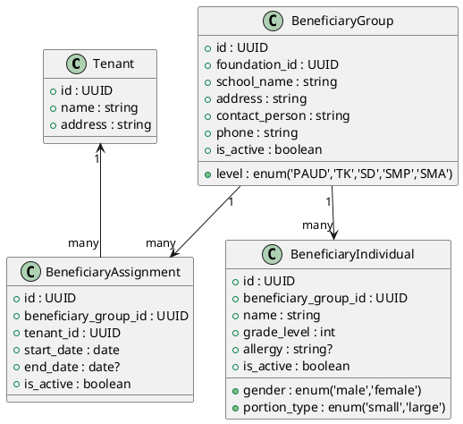

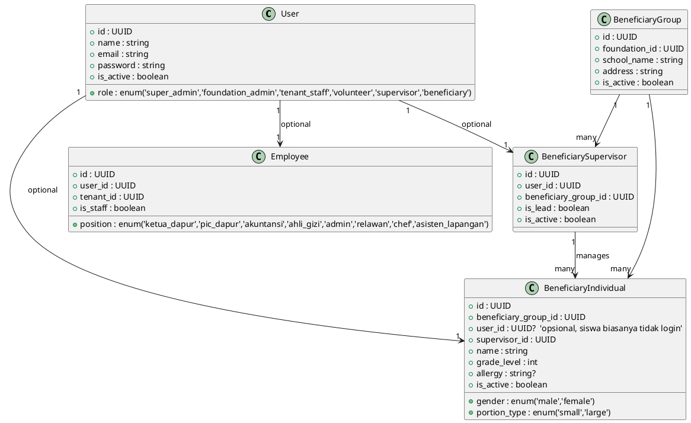

```plantuml
@startuml
' MBG Domain Model - Multi-tenant + Spatie + Pivot tables
' PKs use UUID. tenant_id nullable for shared resources.

class Foundation {
  +id : UUID
  +name : string
  +contact : string
}
class Tenant {
  +id : UUID
  +foundation_id : UUID
  +name : string
  +location : string
  +status : enum('active','inactive')
}

class User {
  +id : UUID
  +tenant_id : UUID? 
  +name : string
  +email : string
  +password : string
  +is_active : boolean
}
class Employee {
  +id : UUID
  +user_id : UUID
  +tenant_id : UUID
  +position : string
}
class BeneficiaryGroup {
  +id : UUID
  +foundation_id : UUID
  +name : string
  +level : enum('PAUD','TK','SD','SMP','SMA')
  +address : string
  +is_active : boolean
}
class BeneficiaryIndividual {
  +id : UUID
  +beneficiary_group_id : UUID
  +user_id : UUID?
  +name : string
  +gender : enum('male','female')
  +grade_level : int
  +portion_type : enum('small','large')
  +allergy : string?
  +is_active : boolean
}
class BeneficiaryAssignment {
  +id : UUID
  +beneficiary_group_id : UUID
  +tenant_id : UUID
  +start_date : date
  +end_date : date?
  +is_active : boolean
}

class Role {
  +id : int
  +name : string
  +guard_name : string
}
class Permission {
  +id : int
  +name : string
  +guard_name : string
}
class model_has_roles {
  +role_id : int
  +model_type : string
  +model_id : UUID
}
class model_has_permissions {
  +permission_id : int
  +model_type : string
  +model_id : UUID
}
class role_has_permissions {
  +permission_id : int
  +role_id : int
}

class Menu {
  +id : UUID
  +tenant_id : UUID?
  +name : string
  +nutrition_summary : json
  +is_active : boolean
}

class Ingredient {
  +id : UUID
  +tenant_id : UUID?
  +name : string
  +unit : string
  +category : string
}

class MenuIngredient {
  +id : UUID
  +menu_id : UUID
  +ingredient_id : UUID
  +qty : decimal
  +unit : string
}

class StockItem {
  +id : UUID
  +tenant_id : UUID
  +ingredient_id : UUID
  +current_qty : decimal
  +min_qty : decimal
}

class StockMovement {
  +id : UUID
  +tenant_id : UUID
  +ingredient_id : UUID
  +movement_type : enum('in','out','adjustment')
  +qty : decimal
  +source_type : string
  +source_id : UUID?
  +note : text
  +created_at : datetime
}

class Supplier {
  +id : UUID
  +tenant_id : UUID?    'nullable = global supplier
  +name : string
  +type : enum('afiliasi','non_afiliasi')
  +contact : string
  +coverage_area : json
}

class PurchaseOrder {
  +id : UUID
  +tenant_id : UUID
  +supplier_id : UUID
  +order_date : date
  +status : enum('draft','ordered','received','cancelled')
  +total_amount : decimal
}

class PurchaseOrderItem {
  +id : UUID
  +purchase_order_id : UUID
  +ingredient_id : UUID
  +qty : decimal
  +unit_price : decimal
}

class Period {
  +id : UUID
  +tenant_id : UUID
  +start_date : date
  +end_date : date
  +active_days : json
  +is_active : boolean
}

class Schedule {
  +id : UUID
  +tenant_id : UUID
  +period_id : UUID
  +date : date
  +menu_id : UUID
}
class Distribution {
  +id : UUID
  +tenant_id : UUID
  +beneficiary_group_id : UUID
  +schedule_id : UUID
  +served_count : int
  +notes : text
}

class Expense {
  +id : UUID
  +tenant_id : UUID
  +supplier_id : UUID
  +amount : decimal
  +date : date
  +description : text
}
class Transfer {
  +id : UUID
  +from_tenant_id : UUID
  +to_tenant_id : UUID
  +amount : decimal
  +date : date
}

' === RELATIONS ===
Foundation "1" -- "many" Tenant
Foundation "1" -- "many" BeneficiaryGroup
Tenant "1" -- "many" User
Tenant "1" -- "many" Employee
Tenant "1" -- "many" Period
Tenant "1" -- "many" Menu
Tenant "1" -- "many" Ingredient
Tenant "1" -- "many" Supplier
Tenant "1" -- "many" StockItem
Tenant "1" -- "many" StockMovement
Tenant "1" -- "many" PurchaseOrder
Tenant "1" -- "many" Expense
Tenant "1" -- "many" Transfer
Tenant "1" -- "many" Distribution

User "1" -- "0..1" Employee
User "1" -- "0..1" BeneficiarySupervisor : (via BeneficiarySupervisor table)
User "1" -- "0..1" BeneficiaryIndividual : optional login

BeneficiaryGroup "1" -- "many" BeneficiaryIndividual
BeneficiaryGroup "1" -- "many" BeneficiaryAssignment
BeneficiaryAssignment "many" -- "1" Tenant

Menu "1" -- "many" MenuIngredient
Ingredient "1" -- "many" MenuIngredient
Ingredient "1" -- "many" StockItem
Ingredient "1" -- "many" StockMovement
Supplier "1" -- "many" PurchaseOrder
PurchaseOrder "1" -- "many" PurchaseOrderItem
Schedule "1" -- "many" Distribution
BeneficiaryGroup "1" -- "many" Distribution

' Spatie pivots relations (morph-like)
Role "1" -- "many" model_has_roles
Permission "1" -- "many" model_has_permissions
Role "1" -- "many" role_has_permissions
model_has_roles ..> User : model_id/model_type
model_has_permissions ..> User : model_id/model_type

note right of Menu : tenant_id nullable -> if null menu is global/shared
note right of Ingredient : tenant_id nullable -> global/local
note right of Supplier : tenant_id nullable -> supplier can serve many tenants

@enduml
```

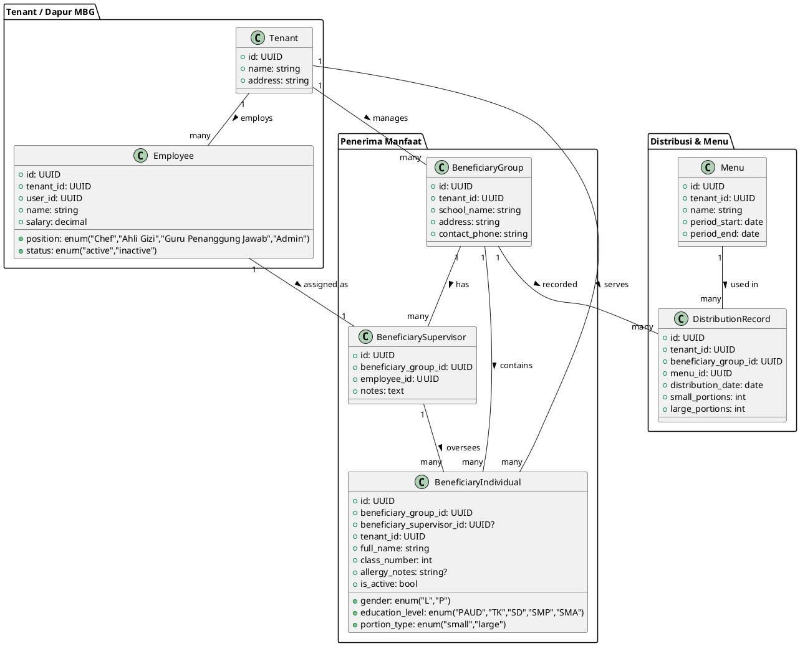

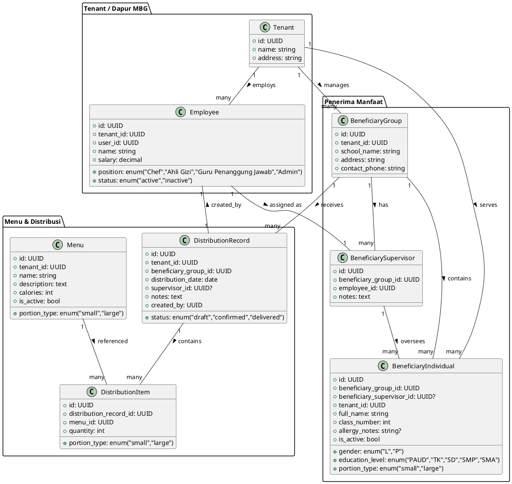

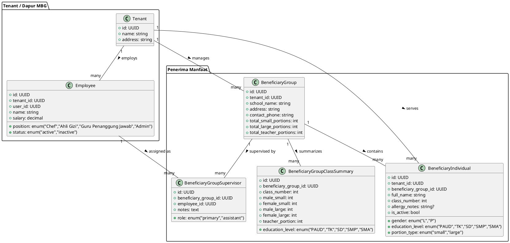

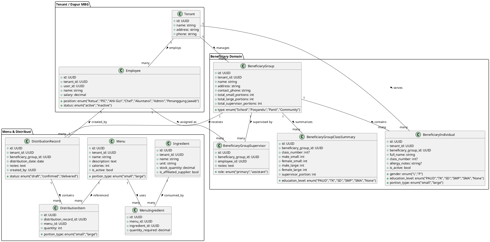

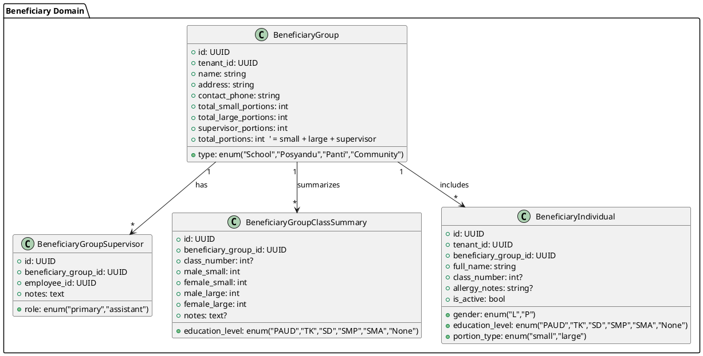

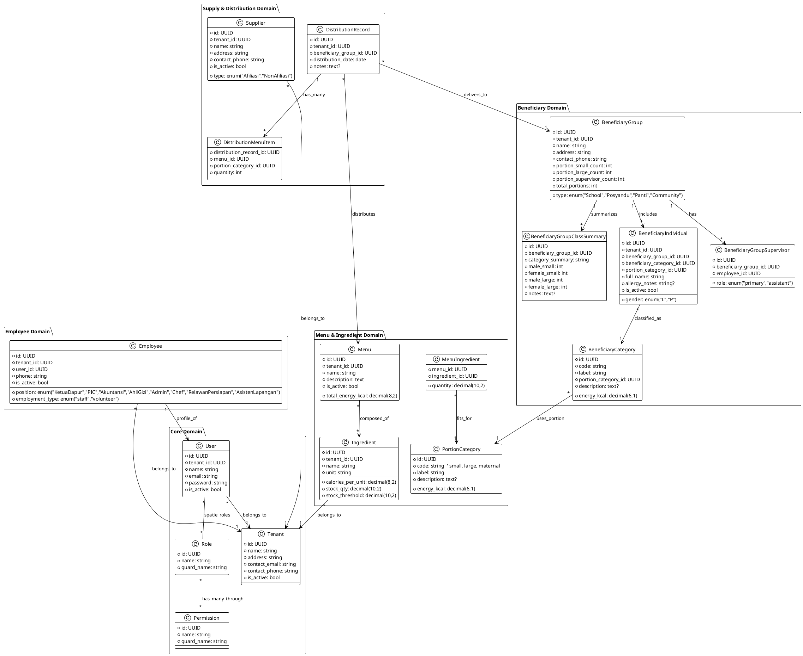
